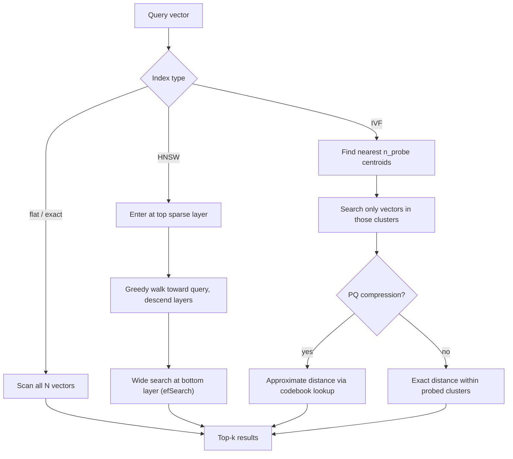

# ANN Algorithms: HNSW and IVF

## TL;DR
Exact nearest-neighbour search is a linear scan — $O(N)$ per query — and stops being feasible
somewhere in the low millions of vectors at interactive latency. Approximate nearest neighbour
(ANN) algorithms trade a small, tunable amount of recall for orders-of-magnitude faster search.
HNSW (a layered graph) and IVF (+ optional PQ compression) are the two dominant families;
everything about tuning them is a three-way trade between recall, latency, and memory.

## Intuition
Imagine searching for the closest match to a point among a million points scattered in space.
Checking every point is exact but slow. HNSW builds a multi-level "highway system" over the
points — sparse long-range links at the top for jumping across the space fast, dense short-range
links at the bottom for fine-grained accuracy — so a search zooms in coarse-to-fine, like using a
highway then local roads instead of walking the whole map. IVF instead partitions the space into
buckets (via k-means-like clustering) up front, and a query only searches the handful of buckets
nearest to it — like knowing which neighbourhood to search instead of checking every house in the
city.

## The maths

**Exact / flat baseline.** For a query $q$ against $N$ stored vectors, exact search computes
$\text{sim}(q, v_i)$ for every $i$ and returns the top-$k$. Cost is $O(Nd)$ per query. This is
the ground truth every ANN method is measured against — always keep a flat index around for
evaluation, even if you never serve from it in production.

**HNSW (Hierarchical Navigable Small World).** Vectors form a graph with $L$ layers; layer $L-1$
(top) is sparsest, layer $0$ (bottom) contains every vector and is densest. Each node connects to
roughly $M$ neighbours per layer. Search starts at an entry point in the top layer, greedily walks
toward the query at each layer, then descends and repeats with a wider candidate list at the
bottom layer. Three knobs control the recall/latency/memory triangle:

- $M$ — max neighbours per node per layer. Higher $M$ → better recall, more memory (graph edges
  scale with $M$), slower inserts.
- $\text{efConstruction}$ — candidate list size used while *building* the graph. Higher → better
  graph quality (more accurate neighbour selection), slower index build, one-time cost.
- $\text{efSearch}$ — candidate list size used while *querying*. Higher → better recall, higher
  query latency, no extra memory. This is the one knob you can safely tune per-query at serving
  time without rebuilding anything.

**IVF (Inverted File Index).** Cluster the corpus into $n_{\text{list}}$ centroids via k-means. At
query time, find the $n_{\text{probe}}$ nearest centroids to $q$ and only exhaustively search the
vectors assigned to those clusters:

$$
\text{candidates} = \bigcup_{c \in \text{top-}n_{\text{probe}}(q)} \{v_i : \text{assign}(v_i) = c\}
$$

Cost drops from $O(Nd)$ to roughly $O(n_{\text{list}} d + \frac{N}{n_{\text{list}}} n_{\text{probe}} \, d)$
— search the centroids, then only the vectors in the probed clusters. $n_{\text{probe}}$ is the
recall/latency knob: probe more clusters, catch more true neighbours that landed in a
neighbouring cluster near the boundary, at proportionally higher cost.

**Product Quantization (PQ) for compression.** A $d$-dimensional vector is split into $m$
subvectors of dimension $d/m$; each subvector is quantized independently to one of $2^b$ centroids
(a small codebook learned via k-means per subspace). Instead of storing $d$ floats (4 bytes
each), you store $m$ codes of $b$ bits each:

$$
\text{original size} = 4d \text{ bytes}, \qquad \text{PQ size} = \frac{mb}{8} \text{ bytes}
$$

Worked example: $d = 768$, $m = 96$ subvectors of 8 dimensions each, $b = 8$ bits per code
(256 centroids per subspace). Original: $4 \times 768 = 3072$ bytes/vector. PQ: $96 \times 8 / 8 =
96$ bytes/vector — a 32x compression. Distance is then computed approximately via precomputed
lookup tables between query subvector and codebook centroids, rather than exact float
arithmetic, which is what makes IVF+PQ scale to hundreds of millions of vectors in memory that
would otherwise not fit.

## Diagram



## Code
```python
import numpy as np


def recall_at_k(approx_index_search, exact_search, queries, k=10):
    """The single most important sanity check before tuning any ANN parameter."""
    hits = 0
    for q in queries:
        approx_ids = set(approx_index_search(q, k))
        exact_ids = set(exact_search(q, k))
        hits += len(approx_ids & exact_ids) / k
    return hits / len(queries)


def pq_compression_ratio(d: int, m: int, bits_per_code: int) -> float:
    original_bytes = 4 * d                       # float32 per dimension
    compressed_bytes = (m * bits_per_code) / 8
    return original_bytes / compressed_bytes


print(f"{pq_compression_ratio(d=768, m=96, bits_per_code=8):.1f}x compression")  # ~32.0x


# HNSW-style parameter sweep (pseudocode against a real ANN library's API)
def sweep_ef_search(index, queries, ef_values=(16, 32, 64, 128, 256), k=10):
    results = {}
    for ef in ef_values:
        index.set_ef_search(ef)
        latency_ms, recall = benchmark(index, queries, k)   # measure both together
        results[ef] = {"recall": recall, "latency_ms": latency_ms}
    return results
```

## In practice
- **Use it when:** the corpus is large enough (roughly beyond a few hundred thousand to a
  million vectors) that exact search latency is no longer acceptable — below that, flat/exact
  search is often fast enough and removes an entire class of recall-tuning bugs.
- **Defaults that work:** HNSW with $M = 16$–$32$, $\text{efConstruction} = 100$–$200$ is a
  reasonable starting point for most workloads and is what most vector DBs default to; tune
  $\text{efSearch}$ upward at query time if recall@k measured against exact search is below
  target. For IVF, $n_{\text{list}} \approx \sqrt{N}$ is a common starting heuristic, with
  $n_{\text{probe}}$ tuned per the same recall check.
- **Breaks when:** HNSW graphs are memory-hungry (every vector carries edges at every layer) and
  slow to build incrementally at very high insert rates; IVF's clustering assumption degrades if
  the underlying vector distribution shifts significantly after the index is built (new document
  types skew the space, and the fixed centroids no longer partition it well) — periodic
  reclustering is needed.
- **Cost / latency:** always frame this as a triangle — you can improve at most two of {recall,
  latency, memory} without paying for the third. IVF+PQ optimizes hardest for memory at some
  recall cost; HNSW optimizes for latency/recall at a real memory cost; flat optimizes for
  simplicity and perfect recall at the worst latency and no memory savings.

## Interview angle

**Q. Walk me through what happens inside HNSW when you increase efSearch.**
The search maintains a candidate list of size efSearch as it descends the graph; a larger list
means more candidates are explored before settling on the final top-k, so the search is less
likely to get stuck in a local neighbourhood that misses the true nearest neighbours. This raises
recall monotonically (up to the graph's own ceiling) but adds latency roughly linearly with the
candidate list size, and it costs zero extra memory since the graph itself is unchanged — it's a
serving-time-only knob.

**Follow-up.** Why is efSearch tunable at serving time but M and efConstruction are not? → M and
efConstruction shape the graph itself at build time (how many edges exist, how well they were
chosen); changing them requires rebuilding the index, whereas efSearch only controls how much of
the already-built graph a given query explores.

**Q. How would you decide between HNSW and IVF+PQ for a given deployment?**
Ask which resource is scarcest. If memory is the binding constraint (hundreds of millions of
vectors, cost-sensitive infra), IVF+PQ's compression is the answer even at some recall cost. If
query latency and recall matter most and memory is available, HNSW's graph structure typically
gets better recall/latency tradeoffs at a given memory budget for corpora up to tens of millions
of vectors. Many production vector databases actually combine both ideas (e.g. IVF partitioning
with an HNSW or graph structure inside each partition, or PQ-compressed vectors traversed via an
HNSW-like graph).

**Follow-up.** How would you validate that choice empirically rather than by rule of thumb? →
Build a labelled evaluation set, measure recall@k of each candidate configuration against exact
flat search on the same queries, and plot recall against measured latency and memory footprint —
the "rule of thumb" only tells you where to start the sweep.

**Q. Why should you always keep an exact/flat index around, even in production?**
It's the only ground truth for measuring ANN recall. Without it, you're tuning $M$/efSearch/
$n_{\text{probe}}$ against vibes; with it, "recall@10 is 0.94 against exact search at this
efSearch" is a number you can defend and regress-test as the corpus or library version changes.

## Traps
- Tuning HNSW/IVF parameters by "feel" (bump efSearch until it "seems okay") instead of measuring
  recall@k against an exact baseline — this is the single most common mistake in production
  vector search tuning.
- Assuming ANN recall is a fixed property of the algorithm rather than a tunable operating point —
  every one of these algorithms can be pushed toward near-100% recall at higher latency/memory
  cost, so "HNSW has low recall" is meaningless without stating the parameters.
- Forgetting that PQ introduces approximation error in distance computation itself, on top of the
  approximation from only searching probed clusters — the two error sources compound in IVF+PQ.
- Treating index parameters as set-once — as the corpus grows or its distribution shifts (new
  document types added), previously-tuned parameters can silently drift out of their target
  recall band.

## Flashcards
What's the fundamental recall/latency/memory tradeoff in ANN search?::You can improve at most two of the three without cost to the third — it's always a triangle, not a free lunch.
What does efSearch control in HNSW, and when can you change it?::The candidate list size explored during search; higher efSearch raises recall and latency with no extra memory, and it's tunable at query time without rebuilding the index.
What do M and efConstruction control, and when do they take effect?::Graph structure quality at build time — number of neighbours per node and search breadth during construction; changing them requires rebuilding the index.
What does IVF's n_probe parameter trade off?::More probed clusters means higher recall (catches near-boundary true neighbours) at proportionally higher query cost.
How does Product Quantization achieve compression, and what's the tradeoff?::Splits each vector into subvectors, quantizes each to a small codebook, replacing floats with compact codes — large memory savings at the cost of approximate (not exact) distance computation.
Why should an exact/flat index always be kept around during development?::It's the only ground truth for measuring ANN recall@k — without it, parameter tuning has no way to verify it's actually working.

## Related
[[vector-databases]]
[[embedding-models]]
[[hybrid-search-bm25-vector]]
[[rag-evaluation]]
