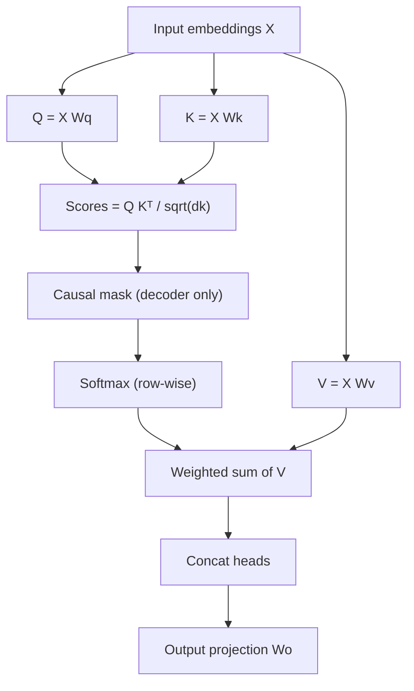

# Attention Mechanism

## TL;DR

Attention lets every position in a sequence look at every other position and pull in a weighted
average of their representations, with weights learned from content similarity rather than fixed
by distance. Scaled dot-product attention is: score queries against keys, scale by $1/\sqrt{d_k}$
to keep the softmax well-behaved, normalise with softmax, and use the result to weight the values.
Multi-head attention runs several of these in parallel subspaces so the model can attend to
different kinds of relationships at once. It is the mechanism that made transformers replace RNNs.

## Intuition

Think of a database lookup that is fuzzy instead of exact. Every token emits a **query** ("what am
I looking for"), and every token (including itself) emits a **key** ("what do I contain") and a
**value** ("what do I actually offer if you attend to me"). You compare your query against every
key with a dot product — high similarity means "relevant" — turn those similarities into a
probability distribution with softmax, and take a weighted sum of the values using that
distribution. Nothing here is convolutional (fixed local window) or recurrent (fixed order of
processing); any token can talk to any other token in one step, which is exactly why attention
scales better with long-range dependencies than RNNs and why it parallelises over the sequence
dimension.

## The maths

### Scaled dot-product attention

For a sequence of $n$ tokens with model dimension $d_{model}$, project each token embedding
$x_i \in \mathbb{R}^{d_{model}}$ into three vectors using learned weight matrices
$W^Q, W^K \in \mathbb{R}^{d_{model}\times d_k}$ and $W^V \in \mathbb{R}^{d_{model}\times d_v}$:

$$
Q = XW^Q,\quad K = XW^K,\quad V = XW^V
$$

where $X \in \mathbb{R}^{n \times d_{model}}$ stacks all token embeddings as rows. Attention output:

$$
\text{Attention}(Q,K,V) = \text{softmax}\!\left(\frac{QK^\top}{\sqrt{d_k}}\right)V
$$

$QK^\top \in \mathbb{R}^{n\times n}$ is the raw similarity matrix — row $i$ holds the dot products of
query $i$ against every key. Softmax is applied row-wise so each row sums to 1 (a valid weighting
over the $n$ values), and the result is an $n \times d_v$ matrix: one attended output vector per
input token.

### Why divide by $\sqrt{d_k}$

Assume each component of $q$ and $k$ is drawn independently with mean 0 and variance 1 (a
reasonable approximation right after a well-scaled linear projection, and what weight
initialisation is designed to preserve). The dot product is a sum of $d_k$ independent products:

$$
q\cdot k = \sum_{i=1}^{d_k} q_i k_i
$$

Each term $q_ik_i$ has mean 0 and variance $\mathrm{Var}(q_i)\mathrm{Var}(k_i) = 1$. Since the terms
are independent, variances add:

$$
\mathrm{Var}(q\cdot k) = \sum_{i=1}^{d_k}\mathrm{Var}(q_ik_i) = d_k
$$

So the standard deviation of the raw dot product grows as $\sqrt{d_k}$. For typical head dimensions
($d_k = 64$ or $128$), that is a spread of magnitude 8–11 — comparable to or larger than the
softmax's effective saturation range. Feed a softmax logits with variance $d_k$ and, for even
moderately large $d_k$, a few logits dominate: the softmax becomes near one-hot, gradients through
the small logits vanish (their softmax probability and its derivative are both ~0), and training
stalls. Dividing by $\sqrt{d_k}$ rescales the dot product back to unit variance regardless of
$d_k$, keeping the softmax in a regime where it has meaningful gradient almost everywhere — the
fix is dimensional, not tuned per model.

### Multi-head attention

Instead of one attention with the full $d_{model}$, split into $h$ heads of dimension
$d_k = d_{model}/h$ each, run scaled dot-product attention independently per head, and concatenate:

$$
\text{MHA}(X) = \text{Concat}(\text{head}_1,\dots,\text{head}_h)W^O,\quad
\text{head}_i = \text{Attention}(XW^Q_i, XW^K_i, XW^V_i)
$$

$W^O \in \mathbb{R}^{d_{model}\times d_{model}}$ mixes the heads back together. Splitting into $h$
heads costs no extra compute versus one big head (same total parameter count, since each head's
$W^Q_i$ etc. is $d_{model}\times d_k$ and there are $h$ of them) but lets each head specialise —
empirically different heads learn different relations: positional offsets, syntactic dependencies,
coreference-like patterns, rare-token copying. This is a real capacity gain, not just an
implementation convenience — a single head is forced to average all relation types into one
softmax distribution per query, heads let it factor them.

### Complexity

Computing $QK^\top$ costs $O(n^2 d_k)$ per head, and there are $h$ heads with $d_k = d_{model}/h$,
so total is $O(n^2 d_{model})$ — quadratic in sequence length $n$, linear in model width. This is
the practical ceiling on context length: doubling the sequence quadruples the attention compute
and, worse, the $n\times n$ score matrix's memory. This is exactly the problem
[[flash-attention-and-efficient-attention]] and other efficient-attention variants target.

### Causal masking

For autoregressive (decoder) models, token $i$ must not see tokens $j > i$ — otherwise the model
trivially "cheats" by looking at the answer during training. Enforce this by adding $-\infty$ (in
practice a large negative number) to the disallowed entries of $QK^\top/\sqrt{d_k}$ before softmax,
so their post-softmax weight is exactly 0:

$$
\text{score}_{ij} = \begin{cases}\dfrac{q_i\cdot k_j}{\sqrt{d_k}} & j \le i \\ -\infty & j > i\end{cases}
$$

This is a strictly upper-triangular mask on the score matrix. It costs nothing extra
architecturally — same weights, same QKV, just a different mask — which is why the same
transformer block serves as encoder (no mask, bidirectional) or decoder (causal mask) layer.

### Cross-attention

In encoder-decoder models, the decoder's queries come from the decoder's own hidden states, but the
keys and values come from the encoder's output. This lets every decoder position attend over the
entire input sequence with no causal restriction on the encoder side:

$$
\text{CrossAttn}(Q_{dec}, K_{enc}, V_{enc}) = \text{softmax}\!\left(\frac{Q_{dec}K_{enc}^\top}{\sqrt{d_k}}\right)V_{enc}
$$

This is the mechanism that replaced the fixed-length context vector in seq2seq RNN
[[recurrent-networks-and-lstm]] encoder-decoder models — decoder no longer has to compress the
whole input into one vector; it can look back selectively at every step.

## Diagram



## Code

Single head, from scratch:

```python
import torch
import torch.nn.functional as F

def scaled_dot_product_attention(q, k, v, causal=False):
    # q, k, v: (batch, seq_len, d_k)
    d_k = q.size(-1)
    scores = q @ k.transpose(-2, -1) / d_k ** 0.5      # (batch, seq_len, seq_len)
    if causal:
        seq_len = q.size(-2)
        mask = torch.triu(torch.ones(seq_len, seq_len, dtype=torch.bool), diagonal=1)
        scores = scores.masked_fill(mask, float("-inf"))
    weights = F.softmax(scores, dim=-1)                 # normalise over keys
    return weights @ v, weights
```

Multi-head, from scratch:

```python
import torch
import torch.nn as nn

class MultiHeadAttention(nn.Module):
    def __init__(self, d_model, n_heads):
        super().__init__()
        assert d_model % n_heads == 0
        self.h = n_heads
        self.d_k = d_model // n_heads
        self.wq = nn.Linear(d_model, d_model, bias=False)
        self.wk = nn.Linear(d_model, d_model, bias=False)
        self.wv = nn.Linear(d_model, d_model, bias=False)
        self.wo = nn.Linear(d_model, d_model, bias=False)

    def split_heads(self, x):
        b, n, d = x.shape
        return x.view(b, n, self.h, self.d_k).transpose(1, 2)  # (b, h, n, d_k)

    def forward(self, x, causal=False):
        b, n, _ = x.shape
        q, k, v = self.split_heads(self.wq(x)), self.split_heads(self.wk(x)), self.split_heads(self.wv(x))
        scores = q @ k.transpose(-2, -1) / self.d_k ** 0.5      # (b, h, n, n)
        if causal:
            mask = torch.triu(torch.ones(n, n, dtype=torch.bool, device=x.device), diagonal=1)
            scores = scores.masked_fill(mask, float("-inf"))
        weights = torch.softmax(scores, dim=-1)
        out = weights @ v                                        # (b, h, n, d_k)
        out = out.transpose(1, 2).contiguous().view(b, n, -1)     # concat heads
        return self.wo(out)
```

## In practice

- **Use it when:** any sequence problem with long-range dependencies — text, code, time series with
  irregular lag structure, even sets (attention with no positional encoding is permutation-equivariant).
- **Defaults that work:** $d_k = 64$–$128$ per head, $h$ such that $h \cdot d_k = d_{model}$
  (e.g. 8–32 heads for $d_{model}$ 512–4096), attention dropout 0.0–0.1.
- **Breaks when:** sequence length grows — $O(n^2)$ compute and, worse, $O(n^2)$ memory for the
  score matrix dominate; mitigated by [[flash-attention-and-efficient-attention]] (fuses the
  softmax so the full $n\times n$ matrix is never materialised) or sparse/linear attention variants.
- **Cost / latency:** attention is the FLOP and memory bottleneck at long context; at short context
  (a few hundred tokens) the feed-forward sublayers usually dominate compute instead.

## Interview angle

**Q. Why scale by $\sqrt{d_k}$ specifically, not some other constant?**
Because the variance of an unnormalised dot product of $d_k$ independent unit-variance terms grows
linearly with $d_k$ (variances of independent terms add), so its standard deviation grows as
$\sqrt{d_k}$. Dividing by $\sqrt{d_k}$ is exactly the normalisation that keeps the logits at unit
variance regardless of head dimension, so the softmax stays in a non-saturating regime as you
change $d_k$.

**Follow-up.** What happens if you forget the scaling? → For large $d_k$ the logits get large in
magnitude, softmax saturates to near one-hot, gradients through non-max entries vanish, and
training becomes unstable or stalls, especially early in training when this variance blow-up is
worst.

**Q. Why does multi-head attention help over one large head?**
Splitting into $h$ heads at fixed total parameter count forces each head to operate in a lower-
dimensional subspace and learn its own similarity function; empirically heads specialise (some
attend locally, some to specific syntactic or positional patterns). One head with the same total
width has to represent all such relations inside a single softmax per query, which is strictly
less expressive for capturing multiple simultaneous relation types.

**Q. What is the computational and memory complexity of self-attention, and why does it matter?**
$O(n^2 d)$ time and $O(n^2)$ memory for the score matrix, per layer. It matters because it is the
practical limit on context length in production LLMs — quadrupling context roughly quadruples
attention cost, which is why techniques like FlashAttention (memory, not asymptotic time), KV
caching (inference-time reuse), and sparse/linear attention exist.

**Q. Explain causal masking and why it is needed only in the decoder.**
Causal masking sets attention scores for future positions to $-\infty$ before softmax so a token
can only attend to itself and earlier tokens. It's required whenever the model is trained to
predict the next token autoregressively — without it the model would attend to the token it's
supposed to predict, making training trivial and useless at inference (where future tokens don't
exist yet). An encoder that only needs a bidirectional representation (e.g. BERT-style pretraining)
has no such restriction.

**Q. What's the difference between self-attention and cross-attention?**
Self-attention: Q, K, V all derived from the same sequence. Cross-attention: Q from one sequence
(e.g. decoder states), K and V from another (e.g. encoder output) — it's how the decoder in an
encoder-decoder model reads the source sequence at every generation step.

**Follow-up.** Where does cross-attention appear outside classic seq2seq translation? → Retrieval-
augmented generation architectures and multimodal models (e.g. attending text queries over image
patch embeddings) both use the same Q-from-one-source, K/V-from-another-source pattern.

## Traps

- Saying attention is $O(n)$ or "linear" — it is quadratic in sequence length for vanilla attention;
  conflating it with efficient-attention variants is a common and easily caught mistake.
- Claiming $\sqrt{d_k}$ scaling is an empirically-tuned hyperparameter — it is derived from a
  variance argument, not tuned; interviewers probing depth want the derivation, not "it worked
  better."
- Saying attention has no notion of order — attention itself is permutation-equivariant, but
  transformers add positional information separately (see [[transformer-architecture]]); the block
  as a whole is order-aware, the attention operation alone is not.
- Forgetting that multi-head attention has the *same* total parameter count and FLOPs as one head
  of width $d_{model}$ (common misconception that more heads means more parameters) — the split is
  free.
- Describing the mask as "setting scores to zero" — it must be $-\infty$ *before* softmax; zeroing
  after softmax breaks the normalisation (rows would no longer sum to 1).

## Flashcards

Why divide attention scores by $\sqrt{d_k}$?::Because the variance of a dot product of $d_k$ unit-variance terms grows as $d_k$, so its std grows as $\sqrt{d_k}$; dividing by $\sqrt{d_k}$ keeps logits at unit variance so softmax doesn't saturate.
What is the time complexity of self-attention over a sequence of length n?::$O(n^2 d)$ — quadratic in sequence length, linear in model width.
What does causal masking do mechanically?::Adds $-\infty$ to disallowed (future) positions in the score matrix before softmax, giving them exactly zero attention weight.
In cross-attention, where do Q, K, V come from?::Q from the target/decoder sequence; K and V from the source/encoder sequence.
Does multi-head attention cost more compute than single-head at the same d_model?::No — same total parameters and FLOPs; the width is split across heads, not added.
Is self-attention alone aware of token order?::No — it is permutation-equivariant; order comes from positional encodings added separately.
What are the three quantities computed from each token, and their role?::Query (what I'm looking for), Key (what I contain, matched against queries), Value (what I contribute if attended to).

## Related

[[transformer-architecture]]
[[flash-attention-and-efficient-attention]]
[[recurrent-networks-and-lstm]]
[[context-window-and-positional-encoding]]
[[kv-cache-and-inference-optimization]]
