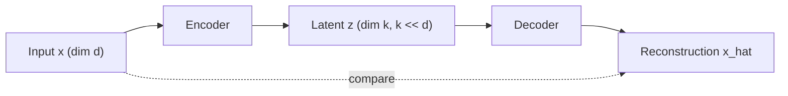

# Autoencoders and Representation Learning

## TL;DR

An autoencoder learns to compress input into a lower-dimensional latent code (encoder) and
reconstruct the original input from that code (decoder), trained purely by reconstruction error —
no labels needed. The bottleneck forces the model to keep only the information that matters for
reconstruction, which is exactly what makes the latent code useful as a learned feature
representation for other tasks. Variants — denoising, sparse, variational — impose different
constraints on the latent space to control what "useful" means, and are the conceptual bridge
between classical dimensionality reduction (PCA) and modern self-supervised representation learning.

## Intuition

PCA finds the best *linear* lower-dimensional subspace to reconstruct data from — an autoencoder is
PCA generalised to nonlinear encoders/decoders via neural networks, and with a linear encoder,
linear decoder, and MSE loss, an autoencoder's optimal solution actually spans the same subspace as
PCA. The bottleneck (a hidden layer narrower than the input) is the whole point: without it, the
network could just learn the identity function and reconstruction loss would trivially go to zero,
learning nothing useful. Force the information through a narrow pipe, and the network has to
discover which features are worth keeping — that discovered compression is a representation you can
reuse elsewhere (as embeddings, as initialisation for a downstream task, as an anomaly-detection
signal). This same idea — learn representations from unlabelled data by defining a self-supervised
objective and letting a bottleneck or a prediction task do the work of forcing useful structure — is
the throughline connecting autoencoders to masked language modelling, contrastive learning, and most
of modern self-supervised representation learning.

## The maths

### Basic autoencoder objective

$$
\hat x = D(E(x)), \qquad \mathcal{L} = \|x - \hat x\|_2^2
$$

$E: \mathbb{R}^d \to \mathbb{R}^k$ (encoder, $k < d$), $D: \mathbb{R}^k \to \mathbb{R}^d$ (decoder).
Minimising reconstruction error while $k < d$ forces $E$ to discard information — ideally the
information least useful for reconstructing $x$, which for many real datasets correlates with noise
or redundancy rather than signal.

### Linear autoencoder ≈ PCA

With linear $E(x) = Wx$, linear $D(z) = W'z$, and MSE loss, the optimal solution's latent subspace
(the row space of the optimal $W$) equals the subspace spanned by the top-$k$ principal components
of $x$ — the same subspace [[dimensionality-reduction-pca]] finds via eigendecomposition of the
covariance matrix. The autoencoder framing generalises this by allowing $E, D$ to be arbitrary
nonlinear functions (deep networks), letting the model capture nonlinear manifold structure that
PCA, restricted to linear projections, cannot.

### Denoising autoencoder

Corrupt the input, reconstruct the clean original:

$$
\tilde x = x + \epsilon,\qquad \mathcal{L} = \|x - D(E(\tilde x))\|_2^2
$$

Now the identity function is not even an option — the model is explicitly forced to learn which
parts of $\tilde x$ are corruption-noise versus signal, which is a more robust training signal than
plain reconstruction and tends to produce features that transfer better to downstream tasks.

### Sparse autoencoder

Add a penalty encouraging most latent activations to be near zero, even with a latent dimension
$k \ge d$ (an "overcomplete" code that would otherwise trivially learn the identity):

$$
\mathcal{L} = \|x - \hat x\|_2^2 + \lambda \sum_j \text{KL}(\rho \,\|\, \hat\rho_j)
$$

where $\hat\rho_j$ is the average activation of latent unit $j$ over a batch and $\rho$ is a small
target sparsity level. Forces each input to be represented by only a handful of active latent units
— useful for interpretability (each unit tends to correspond to a more isolated, human-inspectable
concept) and is the technique behind recent sparse-autoencoder work on interpreting LLM activations.

### Variational autoencoder (VAE)

Instead of encoding to a single point $z$, encode to a *distribution* $q_\phi(z|x)$ (typically
Gaussian, parameterised by a mean and variance the encoder outputs), and require it to stay close to
a prior $p(z)$ (typically $\mathcal{N}(0, I)$), enabling both reconstruction and generation by
sampling from the prior. See [[generative-models-overview]] for the full ELBO derivation — the key
structural difference from a plain autoencoder is that the latent space is regularised to be a
smooth, samplable distribution rather than an arbitrary learned code, which is what lets you decode
a fresh, coherent output from a randomly sampled $z$.

## Diagram



## Code

```python
import torch
import torch.nn as nn

class Autoencoder(nn.Module):
    def __init__(self, input_dim, latent_dim):
        super().__init__()
        self.encoder = nn.Sequential(
            nn.Linear(input_dim, 128), nn.ReLU(),
            nn.Linear(128, latent_dim),
        )
        self.decoder = nn.Sequential(
            nn.Linear(latent_dim, 128), nn.ReLU(),
            nn.Linear(128, input_dim),
        )

    def forward(self, x):
        z = self.encoder(x)
        return self.decoder(z), z

model = Autoencoder(input_dim=784, latent_dim=32)
optimizer = torch.optim.AdamW(model.parameters(), lr=1e-3)

for x in dataloader:                       # x: (batch, 784), unlabeled
    x_hat, z = model(x)
    loss = nn.functional.mse_loss(x_hat, x)  # reconstruction loss, no labels needed
    optimizer.zero_grad(); loss.backward(); optimizer.step()

# denoising variant: corrupt the input, reconstruct the clean version
def denoising_step(model, x, noise_std=0.2):
    x_noisy = x + noise_std * torch.randn_like(x)
    x_hat, _ = model(x_noisy)
    return nn.functional.mse_loss(x_hat, x)   # target is the clean x, not x_noisy
```

## In practice

- **Use it when:** you need unsupervised/self-supervised dimensionality reduction that captures
  nonlinear structure PCA can't; anomaly detection (reconstruction error is high on out-of-
  distribution inputs the model never learned to compress well); pretraining a feature extractor
  when labels are scarce; denoising or imputation tasks directly.
- **Defaults that work:** latent dimension chosen via reconstruction-error-vs-dimension curve
  (elbow method, similar to PCA's explained-variance-ratio approach — see
  [[dimensionality-reduction-pca]]); MSE for continuous inputs, binary cross-entropy for
  normalised/binary inputs; denoising variant as a default over plain autoencoders for more robust
  features.
- **Breaks when:** the latent bottleneck is too large relative to input complexity, so the model
  just learns near-identity and the code isn't a meaningful compression; or the reconstruction
  objective doesn't align with what downstream task actually needs (reconstructing pixels perfectly
  doesn't guarantee the latent code is good for classification — a classic mismatch between
  self-supervised proxy objective and true downstream goal).
- **Cost / latency:** for anomaly detection, inference is one forward pass through encoder+decoder
  plus a distance computation — cheap; training cost scales like any other deep net of similar size.

## Interview angle

**Q. Why does the autoencoder need a bottleneck — what stops it from just learning the identity
function?**
Without a bottleneck (latent dimension $\ge$ input dimension, and no other constraint), the network
can trivially copy input to output through an identity-like mapping and reconstruction loss goes to
zero while learning nothing useful. A bottleneck ($k < d$) makes the identity function infeasible —
the model is forced to discard information, and minimising reconstruction error under that
constraint means it keeps the information most useful for reconstructing typical inputs, which
tends to be the signal, not the noise.

**Q. How does a linear autoencoder relate to PCA?**
With linear encoder/decoder and MSE loss, the optimal autoencoder's latent subspace equals the
subspace spanned by the top-$k$ principal components — same solution, different optimisation route
(gradient descent vs. eigendecomposition of the covariance matrix). The nonlinear (deep) autoencoder
generalises this to capture nonlinear manifolds that a linear projection like PCA structurally
cannot represent.

**Follow-up.** So why ever use PCA instead of a deep autoencoder? → PCA is deterministic, has a
closed-form solution (no training, no hyperparameters, no risk of a bad local optimum), gives
directly interpretable orthogonal components ranked by explained variance, and is far cheaper —
worth it whenever the linear subspace assumption is a reasonable approximation, which is common in
practice.

**Q. How would you use an autoencoder for anomaly detection, and what's the underlying assumption?**
Train the autoencoder to reconstruct normal data well; at inference, flag inputs with high
reconstruction error as anomalous. The assumption is that the bottleneck, having only seen normal
data, learns a compression scheme specific to normal data's structure — genuinely anomalous inputs
don't fit that structure and reconstruct poorly. It breaks down if anomalies are simple/subtle
enough to still reconstruct well, or if training data itself contains enough anomalies that the
model learns to compress them too.

**Q. Plain autoencoder vs. denoising autoencoder vs. VAE — what does each buy you?**
Plain: simplest, learns a deterministic compressed code, good for dimensionality reduction and
straightforward reconstruction-error-based anomaly detection. Denoising: forces robustness by
making identity mapping impossible even without a tight bottleneck, generally yields features that
transfer better to downstream tasks. VAE: regularises the latent space into a smooth, samplable
distribution, trading some reconstruction fidelity for the ability to generate new, coherent samples
by sampling the prior — the right choice specifically when generation, not just compression, is the
goal (see [[generative-models-overview]]).

## Traps

- Calling an autoencoder's latent code "the same as PCA" in general — only true for the linear-
  encoder/decoder, MSE-loss special case; a deep nonlinear autoencoder's code is not guaranteed to
  be orthogonal, ranked, or even stable across random initialisations the way PCA components are.
- Assuming low reconstruction loss automatically means good downstream features — reconstruction is
  a proxy objective; a code that's great at reconstructing pixels can still be poor for a
  downstream classification/retrieval task if the objectives aren't aligned.
- Confusing a plain autoencoder with a VAE — a plain autoencoder's latent space has no guarantee of
  being smooth or samplable; sampling a random point in a vanilla AE's latent space and decoding it
  usually produces garbage, unlike a properly trained VAE.
- Forgetting that the bottleneck is what makes representation learning nontrivial — without it
  (or another constraint like denoising/sparsity), there is no forcing function to learn anything
  beyond the identity.

## Flashcards

Why is a bottleneck necessary in an autoencoder?::Without it the network could learn the identity function and minimise reconstruction loss to zero while learning nothing useful; the bottleneck forces information to be discarded, keeping what matters for reconstruction.
How does a linear autoencoder with MSE loss relate to PCA?::Its optimal latent subspace equals the subspace spanned by the top-k principal components — same solution as PCA, reached via gradient descent instead of eigendecomposition.
What does a denoising autoencoder change relative to a plain one?::It corrupts the input and reconstructs the clean original, removing the identity-function shortcut and typically producing more robust, transferable features.
What is the key structural difference between a plain autoencoder and a VAE?::A VAE encodes to a distribution (regularised toward a prior) rather than a single point, making the latent space smooth and samplable for generation.
Why can reconstruction error be used for anomaly detection?::A model trained only on normal data learns a compression scheme specific to normal data's structure; genuinely anomalous inputs don't fit that structure and reconstruct poorly.

## Related

[[generative-models-overview]]
[[dimensionality-reduction-pca]]
[[embeddings]]
[[anomaly-detection]]
[[transfer-learning-and-finetuning]]
