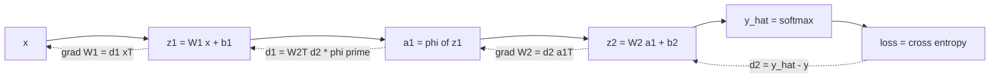

# Backpropagation

## TL;DR
Backpropagation is reverse-mode automatic differentiation applied to a neural network's computational graph. One forward pass caches intermediate values; one backward pass propagates $\partial \mathcal{L}/\partial(\cdot)$ from the loss to every parameter using the chain rule, at roughly the cost of one extra forward pass — regardless of how many parameters there are. It is not an optimisation algorithm; it only computes gradients, which an optimiser then consumes.

## Intuition
Every node in the network is a small function that knows two things locally: what it output, and how sensitive that output is to its own inputs. Backprop is a message-passing protocol. The loss says "here is how much I care about your output." Each node multiplies that incoming message by its own local derivative, keeps the part addressed to its parameters, and forwards the rest to whoever fed it. Nobody needs a global view of the network — only its own local Jacobian and the message from downstream.

## The maths

### Setup and notation

For layers $\ell = 1 \dots L$:

$$
\mathbf{z}^{(\ell)} = W^{(\ell)}\mathbf{a}^{(\ell-1)} + \mathbf{b}^{(\ell)}, \qquad \mathbf{a}^{(\ell)} = \phi\!\left(\mathbf{z}^{(\ell)}\right), \qquad \mathbf{a}^{(0)} = \mathbf{x}
$$

Define the **error signal** (the quantity backprop actually propagates):

$$
\boldsymbol{\delta}^{(\ell)} \;\equiv\; \frac{\partial \mathcal{L}}{\partial \mathbf{z}^{(\ell)}} \in \mathbb{R}^{n_\ell}
$$

Everything else follows from $\boldsymbol{\delta}$.

### The local-gradient view

For any node $y = f(x)$ sitting inside a larger graph, with $\bar{y} \equiv \partial\mathcal{L}/\partial y$ the incoming ("upstream") gradient:

$$
\bar{x} = \left(\frac{\partial y}{\partial x}\right)^{\!\top} \bar{y}
$$

That is the whole algorithm. `upstream × local = downstream`. The useful mental catalogue:

| Node | Forward | Backward rule |
|---|---|---|
| add | $y = a + b$ | gradient copies to both branches |
| multiply | $y = ab$ | $\bar a = b\,\bar y$, $\bar b = a\,\bar y$ — it *swaps* |
| max / ReLU | $y=\max(a,b)$ | routes the whole gradient to the argmax, 0 to the other |
| branch (used twice) | $y_1=x,\,y_2=x$ | gradients **sum**: $\bar x = \bar y_1 + \bar y_2$ |
| matmul | $Y = XW$ | $\bar X = \bar Y W^\top$, $\bar W = X^\top \bar Y$ |

The branch rule is the one people forget: a value consumed by two consumers accumulates both gradients. This is why PyTorch's `.grad` fields *accumulate* and why you must call `optimizer.zero_grad()`.

### The three backprop equations

**Recursion for $\boldsymbol{\delta}$.** $\mathbf{z}^{(\ell)}$ affects the loss only through $\mathbf{a}^{(\ell)}$, which affects it only through $\mathbf{z}^{(\ell+1)}$:

$$
\boldsymbol{\delta}^{(\ell)}
= \underbrace{\left(W^{(\ell+1)}\right)^{\!\top}\boldsymbol{\delta}^{(\ell+1)}}_{\text{pull through the next layer}} \;\odot\; \underbrace{\phi'\!\left(\mathbf{z}^{(\ell)}\right)}_{\text{local activation slope}}
$$

where $\odot$ is elementwise product.

**Parameter gradients.** Since $\partial z_i^{(\ell)}/\partial W_{ij}^{(\ell)} = a_j^{(\ell-1)}$:

$$
\frac{\partial \mathcal{L}}{\partial W^{(\ell)}} = \boldsymbol{\delta}^{(\ell)}\left(\mathbf{a}^{(\ell-1)}\right)^{\!\top},
\qquad
\frac{\partial \mathcal{L}}{\partial \mathbf{b}^{(\ell)}} = \boldsymbol{\delta}^{(\ell)}
$$

An outer product: rows indexed by the error at this layer, columns by the activation that produced it. This is the rule to be able to write from memory.

### Worked derivation — 2-layer MLP, softmax + cross-entropy

Network, single example $\mathbf{x}\in\mathbb{R}^{d}$, one-hot label $\mathbf{y}\in\{0,1\}^{K}$:

$$
\begin{aligned}
\mathbf{z}^{(1)} &= W^{(1)}\mathbf{x} + \mathbf{b}^{(1)} \\
\mathbf{a}^{(1)} &= \phi\!\left(\mathbf{z}^{(1)}\right) \\
\mathbf{z}^{(2)} &= W^{(2)}\mathbf{a}^{(1)} + \mathbf{b}^{(2)} \\
\hat{y}_k &= \frac{e^{z^{(2)}_k}}{\sum_{j} e^{z^{(2)}_j}} \\
\mathcal{L} &= -\sum_k y_k \log \hat{y}_k
\end{aligned}
$$

**Step 1 — the softmax Jacobian.** Let $z \equiv \mathbf{z}^{(2)}$ and $S = \sum_j e^{z_j}$.

$$
\frac{\partial \hat{y}_k}{\partial z_m}
= \frac{\partial}{\partial z_m}\frac{e^{z_k}}{S}
= \frac{\mathbb{1}[k=m]e^{z_k}S - e^{z_k}e^{z_m}}{S^2}
= \hat{y}_k\bigl(\mathbb{1}[k=m] - \hat{y}_m\bigr)
$$

**Step 2 — chain into the loss.**

$$
\frac{\partial \mathcal{L}}{\partial z_m}
= \sum_k \frac{\partial \mathcal{L}}{\partial \hat{y}_k}\frac{\partial \hat{y}_k}{\partial z_m}
= \sum_k \left(-\frac{y_k}{\hat{y}_k}\right)\hat{y}_k\bigl(\mathbb{1}[k=m] - \hat{y}_m\bigr)
$$

The $\hat{y}_k$ cancels — this cancellation *is* the reason the pairing is clean:

$$
= -\sum_k y_k\bigl(\mathbb{1}[k=m] - \hat{y}_m\bigr)
= -y_m + \hat{y}_m \sum_k y_k
$$

**Step 3 — use $\sum_k y_k = 1$** (one-hot label):

$$
\boxed{\;\frac{\partial \mathcal{L}}{\partial \mathbf{z}^{(2)}} = \hat{\mathbf{y}} - \mathbf{y} = \boldsymbol{\delta}^{(2)}\;}
$$

Prediction minus target. No activation derivative appears, so the output layer never suffers vanishing gradients from saturation — the same cancellation happens for sigmoid + binary cross-entropy and for linear + MSE. This is the single most-asked derivation in DL interviews; see [[loss-functions]] for the general statement.

**Step 4 — propagate.**

$$
\begin{aligned}
\frac{\partial \mathcal{L}}{\partial W^{(2)}} &= \boldsymbol{\delta}^{(2)}\left(\mathbf{a}^{(1)}\right)^{\!\top}, &
\frac{\partial \mathcal{L}}{\partial \mathbf{b}^{(2)}} &= \boldsymbol{\delta}^{(2)} \\
\boldsymbol{\delta}^{(1)} &= \left(\left(W^{(2)}\right)^{\!\top}\boldsymbol{\delta}^{(2)}\right)\odot\phi'\!\left(\mathbf{z}^{(1)}\right), &
& \\
\frac{\partial \mathcal{L}}{\partial W^{(1)}} &= \boldsymbol{\delta}^{(1)}\mathbf{x}^\top, &
\frac{\partial \mathcal{L}}{\partial \mathbf{b}^{(1)}} &= \boldsymbol{\delta}^{(1)}
\end{aligned}
$$

**Batched form.** With $B$ rows, $A^{(\ell)} \in \mathbb{R}^{B\times n_\ell}$, $\Delta^{(2)} = (\hat{Y}-Y)/B$ for mean reduction:

$$
\frac{\partial \mathcal{L}}{\partial W^{(2)}} = \left(\Delta^{(2)}\right)^{\!\top} A^{(1)},
\qquad
\Delta^{(1)} = \left(\Delta^{(2)} W^{(2)}\right) \odot \phi'\!\left(Z^{(1)}\right)
$$

### Reverse-mode autodiff — the framing

Backprop is not special to neural nets. For $f:\mathbb{R}^n \to \mathbb{R}^m$:

- **Forward mode** propagates a directional derivative input→output. One pass gives one column of the Jacobian. Cost $\propto n$ passes for the full Jacobian.
- **Reverse mode** propagates a cotangent output→input. One pass gives one **row**. Cost $\propto m$ passes.

Training has $m=1$ (scalar loss) and $n =$ millions of parameters, so reverse mode wins by a factor of $n$. That asymmetry is the entire reason deep learning is computationally feasible. The price is memory: reverse mode must store every intermediate needed by a backward rule until it is consumed — which is why activation memory, not weights, usually caps your batch size. Gradient checkpointing trades recomputation for that memory; see [[mixed-precision-and-memory]].

Frameworks build the graph dynamically (PyTorch: each tensor op appends a node with its `grad_fn`), then `loss.backward()` walks it in reverse topological order.

## Diagram



## Code

From-scratch NumPy, no autodiff — this is what a "implement backprop on a whiteboard" question wants, and it actually trains.

```python
import numpy as np
rng = np.random.default_rng(0)

# ---- toy data: two interleaving moons-ish blobs, 3 classes ----
def make_data(n=900, K=3, d=2):
    X, y = [], []
    for k in range(K):
        t = np.linspace(0, 1, n // K)
        r = 4 * t
        th = k * 2 * np.pi / K + 4 * t + rng.normal(0, 0.2, n // K)
        X.append(np.c_[r * np.sin(th), r * np.cos(th)])
        y.append(np.full(n // K, k))
    return np.vstack(X), np.concatenate(y)

X, y = make_data()
X = (X - X.mean(0)) / X.std(0)
K = 3
Y = np.eye(K)[y]                       # one-hot, (N, K)

# ---- parameters: He init for ReLU (see weight-initialization) ----
d, h = X.shape[1], 64
W1 = rng.normal(0, np.sqrt(2 / d), (d, h)); b1 = np.zeros(h)
W2 = rng.normal(0, np.sqrt(2 / h), (h, K)); b2 = np.zeros(K)

def softmax(z):                         # stable: subtract rowwise max
    z = z - z.max(axis=1, keepdims=True)
    e = np.exp(z)
    return e / e.sum(axis=1, keepdims=True)

lr, B, N = 0.5, 128, X.shape[0]
for epoch in range(300):
    idx = rng.permutation(N)
    for s in range(0, N, B):
        j = idx[s:s + B]
        xb, yb = X[j], Y[j]
        m = len(j)

        # ---------- forward ----------
        z1 = xb @ W1 + b1               # (m, h)
        a1 = np.maximum(0.0, z1)        # ReLU
        z2 = a1 @ W2 + b2               # (m, K)  logits
        p  = softmax(z2)

        # ---------- backward ----------
        d2 = (p - yb) / m               # dL/dz2  <-- the derived result
        gW2 = a1.T @ d2                 # (h, K)
        gb2 = d2.sum(0)
        d1 = (d2 @ W2.T) * (z1 > 0)     # pull back, then ReLU' mask
        gW1 = xb.T @ d1                 # (d, h)
        gb1 = d1.sum(0)

        # ---------- SGD step ----------
        W2 -= lr * gW2; b2 -= lr * gb2
        W1 -= lr * gW1; b1 -= lr * gb1

    if epoch % 100 == 0 or epoch == 299:
        p_all = softmax(np.maximum(0, X @ W1 + b1) @ W2 + b2)
        loss = -np.log(p_all[np.arange(N), y] + 1e-12).mean()
        acc = (p_all.argmax(1) == y).mean()
        print(f"epoch {epoch:3d}  loss {loss:.4f}  acc {acc:.3f}")
```

**Always verify analytic gradients numerically.** Central differences, not forward:

```python
def numerical_check(param, analytic, loss_fn, eps=1e-5, n=8):
    """Compare a few random entries of analytic grad against central differences."""
    flat, g = param.ravel(), analytic.ravel()
    for i in rng.choice(flat.size, n, replace=False):
        old = flat[i]
        flat[i] = old + eps; lp = loss_fn()
        flat[i] = old - eps; lm = loss_fn()
        flat[i] = old
        num = (lp - lm) / (2 * eps)
        rel = abs(num - g[i]) / max(1e-8, abs(num) + abs(g[i]))
        print(f"idx {i:5d}  num {num: .6f}  ana {g[i]: .6f}  rel {rel:.2e}")
```

A relative error below roughly `1e-6` with float64 means the gradient is right; anything above `1e-3` means it is wrong. Use float64 — float32 noise swamps the test. PyTorch ships this as `torch.autograd.gradcheck`.

The same model in PyTorch, to show what is being automated:

```python
import torch, torch.nn as nn
Xt = torch.tensor(X, dtype=torch.float32)
yt = torch.tensor(y)
model = nn.Sequential(nn.Linear(2, 64), nn.ReLU(), nn.Linear(64, 3))
opt = torch.optim.SGD(model.parameters(), lr=0.5)
for _ in range(300):
    opt.zero_grad()                       # gradients ACCUMULATE; must clear
    loss = nn.CrossEntropyLoss()(model(Xt), yt)
    loss.backward()                       # reverse pass over the autograd graph
    opt.step()
print(float(loss))
```

## In practice
- **Use it when:** any time you fit a differentiable model by gradient descent. If your op is non-differentiable (argmax, sampling, hard routing) you need a surrogate — straight-through estimator, Gumbel-softmax, or a policy-gradient estimator.
- **Defaults that work:** let the framework do it. Write backprop by hand only for interviews, for a custom `autograd.Function`, or when debugging a numerically unstable op.
- **Breaks when:** the graph is very deep and the product of Jacobians shrinks or blows up ([[vanishing-and-exploding-gradients]]); when an in-place op overwrites a tensor a backward rule still needs (PyTorch raises "a variable needed for gradient computation has been modified"); when you accidentally keep the graph across iterations by storing `loss` instead of `loss.item()`, which leaks memory monotonically.
- **Cost / latency:** backward is roughly 2× the forward FLOPs, so a training step is ~3× inference. Memory is dominated by cached activations, scaling with batch × width × depth.

> [!warning]
> `.detach()` and `torch.no_grad()` are not interchangeable. `no_grad()` stops the graph being built at all (use for evaluation); `.detach()` cuts one tensor out of an existing graph (use to stop gradient flowing down a specific branch, e.g. into a target network).

## Interview angle

**Q. Derive $\partial \mathcal{L}/\partial z$ for softmax with cross-entropy.**
Walk the three steps above: softmax Jacobian $\hat{y}_k(\mathbb{1}[k=m]-\hat{y}_m)$, chain with $\partial\mathcal{L}/\partial\hat{y}_k = -y_k/\hat{y}_k$, the $\hat{y}_k$ cancels, and $\sum_k y_k = 1$ leaves $\hat{\mathbf{y}} - \mathbf{y}$. Then say why it matters: no activation derivative survives, so the output layer's gradient never saturates, and the update is proportional to the prediction error.

**Follow-up.** *What if you used MSE on softmax outputs instead?* → The softmax Jacobian no longer cancels. You get a factor $\hat{y}(1-\hat{y})$ which is near zero when the model is confidently wrong — exactly when you most need a large gradient. Training stalls. This is the standard argument for why classification uses cross-entropy.

**Q. What is the computational complexity of backprop?**
Same order as the forward pass — roughly 2× the FLOPs — and crucially independent of the number of parameters in the sense that you get *all* gradients in one pass. That is the reverse-mode property: cost scales with the number of outputs (one, the loss), not inputs. Memory is the real cost, since intermediates must be retained.

**Follow-up.** *So why not use forward mode?* → Forward mode costs one pass per input direction. With 10 million parameters that is 10 million passes for the full gradient. Reverse mode gets it in one.

**Q. Why do we need `optimizer.zero_grad()`?**
PyTorch accumulates into `.grad` rather than overwriting, because a tensor used in several places must sum gradients from all its consumers — the branch rule. Accumulation is also what makes gradient accumulation across micro-batches work. The cost is that you must explicitly clear between steps or gradients from previous batches pile up.

**Q. You implemented backprop and the loss doesn't move. How do you localise the bug?**
Gradient check first: central differences in float64 against the analytic gradient, a handful of random entries per parameter tensor. If the check passes, the gradient is right and the problem is the optimiser or LR, so try overfitting a single batch. If the check fails, the failing tensor tells you which layer's rule is wrong. In practice, a transposed matmul or a missing `/batch_size` is the culprit about half the time.

**Q. How does backprop handle a weight that is shared across timesteps or layers?**
The branch rule: a shared parameter is one node with multiple consumers, so its gradient is the sum of contributions from every use. In an RNN this is backpropagation through time — unroll, then sum gradients across all timesteps, which is precisely where the product-of-Jacobians blow-up comes from. See [[recurrent-networks-and-lstm]].

## Traps
- **"Backprop is the training algorithm."** No — backprop computes gradients, SGD/Adam consume them. Conflating the two makes you sound like you learned it from a blog post. See [[optimizers-sgd-adam]].
- **"Backprop finds the global minimum."** It computes an exact local gradient of a non-convex objective. Nothing about global optimality is implied.
- **"You need to store the Jacobian matrices."** You never materialise a Jacobian; you only ever compute Jacobian-vector products. Storing $W^\top\boldsymbol{\delta}$ is a matvec, not a matrix.
- **Forgetting the $1/B$ when the loss uses mean reduction.** Gradients are then $B$ times too large and your effective LR is wrong by a factor of the batch size — a classic from-scratch bug.
- **Unstable softmax.** `np.exp(z)` on logits around 800 overflows to `inf` and then `nan`. Always subtract the row max. Frameworks avoid it entirely by fusing log-softmax into the loss.
- **"Gradient checking with forward differences is fine."** Forward differences have $O(\epsilon)$ error, central differences $O(\epsilon^2)$. Use central, and use float64.
- **Applying the ReLU mask to the wrong tensor** — the mask is `z1 > 0` (pre-activation), and while `a1 > 0` happens to be numerically identical for ReLU, the habit breaks for LeakyReLU and ELU.

## Flashcards
What is the error signal delta at layer l?::The partial derivative of the loss with respect to the pre-activation z at layer l.
Backprop recursion for delta?::delta_l = (W_{l+1}^T delta_{l+1}) elementwise-times phi'(z_l).
Weight gradient in terms of delta?::dL/dW_l = delta_l times a_{l-1}^T — an outer product of the layer error and the incoming activation.
dL/dz for softmax + cross-entropy?::y_hat minus y — prediction minus one-hot target.
Why does the softmax Jacobian cancel with cross-entropy?::dL/dy_hat_k = -y_k/y_hat_k and the softmax Jacobian carries a factor y_hat_k, so the two cancel exactly.
Why is reverse mode preferred over forward mode for training?::Cost scales with the number of outputs (one scalar loss), not the number of parameters; forward mode needs one pass per input direction.
Backward rule for a multiply node?::Gradients swap — the gradient to each input is the upstream gradient times the *other* input.
What happens to the gradient of a tensor used in two places?::It is the sum of the gradients from both consumers — which is why PyTorch accumulates into .grad.
Tolerance for a passing gradient check?::Relative error below about 1e-6 using central differences in float64.
Why is backward roughly twice the cost of forward?::Each node computes gradients with respect to both its inputs and its parameters, about two matmuls per forward matmul.

## Related
- [[neural-network-fundamentals]]
- [[loss-functions]]
- [[optimizers-sgd-adam]]
- [[vanishing-and-exploding-gradients]]
- [[activation-functions]]
- [[matrix-calculus-and-gradients]]
- [[drill-ml-from-scratch]]
- [[moc-deep-learning]]
