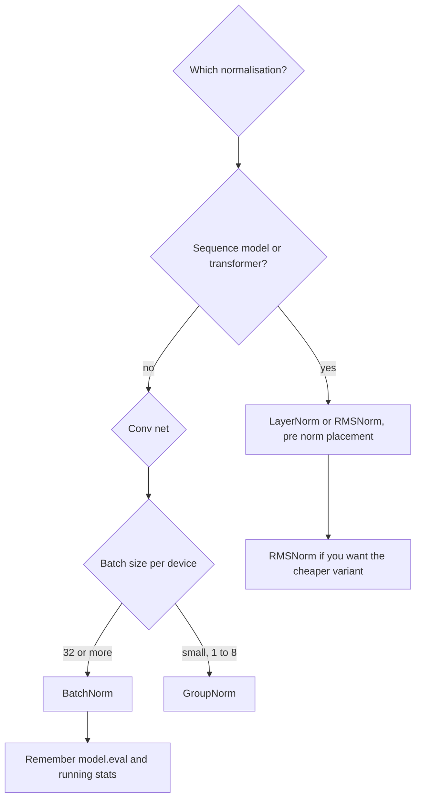

# BatchNorm and LayerNorm

## TL;DR
Both standardise activations to roughly zero mean and unit variance, then re-scale with learned $\gamma,\beta$ — they differ only in **which axes they average over**. BatchNorm averages across the batch (per channel), so it couples examples together and breaks at batch size 1, with variable sequence lengths, and in RNNs. LayerNorm averages across the feature dimension within each example, so it is batch-independent — which is why every transformer uses it. RMSNorm drops the mean subtraction and is the current LLM default.

## Intuition
Both are answering "the scale of this layer's inputs keeps drifting as the layers below it learn, so the layer above has to keep re-adapting." Normalisation pins the scale so each layer sees a stable input distribution. The design question is what population you standardise against. BatchNorm asks "how does this feature compare to the same feature in the other examples in this batch?" — a statement about the batch. LayerNorm asks "how does this feature compare to the other features of *this* example?" — a statement about one example only, and therefore safe at any batch size.

## The maths

### BatchNorm

For activation $x$ at channel $c$, statistics computed over the batch dimension (and spatial dimensions for convs):

$$
\mu_c = \frac{1}{m}\sum_{i \in \mathcal{B}} x_{i,c}, \qquad
\sigma_c^2 = \frac{1}{m}\sum_{i \in \mathcal{B}}\left(x_{i,c}-\mu_c\right)^2
$$

$$
\hat{x}_{i,c} = \frac{x_{i,c}-\mu_c}{\sqrt{\sigma_c^2+\epsilon}}, \qquad
y_{i,c} = \gamma_c\hat{x}_{i,c} + \beta_c
$$

$\gamma_c,\beta_c$ are learned per channel — $2C$ parameters. They exist because forcing every layer to unit Gaussian would cost expressive power; with them, the network *can* recover the identity if that is optimal. For a conv feature map $(N,C,H,W)$, the mean is over $N\times H\times W$, so there are $C$ means, not $C\times H\times W$.

**Two modes.** Training uses the batch statistics. Inference uses a running EMA of them, accumulated during training:

$$
\mu_{\text{run}} \leftarrow (1-\alpha)\mu_{\text{run}} + \alpha\mu_{\mathcal{B}}
$$

This train/test discrepancy is BatchNorm's defining awkwardness — the function computed at inference is not the function computed at training. Forgetting `model.eval()` uses batch statistics at inference, so predictions depend on which other examples happen to be in the request. That is a real production bug, and a genuine [[training-serving-skew]] example.

**Why it works.** The original "reduces internal covariate shift" story is now considered largely wrong; the better-supported explanation is that it **smooths the loss landscape** — it bounds the gradient's Lipschitz constant, which is why you can use a much larger learning rate with BatchNorm than without. A second effect: because each example's normalisation depends on the batch it happens to land in, BatchNorm injects noise and acts as a regulariser, which is why BatchNorm networks often need less dropout.

**Scale invariance.** $\mathrm{BN}(aWx) = \mathrm{BN}(Wx)$ for any $a>0$, so the *magnitude* of the preceding weights has no effect on the output — only their direction. This makes the network far less sensitive to initialisation and interacts with weight decay in a non-obvious way (decay on a pre-BN weight changes the effective learning rate rather than the function). Also, the preceding layer's bias is redundant; use `bias=False`.

### Where BatchNorm breaks

- **Batch size 1.** $\sigma^2 = 0$ exactly. The output is $\beta$ for every unit — all information is destroyed. Even at batch 2–8 the statistics are so noisy that training degrades badly, which is the practical problem for detection and segmentation where memory forces small batches. GroupNorm or LayerNorm is the fix.
- **RNNs.** The statistics would have to be computed per timestep, but sequences have different lengths, so late timesteps are estimated from few sequences, and at inference a longer sequence than seen in training has no running statistics at all. LayerNorm sidesteps this entirely.
- **Variable-length sequences generally.** Padding tokens contaminate the batch statistics unless masked, and masking BatchNorm correctly is fiddly.
- **Distributed training.** Each device computes statistics on its local shard, so the effective batch is per-device, not global. `SyncBatchNorm` fixes it at the cost of an all-reduce per BN layer.
- **Non-i.i.d. batches.** If a batch is sorted by class or by user, the statistics encode the label. This is a subtle [[data-leakage]] route.
- **Any train/inference batch composition mismatch**, e.g. training at batch 256 and serving single requests.

### LayerNorm

Same formula, different axes. Statistics over the **feature dimension of a single example**:

$$
\mu_i = \frac{1}{d}\sum_{k=1}^{d}x_{i,k}, \qquad \sigma_i^2 = \frac{1}{d}\sum_{k=1}^{d}(x_{i,k}-\mu_i)^2
$$

$$
y_{i,k} = \gamma_k\frac{x_{i,k}-\mu_i}{\sqrt{\sigma_i^2+\epsilon}} + \beta_k
$$

No batch dependence, so training and inference compute the identical function, batch size 1 is fine, and sequence length is irrelevant — each token normalises over its own $d$ features independently. That is the entire reason transformers use it.

**The family, by axes:** BatchNorm over $(N,H,W)$ per channel; LayerNorm over $(C,H,W)$ per example (or over $d$ per token); InstanceNorm over $(H,W)$ per example per channel (style transfer); GroupNorm over $(H,W)$ and a group of channels, which interpolates between the two and is the standard choice for small-batch vision.

### Pre-norm vs post-norm

The original Transformer is **post-norm**: $x_{\ell+1} = \mathrm{LN}\bigl(x_\ell + \mathrm{Sublayer}(x_\ell)\bigr)$.

Modern models are **pre-norm**: $x_{\ell+1} = x_\ell + \mathrm{Sublayer}\bigl(\mathrm{LN}(x_\ell)\bigr)$.

The difference is whether there is a **clean, un-normalised residual path from input to output**. In pre-norm there is: gradients flow from the loss to layer 1 through a chain of pure additions, with no LayerNorm Jacobian in the way. In post-norm every residual connection is followed by a LayerNorm, so the gradient passes through $L$ normalisation Jacobians and their product can shrink — which is exactly why post-norm transformers need careful warmup and are hard to train deep. See [[vanishing-and-exploding-gradients]].

The tradeoff, stated honestly: post-norm often reaches slightly better final quality when it trains at all, because normalising the residual stream stops activation magnitude growing with depth. Pre-norm lets the residual stream's variance grow across layers, which is usually handled by a final LayerNorm before the output head and by scaling residual-branch outputs at init. In 2026 essentially all large models are pre-norm, because trainability at depth beats a small quality edge. Some use both (a "sandwich" norm).

### RMSNorm

Drop the mean subtraction and the shift:

$$
y_k = \gamma_k\,\frac{x_k}{\mathrm{RMS}(x)}, \qquad \mathrm{RMS}(x) = \sqrt{\frac{1}{d}\sum_{j=1}^{d}x_j^2 + \epsilon}
$$

The claim, borne out empirically, is that **re-scaling is what does the work and re-centring contributes little**. It is cheaper (one pass of statistics instead of two, no $\beta$) and is the default in LLaMA-family models and most current LLMs.

## Diagram



## Code

```python
import torch, torch.nn as nn

x = torch.randn(8, 16, 32)          # (batch, seq, features)

ln = nn.LayerNorm(32)               # normalises the LAST dim, per token
print(ln(x).mean(-1).abs().max().item() < 1e-5)   # True: each token is centred
print(ln(x).std(-1).mean().item())                # ~1

# BatchNorm1d on (N, C) expects C as dim 1 and averages over N
bn = nn.BatchNorm1d(32)
y = bn(x.transpose(1, 2))           # (8, 32, 16): stats over N and seq per channel
print(bn.running_mean.shape)        # torch.Size([32])

# The train/eval discrepancy, demonstrated
bn.train(); a = bn(x.transpose(1, 2))
bn.eval();  b = bn(x.transpose(1, 2))
print("train vs eval differ:", not torch.allclose(a, b, atol=1e-3))

# LayerNorm is identical in train and eval
ln.train(); p = ln(x)
ln.eval();  q = ln(x)
print("layernorm identical:", torch.allclose(p, q))

# batch size 1 destroys BatchNorm's signal in training mode
bn1 = nn.BatchNorm1d(4); bn1.train()
out = bn1(torch.randn(1, 4))
print(out)      # all zeros (beta), regardless of input — variance is 0
```

RMSNorm and the two residual placements:

```python
class RMSNorm(nn.Module):
    def __init__(self, d, eps=1e-6):
        super().__init__()
        self.weight = nn.Parameter(torch.ones(d))
        self.eps = eps

    def forward(self, x):
        rms = x.pow(2).mean(-1, keepdim=True).add(self.eps).rsqrt()
        return self.weight * (x * rms)

class PreNormBlock(nn.Module):        # modern: clean residual highway
    def __init__(self, d, sublayer):
        super().__init__(); self.norm, self.sub = nn.LayerNorm(d), sublayer
    def forward(self, x):
        return x + self.sub(self.norm(x))

class PostNormBlock(nn.Module):       # original Transformer
    def __init__(self, d, sublayer):
        super().__init__(); self.norm, self.sub = nn.LayerNorm(d), sublayer
    def forward(self, x):
        return self.norm(x + self.sub(x))

d = 32
print(PreNormBlock(d, nn.Linear(d, d))(torch.randn(2, 5, d)).shape)
print(RMSNorm(d)(torch.randn(2, 5, d)).shape)
```

## In practice
- **Use it when:** convnets with batch ≥ 32 per device → BatchNorm. Small-batch vision (detection, segmentation, 3D) → GroupNorm. Anything sequential or transformer-shaped → LayerNorm, or RMSNorm if you want the cheaper version. Tabular MLPs → BatchNorm or LayerNorm both work, BatchNorm often slightly better.
- **Defaults that work:** `eps=1e-5`, BatchNorm `momentum=0.1` (PyTorch's convention: this is the EMA weight on the *new* batch), `bias=False` on the layer feeding a BatchNorm, pre-norm placement in transformers, $\gamma$ init to 1 and $\beta$ to 0. Do not weight-decay $\gamma$ or $\beta$ — see [[optimizers-sgd-adam]].
- **Breaks when:** batch size 1 in BatchNorm training mode; `model.eval()` forgotten; fine-tuning a pretrained convnet on a small target dataset where the running statistics are stale (freezing BN is a standard trick); distributed training without `SyncBatchNorm` at small per-device batch; batches that are non-i.i.d.
- **Cost / latency:** memory-bandwidth bound, not FLOP bound — typically a few percent of runtime, though it can be more in small convnets because it prevents kernel fusion. BatchNorm at inference can be **folded into the preceding conv/linear weights** entirely, making it free; LayerNorm cannot, because its statistics depend on the input.

> [!warning]
> PyTorch's BatchNorm `momentum` is the weight on the new observation, the opposite of the convention in most papers and in TensorFlow. `momentum=0.1` means a fast-moving average, not a slow one.

## Interview angle

**Q. What is the difference between BatchNorm and LayerNorm?**
Only the axes. BatchNorm computes mean and variance per channel across the batch (and spatial dims), so an example's output depends on the other examples in its batch and it needs separate train/inference behaviour with running statistics. LayerNorm computes them across the features of a single example, so it is batch-independent and identical in train and eval. That independence is why sequence models and transformers use LayerNorm.

**Q. Why do transformers use LayerNorm rather than BatchNorm?**
Sequences have variable length, so per-timestep batch statistics are estimated from different numbers of examples and are undefined for lengths not seen in training; padding contaminates them; and autoregressive inference runs effectively at batch-of-one per step. LayerNorm has none of these problems because each token normalises over its own feature vector.

**Q. Why does BatchNorm break at batch size 1?**
The batch variance of a single example is exactly zero, so the normalised output is zero and the layer emits $\beta$ for every unit — the input is completely discarded. More practically, at batch 2–8 the statistics are so noisy that they act as excessive gradient noise. GroupNorm is the standard replacement for small-batch regimes.

**Q. Explain pre-norm versus post-norm.**
Post-norm applies LayerNorm after the residual addition, so every residual connection is wrapped in a normalisation and the gradient path from loss to early layers passes through $L$ LayerNorm Jacobians — which is why deep post-norm transformers need careful warmup and are unstable. Pre-norm applies it to the sublayer input, leaving a clean additive residual highway from input to output, so gradients flow directly. Pre-norm trains deep models reliably; post-norm can reach marginally better quality when it converges. Everything large is pre-norm today.

**Follow-up.** *If pre-norm has a clean residual path, what is its downside?* → The residual stream variance grows with depth since nothing renormalises it, so you need a final LayerNorm before the head and typically a $1/\sqrt{L}$ scaling of residual-branch outputs at init.

**Q. Why does BatchNorm actually work? Is it internal covariate shift?**
The covariate-shift story is the original explanation and is not well supported — you can inject noise after BatchNorm, deliberately reintroducing distribution shift, and it still trains fine. The better-supported account is that it smooths the loss landscape and bounds gradient magnitudes, which is why it permits much larger learning rates. It also acts as a regulariser through the noise in batch statistics.

**Q. What is RMSNorm and why did LLMs adopt it?**
LayerNorm without mean subtraction and without the $\beta$ shift — divide by the root mean square and scale by a learned $\gamma$. The empirical finding is that re-scaling carries almost all the benefit while re-centring adds little, so you get the same quality with fewer operations and fewer parameters. At LLM scale that saving is worth taking, and it is the default in LLaMA-family architectures.

**Q. Your model is great in validation and worse in production. BatchNorm is in the stack. What do you check?**
First that `model.eval()` is called on the serving path — otherwise BatchNorm uses request-batch statistics and a single-item request produces garbage. Second, whether the running statistics match production data; if training data was normalised differently or the distribution has shifted, the frozen statistics are wrong. Third, whether training batches were non-i.i.d. (sorted by class or user), which makes the learned statistics unrepresentative.

## Traps
- **"BatchNorm normalises each example."** It normalises each *channel across examples*. That coupling between examples is the whole source of its problems.
- **"Normalisation makes activations exactly N(0,1)."** Only before $\gamma,\beta$. The learned affine can and does undo it, and should be allowed to.
- **Forgetting `model.eval()`.** The classic. Also affects dropout — see [[dropout-and-regularization-dl]].
- **Weight-decaying $\gamma$ and $\beta$.** Shrinking $\gamma$ toward zero suppresses the channel; exclude norm parameters from decay.
- **Keeping a bias on the layer before BatchNorm.** Redundant — BN subtracts the mean, cancelling it. Use `bias=False`.
- **"LayerNorm normalises over the batch too."** It does not touch the batch dimension at all. In PyTorch `nn.LayerNorm(d)` normalises only the last dimension of size `d`.
- **Assuming BatchNorm is a free lunch at inference.** It is, in convnets, because it folds into the preceding weights. LayerNorm does not fold and is a real (if small) inference cost.
- **Not freezing BN when fine-tuning on a small dataset.** The running statistics get overwritten by a handful of unrepresentative batches and accuracy drops.

## Flashcards
What axes does BatchNorm average over?::The batch dimension (and spatial dims for convs), producing one mean and variance per channel.
What axes does LayerNorm average over?::The feature dimension within a single example — no batch dependence.
Why does BatchNorm fail at batch size 1?::The batch variance is exactly zero, so the normalised output is zero and the layer outputs beta regardless of input.
What are gamma and beta for?::Learned per-channel scale and shift so the network can undo the normalisation if the identity is a better function.
Why do transformers use LayerNorm?::Variable sequence lengths, padding, and batch-of-one autoregressive decoding all break per-timestep batch statistics; LayerNorm is batch-independent.
Pre-norm formula?::x + Sublayer(LayerNorm(x)) — leaving a clean additive residual path.
Post-norm formula?::LayerNorm(x + Sublayer(x)) — every residual is wrapped in a norm, so gradients pass through L norm Jacobians.
What is RMSNorm?::LayerNorm without mean subtraction or beta: divide by the root mean square of the features, scale by a learned gamma.
Why is BatchNorm cheaper at inference than LayerNorm?::Its statistics are fixed constants, so it folds into the preceding conv/linear weights; LayerNorm's depend on the input and cannot fold.
Which normalisation for small-batch vision?::GroupNorm — it averages over spatial dims and a group of channels, with no batch dependence.
Is "internal covariate shift" the accepted explanation for BatchNorm?::No — the better-supported explanation is loss-landscape smoothing plus regularising noise from batch statistics.

## Related
- [[neural-network-fundamentals]]
- [[vanishing-and-exploding-gradients]]
- [[dropout-and-regularization-dl]]
- [[transformer-architecture]]
- [[weight-initialization]]
- [[training-serving-skew]]
- [[moc-deep-learning]]
