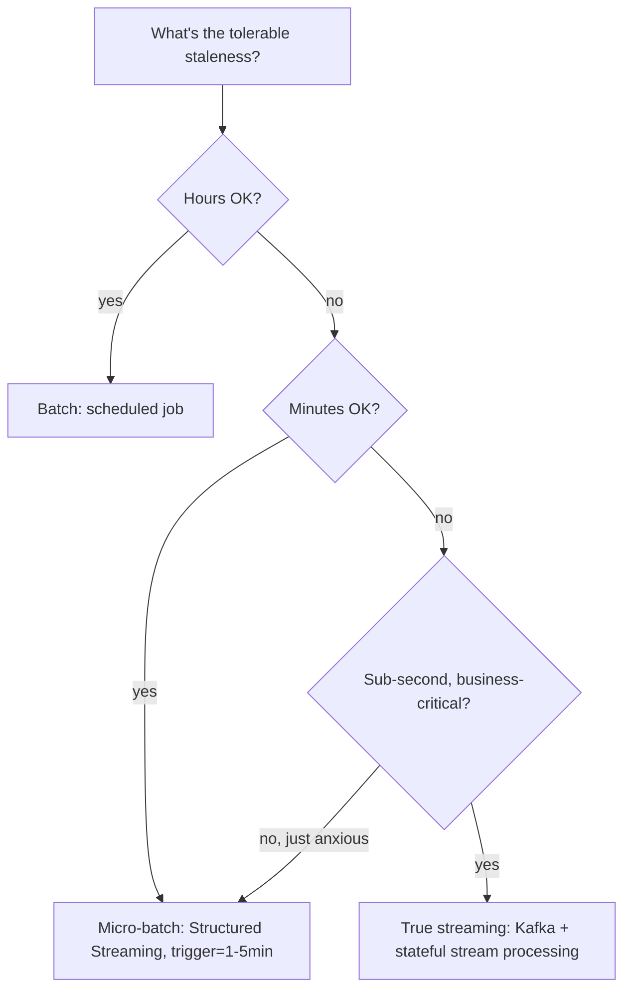

# Batch vs Streaming

## TL;DR
The decision isn't "streaming is modern, batch is legacy" — it's a genuine cost-benefit tradeoff along
three axes: how fresh must the output be (latency requirement), how much data and how continuous is
its arrival (volume/velocity), and how much operational complexity you're willing to carry
(streaming infra, exactly-once concerns, state management). Micro-batching (Structured Streaming's
default trigger, e.g. every 1-5 minutes) is the pragmatic middle ground that gets most teams 90% of
streaming's freshness at a fraction of the complexity.

## Intuition
Ask: "if this data were 24 hours stale, would anyone notice or care?" If no — batch, and stop there,
you just saved yourself weeks of streaming infrastructure. If yes, ask how stale is *actually*
tolerable: minutes (micro-batch is fine) or sub-second (true streaming, with all its state-management
and exactly-once headaches, is earning its keep). Most "we need real-time" requirements, when pressed,
turn out to mean "within the hour," which is squarely batch or micro-batch territory.

## The maths
Model the decision as minimising total cost:
$$
\text{Cost} = C_{\text{infra}}(\text{architecture}) + C_{\text{staleness}}(\Delta t) \cdot P(\text{staleness causes harm})
$$
where $\Delta t$ is data latency (time from event to availability for use) and $C_{\text{infra}}$ rises
sharply as $\Delta t \to 0$ (batch cluster cost is roughly flat regardless of $\Delta t$ down to
minutes; true streaming infra — always-on consumers, state stores, exactly-once coordination — adds a
step-change in operational cost). The right architecture minimises the sum, not just $\Delta t$ in
isolation. Two supporting facts:

- **Micro-batching** runs the same batch-style logic on a short fixed trigger interval (e.g. every 60s),
  giving latency in the range of the trigger interval without needing continuous stateful stream
  processing — it's the dominant middle ground in practice (Spark Structured Streaming's default mode).
- **True streaming** (continuous/low-latency triggers, event-at-a-time or small micro-batches with
  sub-second triggers) is warranted only when $\Delta t$ requirements are sub-minute *and* the
  business impact of staleness at that timescale is real (fraud blocking, bidding, live
  personalisation) — otherwise the extra complexity buys nothing.

## Diagram


## Code
```python
# Batch: a daily scheduled job — simplest possible correct architecture
df = spark.read.format("delta").load("/bronze/events")
daily_agg = df.filter(df.event_date == run_date).groupBy("user_id").agg(...)
daily_agg.write.format("delta").mode("overwrite").save("/gold/daily_agg")
```

```python
# Micro-batch: Structured Streaming with a fixed trigger interval — the pragmatic default
stream_df = (spark.readStream.format("delta").load("/bronze/events"))
query = (stream_df.groupBy("user_id").agg(...)
    .writeStream
    .format("delta")
    .outputMode("update")
    .trigger(processingTime="2 minutes")   # micro-batch cadence, not continuous
    .option("checkpointLocation", "/checkpoints/agg")
    .start("/gold/streaming_agg"))
```

```python
# True continuous streaming (rare — only when sub-second latency is genuinely required)
query = (stream_df.writeStream
    .trigger(continuous="1 second")   # experimental, low-latency mode; far fewer operators supported
    .start())
```

## In practice
- **Use it when:** default to batch. Move to micro-batch when the business genuinely can't wait for a
  scheduled run (e.g. hourly fraud scoring, near-real-time dashboards). Reserve true streaming for
  sub-minute, business-critical freshness (fraud blocking at transaction time, ad bidding, live
  recommendation re-ranking).
- **Defaults that work:** Structured Streaming with `processingTime` triggers in the 1-5 minute range
  covers the vast majority of "we need it fresher than daily" requirements without the operational
  burden of true low-latency streaming (state store tuning, watermark management, exactly-once
  coordination across the whole path).
- **Breaks when:** teams pick streaming because it sounds more sophisticated, then discover they now
  own watermarking, late-data handling, state store sizing, and checkpoint recovery — for a use case
  that would have been fine as an hourly batch job.
- **Cost / latency:** batch clusters can be ephemeral (spin up, run, shut down) — cost roughly
  proportional to data volume processed. Streaming requires an always-on (or near-always-on) cluster,
  which is a fixed cost floor regardless of data volume; this fixed cost is the main reason to avoid
  streaming unless the latency requirement demands it.

## Interview angle
**Q. Product wants "real-time" fraud scores. How do you figure out what architecture that actually
needs?**
Push back on "real-time" until you get a number: is a transaction scored within 500ms of arrival, or
is "real-time dashboard updated every few minutes" what they actually mean? Those are wildly different
architectures. If it's sub-second, per-transaction blocking decisions — that's true streaming with a
low-latency serving path. If it's "the ops team sees fraud rate trending up within the hour" — that's
micro-batch or even hourly batch, at a fraction of the engineering cost.

**Follow-up.** The business insists on "sub-second" but can't say why. How do you validate the
requirement? → Trace it to a concrete decision that happens at that timescale (e.g. blocking a
transaction before settlement) — if no such decision exists, the real requirement is almost always
looser, and you can negotiate down to micro-batch with a clear cost/latency tradeoff shown.

**Q. What is micro-batching and why is it the dominant pattern rather than true streaming?**
Micro-batching applies the same batch-style transformation logic repeatedly on a short, fixed trigger
interval instead of continuously per-event. It gets you latency close to the trigger interval (e.g. 1-2
minutes) while reusing batch semantics, tooling, and mental models — no need for per-event state
management or continuous-mode operator restrictions. It's the 80/20 answer: most "streaming"
requirements are actually satisfied by low-minute freshness, and micro-batch delivers that at far
lower operational cost than true streaming.

**Q. What operational costs does true streaming add that batch/micro-batch don't have?**
An always-on cluster (fixed cost floor); state store management for windowed/stateful aggregations;
watermarking and late-data handling policy; exactly-once coordination across source → processing →
sink; and harder debugging (you can't just "rerun a job" the same way — you're reasoning about a
continuously evolving state).

**Q. Give an example from your own work where batch was clearly the right call, and one where
streaming would have been.**
(Talking-point framing) Daily feature aggregation for a churn model — batch is obviously right,
freshness within a day doesn't change the decision. A live fraud-blocking check at transaction time —
genuinely needs sub-second, so streaming (or a low-latency synchronous lookup) earns its complexity
there.

## Traps
- Choosing streaming as a default "for scalability" — batch scales perfectly well to very large data
  volumes; streaming solves *latency*, not volume, and Spark batch jobs routinely process far more
  data than most streaming pipelines ever see.
- Not distinguishing micro-batch from true streaming when discussing architecture — interviewers will
  probe whether you understand that Structured Streaming's default mode is still micro-batch under
  the hood, just with a shorter trigger, not continuous.
- Underestimating the ongoing cost of a streaming pipeline (state store growth, checkpoint management,
  schema evolution mid-stream) versus a batch job you can pause, rerun, and forget between runs.
- Assuming "streaming" and "real-time" are synonyms — a 5-minute micro-batch is still "streaming" in
  the Structured Streaming sense but is not sub-second real-time.

## Flashcards
What three factors decide batch vs streaming?::Latency requirement, data volume/velocity, and the operational complexity cost the team can absorb.
What is micro-batching?::Applying batch-style transformation logic on a short fixed trigger interval (e.g. every 1-5 minutes) instead of continuously per event — the pragmatic middle ground.
Why does true streaming have a higher fixed cost floor than batch?::It requires an always-on cluster and continuous state management, versus batch's ephemeral, spin-up-and-shut-down clusters.
When does true low-latency streaming genuinely earn its complexity?::When a concrete sub-minute business decision (e.g. blocking a fraudulent transaction before settlement) depends on that freshness.
What extra operational burdens does true streaming add over micro-batch?::State store management, watermarking/late-data handling, and exactly-once coordination across the whole pipeline.
Is Structured Streaming's default trigger mode continuous or micro-batch?::Micro-batch — continuous mode exists but is experimental and supports far fewer operators.

## Related
[[data-pipeline-fundamentals]]
[[spark-architecture]]
[[batch-vs-realtime-inference]]
[[kafka-and-event-streaming]]
[[vs-batch-vs-streaming-architecture]]
