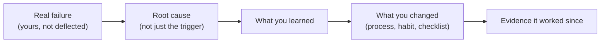

# Handling Failure Questions

## TL;DR
"Tell me about a time you failed" is not testing whether you're perfect — it's testing
ownership (do you blame others), learning (did anything change because of it), and judgement
about what "failure" even means at your level. Pick a real failure that was genuinely yours,
show what you changed afterward, and never let the story quietly become about someone else's
mistake.

## Intuition
Interviewers have heard hundreds of "I worked too hard" fake-failure answers. What they're
actually listening for is closer to what a good post-incident review sounds like: what
happened, what was the root cause (not just the trigger), what changed as a result so it
doesn't recur. A confident engineer can describe a real mistake calmly because it's in the
past and they've already extracted the lesson — that calm is the signal, more than the
specific mistake.

## The maths
Not applicable.

## Diagram


## Code
```text
Not applicable — this is a communication framework.
```

## In practice
- **Use it when:** "tell me about a failure/mistake," "time you were wrong," "project that
  didn't go well."
- **Defaults that work:** pick a failure with real, bounded consequences (a model shipped
  with a subtle bug, a launch delayed because of something you missed, an analysis that led
  to a wrong recommendation) — not a fake-humble non-failure ("I work too hard") and not a
  catastrophic, career-ending one that raises more concern than it resolves.
- **Breaks when:** the story secretly blames a teammate, a vague "the requirements changed,"
  or leadership — this reads as an inability to own outcomes, which is disqualifying at senior
  levels even if the facts are technically true.
- **Cost / latency:** n/a.

### The honest-but-safe answer shape

1. **What happened, briefly.** State the mistake plainly, in one or two sentences, without
   pre-emptive excuses. ("I shipped a feature transformation that used a rolling average
   computed after the fact, which leaked future information into training — the offline
   metrics looked great and production performance was materially worse.")
2. **Root cause, not just the trigger.** Go one level deeper than "I made a mistake" — what
   about your process allowed it. ("The pipeline didn't have a training/serving parity check
   for that feature; I'd validated the transformation logic but not exactly how it would be
   computed at inference time.")
3. **What you did once you found it.** Show the actual fix and the containment — did you
   catch it, or did production/a teammate catch it, and how did you respond.
4. **What changed afterward — this is the part interviewers actually weigh most.** A concrete,
   durable change: a checklist item, a new test class, a review practice you now follow, a
   habit ("I now always write the point-in-time-correctness check as part of any new feature,
   not as an afterthought").
5. **Optional: evidence it stuck.** If you've since caught a similar issue *because* of the
   change, say so — it proves the lesson generalized rather than being a one-time fix.

## Interview angle
**Q. Tell me about a time you failed.**
Use the shape above. Keep step 1 short and factual, spend real time on steps 2 and 4 — root
cause and durable change are what's being graded, not the drama of the mistake itself.

**Follow-up.** "Whose fault was it, ultimately?" → Resist the urge to spread blame even if
others were partly involved; own your piece cleanly ("I should have caught it in review — the
process gap was mine to close") while being factual about what happened. You can name a
process gap without naming a person.

**Q. What's a mistake you made that you haven't fully resolved / that still bothers you?**
This is a harder, more senior version — it's testing whether you can be honest about an
unresolved gap without spiraling into over-disclosure. A good answer: name a real, moderate
gap, what you've done so far, and what you'd still like to change — framed as ongoing growth,
not as an unaddressed liability.

**Q. Have you ever missed a deadline or delivered something below expectations?**
Same shape, oriented toward delivery rather than a technical bug — describe the estimation
gap or the missed dependency, what you changed about how you scope or communicate risk early
now (e.g. "I now flag schedule risk the moment I see it, rather than waiting to see if it
resolves itself").

## Traps
- Wrong: "I'm a perfectionist, so I sometimes work too hard" as a failure answer. — Correct:
  interviewers recognize this immediately as a non-answer; it reads as unwillingness to be
  honest, which is worse than admitting a real, moderate mistake.
- Wrong: a story where "the requirements kept changing" or "the stakeholder was unreasonable"
  is secretly the whole point. — Correct: however true, framing the *cause* as external makes
  it sound like you're deflecting; keep the focus on your own decision or gap.
- Wrong: picking a catastrophic failure (a major outage, data loss) without a clear, credible
  resolution and lesson. — Correct: scale the failure to something real but bounded, where the
  learning and fix are clearly proportionate and believable.
- Wrong: no evidence the lesson generalized — "I learned to be more careful" is too vague. —
  Correct: name the specific practice/checklist/test you now use, ideally one you can point to
  as still in use.

## Flashcards
What three things is a "tell me about a failure" question actually testing?::Ownership (not blaming others), learning (root cause understanding), and evidence of a durable change.
What's wrong with "I work too hard" as a failure answer?::It's a non-answer that dodges honesty, which reads worse than admitting a real, moderate mistake.
What should you go one level deeper than in your failure story?::The trigger — go to the root cause (a process or judgement gap), not just "what happened."
What part of the failure-answer shape do interviewers weight most heavily?::What changed afterward — a concrete, durable practice or habit, not just remorse.
How should you handle a failure that partly involved other people?::Own your specific piece factually without spreading blame; you can name a process gap without naming a person.

## Related
[[star-method]], [[project-narrative-construction]], [[stakeholder-and-conflict-questions]], [[interview-day-playbook]]
