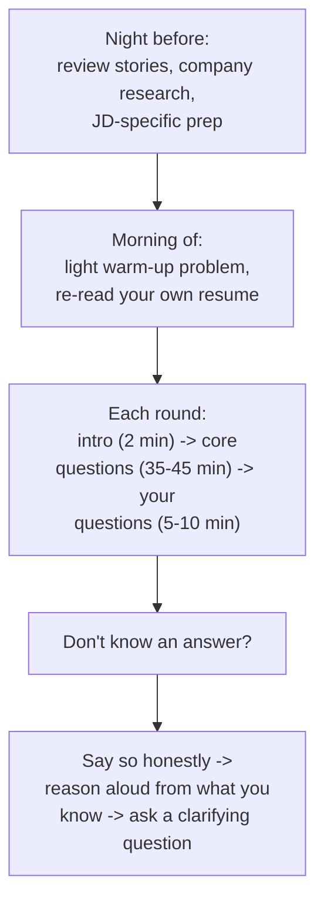

# Interview Day Playbook

## TL;DR
The night before, review your own stories and the company/role specifics, not new material.
The morning of, do a light warm-up, not cramming. Structure each 45-60 minute round with time
buffers so you're not rushed at the end. When you don't know an answer, say so cleanly, reason
out loud from what you do know, and ask a clarifying question rather than freezing or
bluffing.

## Intuition
Treat interview day like a race day, not a study day — the work that determines your
performance was done in the weeks before; the day itself is about arriving calm, warmed up,
and executing what you already know. Athletes don't learn a new technique the morning of a
race; they do a light jog and review the plan.

## The maths
Not applicable.

## Diagram


## Code
```text
Not applicable — this is a preparation and execution framework.
```

## In practice
- **Use it when:** the 24 hours before any interview loop, and as a live mental checklist
  during each round.
- **Defaults that work:** a fixed, short night-before checklist and a fixed, short
  morning-of checklist (below), so you're not deciding what to review under stress — decide it
  once, in advance, and just execute it.
- **Breaks when:** cramming new technical material the night before or morning of — it adds
  anxiety without meaningfully adding readiness at this stage, and crowds out sleep, which
  affects live problem-solving far more than one extra topic reviewed.
- **Cost / latency:** n/a.

### What to review the night before

Re-read your own resume and anchor project notes so your stories are fresh and consistent
(see [[project-narrative-construction]]), not so you memorize new ones. Re-read the JD and
your notes on what it's testing for (see [[resume-and-jd-mapping]]). Skim the company's
recent product/engineering blog posts or news if available — one or two specific, current
facts are enough for a good closing question (see [[questions-to-ask-interviewers]]). Confirm
logistics (link, time zone if remote, address if on-site, ID requirements) so morning-of
doesn't start with a scramble. Sleep is the single highest-leverage "prep" activity the night
before — protect it over one more practice problem.

### What to review the morning of

One light warm-up: a single easy coding problem or a five-minute mental walk through your
STAR stories out loud — not a new topic, just loosening up the retrieval pathways you'll need.
Re-read your own resume once more (interviewers will ask about it directly and there's nothing
worse than being surprised by your own bullet point). Arrive (physically or virtually) 10-15
minutes early — resolve any tech/logistics issues before the clock starts, not during it.

### Structuring a 45-60 minute round

Roughly: 2-3 minutes of intro/rapport, 35-45 minutes of core content (technical problem,
system design, or behavioral questions — driven by the interviewer, but you can gently pace
yourself: if a technical problem is taking too long, say so and propose moving to the next
part), then 5-10 minutes reserved at the end for your own questions — protect this time; if the
interviewer is running long, it's fine to say "I want to make sure I leave time for my
questions too" a few minutes before the hour.

### Recovering when you don't know an answer

Say so plainly and immediately — "I haven't worked with that specific technique directly, but
here's how I'd reason about it" — rather than bluffing or going silent; interviewers
consistently rate honest, structured reasoning from an admitted knowledge gap higher than
confident-sounding guessing. Reason out loud from adjacent things you do know (a related
technique, a first-principles argument, a decomposition of the problem). Ask a clarifying
question if the prompt is genuinely ambiguous — this is a legitimate move, not a stall tactic,
as long as it's a real question and not a delay. If you're stuck on a coding/design problem,
narrate your thinking rather than going silent — interviewers grade the process more than the
final answer in most rounds designed by good companies.

## Interview angle
**Q. How do you prepare the night before a big interview?**
Describe the fixed checklist above — review your own material, confirm logistics, protect
sleep — and explicitly say you avoid cramming new topics, which shows self-awareness about
what actually improves performance under pressure.

**Follow-up.** "What if you realize you're weak on a topic the night before?" → A brief,
targeted refresher (say, re-reading one summary page) is fine; a multi-hour cram session the
night before a loop usually costs more in fatigue than it gains in coverage.

**Q. Tell me about a time you didn't know the answer to an interview question.**
This is itself sometimes asked directly — describe a real instance where you said so plainly,
reasoned from what you knew, and either arrived at a reasonable answer or asked a good
clarifying question that redirected the conversation productively.

**Q. How do you handle running out of time on a system design or coding round?**
Prioritize out loud: state that you're consciously choosing to leave a lower-priority
part underspecified so you can cover the core requirement fully — this shows judgement about
what actually matters, which interviewers weigh heavily, versus silently running out of time
on everything.

## Traps
- Wrong: cramming a new topic (say, a distributed systems concept you've never used) the
  night before. — Correct: review your existing stories/material; new-topic learning belongs
  weeks earlier, not hours before.
- Wrong: bluffing through an unknown answer with confident-sounding vagueness. — Correct: say
  you don't know directly, then reason from adjacent knowledge — this reads far better under
  any competent interviewer's evaluation.
- Wrong: letting the interviewer's pacing consume your closing-questions time entirely. —
  Correct: politely protect the last 5-10 minutes; asking no questions (see
  [[questions-to-ask-interviewers]]) reads as low engagement.
- Wrong: going silent while stuck on a problem. — Correct: narrate your thinking process even
  when stuck — most interviewers grade the reasoning, not just the final answer.
- Wrong: skipping sleep to fit in one more practice session. — Correct: sleep has a larger
  effect on live reasoning quality than most additional prep the night before an interview.

## Flashcards
What should you review the night before an interview?::Your own stories/resume and JD-specific notes, plus logistics — not new technical material.
What's the recommended morning-of warm-up?::One light, easy problem or a spoken run-through of your STAR stories — not new learning.
How should you structure a 45-60 minute round?::~2-3 min intro, ~35-45 min core content, 5-10 min reserved and protected for your own questions.
What's the best way to handle not knowing an answer?::State it plainly, reason aloud from adjacent knowledge, and ask a clarifying question if the prompt is ambiguous.
Why is bluffing worse than admitting a gap in an interview?::Interviewers consistently rate honest, structured reasoning from an admitted gap higher than confident guessing that turns out wrong.

## Related
[[star-method]], [[project-narrative-construction]], [[questions-to-ask-interviewers]], [[resume-and-jd-mapping]]
