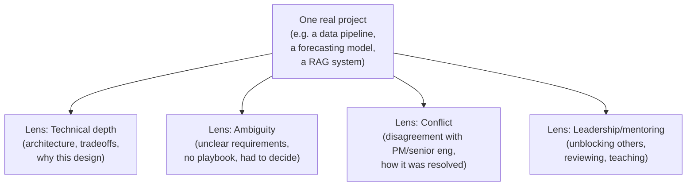

# Project Narrative Construction

## TL;DR
Don't prepare "stories" — prepare *one real project, told 3-4 different ways*, each cut to
foreground a different competency: technical depth, handling ambiguity, conflict/pushback, and
leadership/mentoring. The underlying facts stay the same; what changes is which part of the
Action you slow down on and elaborate.

## Intuition
A single meaty project (say, a forecasting pipeline you built and owned) is like a house you've
lived in for years — you can give a tour focused on the architecture (technical depth), a tour
focused on "we didn't know if this would even work" (ambiguity), a tour focused on the
argument you had with the contractor (conflict), or a tour focused on who you trained to
maintain it after you (leadership). Same house, four tours, each answers a different question
an interviewer actually asked.

## The maths
Not applicable — this is a preparation strategy, not a technical derivation. The only "formula"
worth internalizing: **1 project × 4 lenses ≥ 4 shallow, unrelated anecdotes**, because depth
under follow-up questioning is what actually gets tested, and you can only get real depth on
material you've lived through in detail.

## Diagram


## Code
```text
Not applicable — this is a communication/preparation framework.
```

## In practice
- **Use it when:** prepping for a loop with 3-5 behavioral rounds that will each ask a
  differently-framed question but often about "a project you're proud of."
- **Defaults that work:** pick 2-3 anchor projects total (not one — you need range across
  different competencies and different time periods of your career), and for each anchor
  project, write out the Action section four different ways, one per lens below. Reuse
  Situation/Task across lenses; only the Action (and sometimes Result) changes emphasis.
- **Breaks when:** you try to force every project into every lens — some projects genuinely
  don't have a good conflict story, and inventing one sounds fake under follow-up questions.
  Pick the lens that's true for each project rather than stretching all four onto all
  projects.
- **Cost / latency:** n/a.

### Applying the four lenses (using an owner's likely project shapes — a data pipeline, a forecasting model, a RAG system — as illustrative shapes, not asserted specifics)

**Technical depth lens — e.g. a data pipeline project.**
Slow down on the architecture decision that had a real tradeoff: why medallion layering, why
this partitioning/join strategy, what broke at scale and how you diagnosed it (a Spark stage
that spilled to disk, a skewed join key). The interviewer is testing whether you actually built
it versus configured someone else's design.

**Ambiguity lens — e.g. a forecasting model project.**
Slow down on the moment requirements weren't given to you: what metric to optimize wasn't
specified, the business hadn't defined "how wrong is too wrong," or the right granularity
(SKU-level vs category-level) wasn't obvious. Show how you framed the problem yourself, what
assumptions you made explicit, and how you validated the framing before building.

**Conflict lens — e.g. pushing back during a RAG system build.**
Slow down on a real disagreement: a PM wanted a launch date that didn't allow for a proper
eval set, or a senior engineer wanted to skip a reranking step you believed was needed for
groundedness. Show the disagreement, your reasoning, how you argued it (data, a small
prototype, a cost/risk comparison) — not who "won," but how it was resolved professionally.

**Leadership/mentoring lens — any of the above, later in the project's life.**
Slow down on how you brought others along: reviewed a junior's PR and caught a subtle
data-leakage bug, ran a brown-bag on the pipeline's design so others could maintain it, or
onboarded someone new by pairing on their first change. This lens tests whether you scale
beyond your own hands, which matters more the more experience you claim.

## Interview angle
**Q. Tell me about a challenging project.**
Pick your strongest anchor project and open with whichever lens matches what you sense the
round is testing (a "tech screen" round wants the technical-depth cut; a "hiring manager"
round often wants ambiguity or leadership). If unsure, ask a clarifying question first:
"Would you like me to focus on the technical build, or on how I navigated the ambiguity in
scoping it?" — this itself signals seniority.

**Follow-up.** "What was the hardest technical decision?" → Have a specific, defensible
decision ready with the alternative you rejected and why (not just "it was hard").

**Q. Give me an example where you disagreed with someone more senior.**
Switch to the conflict lens on the same anchor project rather than reaching for a new one —
this keeps your story internally consistent and deeply known under probing, versus a thin
story you're improvising on.

## Traps
- Wrong: preparing 6-8 different shallow project stories "to cover everything." — Correct:
  2-3 deeply-known anchor projects, each retold through multiple lenses, survive follow-up
  questioning far better than many shallow ones.
- Wrong: inventing a conflict or leadership moment that didn't really happen to fill a lens.
  — Correct: if a project genuinely has no conflict story, use a different anchor project for
  that competency rather than fabricating one — experienced interviewers probe for specifics
  and fabrication collapses under "who exactly, what exactly did they say."
- Wrong: treating the four lenses as four separate unrelated stories to memorize verbatim. —
  Correct: they should feel like the same person describing the same real work from different
  angles — consistent details, consistent timeline, consistent tools/stack.

## Flashcards
Why prepare one project told four ways instead of four different projects?::Depth under follow-up questioning matters more than breadth; a well-known project survives probing, a thin one doesn't.
What are the four competency lenses to prepare per anchor project?::Technical depth, ambiguity, conflict, leadership/mentoring.
How many anchor projects should you typically prepare in depth?::Two to three — enough range across competencies and career stages, not so many that none are deep.
What should stay constant across the four retellings of one project?::Situation and Task (context and goal); only the Action's emphasis and sometimes the Result framing change.
What's the risk of forcing every project into every lens?::Fabricated or stretched conflict/leadership moments collapse under specific follow-up questions.

## Related
[[star-method]], [[handling-failure-questions]], [[stakeholder-and-conflict-questions]], [[resume-and-jd-mapping]]
