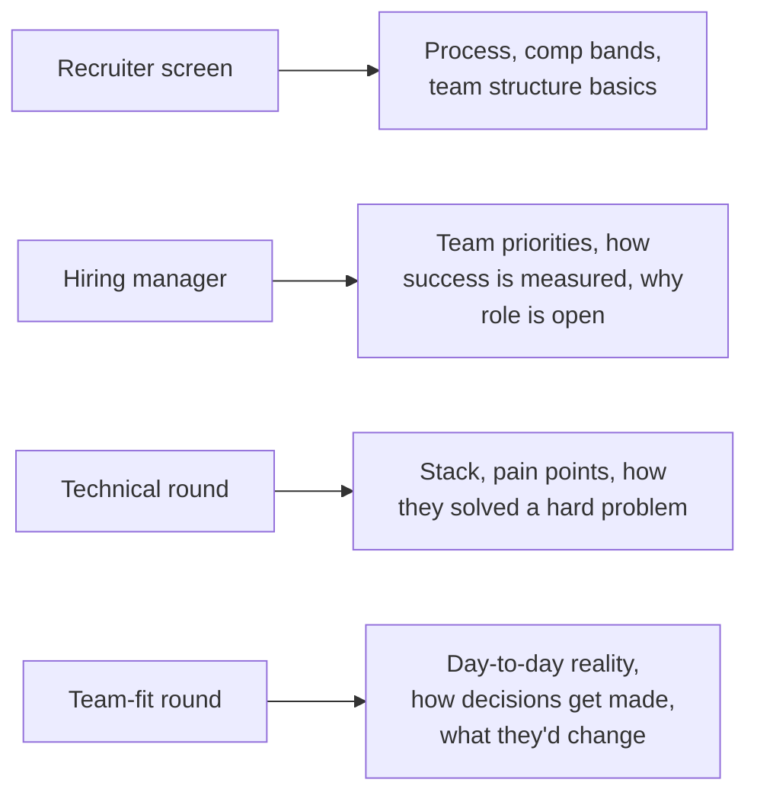

# Questions to Ask Interviewers

## TL;DR
"Do you have any questions for me?" is itself a scored part of the interview — a generic
question ("what's the culture like?") signals box-ticking; a specific question tailored to
the round type signals genuine engagement and, at 5 years experience, that you're evaluating
the role as much as they're evaluating you.

## Intuition
Every round has a different person with different visibility into the role — a recruiter
knows process and comp bands, a hiring manager knows team priorities and how success is
measured, a technical interviewer knows the actual day-to-day stack and pain points, and a
"team fit" round often has peers who know what it's really like to work there. Asking the
recruiter about technical architecture, or the hiring manager about PTO policy, wastes the one
good question you get with the person who could actually answer it well.

## The maths
Not applicable.

## Diagram


## Code
```text
Not applicable — this is a communication framework, not a technical one.
```

## In practice
- **Use it when:** end of every round — always have 2-3 questions ready, tailored to who's
  in the room; ask 1-2, not all of them (respect the clock).
- **Defaults that work:** ask something that requires them to give you a real, specific
  answer, not a scripted one; ideally something you couldn't have gotten from the job
  description or company website.
- **Breaks when:** you ask the same generic question in every round ("what do you like about
  working here?") — it signals you didn't tailor your prep to each person, which is the exact
  opposite of the engagement signal you're going for.
- **Cost / latency:** n/a.

### By round type

**Recruiter screen.** Focus on process and structure — things a recruiter genuinely owns and
can answer precisely: "How many rounds are in the loop, and what does each one focus on?" /
"What does the comp structure typically look like at this level — fixed/variable/ESOP mix?" /
"What's the timeline for a decision after the loop?" Avoid deep technical or team-culture
questions here — they usually can't answer with real specifics and it wastes the slot.

**Hiring manager.** Focus on the team and the role's purpose: "What does success in this role
look like at 6 months and at a year?" / "Why is this role open — growth, backfill, new
initiative?" / "What's the biggest technical or organizational challenge the team is dealing
with right now?" — this last one is especially good because the answer tells you what you'd
actually be doing.

**Technical round.** Focus on their actual system and its pain points — this doubles as a
genuine technical conversation: "What does your model deployment/retraining cadence look like
today, and what's the part that's still painful?" / "How do you currently catch training-serving
skew, or feature drift, in production?" A good technical question here shows you already think
like someone building the thing they build, not like a candidate reciting buzzwords.

**Team-fit / peer round.** Focus on day-to-day reality and decision-making: "How does the team
decide between building something in-house versus using a managed/third-party tool?" / "What's
something you'd change about how the team works if you could?" This second question in
particular tends to get an honest, specific answer that tells you a lot.

## Interview angle
**Q. What's a good closing question for a hiring-manager round?**
"What does success look like in this role at 6 months?" — it's specific, shows you're already
thinking about delivering, and the answer tells you concretely what you'd be measured on,
which most JDs don't spell out clearly.

**Follow-up.** "What if they give a vague answer?" → Ask one respectful follow-up for
specificity ("is there a particular project or metric that would define that?") rather than
dropping it — this itself is a small signal of your own clarity-seeking habit.

**Q. Should you ask about compensation in a technical round?**
No — save comp, PTO, notice-period, and process questions for the recruiter; asking a hiring
manager or technical interviewer about compensation reads as not understanding round
structure, and can cost you rapport built during the technical conversation.

**Q. Is it ever okay to ask a slightly pointed question, like about attrition or a recent
layoff?**
Yes, carefully — frame it as genuine due diligence, not accusatory: "I noticed [public,
verifiable fact] — how has that affected the team you'd be joining?" Ask this in a
later round (hiring manager or team-fit), not the recruiter screen, and only if it's something
you'd genuinely want answered before accepting an offer.

## Traps
- Wrong: asking the same 2 generic questions in every round regardless of who's answering. —
  Correct: tailor at least one question per round to what that specific person can actually
  answer well.
- Wrong: "No, I think you've covered everything" as a closing answer. — Correct: always have
  at least one question ready; "no questions" reads as low engagement even late in a long
  interview day.
- Wrong: asking a question you could have answered yourself from the JD or company website. —
  Correct: ask something that requires their specific, current, inside knowledge.
- Wrong: asking about comp/PTO/notice period in a technical or hiring-manager round. —
  Correct: route those questions to the recruiter.

## Flashcards
Why should your closing questions differ by round type?::Each interviewer has different visibility (process vs team priorities vs technical stack vs day-to-day reality) — a mismatched question wastes the one person who could answer it well.
What's a strong closing question for a hiring-manager round?::"What does success in this role look like at 6 months / a year?"
Where should compensation questions be routed?::To the recruiter screen, not technical or hiring-manager rounds.
What's the risk of asking the same generic question every round?::It signals you didn't tailor prep to each person — the opposite of genuine engagement.
What makes a technical-round closing question strong?::It reflects genuine familiarity with the kind of problems they'd actually be solving (e.g. drift detection, retraining cadence), not generic curiosity.

## Related
[[star-method]], [[stakeholder-and-conflict-questions]], [[interview-day-playbook]], [[salary-negotiation-india]]
