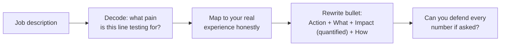

# Resume and JD Mapping

## TL;DR
A job description is a list of things the company is worried they can't do well — reverse it
to find what it's actually testing for, then tailor your resume bullets to lead with impact
(what changed, quantified) rather than activity (what you did), without fabricating numbers
you can't defend if asked.

## Intuition
A JD is written backward from a pain the team has — "experience with real-time inference
pipelines" usually means their current one is slow/flaky and they're tired of it; "strong
stakeholder communication" often means the last person in the role couldn't translate
technical tradeoffs for non-technical leadership. Read the JD like a symptom list and diagnose
the underlying need, then show your resume already treats that exact symptom.

## The maths
Not applicable, but the "impact bullet" has a reliable shape worth treating almost like a
formula:

$$
\text{bullet} = \text{Action verb} + \text{what you built/changed} + \text{quantified outcome} + \text{(optional) how}
$$

e.g. "Rebuilt the feature-generation pipeline in PySpark, cutting nightly batch runtime from
6 hours to 90 minutes by fixing a skewed join and moving repeated transforms to a shared Delta
table" — verb, what, quantified outcome, how, in one sentence.

## Diagram


## Code
```text
Not applicable — this is a writing/positioning framework, not a technical one.
```

## In practice
- **Use it when:** applying to a specific role, not maintaining one generic resume for every
  application — at 5 years experience, a tailored resume materially outperforms a generic one
  for ATS pass-through and recruiter skim time.
- **Defaults that work:** lead each bullet with the outcome or the verb that shows ownership
  ("Built," "Led," "Redesigned," "Reduced"), not with the tool ("Used Spark to..."); reserve
  the tool/stack mention for the "how" clause at the end of the bullet.
- **Breaks when:** you copy JD keywords into your resume without having the substance behind
  them — this passes an ATS keyword scan but collapses the moment a technical interviewer
  asks a follow-up question about "the RAG system" that turns out to be a single LangChain
  tutorial you followed once.
- **Cost / latency:** n/a.

### Reverse-engineering what a JD is actually testing for

Group JD lines into three buckets: **must-have technical substance** (a specific stack,
technique, or scale requirement — e.g. "experience with distributed training" implies they've
hit single-GPU limits and need someone who's actually done multi-node work, not just read
about it), **soft-skill euphemisms** (e.g. "comfortable with ambiguity" often means the team
lacks a fully-defined process and wants someone who won't need hand-holding; "cross-functional
collaboration" often means you'll work directly with product/business without a
translating layer), and **nice-to-have filler** (long lists of tools where only 2-3 are
actually load-bearing — usually inferable from what's mentioned first and repeated). Weight
your resume tailoring toward the first two buckets; don't waste bullet real estate chasing
filler keywords.

### Tailoring bullet points to lead with impact

Rewrite each bullet so the first few words carry the outcome or the ownership verb, not the
tool. Weak: "Used XGBoost and SHAP to build a churn model for the retention team." Stronger:
"Built a churn-prediction model that identified the top 3 controllable churn drivers,
informing a retention campaign that the team credited with a measurable lift in save-rate,
using XGBoost with SHAP for interpretability." The tool is still there — just repositioned as
supporting detail, not the headline.

### Quantifying without fabricating

Three honest ways to get a real number when you don't have an exact one memorized: (1) use a
relative/approximate figure you can defend ("roughly halved," "reduced by an order of
magnitude") rather than a suspiciously precise fake one; (2) quantify scale or scope instead
of business outcome when the outcome isn't cleanly attributable to you alone ("processed ~2TB
of daily event data across 40+ feature pipelines" is honest and still impressive without
claiming a business KPI you didn't directly own); (3) if truly no number exists, quantify
effort/scope honestly and let the interview conversation carry the qualitative impact — never
invent a percentage or dollar figure you can't reconstruct if asked "how did you measure
that?"

## Interview angle
**Q. Walk me through how you tailored your resume for this role.**
Show the reverse-engineering: "I noticed the JD emphasized real-time inference and cost
efficiency, which told me your team is likely optimizing an existing serving stack rather
than building fresh — so I led with my work reducing inference latency and cost on
[project], rather than leading with model-building work that was less relevant here."

**Follow-up.** "What if you don't have direct experience with something the JD lists as a
must-have?" → Be honest about the gap, then bridge with adjacent, transferable experience and
a credible plan to close it quickly — don't claim experience you don't have; a good
interviewer will find the gap in five minutes of follow-up questions.

**Q. This resume bullet says you "improved model performance by 25%" — walk me through
that number.**
Be ready to defend every number on your resume in detail: what metric, what baseline, over
what time window, measured how. If you can't reconstruct a number under this kind of
questioning, don't put it on the resume — this is the single biggest resume-credibility risk
at this experience level.

## Traps
- Wrong: stuffing the resume with every JD keyword regardless of real depth. — Correct:
  tailor toward the load-bearing 2-3 requirements you can go deep on; unsupported keyword
  stuffing collapses under a technical follow-up.
- Wrong: leading bullets with the tool ("Used PyTorch to train a model..."). — Correct: lead
  with the action/outcome, put the tool in the "how" clause.
- Wrong: a suspiciously precise, unexplainable number ("improved accuracy by 23.7%"). —
  Correct: use a number you can fully reconstruct on the spot, or use an honest
  relative/approximate framing instead.
- Wrong: one generic resume for every application at this experience level. — Correct: a
  tailored resume per JD-cluster (not necessarily every single application, but per role-type)
  measurably improves recruiter response rate.

## Flashcards
What's the "impact bullet" formula?::Action verb + what you built/changed + quantified outcome + (optional) how/tool.
Why should the tool name usually come at the end of a bullet, not the start?::Leading with the outcome/action signals impact; the tool is supporting detail, not the headline.
How do you reverse-engineer what a JD line is really testing for?::Read it as a symptom of a team pain (a slow pipeline, an ambiguous process, a translation gap) rather than a literal checklist item.
What's the safest way to quantify impact when you don't have an exact number?::Use an honest relative/approximate figure ("roughly halved") or quantify scale/scope instead of a business KPI you can't fully attribute to yourself.
What should you do about a resume number you can't defend under questioning?::Remove or rephrase it — every number on the resume should be reconstructable on the spot.

## Related
[[star-method]], [[project-narrative-construction]], [[interview-day-playbook]], [[salary-negotiation-india]]
