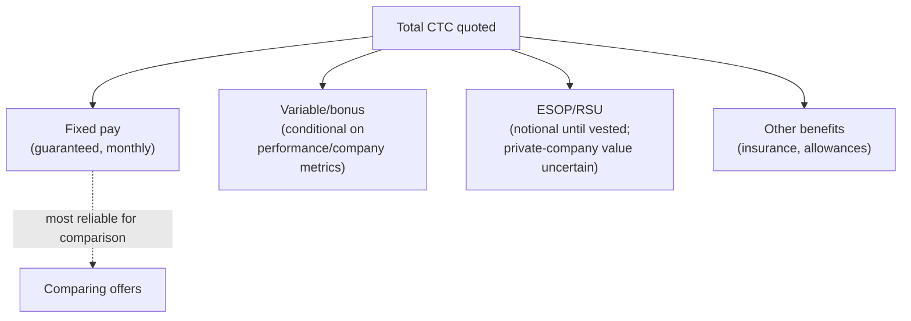

# Salary Negotiation in India

## TL;DR
Indian tech compensation is almost always framed as CTC (Cost to Company), a bundle of fixed
pay, variable/bonus, and often ESOPs/RSUs, which makes comparing offers harder than it looks.
At 5 years experience your leverage comes from being a proven, specific, hard-to-replace
profile (not generic "5 YOE ML"), a competing offer or strong pipeline, and a clean, confident
handling of the "expected CTC" question — never inventing numbers, but never anchoring
low either.

## Intuition
CTC is like a grocery bag someone hands you and says "this bag is worth ₹X" — but the bag
might be mostly rice (fixed, guaranteed) or mostly exotic spices you may never use (ESOPs that
may be worth nothing, variable pay tied to targets you don't control). Two offers with the
same headline CTC can be very different real offers once you unpack the bag.

## The maths
No formal derivation, but the structural relationship worth internalizing:

$$
\text{CTC} = \text{Fixed} + \text{Variable (bonus/incentive)} + \text{ESOP/RSU (notional)} + \text{Other benefits}
$$

The only reliable, guaranteed number in that sum for comparison purposes is **Fixed** (base +
allowances actually paid monthly). Variable is conditional on performance/company metrics you
often don't control. ESOP/RSU value is notional until vested and (for private companies)
until there's a liquidity event — so it should be discounted heavily, not treated at face
value, in any offer comparison.

## Diagram


## Code
```text
Not applicable — this is a compensation-structure framework, not a technical one.
```

## In practice
- **Use it when:** any recruiter screen asking "expected CTC," any offer-stage negotiation.
- **Defaults that work:** always ask for the full breakdown (fixed / variable / ESOP terms /
  joining bonus / notice buyout, if relevant) before comparing any two offers on headline
  number alone; treat ESOP/RSU as a bonus consideration, not a load-bearing part of your
  decision, unless the company is public or clearly near a liquidity event.
- **Breaks when:** you compare offers purely on quoted CTC without unpacking the mix — a
  higher-CTC offer that's 40% variable/ESOP can be a real pay cut in guaranteed terms versus a
  lower-CTC offer that's 90% fixed.
- **Cost / latency:** n/a.

### How compensation is typically structured

Fixed pay is what actually lands in your account monthly/annually regardless of performance —
this is the number to anchor your real financial planning on. Variable pay (sometimes called
"bonus" or "variable pay component," VP) is tied to individual and/or company performance and
paid annually or half-yearly — treat the *target* percentage as aspirational, not guaranteed,
unless you have clear evidence (from current employees, Glassdoor-style data, or the offer
letter's history of payout) that it's reliably paid near-target. ESOPs/RSUs at a private
company carry real uncertainty (vesting schedules, cliff periods, strike price, and — crucially
— whether there's ever a liquidity event); at a public company, RSUs are closer to real,
liquid compensation once vested, though still subject to stock price risk.

### Handling the "expected CTC" question

The safest, most professional answer at 5 years experience is to redirect toward a *range*
grounded in your current compensation and market research, rather than either lowballing
yourself or inventing a number you can't justify: "My current fixed is around [X]; based on my
experience and the market for this role, I'm looking for a total package in the [range]
range, but I'm flexible on the exact mix if the role and growth are strong — happy to
discuss further once we're both sure it's a fit." This does three things: it doesn't hide your
current pay (which recruiters often ask for anyway and inconsistency looks bad), it signals a
range rather than a single anchor (giving room to negotiate up), and it defers precision until
mutual interest is established.

### Negotiating leverage at 5 years experience

Your leverage at this level comes from: (1) a genuinely competing offer or strong pipeline —
the single strongest lever, use it honestly, never bluff a fake offer; (2) depth in a
specific, currently scarce skill set (e.g. production LLM/RAG systems, MLOps at scale) rather
than generic "I know Python and sklearn"; (3) a track record you can point to concretely
(ownership of a system end-to-end, not just contributing to one); (4) being further along in
the process — an org that's invested several rounds in you has more to lose by losing you over
a negotiable gap than by stretching a bit. Use these to negotiate the *fixed* component and the
joining bonus (if any) primarily — those are the parts you can actually bank on.

### General principles

Negotiate after an offer is extended, not before — never give a hard number early that you'll
regret anchoring to. Never negotiate against yourself (don't counter your own number down
before they've responded). Ask for everything you want in one pass, not sequentially (raising
a new ask each time you get one met reads poorly) — bundle fixed pay, joining bonus, and start
date/notice period into one negotiation conversation. Get the final offer in writing before
resigning your current role, and factor notice period and any bond/service agreement
constraints into your timeline honestly.

## Interview angle
**Q. What's your expected CTC?**
Give a range anchored to current compensation plus market research, staying flexible on exact
mix: "Currently around [X] fixed; looking for a package in the [range] range depending on the
full structure — happy to go deeper once we're both confident it's a good fit."

**Follow-up.** "Can you share your current CTC breakdown?" → Being transparent about your
current fixed/variable/ESOP split is normal in India and often expected; you can still frame
your ask as forward-looking rather than purely current-CTC-plus-X.

**Q. How do you compare two offers with similar total CTC but different structures?**
Compare fixed-to-fixed first as the primary signal (this is your real, guaranteed income);
treat variable pay by its realistic likely payout, not the target ceiling; discount
private-company ESOP heavily unless you have real information about the company's stage,
because at this level you should be optimizing primarily for the guaranteed number, with
upside as a genuine bonus, not the plan.

**Q. The recruiter says the offer is "final, no room to negotiate." What do you do?**
Politely test it once, specifically ("Understood — is there flexibility on the joining bonus
or the variable component even if fixed is fixed?"), and if it's genuinely final, decide based
on the whole picture (role, growth, team) rather than pushing further in a way that damages
the relationship before you've even joined.

## Traps
- Wrong: comparing two offers purely by quoted total CTC. — Correct: always unpack into
  fixed/variable/ESOP and compare fixed pay as the primary, most reliable signal.
- Wrong: treating ESOP value at face value in a private company. — Correct: heavily discount
  it — vesting, cliffs, and whether there's ever a liquidity event are all real uncertainties.
- Wrong: giving a single hard number early in the process. — Correct: give a range anchored to
  current pay and market research, deferring precision to the offer stage.
- Wrong: bluffing about a competing offer that doesn't exist. — Correct: only use genuine
  competing offers as leverage — this is discoverable and damages trust if caught, and is
  simply dishonest regardless.
- Wrong: negotiating in multiple sequential rounds, asking for one more thing each time. —
  Correct: bundle your full ask into a single, clear negotiation conversation.

## Flashcards
What are the typical components of Indian tech CTC?::Fixed pay, variable/bonus, ESOP/RSU (notional), and other benefits.
Which CTC component should you weight most when comparing two offers?::Fixed pay — it's the only guaranteed, monthly-realized number.
Why should private-company ESOP be discounted heavily in an offer comparison?::Its value is notional until vesting and until a liquidity event occurs, both of which are uncertain.
What's a safe way to answer "what's your expected CTC"?::Give a range anchored to current fixed pay and market research, staying flexible on exact mix, deferring precision to the offer stage.
What is the strongest, most legitimate source of negotiation leverage at 5 years experience?::A genuine competing offer or strong active pipeline.
When should you negotiate — before or after an offer is extended?::After — avoid anchoring to an early hard number before an offer exists.

## Related
[[questions-to-ask-interviewers]], [[resume-and-jd-mapping]], [[interview-day-playbook]]
