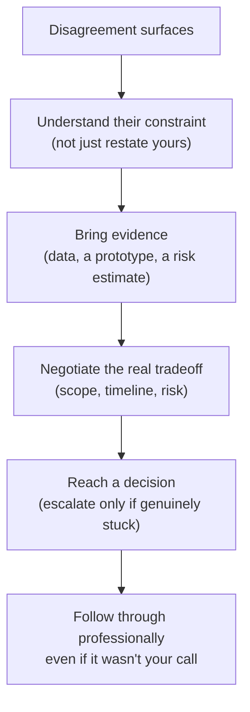

# Stakeholder and Conflict Questions

## TL;DR
These questions test whether you can disagree with someone (a PM, a senior engineer, a
non-technical stakeholder) without either caving silently or being needlessly combative. The
winning shape is: state your position with evidence, understand theirs, find the real
constraint underneath the disagreement, and land on a decision — even if it isn't fully yours
to make.

## Intuition
Interviewers aren't looking for "who was right." They're looking at how you behave in the
messy middle — do you escalate productively, do you compromise on the right things and hold
firm on the right things, do you make the other person feel heard even when you disagree. At
5 years experience, you're expected to influence without authority — this is exactly the
skill being probed.

## The maths
Not applicable.

## Diagram


## Code
```text
Not applicable — this is a communication framework.
```

## In practice
- **Use it when:** "disagreed with a PM/senior engineer," "pushed back on a deadline,"
  "explained something technical to a non-technical stakeholder," "convinced someone to
  change their mind."
- **Defaults that work:** always show you understood the other side's constraint before
  arguing your own point — this single move is what separates a "collaborative disagreement"
  story from a "I was right and they were wrong" story, and interviewers can tell the
  difference immediately.
- **Breaks when:** the story is really "I complained until I got my way" or "I did what I was
  told and it went badly, not my fault" — neither shows the negotiation and judgement being
  tested.
- **Cost / latency:** n/a.

### Disagreeing with a PM or senior engineer

Anchor the disagreement in a concrete tradeoff, not a personality clash: "The PM wanted to
ship the recommendation model without an offline eval against last quarter's data because of
a launch date; I was concerned we'd ship a regression we couldn't detect until it hurt
conversion." Then show the move: you didn't just say no — you proposed a bounded version of
the safeguard ("a 2-day offline eval, not a full A/B, so it doesn't blow the date") and backed
it with a reason ("we'd shipped a silent regression before and it took three weeks to
notice"). Close with the actual outcome, including if you didn't fully get your way — "we
compromised on doing the eval in parallel with a soft launch to 5% of traffic," is a
completely credible and good ending.

### Pushing back on an unrealistic timeline

Don't push back with "that's not enough time" alone — push back with the specific thing that
breaks: "Building the pipeline is two weeks; the part that can't be compressed is validating
against three months of historical data to catch seasonality issues, and skipping that means
we're guessing at accuracy in production." Offer an alternative structure (a phased delivery,
a reduced scope for v1, extra help) rather than only naming the problem — this shows you're
solving the business's problem too, not just protecting your own timeline.

### Working with non-technical stakeholders

The competency here is translation, not simplification-to-the-point-of-inaccuracy. A good
story shows you found the actual business question underneath a vague ask ("stakeholder
wanted 'more accuracy' — I asked what decision the number feeds, discovered they cared about
false positives specifically because those triggered a costly manual review, and reframed the
goal around precision at a fixed recall, not accuracy"). This shows you drive requirements
clarity rather than waiting to be told exactly what to build.

## Interview angle
**Q. Tell me about a time you disagreed with a more senior engineer.**
Use a real technical disagreement (a design choice, a shortcut you thought was risky), show
you understood their reasoning, brought evidence (a smaller test, past data, a cost estimate),
and describe how it actually resolved — including "they were right and I updated my view" as
a perfectly good, sometimes better, ending.

**Follow-up.** "What if they hadn't come around?" → Have an honest answer about escalation:
you'd state your concern once clearly in writing (so it's documented, not adversarial), defer
to their call if it's within their authority, and move on professionally — endless re-litigating
a decided point is itself a red flag interviewers watch for.

**Q. Describe a time you had to explain a technical limitation to a non-technical
stakeholder who didn't want to hear it.**
Show empathy for their business pressure first, then translate the technical constraint into
its business consequence in their terms (cost, risk, timeline) rather than technical jargon,
and offer at least one alternative path forward rather than just a "no."

## Traps
- Wrong: a conflict story where you were simply right and the other person was simply wrong,
  with no acknowledgment of their constraint. — Correct: always show you understood their
  position; disagreement without empathy reads as poor collaboration even when your technical
  point was correct.
- Wrong: "I escalated to my manager" as the very first move in the story. — Correct: show you
  tried direct resolution first; premature escalation reads as an inability to handle
  friction independently.
- Wrong: over-explaining jargon to a non-technical stakeholder as "simplifying." — Correct:
  translate to business impact (cost, risk, time), don't just use smaller words for the same
  technical concept.
- Wrong: ending every conflict story with "and I was right." — Correct: some of your best
  stories should end with you updating your view — it's more credible and shows genuine
  collaboration.

## Flashcards
What's the key move that separates a good conflict story from a "I was right" story?::Showing you understood the other side's constraint before arguing your own position.
When pushing back on a timeline, what should you name specifically?::The exact thing that breaks if the timeline is compressed, plus an alternative (phased scope, extra help), not just "not enough time."
What is the actual competency being tested with non-technical stakeholders?::Translating a vague ask into the real business question/decision it feeds, and communicating tradeoffs in business terms.
Why is premature escalation a red flag in a conflict story?::It suggests an inability to resolve friction directly before involving authority.
Is it acceptable for a conflict story to end with you being wrong?::Yes — updating your view after being shown evidence is a strong, credible ending, often better than "I was right."

## Related
[[star-method]], [[project-narrative-construction]], [[handling-failure-questions]], [[questions-to-ask-interviewers]]
