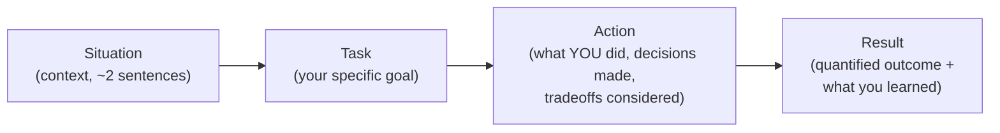

# STAR Method

## TL;DR
STAR (Situation, Task, Action, Result) is a structure for answering "tell me about a time
you..." questions so the interviewer gets a complete, checkable story instead of a vague
anecdote. At 5 years experience, the bar isn't "did you use the structure" — it's whether your
Result is specific enough to be believed and your Action shows judgement, not just effort.

## Intuition
Think of STAR as the shape of a well-written incident report, not a script. Situation and Task
are the "why does this story exist" — kept short. Action is "what did *you*, specifically, do"
— the longest part, and the part interviewers actually probe. Result is "how do we know it
worked" — and this is where most answers quietly fall apart into hand-waving.

## The maths
Not applicable — no formal derivation. The only "quantitative" discipline here is: every
Result should contain a number, a before/after comparison, or a concrete, falsifiable outcome
— not an adjective.

## Diagram


## Code
```text
Not applicable — this is a communication framework, not a technical one.
```

## In practice
- **Use it when:** any "tell me about a time..." prompt — failure, conflict, leadership,
  ambiguity, technical deep-dive-by-story.
- **Defaults that work:** Situation+Task in 20% of your answer time, Action in 60%, Result in
  20%. Practice a 90-second version and a 3-minute version of each story — interviewers will
  sometimes say "go deeper" and you should have more to give, not be improvising.
- **Breaks when:** you spend most of the answer on Situation (over-explaining context nobody
  asked for) and rush the Result — this is the single most common failure mode at this
  experience level, because senior ICs are used to explaining systems, not defending outcomes.
- **Cost / latency:** n/a.

### Worked example (5-YOE ML engineer, using an owner's likely project shape — a forecasting model)

**Situation.** "Our demand-forecasting model was retrained monthly on a fixed PySpark pipeline,
but a regional promo calendar change caused a systematic under-forecast for three weeks before
anyone noticed — inventory planning was already reacting to bad numbers."

**Task.** "I owned making sure a data or distribution shift like this got caught within days,
not weeks, without adding a slow, manual review step to every retrain."

**Action.** "I looked at why it wasn't caught: the pipeline validated schema and nulls but
never checked whether the *input feature distribution* matched what the model was trained on.
I added a drift check on the top features (population stability index against the training
window) that ran automatically after each batch scoring job, wrote it so it emitted a Slack
alert with the specific feature and PSI score rather than a generic 'drift detected', and set
thresholds by looking at 6 months of historical PSI values so it wouldn't cry wolf on normal
seasonal swing. I also pushed back on doing a full model-retrain trigger automatically — chose
to alert-then-human-decide because auto-retraining on a drifted, possibly bad, batch of data
could make things worse."

**Result.** "The next real distribution shift (a regional pricing change) was flagged within a
day instead of weeks; forecast MAPE recovered within days instead of the ~3 weeks it took last
time. The check has run in production for over a year with two true positives and, as far as
I know, zero false-positive pages that needed a retrain."

## Interview angle
**Q. Walk me through a project using STAR.**
Use the structure above; keep Situation to 2 sentences, spend the bulk of your time on Action,
and always land on a Result with a number or a concrete comparison — "faster," "better," and
"more reliable" are not results, they're summaries of a result you haven't stated yet.

**Follow-up.** "What would you do differently?" → Always have one honest answer ready — this
tests self-awareness, not perfection. A good response often ties back to something you now do
differently as a general practice, not just a regret about that one project.

**Q. Give me a shorter version — 60 seconds.**
Practice compressing your stories in advance. Cut Situation to one sentence, keep Action to
the single highest-judgement decision, keep the Result number. Interviewers who ask for the
short version are testing whether you can prioritize signal, not whether you can talk fast.

## Traps
- Wrong: "We improved the model's accuracy" as a Result. — Correct/Fixed: "We reduced
  forecast MAPE from 18% to 11% over the next quarter, which reduced safety-stock overbuild
  by roughly 2,000 units/month" — a Result should survive the follow-up question "how do you
  know?"
- Wrong: making the Action about the team ("we decided...") when the interviewer is
  evaluating *you*. — Correct: be explicit about your specific contribution even when it was
  a team effort: "I proposed X, the team agreed after I showed Y, I implemented Z."
- Wrong: picking a story where the "Action" was purely technical execution with no judgement
  call. — Correct: STAR answers are strongest when the Action includes a decision you made
  under a tradeoff (build vs buy, speed vs correctness, autonomy vs escalation) — that's what
  signals seniority.
- Wrong: a Result that's vague ("stakeholders were happy") when a quantified one was
  available. — Correct: always reach for the number, even an approximate, honestly-caveated
  one ("roughly," "by my estimate") over a feeling-based claim.

## Flashcards
What does STAR stand for?::Situation, Task, Action, Result.
What proportion of a STAR answer should typically be the Action?::Roughly 60% — Situation and Task should be brief context, Result should be a crisp quantified close.
What is the most common STAR failure mode at the 5-YOE level?::Over-explaining Situation/Task and rushing or vaguing-out the Result.
What makes a Result "vague" versus "quantified"?::A vague result uses adjectives ("better," "faster") with no number or comparison; a quantified one states a measurable before/after or concrete outcome.
Why should your Action include a tradeoff or judgement call?::It signals seniority — that you make decisions under constraints, not just execute tasks.
What's a safe answer to "what would you do differently"?::A specific, honest lesson that shows self-awareness, ideally tied to a practice you've since adopted — not fake humility or a non-answer.

## Related
[[project-narrative-construction]], [[handling-failure-questions]], [[interview-day-playbook]], [[qbank-behavioral]]
