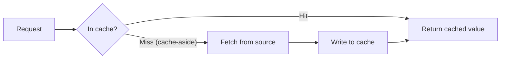

# Caching Strategies

## TL;DR
**Cache-aside** (lazy loading, app checks cache then falls back to the source on a miss) is the
default pattern; **write-through** (every write goes to cache and source together) trades write
latency for read consistency. **TTL** (time-based expiry) is simple but can serve stale data or
cause thundering-herd expiry storms; **explicit invalidation** is precise but requires the writer to
know every cache entry a change affects. In ML systems, caching shows up twice specifically:
**feature caching** (avoid recomputing/refetching features per request) and **LLM response
caching** (avoid re-running expensive generation for repeated or near-duplicate prompts) — the
latter is one of the highest-leverage cost/latency levers in an LLM-based system.

## Intuition
A cache is a bet: "this value is expensive to (re)compute and will probably be asked for again
soon, so keep a copy somewhere fast." Cache-aside is like checking your fridge before going to the
store — if it's not in the fridge, go get it and put a copy in the fridge for next time.
Write-through is like the store automatically stocking your fridge the moment new stock arrives, so
your fridge is never out of date, at the cost of every delivery taking a bit longer (it has to
detour through your kitchen).

## The maths
**Cache hit rate** drives the actual cost/latency win:
$$
\text{effective latency} = h \cdot L_{\text{cache}} + (1-h) \cdot L_{\text{source}}
$$
where $h$ is the hit rate, $L_{\text{cache}} \ll L_{\text{source}}$. A cache is only worth its
complexity if $h$ is meaningfully high — a 5% hit rate cache barely moves effective latency and may
not be worth the staleness risk and operational overhead.

**TTL vs. staleness tradeoff**: for a value that changes at some real-world rate, a TTL of $\tau$
bounds the worst-case staleness at $\tau$, but shrinking $\tau$ to reduce staleness also shrinks
effective hit rate (more frequent misses) — the two are in direct tension, and the right $\tau$
depends on how quickly the underlying value actually changes versus how much staleness the
consumer can tolerate.

## Diagram


## Code
```python
# Cache-aside (lazy loading) — the default pattern
def get_features(entity_id, cache, feature_store, ttl_seconds=300):
    cached = cache.get(f"features:{entity_id}")
    if cached is not None:
        return cached                       # hit
    features = feature_store.fetch(entity_id)  # miss: go to source
    cache.set(f"features:{entity_id}", features, ex=ttl_seconds)
    return features

# Write-through — every write updates cache and source together
def update_customer_profile(customer_id, new_data, db, cache):
    db.update(customer_id, new_data)
    cache.set(f"profile:{customer_id}", new_data)  # keep cache consistent immediately

# LLM response caching — exact-match cache on prompt (+ params) hash
import hashlib

def cached_llm_call(prompt, params, cache, llm_client, ttl_seconds=3600):
    key = "llm:" + hashlib.sha256((prompt + str(sorted(params.items()))).encode()).hexdigest()
    cached = cache.get(key)
    if cached is not None:
        return cached                       # skip an expensive generation call entirely
    response = llm_client.generate(prompt, **params)
    cache.set(key, response, ex=ttl_seconds)
    return response
```

## In practice
- **Use it when:** a value is expensive to compute/fetch relative to how often it's re-requested —
  feature lookups on the hot serving path, repeated or templated LLM prompts (e.g. a fixed system
  prompt + varying but often-repeated user queries in a support bot), expensive aggregate queries.
- **Defaults that work:** cache-aside with a TTL is the right default for most read-heavy workloads
  — simple, resilient to cache failures (falls back to source), tolerates some staleness. Use
  write-through only when read-after-write consistency actually matters (a user must immediately
  see their own update reflected). For LLM caching specifically: exact-match caching on
  prompt+parameters is cheap and effective for templated/repeated queries; semantic caching
  (embedding-similarity match on near-duplicate prompts) catches more hits but risks returning a
  subtly wrong cached answer for a "similar but not identical" question — use it only where that
  risk is acceptable (e.g. FAQ-style queries), never for anything requiring exact correctness.
- **Breaks when:** TTL is set too long for how fast the underlying data actually changes (serves
  stale features to a model, or stale answers from an LLM cache after the underlying knowledge
  changed); a popular cache key expires and a burst of simultaneous requests all miss at once and
  hammer the source (**thundering herd**) — mitigate with jittered TTLs or a lock/single-flight
  pattern so only one request repopulates the cache while others wait.
- **Cost / latency:** caching is the single highest-leverage lever for both latency (cache hit is
  orders of magnitude faster than source) and cost (avoids repeated expensive computation — this is
  especially stark for LLM inference, where a cached response costs a cache lookup instead of a full
  token-generation pass, often a 10-100x cost/latency difference per cached request).

## Interview angle
**Q. Design a caching layer for an LLM-powered customer support bot to reduce cost.**
Start with exact-match caching keyed on the full prompt (system prompt + user message + relevant
parameters) — cheap, safe, and catches genuinely repeated queries (common FAQs). If hit rate is low
because of paraphrased-but-equivalent questions, consider semantic caching: embed the incoming
query, do a similarity search against cached query embeddings, and serve the cached response above
a similarity threshold — but explicitly flag the risk (a "similar" question might need a different
answer) and validate the threshold empirically rather than guessing. Set TTL based on how often the
underlying knowledge base changes; invalidate explicitly (not just TTL) when a knowledge base
document the bot relies on is updated.

**Follow-up.** How do you avoid serving a stale cached answer after the underlying knowledge base
changes?
→ Prefer explicit invalidation over TTL alone where feasible — e.g. tag cache entries with the
document/version they depended on and invalidate on document update; where that's not tractable
(hard to trace exactly which cached responses depended on which document), fall back to a shorter
TTL scoped to how frequently that content actually changes, accepting some bounded staleness.

**Q. Cache-aside vs write-through — when would you pick each for a feature-serving system?**
Cache-aside: the common case — features are read far more often than written, some staleness
(bounded by TTL) is tolerable, and you want the cache to be a pure performance optimization that
fails gracefully (a cache outage just increases source load, doesn't break correctness).
Write-through: when a feature must reflect the very latest write immediately for correctness (e.g.
a fraud model that must see a just-flagged account instantly, not after a TTL expires) — worth the
extra write latency for that guarantee.

**Q. What's a thundering herd, and how do you prevent it?**
When a hot cache key expires (or the cache is cold-started) and many concurrent requests all miss
simultaneously, all hammering the source at once — can cascade into overloading the source system.
Mitigations: jittered TTLs (so keys don't all expire at the same instant), a single-flight/lock
pattern (only one request recomputes the value; others wait for it), or proactively refreshing
hot keys before they expire rather than waiting for a miss.

**Q. Why is LLM response caching considered a bigger cost lever than typical feature caching?**
Because the cost differential per request is so much larger — a full LLM generation call can cost
orders of magnitude more (in both dollars and latency) than a typical feature store lookup, so even
a modest cache hit rate on repeated/templated prompts translates into a large absolute cost and
latency reduction, especially in high-traffic support/FAQ-style applications where query repetition
is common.

## Traps
- "TTL alone is enough for correctness-sensitive data." — TTL bounds staleness but doesn't
  guarantee freshness at any given moment; use explicit invalidation when correctness (not just
  approximate freshness) matters.
- Caching everything indiscriminately — a low hit-rate cache adds complexity and a staleness risk
  for negligible latency/cost benefit; check hit rate before committing to a caching layer.
- Deploying semantic (similarity-based) LLM caching without measuring false-positive risk — a
  "close enough" cached answer served for a subtly different question can be worse than no cache
  at all in a domain where precision matters (e.g. medical or financial guidance).
- Ignoring thundering herd risk on hot keys — a system that looks fine under steady load can fall
  over the moment a popular cache entry expires under high concurrency.

## Flashcards
Cache-aside vs write-through::Cache-aside: check cache, fetch from source and populate on miss (lazy). Write-through: every write updates cache and source together (stronger consistency, added write latency).
What does a cache TTL bound, and what does it not guarantee?::Bounds worst-case staleness; does not guarantee freshness at any given moment before expiry.
What is a thundering herd and how do you prevent it?::Many concurrent requests missing simultaneously on a hot expired key, overloading the source; prevent with jittered TTLs or a single-flight/lock pattern.
Why is LLM response caching a strong cost/latency lever?::Generation calls are far more expensive per request than typical lookups, so even a modest cache hit rate yields large absolute cost/latency savings.
Exact-match vs semantic LLM caching — key risk of semantic caching?::Exact-match is safe but narrow; semantic (embedding-similarity) caching catches more hits but risks serving a wrong answer for a "similar but not identical" query.
When should you prefer write-through over cache-aside?::When read-after-write consistency is required immediately (e.g. a fraud model must see a just-updated flag instantly).

## Related
[[scalability-patterns]]
[[latency-and-throughput-budgets]]
[[feature-stores]]
[[llm-serving-and-throughput]]
