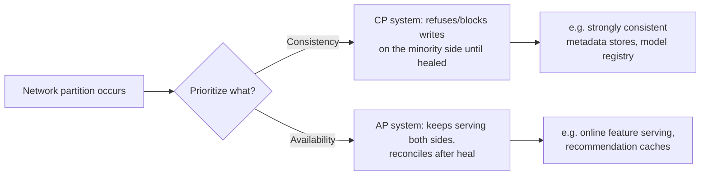

# CAP Theorem and Consistency Models

## TL;DR
CAP says a distributed system can't guarantee Consistency, Availability, and Partition
tolerance all at once. But at any real scale, network partitions *will* happen, so partition
tolerance isn't a choice — it's a fact of life. The actual design decision every distributed
system makes is **CP vs AP**: when a partition happens, do you sacrifice availability (refuse
requests to stay consistent) or sacrifice consistency (keep serving, risk stale/conflicting
data)?

## Intuition
Picture two data centers connected by one network link. The link goes down — a partition.
Each data center can still serve local requests, but they can't talk to each other. Now you
have exactly two options: stop answering requests on one side until the link comes back
(consistent, not available), or let both sides keep answering independently and reconcile
the mess later (available, not consistent). There is no third option once the link is down —
that's the whole theorem.

## The maths
CAP is really a proof by contradiction, not an equation, but it's worth stating precisely.
Let a system guarantee:
- **C**onsistency: every read receives the most recent write or an error.
- **A**vailability: every request receives a (non-error) response.
- **P**artition tolerance: the system continues operating despite arbitrary message loss
  between nodes.

Claim: no system can guarantee all three simultaneously during an actual partition.

*Sketch:* suppose nodes $A$ and $B$ are partitioned (no messages pass between them). A client
writes value $v_1$ to $A$. Another client reads from $B$. For **C** to hold, that read must
return $v_1$ — but $B$ has not received it (partition), so $B$ must either (a) block/error
(violates **A**) or (b) return a stale value (violates **C**). Since $P$ is not optional at
scale (partitions happen — bad cables, GC pauses, packet loss, regional outages), the real
choice is between **C** and **A** during the partition window. Hence: **CP vs AP**, not
"CAP, pick any two" — P is not a peer choice, it's a given.

## Diagram


## Code
```python
# Illustrating the CP vs AP choice in a toy key-value store during a
# simulated partition. Not a real consensus implementation — just the
# decision logic every distributed store has to make.

class CPStore:
    """Refuses writes on a minority partition to guarantee consistency."""
    def write(self, has_quorum: bool, key, value):
        if not has_quorum:
            raise RuntimeError("no quorum: refusing write to protect consistency")
        return {"status": "committed", key: value}

class APStore:
    """Accepts writes on any reachable node; may return stale data."""
    def write(self, has_quorum: bool, key, value):
        # Accepts regardless of quorum; reconciliation (e.g. last-write-wins,
        # vector clocks) happens later when the partition heals.
        return {"status": "accepted_locally", key: value}
```

## In practice
- **Use it when:** deciding the consistency model for a feature store's online layer vs a
  model registry's metadata layer — these two components of one ML platform often make
  *opposite* CAP choices, correctly.
- **Defaults that work:** a **model registry** (which model is "Production", what's the
  latest version) should lean **CP** — you never want two serving fleets to disagree about
  which model version is authoritative; a stale/blocked registry read is annoying, a wrong
  one is a production incident. An **online feature store** serving low-latency features to
  a real-time model should lean **AP** — a slightly stale feature value is usually fine, but
  a blocked request that misses an SLA is not.
- **Breaks when:** teams pick "strongly consistent everywhere" by default because it sounds
  safer, then discover it can't meet a p99 latency SLA under partition/network jitter; or
  pick "eventually consistent everywhere" and get silent training-serving skew from stale
  offline/online feature values.
- **Cost / latency:** CP systems pay latency/availability cost during partitions and under
  normal quorum-write overhead; AP systems pay a correctness cost (staleness, occasional
  conflicting writes needing reconciliation logic).

## Interview angle
**Q. Where would you apply CP vs AP in an ML feature store architecture?**
The offline store (used for training, point-in-time joins) needs strong consistency and
reproducibility — you must be able to reconstruct exactly what a model saw at training time,
so it's effectively CP (or just not distributed in the CAP sense — a single source of truth
like a data warehouse table). The online store (used for real-time serving) typically favors
AP: a Redis/DynamoDB-style cache serving feature vectors under a tight latency SLA, accepting
that a feature might be a few seconds stale rather than blocking the request.

**Follow-up.** How do you catch training-serving skew that this staleness could cause?
→ Log the actual feature values used at serving time and periodically diff them against what
the offline store would compute for the same timestamp/entity — this is a monitoring problem,
not something CAP theory solves for you.

**Q. Is "CAP: pick two" a correct way to phrase the theorem?**
Not quite — it implies P is optional, but at real network scale, partitions are not a design
choice you can opt out of. The honest framing is: partition tolerance is mandatory, so the
actual trade during a partition is consistency vs availability. "Pick two of three" is the
popular simplification, "CP vs AP under partition" is the accurate one.

**Q. Give an example of an AP choice you'd defend to a skeptical reviewer.**
A recommendation-serving cache that's occasionally 30 seconds stale on "trending items" is a
fine AP trade — being unavailable during a network blip would hurt more users than a slightly
stale ranking. Defend it by naming the actual cost of the alternative (blocked requests, SLA
breach) versus the actual cost of staleness (minor ranking quality loss), quantified if
possible.

## Traps
- Wrong: "CAP means you can only ever have two of the three properties, full stop." —
  Correct: partition tolerance isn't optional at scale; the real, always-present decision is
  CP vs AP specifically during a partition event. Outside of a partition, many systems can
  offer both C and A most of the time.
- Wrong: applying one consistency model to an entire ML platform. — Correct: different
  components (registry vs online feature store vs offline warehouse) have different
  consistency requirements and should be designed independently.
- Wrong: confusing CAP's "Consistency" with ACID's "Consistency" (a constraint-integrity
  concept) — CAP's C specifically means linearizability: all reads see the latest write.

## Flashcards
What does CAP theorem actually force you to trade off in practice?::Consistency vs Availability, specifically during a network partition — partition tolerance itself is not optional at real scale.
Why is "pick any two of C, A, P" a slightly misleading summary?::Because P is mandatory in real distributed systems; you don't get to opt out of handling partitions.
Should a model registry be CP or AP by default, and why?::CP — every serving fleet must agree on which model version is authoritative; a wrong answer is worse than a slow one.
Should an online feature store for real-time serving be CP or AP by default, and why?::AP — a tight latency SLA usually matters more than millisecond-level feature freshness.
What does CAP's "Consistency" mean precisely?::Linearizability — every read returns the most recent write or an explicit error, not a constraint-integrity guarantee like in ACID.

## Related
[[distributed-systems-basics]], [[feature-stores]], [[model-registry-and-versioning]], [[training-serving-skew]]
