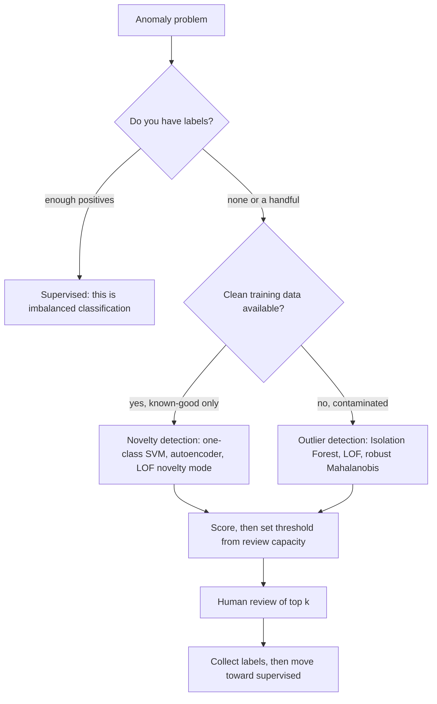

# Anomaly Detection

## TL;DR
When you have labels, it is imbalanced classification and you should treat it that way. Use genuine
anomaly detection when anomalies are unlabelled, unknown in advance, or too rare to learn from. Isolation
Forest is the tabular default (anomalies are easier to isolate, so they sit at shallow depths); Local
Outlier Factor handles varying density; one-class SVM and autoencoders cover the rest. Evaluation is the
hard part — without labels, precision@k reviewed by a human is usually all you have.

## Intuition
Two different questions get conflated. "Which of these existing rows look weird?" is *outlier detection*,
done on a contaminated dataset with no labels. "Does this new row look like the clean data I trained on?"
is *novelty detection*, done after training on known-good data. The algorithms overlap but the deployment
and evaluation are completely different, and saying which one you mean is half the interview answer.

## The maths

### Isolation Forest
The inversion that makes it work: instead of profiling normal points, isolate anomalous ones. Build
random trees by repeatedly picking a random feature and a random split value between that feature's min
and max. Anomalies — being few and different — get separated from the rest after very few splits.

Score by the expected path length $h(x)$, normalised against the average path length of an unsuccessful
search in a binary search tree of $n$ points:

$$
c(n) = 2H(n-1) - \frac{2(n-1)}{n}, \qquad H(i) \approx \ln i + 0.5772
$$

$$
s(x, n) = 2^{-\frac{\mathbb{E}[h(x)]}{c(n)}}
$$

Read the score: $s \to 1$ means very short paths (anomaly), $s \to 0.5$ means typical, $s \to 0$ means
deeply buried (very normal). Because only path length matters, trees are grown to a height limit of
$\lceil \log_2 \psi \rceil$ and subsampled to $\psi = 256$ points by default — the entire method is
$O(n\log\psi)$ after that, and *subsampling actively helps* by reducing swamping (normal points flagged)
and masking (dense anomaly clusters hiding each other).

Note the axis-aligned random cuts: Isolation Forest struggles with anomalies that are only anomalous in a
*combination* of correlated features, because no single axis-aligned cut isolates them. Extended
Isolation Forest uses random hyperplanes to fix exactly that.

### Local Outlier Factor
Density-relative rather than global. Define the $k$-distance of $A$ and the reachability distance

$$
\mathrm{reach\text{-}dist}_k(A,B) = \max\{\ k\text{-distance}(B),\ d(A,B)\ \}
$$

Local reachability density is the inverse mean reachability distance to the $k$ neighbourhood:

$$
\mathrm{lrd}_k(A) = \left(\frac{\sum_{B \in N_k(A)} \mathrm{reach\text{-}dist}_k(A,B)}{|N_k(A)|}\right)^{-1}
$$

$$
\mathrm{LOF}_k(A) = \frac{1}{|N_k(A)|}\sum_{B \in N_k(A)} \frac{\mathrm{lrd}_k(B)}{\mathrm{lrd}_k(A)}
$$

$\mathrm{LOF}\approx 1$ means the point is as dense as its neighbours; $\gg 1$ means it sits in a
relatively sparse pocket. The point of the ratio is that a point in a naturally sparse region is *not*
flagged, which is exactly what a global distance threshold gets wrong.

### One-class SVM
Separate the data from the origin in feature space with maximum margin:

$$
\min_{w, \xi, \rho}\ \frac{1}{2}\lVert w\rVert^2 + \frac{1}{\nu n}\sum_i \xi_i - \rho
\quad\text{s.t.}\quad w^\top\phi(x_i) \ge \rho - \xi_i,\ \ \xi_i \ge 0
$$

with decision function $f(x) = \mathrm{sign}(w^\top\phi(x) - \rho)$. The parameter $\nu \in (0,1]$ both
upper-bounds the fraction of training outliers and lower-bounds the fraction of support vectors — so it
is directly the contamination rate you expect. Kernel choice and scaling matter as much as in
[[support-vector-machines]], and it is $O(n^2)$–$O(n^3)$, so it does not scale.

### Reconstruction-based (autoencoder / PCA)
Train to reconstruct normal data through a bottleneck; score by reconstruction error
$\lVert x - \hat x\rVert^2$. The assumption: the bottleneck learns the manifold of normal data, so
anomalies — off that manifold — reconstruct badly.

Even linear PCA gives a usable version: project onto the top $k$ components and measure the residual
$\lVert x - x V_k V_k^\top\rVert^2$, which is the distance from the principal subspace. Cheap, fast, and
surprisingly competitive ([[dimensionality-reduction-pca]]).

The failure mode is a bottleneck that is too wide — it learns the identity function and reconstructs
anomalies fine too.

### Statistical baselines worth trying first
- **Robust z-score**: $\frac{0.6745(x - \mathrm{median})}{\mathrm{MAD}}$, where the constant makes MAD
  consistent with the standard deviation for Gaussian data. Flag $\lvert z\rvert > 3.5$. Robust because
  the median and MAD are not dragged by the outliers you are hunting.
- **Mahalanobis distance**: $d_M(x) = \sqrt{(x-\mu)^\top\Sigma^{-1}(x-\mu)}$, which accounts for
  correlation, and $d_M^2 \sim \chi^2_d$ under multivariate normality so you get a principled threshold.
  Use a robust covariance estimate (Minimum Covariance Determinant) or the outliers will inflate $\Sigma$
  and hide themselves.

Run these before anything clever. A robust z-score on the right engineered feature beats a badly tuned
Isolation Forest surprisingly often.

### Evaluation without labels
The honest answer is that you cannot compute recall — you do not know what you missed. What you can do:

1. **Precision@k with human review.** Send the top $k$ to an analyst and measure the hit rate. This is
   the metric that actually funds the project.
2. **Inject synthetic anomalies** of known types and measure detection rate — gives an estimate of recall
   *for those types only*.
3. **Proxy labels**: chargebacks, incident tickets, manual write-offs. Delayed and incomplete, but real.
4. **Stability**: do different methods and different seeds agree on the top-scored points? Consensus
   across methods is the standard practical heuristic.

If you do have enough labels to compute PR-AUC reliably, you should probably be doing supervised
classification instead ([[imbalanced-classification]]).

## Diagram



## Code

```python
import numpy as np
from sklearn.datasets import make_blobs
from sklearn.ensemble import IsolationForest
from sklearn.neighbors import LocalOutlierFactor
from sklearn.covariance import EllipticEnvelope
from sklearn.svm import OneClassSVM
from sklearn.preprocessing import StandardScaler
from sklearn.metrics import average_precision_score

rng = np.random.default_rng(0)
X_norm, _ = make_blobs(n_samples=5000, centers=[[0, 0], [5, 5]], cluster_std=[0.6, 1.8],
                       n_features=2, random_state=0)
X_anom = rng.uniform(-6, 11, size=(80, 2))
X = np.vstack([X_norm, X_anom])
y = np.r_[np.zeros(len(X_norm)), np.ones(len(X_anom))]      # labels for evaluation ONLY
Xs = StandardScaler().fit_transform(X)

detectors = {
    "IsolationForest": IsolationForest(n_estimators=200, contamination="auto", random_state=0),
    "LOF":             LocalOutlierFactor(n_neighbors=25),   # fit_predict only, no .predict
    "OneClassSVM":     OneClassSVM(nu=0.02, kernel="rbf", gamma="scale"),
    "RobustCovariance": EllipticEnvelope(contamination=0.02, random_state=0),
}

for name, det in detectors.items():
    if isinstance(det, LocalOutlierFactor):
        det.fit_predict(Xs)
        score = -det.negative_outlier_factor_          # higher = more anomalous
    else:
        det.fit(Xs)
        score = -det.score_samples(Xs)
    print(f"{name:<17} AP = {average_precision_score(y, score):.4f}")
```

Isolation Forest scoring, made explicit:

```python
iso = IsolationForest(n_estimators=300, max_samples=256, random_state=0).fit(Xs)

raw = iso.score_samples(Xs)          # sklearn returns NEGATIVE of the paper's s(x, n)
anomaly_score = -raw                 # higher = more anomalous, in roughly [0.4, 0.7]

k = 80
top_idx = np.argsort(anomaly_score)[::-1][:k]
print(f"precision@{k} = {y[top_idx].mean():.3f}")
# precision@k is the metric that survives having no labels: it maps onto review capacity.
```

Robust statistical baselines — run these first:

```python
def robust_z(x):
    med = np.median(x)
    mad = np.median(np.abs(x - med))
    return 0.6745 * (x - med) / (mad + 1e-12)

from scipy.stats import chi2
from sklearn.covariance import MinCovDet

mcd = MinCovDet(random_state=0).fit(Xs)          # robust mu and Sigma, resistant to the outliers
d2 = mcd.mahalanobis(Xs)
thresh = chi2.ppf(0.99, df=Xs.shape[1])          # principled cutoff under multivariate normality
print("Mahalanobis AP:", round(average_precision_score(y, d2), 4),
      " flagged:", int((d2 > thresh).sum()))
```

Novelty detection — the deployment-shaped version:

```python
# Train on known-good data only; score the live stream.
clean = Xs[y == 0][:4000]
nov = LocalOutlierFactor(n_neighbors=25, novelty=True).fit(clean)   # novelty=True enables .predict

live = Xs[4000:]
flagged = nov.predict(live) == -1
print(f"flag rate on live batch: {flagged.mean():.4f}")
# Monitor this rate. A sudden jump is either a real incident or upstream data drift -
# and distinguishing those two is most of the operational work.
```

PCA reconstruction error, the cheapest scalable option:

```python
from sklearn.decomposition import PCA

p = PCA(n_components=1).fit(Xs[y == 0])                # fit on clean data
recon = p.inverse_transform(p.transform(Xs))
err = ((Xs - recon) ** 2).sum(axis=1)
print("PCA reconstruction AP:", round(average_precision_score(y, err), 4))
```

## In practice
- **Use it when:** anomalies are unlabelled or previously unseen (novel fraud patterns, new failure
  modes); positives are far too rare for supervised learning (well under 0.1%); or you need a monitoring
  signal on data quality and drift rather than a business prediction.
- **Defaults that work:** always start with robust univariate and Mahalanobis baselines plus domain rules.
  Then Isolation Forest with `n_estimators=200`, `max_samples=256`. Scale features. Set the threshold from
  review capacity, not from a `contamination` guess. Ensemble several detectors by rank-averaging their
  scores — the consensus is far more stable than any single method.
- **Breaks when:** anomalies are contextual rather than global (a ₹2 lakh transaction is normal for a
  business account, anomalous for a student — you need conditional or per-segment models); features are
  categorical (Isolation Forest's random splits are not meaningful on arbitrary encodings); the anomaly is
  a *sequence* rather than a point (use temporal features or a sequence model); or the anomaly is only
  visible in a correlated combination of features, where axis-aligned trees fail.
- **Cost / latency:** Isolation Forest is $O(n\log\psi)$ to train and $O(t\log\psi)$ to score — genuinely
  real-time capable, and easy to broadcast across Spark partitions for a nightly batch. LOF is $O(n^2)$
  without an index and has no native `predict` unless `novelty=True`. One-class SVM does not scale past
  tens of thousands of rows.

> [!tip]
> On a medallion architecture, anomaly detection has two distinct homes. At the bronze-to-silver boundary
> it is *data quality*: flag rows violating expectations before they poison downstream tables. At the gold
> layer it is a *business* signal: flag entities for review. Different features, different thresholds,
> different owners — do not build one model for both ([[data-quality-and-validation]]).

## Interview angle

**Q. How does Isolation Forest work, and why is it fast?**
It inverts the usual approach: instead of modelling normal data, it isolates points. Random trees split
on a random feature at a random value; anomalies are few and different, so they get separated after very
few splits. The score is a normalised expected path length, $s = 2^{-\mathbb{E}[h(x)]/c(n)}$. It is fast
because only path length matters, so trees are height-limited and built from a subsample of 256 points —
and the subsampling genuinely improves accuracy by reducing swamping and masking, not just speed.

**Follow-up.** When does it fail? → When anomalies are only anomalous in a correlated combination of
features. The cuts are axis-aligned, so a point inside every marginal range but off the joint manifold is
not isolated quickly. Extended Isolation Forest with random hyperplanes, or a Mahalanobis / reconstruction
score, handles that.

**Q. What is the difference between outlier and novelty detection?**
Outlier detection works on a contaminated training set and asks which existing rows are odd; novelty
detection trains on known-clean data and asks whether a *new* point belongs. In scikit-learn, LOF does
outlier detection by default and novelty detection with `novelty=True` — and the two modes have different
APIs deliberately, because fitting a novelty detector on contaminated data silently teaches it that the
anomalies are normal.

**Q. Why LOF rather than a global distance threshold?**
Because density varies. A point in a naturally sparse region is far from everything but is not anomalous;
a global threshold flags it anyway. LOF compares a point's local density to the density of its own
neighbours, so the score is relative. It is the same reason HDBSCAN beats DBSCAN
([[hierarchical-and-density-clustering]]).

**Q. How do you evaluate with no labels?**
Honestly: I cannot measure recall. I measure precision@k by sending the top-scored cases to human review,
which is also the operationally relevant number since review capacity is the constraint. I supplement
with injected synthetic anomalies of known types for a partial recall estimate, proxy labels like
chargebacks or incident tickets where they exist, and cross-method agreement on the top scores. And I
treat the review outcomes as the beginning of a labelled dataset — most mature systems migrate from
unsupervised to supervised within a year.

**Q. 0.05% fraud with some labels. Supervised or unsupervised?**
Both, in a two-stage design. A supervised model on the known fraud patterns catches what you have seen —
it will be far more precise than any unsupervised method. An unsupervised detector runs alongside to
catch novel patterns the labels do not cover. Combine by taking the union of their alerts, or feed the
anomaly score as a feature into the supervised model. Pure unsupervised throws away real label
information; pure supervised is blind to new attack patterns.

**Q. Your detector's flag rate jumped 5× overnight. What do you check first?**
Data, not fraud. An upstream schema change, a unit change, a null-handling change or a failed join will
move features enough to trip every threshold. Check feature distributions against the training reference
first, then the flag rate per segment to see whether it is broad (systemic = data) or narrow (localised =
possibly real). This is exactly why anomaly detection and drift monitoring share machinery
([[data-drift-and-concept-drift]]).

## Traps
- **Using anomaly detection when you have labels.** Supervised beats unsupervised whenever labels exist,
  by a wide margin. Say so.
- **Setting `contamination` to a guess and treating the output as ground truth.** It is just a threshold
  on the score; derive it from review capacity ([[threshold-selection]]).
- **Fitting a novelty detector on contaminated data.** You teach it the anomalies are normal.
- **Not scaling.** LOF, one-class SVM and Mahalanobis are all distance-based. Isolation Forest is the
  exception — its splits are per-feature, so it is scale-invariant.
- **Using a non-robust mean and covariance for Mahalanobis.** The outliers inflate $\Sigma$ and mask
  themselves; use MinCovDet.
- **Calling `.predict()` on a plain LOF.** It does not exist unless `novelty=True`.
- **Ignoring context.** Global anomaly detection cannot express "normal for this customer, abnormal for
  that one". Model per segment or use residuals from a conditional expectation.
- **Reporting AUC on injected synthetic anomalies as if it were real performance.** You measured
  detection of the anomalies you imagined.
- **Treating every anomaly as fraud.** Most anomalies are data-quality problems. Triaging those two is a
  design decision, not an afterthought.

## Flashcards
State the Isolation Forest scoring formula and how to read it.::$s(x,n) = 2^{-\mathbb{E}[h(x)]/c(n)}$; $s \to 1$ means short paths and an anomaly, $s \approx 0.5$ is typical.
Why does Isolation Forest subsample to 256 points?::Speed, and accuracy — subsampling reduces swamping (normals flagged) and masking (dense anomaly clusters hiding each other).
When does Isolation Forest fail?::When anomalies are only anomalous in a correlated combination of features — axis-aligned random cuts cannot isolate those.
What does LOF ≈ 1 mean?::The point's local density matches its neighbours' — it is normal relative to its own region, even if globally far from everything.
Outlier vs novelty detection?::Outlier detection works on contaminated data and scores existing rows; novelty detection trains on clean data and scores new points.
What does nu control in a one-class SVM?::It upper-bounds the training outlier fraction and lower-bounds the support-vector fraction — effectively the expected contamination.
How do you evaluate an anomaly detector without labels?::Precision@k via human review, injected synthetic anomalies for partial recall, proxy labels, and cross-method agreement. Recall is unknowable.
Which common detector is scale-invariant?::Isolation Forest — its splits are per-feature. LOF, one-class SVM and Mahalanobis all need scaling.

## Related
- [[imbalanced-classification]] — the supervised alternative when labels exist
- [[outlier-detection]] — the data-cleaning sibling of this problem
- [[threshold-selection]] — turning an anomaly score into an alert
- [[hierarchical-and-density-clustering]] — DBSCAN noise labels as an anomaly signal
- [[data-drift-and-concept-drift]] — why flag rates move without any real incident
- [[dimensionality-reduction-pca]] — reconstruction error as an anomaly score
- [[model-monitoring]] — anomaly detection as a monitoring primitive
- [[case-fraud-detection]] — the end-to-end system this sits inside
