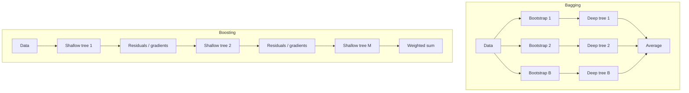

# Bagging vs Boosting

## TL;DR
Bagging fits many low-bias, high-variance models **in parallel** on resampled data and averages them: it
attacks **variance**. Boosting fits many high-bias, low-variance models **sequentially**, each correcting
the previous ensemble's errors: it attacks **bias**. That one sentence decides base-learner depth, the
overfitting behaviour, and whether the thing parallelises.

## Intuition
Bagging is a committee of experts who each read a different sample of the case file, vote independently,
and average away each other's idiosyncratic mistakes. Nobody sees anyone else's answer.

Boosting is an apprentice chain: the first apprentice does a rough job, the second is told specifically
where the first went wrong and fixes only that, the third fixes what remains. Each is weak alone, and the
order matters completely.

## The maths

### Bagging: variance reduction
With $B$ base models of variance $\sigma^2$ and pairwise correlation $\rho$,
$$
\operatorname{Var}\!\left(\frac{1}{B}\sum_b f_b(x)\right) = \rho\sigma^2 + \frac{1-\rho}{B}\sigma^2
$$
Bias is unchanged: $\mathbb{E}[\bar{f}] = \mathbb{E}[f_b]$ when the bootstrap samples are exchangeable. So
bagging **only** helps models that are already low-bias and unstable — deep trees, yes; a linear
regression, essentially not at all, because its variance is already small and bagging cannot fix its bias.
Lowering $\rho$ (feature subsampling) is what [[random-forest]] adds.

### Boosting: stagewise bias reduction
Boosting builds an additive model
$$
F_M(x) = \sum_{m=1}^{M} \eta \, h_m(x)
$$
where each $h_m$ is fit to the *current* errors of $F_{m-1}$. For squared loss the errors are literally
residuals; in general $h_m$ is fit to the negative gradient of the loss evaluated at $F_{m-1}$ — see
[[gradient-boosting]]. Because each stage reduces training loss, the *bias* of the ensemble falls
monotonically with $M$, while variance grows. Hence:

$$
\underbrace{\text{bagging}}_{\text{variance} \downarrow,\ \text{bias} \approx} \qquad\text{vs}\qquad
\underbrace{\text{boosting}}_{\text{bias} \downarrow,\ \text{variance} \uparrow}
$$

### AdaBoost, for the historical question
AdaBoost is boosting with exponential loss $L(y, F) = e^{-yF}$, $y \in \{-1, +1\}$. At round $m$ it fits
$h_m$ to weighted data, computes the weighted error $\epsilon_m$, sets
$$
\alpha_m = \tfrac{1}{2}\ln\frac{1 - \epsilon_m}{\epsilon_m}
$$
and multiplies the weight of every misclassified sample by $e^{\alpha_m}$ (correct ones by $e^{-\alpha_m}$),
renormalising. Note $\alpha_m > 0$ exactly when $\epsilon_m < 0.5$ — the base learner only has to beat a
coin flip, which is the formal meaning of "weak learner". Reweighting is the pre-gradient way of saying
"focus on what's still wrong".

## Diagram



## Code

```python
import numpy as np
from sklearn.datasets import make_friedman1
from sklearn.ensemble import BaggingRegressor, GradientBoostingRegressor, RandomForestRegressor
from sklearn.model_selection import train_test_split
from sklearn.metrics import mean_squared_error
from sklearn.tree import DecisionTreeRegressor

X, y = make_friedman1(n_samples=6000, noise=1.0, random_state=0)
Xtr, Xte, ytr, yte = train_test_split(X, y, test_size=0.25, random_state=0)

def rmse(m):
    return mean_squared_error(yte, m.predict(Xte)) ** 0.5

single_deep    = DecisionTreeRegressor(random_state=0).fit(Xtr, ytr)
single_stump   = DecisionTreeRegressor(max_depth=2, random_state=0).fit(Xtr, ytr)

bagged_deep    = BaggingRegressor(DecisionTreeRegressor(random_state=0),
                                  n_estimators=200, n_jobs=-1, random_state=0).fit(Xtr, ytr)
bagged_stump   = BaggingRegressor(DecisionTreeRegressor(max_depth=2, random_state=0),
                                  n_estimators=200, n_jobs=-1, random_state=0).fit(Xtr, ytr)

forest         = RandomForestRegressor(n_estimators=200, n_jobs=-1, random_state=0).fit(Xtr, ytr)
boosted_stump  = GradientBoostingRegressor(max_depth=2, n_estimators=500,
                                           learning_rate=0.05, random_state=0).fit(Xtr, ytr)

for name, m in [("deep tree", single_deep), ("stump", single_stump),
                ("bagged deep", bagged_deep), ("bagged stumps", bagged_stump),
                ("random forest", forest), ("boosted stumps", boosted_stump)]:
    print(f"{name:<15} rmse {rmse(m):.3f}")
```

The instructive pair is **bagged stumps** vs **boosted stumps**. Bagging a high-bias learner barely
improves on the single stump — averaging cannot remove shared bias. Boosting the same stump is
competitive with or better than the forest, because each stage removes bias.

Watching the overfitting signature differ:

```python
import numpy as np
gb = GradientBoostingRegressor(max_depth=6, n_estimators=1500, learning_rate=0.2, random_state=0)
gb.fit(Xtr, ytr)
test_curve = np.array([mean_squared_error(yte, p) ** 0.5
                       for p in gb.staged_predict(Xte)])
print("boosting: best round", test_curve.argmin(), "->", test_curve.min().round(3),
      "| final round ->", test_curve[-1].round(3))   # final is worse: boosting overfits in M

rf_curve = [mean_squared_error(yte, RandomForestRegressor(n_estimators=n, n_jobs=-1,
            random_state=0).fit(Xtr, ytr).predict(Xte)) ** 0.5 for n in (10, 50, 200, 800)]
print("forest rmse vs n_estimators:", np.round(rf_curve, 3))   # monotone-ish, then flat
```

## In practice

| Axis | Bagging / random forest | Boosting (GBDT) |
|---|---|---|
| Attacks | Variance | Bias |
| Base learner | Deep, low-bias, unstable | Shallow, high-bias (depth 3–8) |
| Fit order | Parallel, embarrassingly so | Sequential over rounds |
| More members | Plateaus, never hurts | Eventually overfits — needs early stopping |
| Key knobs | `max_features`, `min_samples_leaf` | `learning_rate`, `n_estimators`, `max_depth`, `lambda` |
| Free validation | OOB score | Early-stopping curve on a holdout |
| Noise tolerance | High | Lower; will chase mislabelled points |
| Typical accuracy on tabular | Strong | Usually strongest |

- **Use bagging when:** the base learner is unstable and low-bias; the data is noisy or the label has
  irreducible randomness; you want a no-tuning baseline; you need OOB estimates on small data.
- **Use boosting when:** you want maximum tabular accuracy and can afford a validation set for early
  stopping. This is the default answer for structured-data problems.
- **Breaks when:** boosting meets heavy label noise (it keeps allocating capacity to unlearnable points —
  note AdaBoost's exponential loss is especially fragile here because misclassified-point weights grow
  exponentially); bagging meets a high-bias base learner (no gain).
- **Cost / latency:** bagging scales out across cores or Spark executors trivially; boosting parallelises
  *within* a round (over features and histogram bins) but not across rounds, which is exactly how XGBoost
  on Spark is built — see [[xgboost-deep-dive]].

## Interview angle

**Q. One sentence: bagging vs boosting.**
Bagging averages independently-fit low-bias models to cut variance; boosting adds high-bias models
sequentially, each fit to the previous ensemble's errors, to cut bias. Everything else — depth of base
learner, parallelism, overfitting behaviour — follows from that.

**Follow-up.** So why does a random forest use deep trees and XGBoost use depth-6 trees? → Because averaging
removes variance but not bias, so bagged members should already be low-bias, i.e. deep. Boosting removes
bias additively, so each member should contribute a small, low-variance correction — a shallow tree. Making
boosted trees deep is how people accidentally overfit.

**Q. Can boosting overfit? Can bagging?**
Boosting yes, in the number of rounds: training loss falls monotonically and test loss is U-shaped, which
is why early stopping on a validation set is not optional. Bagging essentially not in $B$ — the average
converges — but it can still overfit if the base learners are too flexible for a noisy dataset.

**Q. Which handles outliers and label noise better?**
Bagging. A mislabelled point affects only the roughly 63% of trees that sampled it, and is drowned by the
average. In boosting it is a permanently large residual that every subsequent round tries to fit, so the
ensemble contorts around it. Mitigations: robust loss (Huber / pseudo-Huber instead of squared error),
lower `learning_rate`, `subsample < 1`, and stronger `min_child_weight`.

**Q. Why is AdaBoost a special case of gradient boosting?**
AdaBoost's reweighting scheme is exactly forward stagewise additive modelling under the exponential loss
$e^{-yF(x)}$; the sample weights $\propto e^{-y_i F_{m-1}(x_i)}$ are what the functional gradient of that
loss looks like. Gradient boosting generalises it to any differentiable loss, which is what lets us do
log-loss, Poisson, quantile and ranking objectives.

**Q. You have 200M rows on Databricks. Which do you reach for?**
Either trains distributed, but the shapes differ. A forest parallelises across trees and is the simpler
job. Boosting needs a synchronised histogram build per round, so it is more communication-bound but
usually more accurate per unit of serving cost — fewer, shallower trees at inference. I'd prototype on a
sampled Delta table in single-node XGBoost with early stopping, confirm against a forest baseline, then
scale the winner out. See [[spark-performance-tuning]].

## Traps
- **"Boosting is just bagging done sequentially."** No: bagging resamples data and averages equal-weight
  independent models; boosting reweights (or gradient-targets) and *sums* dependent models. They attack
  opposite halves of the error decomposition.
- **Bagging a linear model and expecting gains.** Linear regression is stable; bagging it returns roughly
  the same model. Bagging helps unstable learners.
- **Boosting without a validation set.** `n_estimators` is not a "more is better" parameter. Without early
  stopping you are guessing, and the guess is usually wrong by hundreds of rounds.
- **Calling a random forest "boosted trees" in an interview.** It happens, and it is an instant signal.
- **"Ensembles always beat single models."** They cost more to serve and to explain, and on a clean,
  genuinely linear relationship a regularised GLM can match them with a fraction of the operational
  burden — see [[generalized-linear-models]].
- **Tuning `n_estimators` and `learning_rate` independently.** They trade off almost exactly: halving the
  learning rate roughly doubles the rounds needed. Fix a small `eta`, let early stopping choose rounds.

## Flashcards
Bagging attacks which error component?::Variance — it averages low-bias, unstable models and leaves bias unchanged.
Boosting attacks which error component?::Bias — each round fits the current ensemble's errors, driving training loss down stagewise.
Why are bagged trees deep and boosted trees shallow?::Averaging cannot remove bias, so members must be low-bias (deep); boosting adds corrections, so members should be low-variance (shallow).
Which ensemble parallelises across members?::Bagging — members are independent. Boosting is sequential across rounds and parallel only within a round.
Which is more sensitive to label noise and why?::Boosting — a mislabelled point keeps a large residual that every subsequent round chases.
AdaBoost corresponds to which loss?::Exponential loss $e^{-yF(x)}$ under forward stagewise additive modelling.
What stops boosting from overfitting?::Early stopping on a validation metric, plus shrinkage (`learning_rate`), subsampling and leaf-level regularisation.

## Related
- [[random-forest]] — bagging's canonical implementation
- [[gradient-boosting]] — the general sequential algorithm
- [[xgboost-deep-dive]] — the regularised second-order version used in production
- [[bias-variance-tradeoff]] — the decomposition this whole page is organised around
- [[ensemble-stacking-and-blending]] — a third way to combine models
- [[decision-trees]] — the base learner both families use
