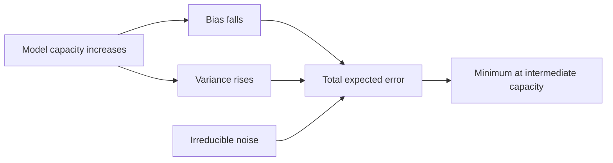

# Bias–Variance Tradeoff

## TL;DR
Expected squared error at a point decomposes exactly into irreducible noise + squared bias +
variance. Bias is error from the model class being too rigid to represent the truth; variance is
error from the fit moving around as the training sample changes. Capacity trades one against the
other, and the diagnostic question in interviews is always "which one is your model suffering from,
and what evidence tells you?"

## Intuition
Shooting at a target with a rifle bolted to a slightly misaligned tripod (high bias, low variance:
tight cluster, wrong place) versus firing freehand with perfect sights (low bias, high variance:
centred on average, scattered). Averaging many freehand shots recovers the centre — which is exactly
why [[random-forest]] and bagging work, and why averaging cannot fix a misaligned tripod.

## The maths

Assume $y = f(x) + \varepsilon$ with $\mathbb{E}[\varepsilon] = 0$, $\operatorname{Var}(\varepsilon)
= \sigma^2$, and $\varepsilon$ independent of $x$. Let $\hat{f}$ be fitted on a random training set
$D$; all expectations below are over $D$ and over $\varepsilon$ at a fixed test point $x_0$.

$$
\mathbb{E}\big[(y - \hat{f}(x_0))^2\big]
= \mathbb{E}\big[(f(x_0) + \varepsilon - \hat{f}(x_0))^2\big]
$$

Write $\bar{f}(x_0) = \mathbb{E}_D[\hat{f}(x_0)]$, the average prediction over training sets. Insert
and subtract it:

$$
\begin{aligned}
\mathbb{E}\big[(y-\hat{f})^2\big]
&= \mathbb{E}\Big[\big(\varepsilon + (f - \bar{f}) + (\bar{f} - \hat{f})\big)^2\Big] \\[4pt]
&= \underbrace{\mathbb{E}[\varepsilon^2]}_{\sigma^2}
 + \underbrace{(f - \bar{f})^2}_{\text{Bias}^2}
 + \underbrace{\mathbb{E}\big[(\hat{f} - \bar{f})^2\big]}_{\text{Variance}}
 + 2\,\text{cross terms}
\end{aligned}
$$

All three cross terms vanish:
- $\mathbb{E}[\varepsilon (f - \bar{f})] = \mathbb{E}[\varepsilon](f-\bar{f}) = 0$ since $f - \bar f$
  is deterministic at $x_0$.
- $\mathbb{E}[\varepsilon(\bar{f} - \hat{f})] = 0$ because the test noise $\varepsilon$ is
  independent of the training set $D$ that produced $\hat f$.
- $\mathbb{E}[(f - \bar{f})(\bar{f} - \hat{f})] = (f-\bar{f})\,\mathbb{E}[\bar{f} - \hat{f}] = 0$
  by the definition of $\bar{f}$.

Hence the exact decomposition:

$$
\boxed{\;
\mathbb{E}\big[(y - \hat{f}(x_0))^2\big]
= \sigma^{2}
+ \big(f(x_0) - \mathbb{E}_D[\hat{f}(x_0)]\big)^{2}
+ \mathbb{E}_D\big[(\hat{f}(x_0) - \mathbb{E}_D[\hat{f}(x_0)])^{2}\big] \;}
$$

irreducible error + bias² + variance. $\sigma^2$ is a floor: no model, no data volume and no
compute removes it.

**Worked instance — k-NN regression.** With the $k$ nearest neighbours $x_{(1)},\dots,x_{(k)}$ of
$x_0$:

$$
\hat{f}(x_0) = \frac{1}{k}\sum_{j=1}^{k} y_{(j)},
\qquad
\operatorname{Var}\big(\hat{f}(x_0)\big) = \frac{\sigma^2}{k},
\qquad
\text{Bias}(x_0) = f(x_0) - \frac{1}{k}\sum_{j=1}^{k} f(x_{(j)})
$$

Increasing $k$ divides variance by $k$ and inflates bias, because the neighbourhood widens and the
averaged $f$ values drift from $f(x_0)$. That is the tradeoff in one formula — see
[[k-nearest-neighbours]].

**Worked instance — ridge.** For $\hat\beta_\lambda = (X^\top X + \lambda I)^{-1}X^\top y$, larger
$\lambda$ shrinks coefficients toward zero: bias grows monotonically, variance shrinks, and there
always exists a $\lambda > 0$ whose total MSE beats OLS. That existence result is the entire
justification for [[regularization-l1-l2]].

**Bagging vs boosting in these terms.** Averaging $B$ models each with variance $v$ and pairwise
correlation $\rho$ gives variance

$$
\rho v + \frac{1-\rho}{B}v
$$

so bagging attacks variance and is floored by $\rho$ — which is why random forests randomise the
feature subset, to push $\rho$ down. Boosting instead fits residuals sequentially and attacks bias,
which is why it needs explicit regularisation (shrinkage, depth limits, early stopping) to keep
variance in check. See [[bagging-vs-boosting]].

**Caveat worth saying out loud.** The clean decomposition is a squared-error result. For 0–1 loss it
does not decompose additively — analogues exist but are not this identity. And in the
over-parameterised regime, test error can fall again past the interpolation point ("double descent"),
so "more capacity always means more variance" is not universally true; it is true within the
classical regime these interviews are about.

## Diagram



## Code

```python
import numpy as np
from sklearn.tree import DecisionTreeRegressor

rng = np.random.RandomState(0)
f = lambda x: np.sin(2 * np.pi * x)
SIGMA, N, REPS = 0.3, 60, 400
x0 = np.array([[0.35]])                      # fixed test point
truth = f(x0[0, 0])

for depth in [1, 3, 8, None]:
    preds = np.empty(REPS)
    for r in range(REPS):
        X = rng.rand(N, 1)
        y = f(X[:, 0]) + rng.normal(0, SIGMA, N)
        preds[r] = DecisionTreeRegressor(max_depth=depth, random_state=r).fit(X, y).predict(x0)[0]
    bias2 = (truth - preds.mean()) ** 2
    var = preds.var()
    print(f"depth={str(depth):>4}  bias^2={bias2:.4f}  var={var:.4f}  "
          f"total={bias2 + var + SIGMA**2:.4f}")
```

Shallow trees show large bias² and tiny variance; unlimited depth flips it. The `total` column has
$\sigma^2 = 0.09$ added as the floor — no configuration goes below it, which is the point.

## In practice
- **Use it when:** diagnosing *why* a model underperforms, before touching hyperparameters. It turns
  "the model is bad" into a testable question.
- **Defaults that work:** read the gap between training and validation error.
  Train error high and validation error close to it → bias-dominated: add capacity, add features,
  reduce regularisation. Train error low and validation error much higher → variance-dominated:
  more data, stronger regularisation, fewer features, simpler model, bagging. Both high and equal
  with a flat learning curve → you may be at the noise floor. See
  [[learning-curves-and-diagnostics]].
- **Breaks when:** the train/validation gap is caused by distribution shift rather than variance.
  A model can have low variance and still fail on a shifted validation period —
  [[data-drift-and-concept-drift]].
- **Cost / latency:** the empirical decomposition needs many refits on resampled data; cheap for
  linear models and trees on modest data, expensive otherwise. Bootstrap resampling
  ([[resampling-bootstrap-and-permutation]]) is the practical tool.

## Interview angle

**Q. Derive the bias–variance decomposition.**
Give the four lines above: assume $y = f + \varepsilon$, insert and subtract
$\bar{f} = \mathbb{E}_D[\hat f]$, expand the square, show each cross term is zero — one because
$\mathbb{E}[\varepsilon]=0$, one because test noise is independent of the training set, one because
$\mathbb{E}[\bar f - \hat f] = 0$ by definition — and you are left with
$\sigma^2 + \text{bias}^2 + \text{variance}$. Say explicitly that it holds for squared error.

**Follow-up.** *Which term does more data reduce?* → Variance, because $\hat{f}$ stabilises as $n$
grows. Bias is a property of the model class and does not shrink with $n$; the irreducible $\sigma^2$
never shrinks. That is why "get more data" is the wrong prescription for an underfitting model.

**Q. Does regularisation increase bias? Is that bad?**
It increases bias by construction — it constrains the solution away from the unconstrained empirical
optimum. It is good whenever the variance reduction exceeds the bias increase, and for ridge there
provably exists a $\lambda>0$ where it does. The tradeoff is empirical: pick $\lambda$ by
cross-validation.

**Q. A random forest with 500 trees still overfits. What does the decomposition tell you?**
Averaging reduces the $\,(1-\rho)v/B\,$ term only; the floor is $\rho v$. If trees are highly
correlated — few informative features, so every tree splits the same way — adding trees does almost
nothing. Reduce $\rho$ (lower `max_features`, more feature subsampling) or reduce individual tree
variance (limit depth, raise `min_samples_leaf`). Also check that the "overfit" is not really
leakage or a grouping violation in the split.

**Q. Is a deep neural network high bias or high variance?**
By capacity, low bias and high variance in the classical sense — but modern over-parameterised
networks land in the double-descent regime where test error falls again past the interpolation
threshold, and implicit regularisation from SGD does a lot of work. So the honest answer is: the
classical picture describes the underparameterised regime; for large networks, state that and talk
about the empirical train/validation curve instead.

**Q. How would you measure bias and variance empirically?**
Bootstrap: draw $B$ resamples, fit a model on each, and at each test point compute the variance of
the $B$ predictions (variance) and the squared gap between their mean and the observed value minus
an estimate of $\sigma^2$ (bias²). You only get a clean bias term when you know the truth, so in
practice you measure variance directly and infer bias from the residual.

## Traps
- **"High bias means the predictions are biased in one direction."** No — bias here is the gap
  between the *average model over training sets* and the truth, which can be positive in one region
  and negative in another.
- **"Bagging reduces bias."** It reduces variance. Boosting is the bias-reducing ensemble.
- **"Add more data" for every problem.** Useless against bias and against the noise floor. Check the
  learning curve first.
- **Quoting the decomposition for classification accuracy.** The additive identity is a squared-error
  result; there is no equally clean 0–1-loss version.
- **Confusing the tradeoff with under/overfitting as synonyms.** Underfitting is the *observable
  symptom* of bias dominance, overfitting of variance dominance —
  [[overfitting-and-underfitting]] — but the decomposition is about expected error over training
  sets, which is a stronger statement.
- **Forgetting $\sigma^2$.** If a competitor's model and yours both sit at 0.42 RMSE, you may both
  be at the noise floor and further tuning is wasted effort.

## Flashcards
Bias–variance decomposition::E[(y − f̂)²] = σ² + (f − E[f̂])² + E[(f̂ − E[f̂])²] — irreducible noise + bias² + variance, for squared loss.
Why do the cross terms vanish::E[ε]=0; test noise is independent of the training set; and E[f̄ − f̂] = 0 by definition of f̄.
Which term shrinks with more data::Variance. Bias is a property of the model class; σ² never shrinks.
k-NN variance and bias in k::Var = σ²/k, bias grows as the neighbourhood widens — larger k means lower variance, higher bias.
Variance of an average of B correlated models::ρv + (1−ρ)v/B — the correlation floor is why random forests decorrelate trees.
Bagging vs boosting in these terms::Bagging attacks variance; boosting attacks bias and needs regularisation to control variance.
Main caveat on the decomposition::It is exact for squared error only, and the classical monotone capacity story breaks in the over-parameterised double-descent regime.

## Related
- [[overfitting-and-underfitting]]
- [[learning-curves-and-diagnostics]]
- [[regularization-l1-l2]]
- [[cross-validation]]
- [[k-nearest-neighbours]]
- [[bagging-vs-boosting]]
- [[moc-classical-ml]]
