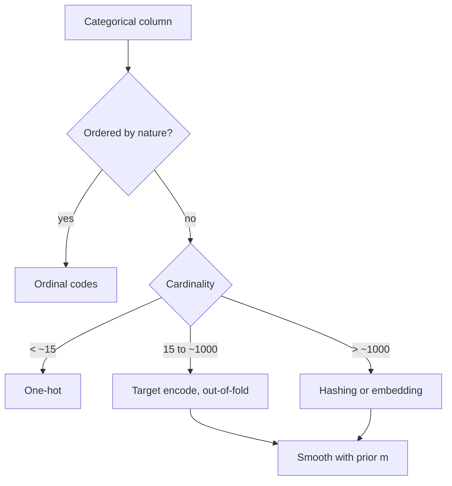

# Categorical Encoding

## TL;DR
Low cardinality → one-hot (or leave native for LightGBM/CatBoost). Ordinal-by-nature → ordinal codes.
High cardinality → target encoding with **out-of-fold** fitting and smoothing, hashing, or a learned
embedding. Label-encoding a nominal variable for a *linear* model invents a false ordering; for a
*tree* it is merely suboptimal, not fatal. Target encoding is the highest-value and highest-risk
technique — it leaks by default.

## Intuition
A categorical column is a set of names. The model needs numbers. You are choosing what geometry to
impose on the names: one-hot says "all levels are equidistant and orthogonal", ordinal says "they lie
on a line in this order", target encoding says "replace each name by what it tells you about the
target", embeddings say "learn the geometry from data".

## The maths

**One-hot.** Level $c$ of a $K$-level variable → $e_c \in \{0,1\}^K$. With an intercept, use $K-1$
dummies (drop-first) to avoid the dummy-variable trap: the $K$ columns sum to the intercept column,
making $X^\top X$ singular. Regularised models tolerate the full $K$; plain OLS does not.

**Target (mean) encoding with smoothing.** For level $c$ with count $n_c$ and in-level target mean
$\bar{y}_c$:

$$
\text{enc}(c) = \frac{n_c\,\bar{y}_c + m\,\bar{y}}{n_c + m}
$$

$\bar{y}$ is the global target mean, $m > 0$ the smoothing strength in pseudo-observations. This is
the posterior mean under a conjugate prior of strength $m$ centred at $\bar{y}$; the shrinkage factor
is $n_c/(n_c+m)$, so a level seen once is essentially the global mean and a level seen 10,000 times
is essentially its own mean. Empirical-Bayes choice: $m \approx \sigma^2_{\text{within}} /
\sigma^2_{\text{between}}$.

**Why it leaks.** If $\bar{y}_c$ includes row $i$'s own $y_i$, then for a level of size 1,
$\text{enc}(c) \to y_i$ under weak smoothing — the feature *is* the label. The fix is a nested /
out-of-fold scheme: to encode the rows of fold $k$, compute the statistics from folds $\ne k$ only.
CatBoost's *ordered target statistics* generalises this: for each row it uses only rows earlier in a
random permutation,

$$
\text{enc}(x_i) = \frac{\sum_{j: \sigma(j) < \sigma(i)} \mathbb{1}[x_j = x_i]\, y_j + m\,\bar{y}}
                       {\sum_{j: \sigma(j) < \sigma(i)} \mathbb{1}[x_j = x_i] + m}
$$

which is unbiased in the same sense as out-of-fold but uses all the data and averages over multiple
permutations.

**Hashing.** $h: \text{string} \to \{0,\dots,B-1\}$, then one-hot of the bucket. Fixed width $B$, no
vocabulary to store, handles unseen levels for free. Collisions are the price: with $K$ levels into
$B$ buckets, the expected number of colliding pairs is $\binom{K}{2}/B$. Rare-level collisions are
usually harmless; a collision between two high-frequency levels is not.

**Weight of evidence** (binary target, common in Indian BFSI credit-risk interviews):

$$
\text{WoE}(c) = \ln \frac{P(x = c \mid y = 1)}{P(x = c \mid y = 0)}, \qquad
\text{IV} = \sum_c \big(P(c\mid 1) - P(c \mid 0)\big)\,\text{WoE}(c)
$$

WoE makes the encoded variable linear in the log-odds, which is exactly what
[[logistic-regression]] wants. IV is the standard univariate screening statistic on scorecards.

## Diagram



## Code

```python
import numpy as np
import pandas as pd
from sklearn.model_selection import KFold

def oof_target_encode(df, col, target, n_splits=5, m=20.0, seed=0):
    """Out-of-fold smoothed target encoding. Returns (train_encoding, mapping_for_serving)."""
    prior = df[target].mean()
    oof = pd.Series(np.nan, index=df.index, dtype=float)

    for tr_idx, va_idx in KFold(n_splits, shuffle=True, random_state=seed).split(df):
        stats = df.iloc[tr_idx].groupby(col)[target].agg(["sum", "count"])
        smooth = (stats["sum"] + m * prior) / (stats["count"] + m)
        oof.iloc[va_idx] = df.iloc[va_idx][col].map(smooth).fillna(prior).values

    # Serving map uses ALL training rows — that is fine, it never touches val/test labels.
    full = df.groupby(col)[target].agg(["sum", "count"])
    serving_map = (full["sum"] + m * prior) / (full["count"] + m)
    return oof, serving_map, prior


rng = np.random.default_rng(0)
df = pd.DataFrame({
    "city": rng.choice([f"c{i}" for i in range(200)], size=5000),
    "y": rng.integers(0, 2, size=5000),          # pure noise target
})
oof, smap, prior = oof_target_encode(df, "city", "y")

# Sanity check that must be part of your answer: with a random target, the encoding
# must carry no signal. Naive in-fold encoding would show spurious correlation.
naive = df.groupby("city")["y"].transform("mean")
print("corr, naive encoding :", np.corrcoef(naive, df["y"])[0, 1].round(3))
print("corr, OOF encoding   :", np.corrcoef(oof,   df["y"])[0, 1].round(3))
```

The naive number is clearly positive on a random target; the out-of-fold number hovers around zero.
That contrast is the whole lesson.

Native categorical handling, which is usually the better answer when available:

```python
import lightgbm as lgb

train = df.copy()
train["city"] = train["city"].astype("category")
model = lgb.LGBMClassifier(n_estimators=300)
model.fit(train[["city"]], train["y"], categorical_feature=["city"])
```

LightGBM sorts the level means and finds an optimal partition of the level set at each split rather
than requiring you to pre-encode; CatBoost uses ordered target statistics internally. Both remove
the leak risk you would otherwise hand-roll.

## In practice
- **Use it when:** always — but match the method to cardinality and model family.
- **Defaults that work:** one-hot up to ~15 levels; target encoding with $m$ between 10 and 100 and
  5-fold out-of-fold above that; hashing at $2^{18}$–$2^{20}$ buckets for click-style ID spaces;
  learned embeddings of dimension $\approx \min(50, (K+1)/2)$ when there is a neural model anyway.
  Always reserve an explicit `__UNKNOWN__` level and map unseen categories to the prior.
- **Breaks when:** the level distribution shifts between train and serving (new SKUs, new cities);
  when a level is rare in train and common later; when target encoding is fit in-fold. Also when
  one-hot blows the matrix up — 50k one-hot columns into a dense model is a memory problem before it
  is an accuracy problem.
- **Cost / latency:** target encoding at serving is a dictionary lookup, so it is the *cheapest*
  high-cardinality option at inference, and the encoding table must be versioned with the model.
  One-hot on high cardinality costs memory in the model artifact.

> [!tip]
> On Databricks, store the encoding map as a small Delta table keyed by
> `(model_version, column, level)` and log its path to MLflow alongside the model. Otherwise you
> cannot reproduce a score from six months ago. See [[model-registry-and-versioning]].

## Interview angle

**Q. You have a `pincode` column with 19,000 distinct values. How do you encode it?**
Not one-hot. First I would ask whether the raw pincode is the signal or a proxy — usually it is a
proxy for geography and affluence, so I would enrich: map to district/state (low cardinality,
one-hot), and to aggregate covariates like district-level income or delivery density. For the
residual identity signal, out-of-fold target encoding with smoothing, or hashing if the space keeps
growing. If I am on CatBoost or LightGBM I let the library handle it natively and skip hand-rolled
encoding entirely.

**Follow-up.** What breaks at serving? → Pincodes not present in training. I map unseen levels to the
global prior explicitly and I monitor the unseen-level rate; a jump there is a drift alarm.

**Q. Why is target encoding dangerous and how do you make it safe?**
Because the encoded value for a row is computed from a statistic that includes that row's own label.
At the extreme — a level seen once with no smoothing — the feature equals the label and the model
gets a perfect training signal that vanishes on new data. The fixes stack: (1) compute the encoding
out-of-fold, so a row's encoding comes only from other folds; (2) smooth toward the global mean so
rare levels do not carry extreme values; (3) optionally add noise. And the encoder must be refit
inside each CV fold, not once on the full training set.

**Follow-up.** How does CatBoost handle this? → Ordered target statistics: it draws random
permutations and, for each row, encodes using only rows that precede it in the permutation. Same
"don't use your own label" property but it uses more data than a $K$-fold split and averages over
several permutations to reduce variance.

**Q. Is label encoding ever fine for a nominal variable?**
For tree-based models, yes in practice — a tree can isolate any single level with enough splits, so
the arbitrary integer order costs you depth, not correctness. For linear models or distance-based
models like [[k-nearest-neighbours|kNN]] and k-means, no: it asserts that level 7 is seven times
level 1 and that levels 3 and 4 are neighbours, which is fabricated structure.

**Q. When would you use hashing over target encoding?**
When the vocabulary is unbounded and changes constantly (URLs, device fingerprints, search queries)
so that maintaining a level→statistic map is operationally painful, and when I need a fixed-width
input regardless of what arrives. The tradeoff is collisions and total loss of interpretability —
I cannot tell you what bucket 41,239 means.

**Q. What is Weight of Evidence and why do credit-risk teams use it?**
WoE replaces a level with the log-ratio of good-to-bad odds within that level, which makes the
variable linear in the log-odds and therefore directly compatible with logistic regression — the
model form regulators accept. Information Value aggregates WoE across levels into one univariate
screening number. It is a target-based encoding, so it carries exactly the same leakage risk and has
to be fitted out-of-sample.

## Traps
- **"I used `LabelEncoder` on my features."** In sklearn, `LabelEncoder` is documented for *targets*;
  `OrdinalEncoder` is the feature-side class. Naming this correctly is a small credibility signal.
- **Target encoding fitted on the full training set before CV.** Optimistic CV, disappointing
  production. The single most common mistake on this topic.
- **Dropping a dummy level "to avoid multicollinearity" in a regularised or tree model.** Only OLS
  needs drop-first. Dropping one in a tree model just hides a level.
- **Not handling unseen categories.** `OneHotEncoder(handle_unknown="ignore")` or an explicit
  `__UNKNOWN__` bucket; otherwise serving throws at 3 a.m.
- **One-hot then [[dimensionality-reduction-pca|PCA]] on the sparse block.** PCA on binary indicators
  is rarely meaningful and destroys the interpretability that made one-hot attractive.
- **Forgetting that the encoding map is part of the model.** It must be versioned, logged and
  shipped together with the weights.

## Flashcards
Smoothed target encoding formula::(n_c * ybar_c + m * ybar) / (n_c + m) — posterior mean with prior strength m pseudo-rows.
Why target encoding leaks::The level statistic includes the row's own label; for a singleton level the feature equals the target.
Two fixes for target-encoding leakage::Out-of-fold (nested) fitting so a row is encoded from other folds only, plus smoothing toward the global prior.
CatBoost's ordered target statistics::For each row, encode using only rows preceding it in a random permutation, averaged over several permutations.
When is label encoding acceptable for a nominal variable::With tree models, where the arbitrary order costs depth not correctness — never with linear, kNN or k-means.
Hashing trick tradeoff::Fixed width, no vocabulary, unseen levels free — at the cost of collisions and zero interpretability.
Weight of Evidence::ln( P(x=c | y=1) / P(x=c | y=0) ) — makes the variable linear in the log-odds, standard on credit scorecards.

## Related
- [[feature-engineering]]
- [[data-leakage]]
- [[lightgbm-and-catboost]]
- [[logistic-regression]]
- [[cross-validation]]
- [[embeddings]]
- [[feature-scaling-and-transforms]]
