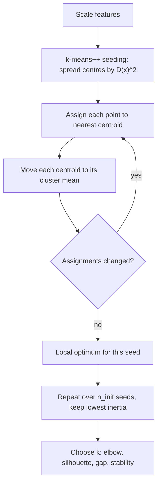

# Clustering with k-Means

## TL;DR
Minimise within-cluster sum of squares by alternating "assign each point to its nearest centroid" and
"move each centroid to its cluster's mean". Lloyd's algorithm converges to a local optimum only, so
k-means++ seeding matters. It implicitly assumes spherical, equal-variance, similarly-sized clusters —
when that is false it produces confident nonsense. Choosing $k$ is a judgement call informed by elbow,
silhouette and gap statistics, never determined by them.

## Intuition
Drop $k$ pins on a map, assign every house to its nearest pin, then move each pin to the centre of the
houses it captured. Repeat. The pins settle into the middle of natural groupings. But the procedure can
only ever carve the map into straight-edged convex tiles of roughly equal scale — so if the real
neighbourhoods are long and thin, or one is enormous and another tiny, the pins will cut through them.

## The maths

### The objective
Partition $\{x_1,\dots,x_n\} \subset \mathbb{R}^d$ into clusters $C_1,\dots,C_k$ minimising the
within-cluster sum of squares (inertia):

$$
J = \sum_{j=1}^{k}\ \sum_{x_i \in C_j} \lVert x_i - \mu_j \rVert_2^2,
\qquad \mu_j = \frac{1}{|C_j|}\sum_{x_i \in C_j} x_i
$$

Two facts follow from the squared Euclidean norm and are worth stating:

1. **Why the mean?** $\mu_j = \arg\min_\mu \sum_{x_i \in C_j}\lVert x_i - \mu\rVert^2$ — setting the
   derivative $-2\sum(x_i - \mu)$ to zero gives the mean exactly. With $L_1$ the minimiser would be the
   median, which is $k$-medians; with an arbitrary distance the centroid step is not even well defined,
   which is why $k$-medoids restricts centres to actual data points.
2. **Equivalent formulation.** Total variance is fixed, so minimising within-cluster variance is
   maximising between-cluster variance: $\mathrm{SS}_{\text{total}} = \mathrm{SS}_{\text{within}} + \mathrm{SS}_{\text{between}}$.

The problem is NP-hard in general (even for $k=2$ in general dimension), so we settle for a local optimum.

### Lloyd's algorithm
Coordinate descent on $J$ over (assignments, centroids):

1. **Assign**: $c_i = \arg\min_j \lVert x_i - \mu_j\rVert^2$.
2. **Update**: $\mu_j \leftarrow \text{mean of points assigned to } j$.
3. Repeat until assignments stop changing.

Each step weakly decreases $J$ — the assign step by definition, the update step because the mean is the
minimiser — and there are finitely many partitions, so it terminates. It terminates at a **local**
minimum, and the quality of that local minimum depends heavily on initialisation. Complexity per
iteration is $O(nkd)$.

The decision boundaries between clusters are the perpendicular bisectors between centroids: k-means
induces a **Voronoi tessellation**, so every cluster is convex and linearly separated from every other.
This single geometric fact explains most of its failures.

### k-means++
Random initialisation can be arbitrarily bad. k-means++ seeds by spreading centres out:

1. Choose $\mu_1$ uniformly at random from the data.
2. For each subsequent centre, choose $x$ with probability proportional to
   $D(x)^2 = \min_{j \le m}\lVert x - \mu_j\rVert^2$ — the squared distance to the nearest existing centre.
3. Repeat until $k$ centres are chosen, then run Lloyd.

This gives an expected approximation guarantee $\mathbb{E}[J] \le 8(\ln k + 2)\, J_{\text{OPT}}$ — the
only provable guarantee in the whole procedure, and the reason it is the default everywhere. In practice
also run several restarts (`n_init`) and keep the lowest inertia.

### The assumptions, stated honestly
k-means is equivalent to a Gaussian mixture model with spherical, equal covariance $\sigma^2 I$ and equal
mixing weights, in the limit $\sigma \to 0$ (hard assignment). So it assumes:

- **Spherical** clusters — elongated or correlated clusters get split.
- **Equal variance** — a tight cluster and a diffuse one of the same size will be mis-split, because the
  squared-distance objective rewards splitting the diffuse one.
- **Similar sizes** — inertia is a sum over points, so a large cluster can be split in two while a small
  one is absorbed.
- **Euclidean geometry is meaningful** — so scaling is mandatory, and high dimension is hostile
  ([[curse-of-dimensionality]]).

When these fail, fit a full-covariance Gaussian mixture (elliptical, soft assignments) or a
density-based method ([[hierarchical-and-density-clustering]]).

### Choosing k
No method *determines* $k$; each gives evidence.

**Elbow**: plot inertia against $k$. Inertia decreases monotonically (more centres always fit better), so
you look for a kink. Often there is no visible kink, and the method is famously subjective. The
kneedle-style formalisation (maximum distance from the line joining the endpoints) at least makes it
reproducible.

**Silhouette**: for point $i$, with $a(i)$ the mean distance to its own cluster and $b(i)$ the mean
distance to the nearest *other* cluster,

$$
s(i) = \frac{b(i) - a(i)}{\max\{a(i),\, b(i)\}} \in [-1, 1]
$$

Mean silhouette peaks at a $k$ where clusters are compact and well separated. Negative values flag
misassigned points. Cost is $O(n^2)$ distances, so subsample on large data. Note it also prefers
spherical clusters, so it agrees with k-means's own bias.

**Gap statistic**: compare $\log W_k$ (pooled within-cluster dispersion) against its expectation under a
null reference distribution (uniform over the data's bounding box or PCA-aligned box), estimated by $B$
Monte Carlo samples:

$$
\mathrm{Gap}(k) = \frac{1}{B}\sum_{b=1}^{B}\log W_{k}^{*b} - \log W_k
$$

Choose the smallest $k$ with $\mathrm{Gap}(k) \ge \mathrm{Gap}(k+1) - s_{k+1}$, where $s_{k+1}$ is the
standard error of the reference dispersions. Unlike elbow and silhouette, the gap statistic can select
$k=1$ — i.e. tell you there is no cluster structure — which is its main virtue.

**Stability**: cluster bootstrap resamples and measure assignment agreement (adjusted Rand index). A $k$
whose partition is not reproducible across resamples is not a real $k$. Underrated, and a strong thing to
mention.

## Diagram



## Code

```python
import numpy as np
from sklearn.cluster import KMeans
from sklearn.datasets import make_blobs
from sklearn.metrics import adjusted_rand_score, silhouette_score
from sklearn.pipeline import make_pipeline
from sklearn.preprocessing import StandardScaler

X, y_true = make_blobs(n_samples=5000, centers=5, cluster_std=1.1,
                       n_features=8, random_state=0)

# Scaling is mandatory: the objective is a squared Euclidean distance.
pipe = make_pipeline(StandardScaler(), KMeans(n_clusters=5, n_init=10, random_state=0))
labels = pipe.fit_predict(X)
print("ARI vs truth:", adjusted_rand_score(y_true, labels))
print("inertia:", pipe.named_steps["kmeans"].inertia_)
```

Choosing $k$ — three pieces of evidence, not one answer:

```python
Xs = StandardScaler().fit_transform(X)
ks = range(2, 12)
inertia, sil = [], []
for k in ks:
    km = KMeans(n_clusters=k, n_init=10, random_state=0).fit(Xs)
    inertia.append(km.inertia_)
    sil.append(silhouette_score(Xs, km.labels_, sample_size=3000, random_state=0))

for k, i, s in zip(ks, inertia, sil):
    print(f"k={k:<3} inertia={i:10.1f}  silhouette={s:.4f}")
```

Gap statistic, implemented directly — it is short and worth being able to write:

```python
def gap_statistic(X, k_range, n_refs=10, seed=0):
    rng = np.random.default_rng(seed)
    lo, hi = X.min(0), X.max(0)
    out = {}
    for k in k_range:
        logW = np.log(KMeans(k, n_init=10, random_state=seed).fit(X).inertia_)
        logW_ref = []
        for _ in range(n_refs):
            Xr = rng.uniform(lo, hi, size=X.shape)          # uniform null over the bounding box
            logW_ref.append(np.log(KMeans(k, n_init=10, random_state=seed).fit(Xr).inertia_))
        logW_ref = np.array(logW_ref)
        gap = logW_ref.mean() - logW
        sk = logW_ref.std() * np.sqrt(1 + 1 / n_refs)
        out[k] = (gap, sk)
    return out

for k, (g, s) in gap_statistic(Xs, range(1, 10)).items():
    print(f"k={k}  gap={g:.4f}  s_k={s:.4f}")
# Pick the smallest k with gap(k) >= gap(k+1) - s_(k+1).
```

Where k-means fails, visibly:

```python
from sklearn.datasets import make_moons
from sklearn.mixture import GaussianMixture

Xm, ym = make_moons(n_samples=2000, noise=0.06, random_state=0)
print("k-means ARI on moons:", adjusted_rand_score(ym, KMeans(2, n_init=10, random_state=0).fit_predict(Xm)))
# Near 0.2-0.3: two crescents are not convex, so Voronoi cells cut straight through them.

# Anisotropic blobs: elliptical clusters need a full-covariance GMM, not k-means.
rng = np.random.default_rng(0)
Xa = make_blobs(n_samples=3000, centers=3, random_state=0)[0] @ rng.normal(size=(2, 2))
ya = make_blobs(n_samples=3000, centers=3, random_state=0)[1]
print("k-means ARI :", adjusted_rand_score(ya, KMeans(3, n_init=10, random_state=0).fit_predict(Xa)))
print("full-cov GMM:", adjusted_rand_score(ya, GaussianMixture(3, covariance_type="full",
                                                               random_state=0).fit_predict(Xa)))
```

At scale — `MiniBatchKMeans` and the Spark equivalent:

```python
from sklearn.cluster import MiniBatchKMeans

mbk = MiniBatchKMeans(n_clusters=5, batch_size=4096, n_init=10, random_state=0).fit(Xs)
# Uses gradient-style updates on mini-batches: O(batch * k * d) per step instead of O(n * k * d).
# Slightly worse inertia, dramatically faster and streamable.

# On Spark: pyspark.ml.clustering.KMeans uses k-means|| — a parallel oversampling variant of
# k-means++ that seeds in O(log k) distributed passes rather than k sequential ones.
```

## In practice
- **Use it when:** you want fast, interpretable partitioning of scaled numeric data into roughly
  spherical groups: customer segmentation, colour or vector quantisation, building a coarse index for
  ANN search (IVF centroids are literally k-means), compressing a feature space, or generating cluster-id
  features for a supervised model.
- **Defaults that work:** scale first; `init='k-means++'`, `n_init=10` (or `'auto'` in recent
  scikit-learn), `random_state` fixed for reproducibility; reduce dimension with PCA first if $d$ is
  large — it both speeds things up and makes Euclidean distance more meaningful. Validate with silhouette
  *and* bootstrap stability, not one number.
- **Breaks when:** clusters are non-convex (moons, rings), elongated or correlated, of very different
  densities or sizes; data is categorical (there is no meaningful mean — use k-modes or Gower-based
  hierarchical); outliers are present (they drag centroids, since the mean is not robust); or $d$ is high
  without reduction. Also note k-means *always* returns $k$ clusters, even in pure noise.
- **Cost / latency:** $O(nkdi)$ for $i$ iterations, trivially parallel over points. `MiniBatchKMeans`
  handles data that does not fit in memory; Spark's `KMeans` with k-means|| handles billions of rows.
  Inference (assigning a new point) is $O(kd)$ and fast enough to serve online.

> [!warning]
> Segmentation results are frequently presented to business stakeholders as if the clusters were
> discovered facts. They are an artefact of your feature set, your scaling and your $k$. Always show that
> the partition is stable under resampling before anyone names the segments in a deck.

## Interview angle

**Q. Write down the k-means objective and show why the update step uses the mean.**
$J = \sum_j \sum_{x_i \in C_j}\lVert x_i - \mu_j\rVert^2$. Holding assignments fixed, differentiate with
respect to $\mu_j$: $\partial J/\partial\mu_j = -2\sum_{x_i\in C_j}(x_i - \mu_j) = 0 \Rightarrow \mu_j$
is the cluster mean. The mean is specifically the minimiser of *squared* Euclidean distance — with $L_1$
you would get the median, which is $k$-medians.

**Follow-up.** Does Lloyd's algorithm always converge, and to what? → It converges in finitely many steps
because each step weakly decreases $J$ and there are finitely many partitions. But only to a local
minimum; the global problem is NP-hard. That is why seeding and restarts matter.

**Q. What does k-means++ do and why is it worth it?**
It picks the first centre uniformly, then each subsequent centre with probability proportional to the
squared distance to the nearest chosen centre — spreading seeds toward under-covered regions. It gives an
expected $O(\log k)$-competitive guarantee relative to the optimum, which random initialisation does not
have, and it typically converges in fewer iterations too.

**Q. What assumptions does k-means make?**
It is a hard-assignment Gaussian mixture with spherical, equal covariance and equal mixing weights. So:
spherical clusters, similar variances, similar sizes, meaningful Euclidean distance. The induced
boundaries are perpendicular bisectors between centroids — a Voronoi tessellation — so every cluster is
convex. Non-convex, elongated or unequal-density structure breaks it.

**Q. How do you choose k?**
I gather evidence rather than expecting an answer. Elbow on inertia for a rough range; mean silhouette for
compactness and separation; gap statistic, which is the only one of the three that can say "$k=1$, there
is no structure"; and bootstrap stability via adjusted Rand index, because a $k$ whose partition does not
reproduce is not real. Then the domain constraint usually decides — if marketing can run four campaigns,
$k$ is four regardless of what the silhouette says.

**Q. Your clusters are dominated by one feature. Why?**
Almost certainly scaling. The objective is a squared Euclidean distance, so a feature measured in
thousands contributes thousands of times more to every distance. Standardise. If it persists after
scaling, the feature genuinely carries most of the variance — check whether that variance is signal or
just a heavy-tailed distribution that needs a log transform.

**Q. Ten million rows on Databricks. How?**
`MiniBatchKMeans` if it fits on one node, otherwise `pyspark.ml.clustering.KMeans`, which uses k-means||
— a parallel oversampling variant of k-means++ that seeds in $O(\log k)$ distributed passes instead of $k$
sequential ones. PCA first to cut $d$, cache the feature vector, and fix the seed so the segmentation is
reproducible across runs.

## Traps
- **Not scaling.** The most common and most fatal error.
- **Using the elbow as proof.** Inertia is monotone decreasing; there is often no elbow, and two analysts
  will read the same plot differently.
- **Assuming the clusters are real.** k-means returns $k$ clusters from uniform noise, confidently. Test
  against a null (gap statistic) and for stability.
- **Running with `n_init=1`.** You get one random local optimum. Restart.
- **Applying it to categorical or mixed data.** The mean of "Mumbai" and "Chennai" is not defined.
  One-hot plus Euclidean is not a fix; use k-modes, Gower distance, or hierarchical.
- **Comparing inertia across different $k$ or different feature sets.** Not comparable — it decreases
  mechanically with $k$ and depends on scaling.
- **Interpreting silhouette on non-convex data.** It shares k-means's spherical bias, so it will agree
  with a wrong answer.
- **Letting outliers set the centroids.** The mean is not robust; trim, winsorise, or use k-medoids.
- **Treating cluster ids as an ordinal feature downstream.** They are nominal; one-hot or target-encode
  them ([[categorical-encoding]]).

## Flashcards
Write the k-means objective.::$J = \sum_j \sum_{x_i \in C_j} \lVert x_i - \mu_j\rVert_2^2$ — within-cluster sum of squares.
Why is the centroid update the mean?::The mean minimises the sum of squared Euclidean distances; the derivative $-2\sum(x_i-\mu)$ vanishes there. With $L_1$ it would be the median.
Does Lloyd's algorithm find the global optimum?::No — it converges to a local minimum in finite steps; the global problem is NP-hard, hence k-means++ and multiple restarts.
How does k-means++ seed, and what guarantee does it give?::Each new centre is chosen with probability proportional to $D(x)^2$, giving $\mathbb{E}[J] \le 8(\ln k + 2)J_{OPT}$.
What shape are k-means decision boundaries?::Perpendicular bisectors between centroids — a Voronoi tessellation, so every cluster is convex.
What model is k-means equivalent to?::A Gaussian mixture with spherical equal covariance and equal weights, with hard assignments (the $\sigma \to 0$ limit).
Define the silhouette coefficient.::$s(i) = (b(i)-a(i))/\max(a(i),b(i))$ where $a$ is mean intra-cluster distance and $b$ the mean distance to the nearest other cluster.
What can the gap statistic do that elbow and silhouette cannot?::Select $k=1$ — i.e. conclude there is no cluster structure at all, by comparing against a uniform null reference.

## Related
- [[hierarchical-and-density-clustering]] — what to use when the shape assumptions fail
- [[dimensionality-reduction-pca]] — the preprocessing that makes Euclidean distance meaningful
- [[curse-of-dimensionality]] — why clustering degrades as $d$ grows
- [[feature-scaling-and-transforms]] — mandatory before k-means
- [[supervised-vs-unsupervised]] — how to evaluate without labels
- [[ann-algorithms-hnsw-ivf]] — IVF indexes built from k-means centroids
- [[anomaly-detection]] — distance-to-centroid as an outlier score
