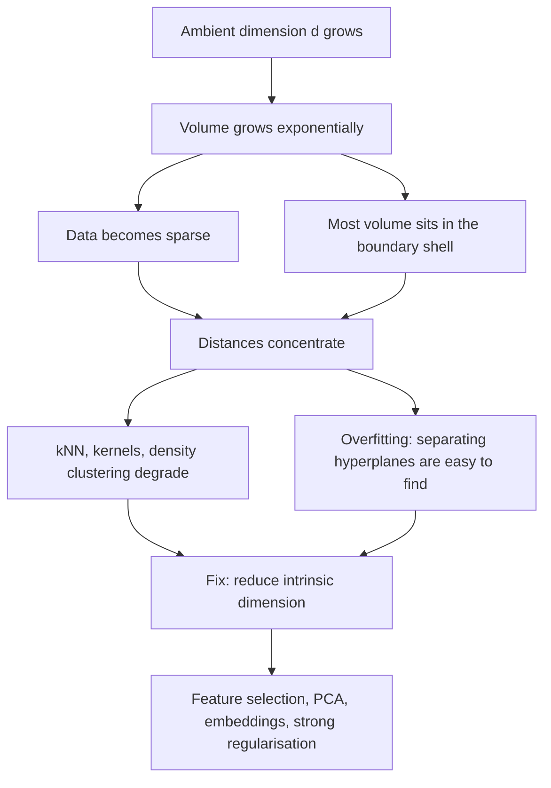

# Curse of Dimensionality

## TL;DR
In high dimensions, volume explodes, data becomes sparse, all pairwise distances converge to the same
value, and everything lives near the boundary. Any method that relies on locality — kNN, kernel density,
RBF kernels, distance-based clustering — degrades. The escape is not more data (you need exponentially
more) but lower *intrinsic* dimension: feature selection, projection, or a learned representation.

## Intuition
Split each feature into 10 bins. In 1-D you need 10 samples to have one per bin; in 2-D, 100; in 10-D,
10 billion. The space you are asking the model to cover grows exponentially while your dataset does not.
Your 100,000 rows, spread across 200 features, are not a cloud — they are 100,000 isolated specks in an
almost entirely empty room.

## The maths

### Sparsity: neighbourhoods are not local
To capture a fraction $r$ of the data in a hypercube sub-cube of $[0,1]^d$, its edge length must be

$$
e_d(r) = r^{1/d}
$$

For $r = 0.01$: $d=1 \Rightarrow 0.01$; $d=10 \Rightarrow 0.63$; $d=100 \Rightarrow 0.955$. To grab 1% of
your data in 100 dimensions you must span 95% of the range of *every* feature. There is no such thing as
a local neighbourhood.

### Everything is near the boundary
The fraction of a $d$-ball's volume lying in the outer shell of relative thickness $\epsilon$ is

$$
1 - (1-\epsilon)^d
$$

At $d = 100$, the outer 5% shell holds $1 - 0.95^{100} \approx 99.4\%$ of the volume. Practically: nearly
every point is closer to the edge of the data region than to any other point, so nearly every prediction
is an extrapolation rather than an interpolation.

Relatedly, the volume of the unit $d$-ball inscribed in the unit cube is
$V_d = \frac{\pi^{d/2}}{\Gamma(d/2+1)} \cdot 2^{-d}$ of the cube, which $\to 0$ rapidly. A hypercube in
high dimensions is essentially all corners.

### Distance concentration
This is the result that actually breaks algorithms. For i.i.d. features with finite variance, let
$D_{\max}^{(d)}$ and $D_{\min}^{(d)}$ be the largest and smallest distances from a query to $n$ points.
Under mild conditions (Beyer et al.),

$$
\frac{D_{\max}^{(d)} - D_{\min}^{(d)}}{D_{\min}^{(d)}} \xrightarrow[d \to \infty]{p} 0
$$

The nearest and farthest neighbours become indistinguishable. Concretely, for $x, x' \sim U[0,1]^d$
independent, $\mathbb{E}\lVert x - x'\rVert_2 \approx \sqrt{d/6}$ while the standard deviation stays
$O(1)$, so the *relative* spread shrinks like $1/\sqrt{d}$. Everything is the same distance away.

Consequence: nearest-neighbour search, RBF kernels, DBSCAN's $\varepsilon$, and cosine thresholds all
lose discriminative power.

### Sample complexity
For a nonparametric estimator with smoothness $s$ in $d$ dimensions, the minimax rate is

$$
\mathbb{E}\lVert \hat{f} - f\rVert^2 \asymp n^{-2s/(2s+d)}
$$

To keep error fixed while $d$ grows, $n$ must grow exponentially. Parametric models escape this by
*assuming* structure — a linear model converges at $O(d/n)$ regardless of smoothness, which is precisely
the bias you pay for the variance you save ([[bias-variance-tradeoff]]).

### Why deep learning is not cursed
Real high-dimensional data is not uniform in the ambient space. A 224×224 RGB image is a point in
$\mathbb{R}^{150528}$, but natural images occupy a tiny, structured manifold of much lower *intrinsic*
dimension. The rates above depend on intrinsic, not ambient, dimension — which is why representation
learning works and why PCA on 500 correlated features often loses nothing.

## Diagram



## Code

```python
import numpy as np

rng = np.random.default_rng(0)

def concentration(d, n=2000):
    """Relative spread of distances from a query to n uniform points in [0,1]^d."""
    X = rng.random((n, d))
    q = rng.random(d)
    dist = np.linalg.norm(X - q, axis=1)
    return (dist.max() - dist.min()) / dist.min()

for d in [2, 5, 10, 50, 200, 1000]:
    print(f"d={d:<5} (dmax-dmin)/dmin = {concentration(d):.3f}")
# The ratio collapses toward 0: 'nearest neighbour' stops being meaningful.
```

```python
# Neighbourhood edge length needed to capture 1% of the data.
for d in [1, 2, 10, 50, 100]:
    print(f"d={d:<4} edge = {0.01 ** (1 / d):.3f}")

# Fraction of a d-ball's volume in the outer 5% shell.
for d in [1, 3, 10, 100]:
    print(f"d={d:<4} outer-shell fraction = {1 - 0.95 ** d:.4f}")
```

Intrinsic vs ambient dimension — the reason PCA usually helps:

```python
from sklearn.decomposition import PCA

# 300 ambient dimensions, but generated from 8 latent factors plus noise.
Z = rng.normal(size=(5000, 8))
A = rng.normal(size=(8, 300))
X = Z @ A + 0.05 * rng.normal(size=(5000, 300))

evr = PCA().fit(X).explained_variance_ratio_
print("components for 99% variance:", np.searchsorted(np.cumsum(evr), 0.99) + 1)   # ~8
```

## In practice
- **Use it when (as a diagnostic):** whenever a distance-based or density-based method underperforms and
  you have more than ~20 features. Check the distance-concentration ratio and the PCA spectrum before
  blaming hyperparameters.
- **Defaults that work:** reduce before you cluster or search. PCA to the knee of the explained-variance
  curve ([[dimensionality-reduction-pca]]), or select features by model-based importance
  ([[feature-selection]]). For text and images, use a trained embedding rather than raw counts or pixels.
- **Breaks when:** you assume PCA always helps — it only helps when variance aligns with signal. If the
  discriminative direction is low-variance, PCA will discard it. Supervised reduction (PLS, LDA) or
  supervised feature selection is the answer there.
- **Cost / latency:** dimension reduction is usually the cheapest performance win available: ANN index
  build time, memory and query latency all scale with $d$, so cutting 768 dims to 128 with a matryoshka
  or PCA-projected embedding is a direct 6× memory saving in a vector store.

> [!tip]
> Trees are the notable exception. A decision tree ignores dimensions it does not split on, so gradient
> boosting handles 1000 mostly-irrelevant features far more gracefully than kNN or an RBF SVM. This is
> part of why XGBoost remains the tabular default ([[xgboost-deep-dive]]).

## Interview angle

**Q. Explain the curse of dimensionality in one minute.**
Three linked effects. Volume grows exponentially, so any fixed dataset becomes sparse; to capture 1% of
your data in 100 dimensions your neighbourhood must span 95% of every feature's range. Almost all volume
sits near the boundary, so predictions are extrapolations. And distances concentrate — the ratio of
farthest to nearest neighbour distance tends to 1 — which breaks every method built on locality.

**Follow-up.** So does that mean high-dimensional ML is hopeless? → No, because real data has low
*intrinsic* dimension. The rates depend on the dimension of the manifold the data actually occupies, not
the ambient dimension. That is the whole justification for embeddings and PCA.

**Q. Which algorithms are most and least affected?**
Most: kNN, kernel density estimation, RBF-kernel SVM, DBSCAN, k-means — anything whose core operation is
a distance. Least: linear models with strong regularisation (they impose structure rather than
discovering it) and tree ensembles (they simply ignore unsplit features). Naive Bayes is oddly robust
because its independence assumption is a very strong prior that trades bias for stability.

**Q. You have 5000 features and 2000 rows. What do you do?**
Accept that I cannot learn a flexible function. Start with a heavily regularised linear model — L1 for
sparsity, or elastic net if features are correlated — and use its selected features as a first pass. In
parallel, check the PCA spectrum for intrinsic dimension. Only then consider a tree model, with
`colsample_bytree` low to decorrelate. Validate with repeated CV, because with $n < d$ a single split is
extremely high-variance.

**Q. Is adding a feature ever harmful?**
Yes, twice over. It adds variance (more parameters to estimate from the same $n$) and, for
distance-based methods, it adds noise directly into the metric — an irrelevant feature contributes to
every distance computation equally with an informative one. That is the theoretical basis for feature
selection, not just a computational convenience.

**Q. Why does a random hyperplane separate high-dimensional data so easily?**
With $n \le d+1$ points in general position, a hyperplane can shatter them — perfect training separation
is achievable with no signal at all. So a high training accuracy in a wide, short dataset means nothing;
only a proper held-out estimate does ([[overfitting-and-underfitting]]).

## Traps
- **"More features is more information."** More features is more *variance* and, for distance methods,
  actively more noise. Information only helps if it is signal.
- **Conflating ambient and intrinsic dimension.** 768-dimensional embeddings work fine precisely because
  their intrinsic dimension is far lower. Saying "embeddings are cursed because d=768" is wrong.
- **Applying PCA blindly before a classifier.** PCA is unsupervised; it maximises variance, not
  discriminability. A low-variance direction can carry all the label information.
- **Thinking more data fixes it.** For nonparametric methods, the required $n$ grows exponentially in $d$
  — you cannot collect your way out.
- **Believing cosine similarity is immune.** It is a distance too. Cosine similarities also concentrate
  in high dimensions; this is why raw cosine thresholds in RAG retrieval are unreliable and why reranking
  exists ([[reranking]]).
- **Using Euclidean distance on one-hot encoded high-cardinality categoricals.** You have manufactured
  exactly the pathological sparse geometry the curse describes.

## Flashcards
What edge length captures 1% of uniform data in 10 dimensions?::$0.01^{1/10} \approx 0.63$ — 63% of each feature's range, so the 'neighbourhood' is not local.
State the distance-concentration result.::As $d \to \infty$, $(D_{max} - D_{min})/D_{min} \to 0$ — nearest and farthest neighbours become indistinguishable.
What fraction of a 100-dimensional ball's volume is in the outer 5% shell?::About 99.4% ($1 - 0.95^{100}$) — nearly all points are near the boundary.
Why is deep learning not defeated by the curse?::Rates depend on intrinsic, not ambient, dimension; real data lies on a low-dimensional manifold.
Which model families are most robust to many irrelevant features?::Tree ensembles (they ignore unsplit features) and strongly regularised linear models. kNN, kernel methods and density clustering are worst hit.
What is the nonparametric minimax rate in d dimensions?::$n^{-2s/(2s+d)}$ for smoothness $s$ — required $n$ grows exponentially in $d$.
Does cosine similarity escape distance concentration?::No. Cosine values also concentrate, which is why raw similarity thresholds are unreliable in high-dimensional retrieval.

## Related
- [[k-nearest-neighbours]] — the method the curse hits hardest
- [[dimensionality-reduction-pca]] — the standard escape route
- [[tsne-and-umap]] — visualising intrinsic structure
- [[feature-selection]] — removing dimensions rather than projecting them
- [[bias-variance-tradeoff]] — the variance cost of each added feature
- [[clustering-kmeans]] — why clustering degrades in high dimensions
- [[embeddings]] — learning a low intrinsic-dimension representation
