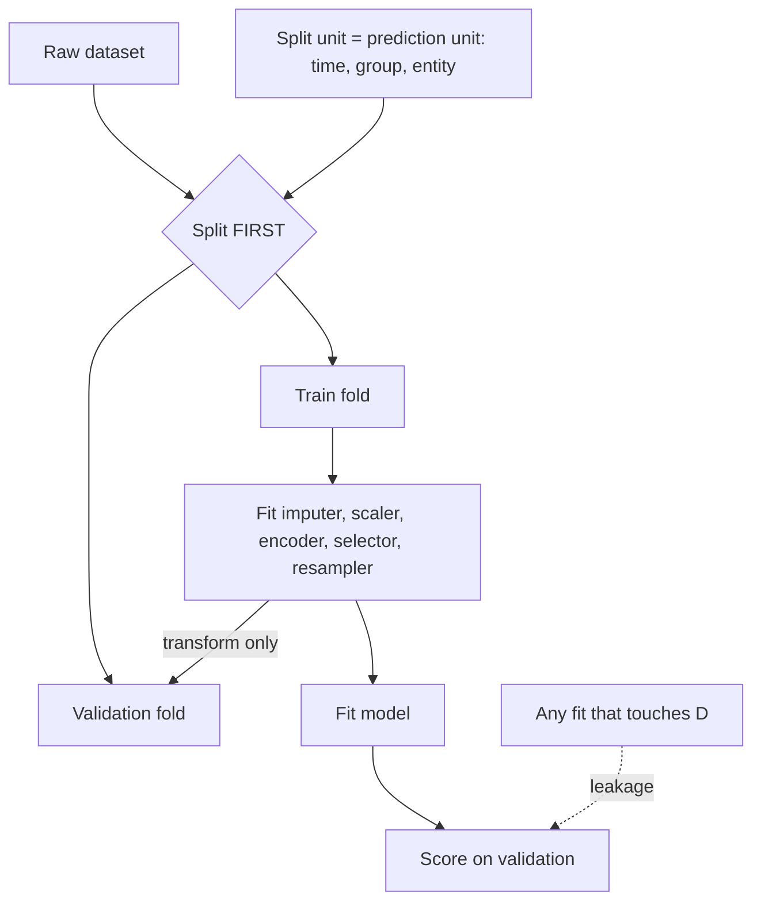

# Data Leakage

## TL;DR
Leakage is any information in your training features that would not be available, in that form, at
prediction time. It makes validation scores look wonderful and production performance collapse. The
single test: for every feature, ask "what is the timestamp at which this value became known, and is it
before the timestamp of the label I am predicting?"

## Intuition
You are marking an exam where someone has printed the answers in invisible ink on the question paper.
Every student scores 98%. You conclude the teaching was excellent. Then you give a clean paper and the
average is 51%. The model did not learn the task; it learned a shortcut that does not exist in the wild.

The reliable smell: *an implausibly good score*. A 0.99 AUC on churn prediction is not a triumph, it is
a bug report.

## The maths
Leakage has no equations — it is bookkeeping, not algebra. The thing to memorise is the taxonomy, and
the one invariant behind all of it:

$$
\text{known}(\text{feature}_j) \ \le\ t_{\text{decision}} \ <\ \text{known}(y)
$$

Every feature's value must be knowable strictly before the moment the prediction is made, and the label
must become known strictly after it. Every leak below is a violation of this inequality.

Six distinct kinds. They have different causes and different fixes, and interviewers want them named
separately.

### 1. Target leakage — a feature encodes the label
A column is populated *because of* the outcome, or after it.

```python
# BUG — predicting loan default
features = ["income", "credit_score", "recovery_agent_assigned", "days_past_due"]
# `recovery_agent_assigned` is only set AFTER the loan defaults.
# `days_past_due` is measured at the time of default, not at application.
model.fit(df[features], df["defaulted"])   # AUC 0.99, useless
```

```python
# FIX — restrict to what exists at decision time, and say what that time is.
DECISION_TIME = "application_timestamp"
features = ["income", "credit_score", "prior_defaults_12m", "utilisation_at_application"]
assert all(df[f"{f}_known_at"] <= df[DECISION_TIME] for f in features)  # enforce in code
```

The diagnostic: fit a single-feature model per column and look for one with suspiciously high AUC alone.
Also check feature importance — a dominant feature you would not have bet on is a leak until proven
otherwise.

### 2. Train/test contamination — the same information in both splits
Duplicated rows, near-duplicates, or oversampling before splitting.

```python
# BUG — SMOTE before the split puts synthetic copies of test rows into train
from imblearn.over_sampling import SMOTE
X_res, y_res = SMOTE().fit_resample(X, y)
Xtr, Xte, ytr, yte = train_test_split(X_res, y_res, test_size=0.2)
```

```python
# FIX — split first, resample only the training fold, inside a pipeline
from imblearn.pipeline import Pipeline as ImbPipeline
Xtr, Xte, ytr, yte = train_test_split(X, y, test_size=0.2, stratify=y, random_state=0)
pipe = ImbPipeline([("smote", SMOTE(random_state=0)), ("clf", LogisticRegression())])
pipe.fit(Xtr, ytr)          # SMOTE runs per-fold under cross_val_score too
```

Duplicates are the quieter version: deduplicate (or hash-key) *before* splitting, otherwise the same
customer appears on both sides.

### 3. Temporal leakage — training on the future
Random splitting a time-ordered dataset lets the model see next month while predicting this month.

```python
# BUG
Xtr, Xte, ytr, yte = train_test_split(df, y, test_size=0.2, random_state=0)   # shuffles time away
```

```python
# FIX — split by time, and validate with rolling origin
cutoff = df["event_ts"].quantile(0.8)
train, test = df[df.event_ts <= cutoff], df[df.event_ts > cutoff]

from sklearn.model_selection import TimeSeriesSplit
cv = TimeSeriesSplit(n_splits=5, gap=7)   # `gap` blocks the label-horizon overlap
```

The subtler temporal bug is a **rolling feature computed over the whole series**:

```python
# BUG — centred window sees the future
df["demand_ma"] = df["demand"].rolling(7, center=True).mean()

# FIX — trailing window, then shift so the current row is excluded
df["demand_ma"] = df["demand"].shift(1).rolling(7).mean()
```

And if your label has a horizon (will this churn in the next 30 days?), leave a `gap` of at least that
horizon between train and validation, or the last 30 days of training labels overlap the validation
period. See [[time-series-features-and-validation]].

### 4. Group leakage — the same entity on both sides
One patient with 40 visits, one customer with 200 transactions, one document split into 12 chunks.
Random row splits put the same entity in train and test, so the model memorises the entity.

```python
# BUG
cross_val_score(model, X, y, cv=5)            # KFold splits rows, not patients
```

```python
# FIX
from sklearn.model_selection import GroupKFold, StratifiedGroupKFold
cv = StratifiedGroupKFold(n_splits=5, shuffle=True, random_state=0)
cross_val_score(model, X, y, groups=df["patient_id"], cv=cv)
```

Ask: what is the unit my model will be applied to in production? Split on that unit.

### 5. Preprocessing fitted on the full dataset
Any `fit` that touches statistics — scaling, imputation, PCA, feature selection, binning, vectorising —
must see only the training fold.

```python
# BUG — scaler and selector see all of X, including the test rows
X_scaled = StandardScaler().fit_transform(X)
X_sel = SelectKBest(f_classif, k=20).fit_transform(X_scaled, y)
Xtr, Xte, ytr, yte = train_test_split(X_sel, y, test_size=0.2)
```

```python
# FIX — everything inside one Pipeline, which cross_val_score refits per fold
from sklearn.pipeline import Pipeline
from sklearn.impute import SimpleImputer

pipe = Pipeline([
    ("impute", SimpleImputer(strategy="median")),
    ("scale",  StandardScaler()),
    ("select", SelectKBest(f_classif, k=20)),
    ("clf",    LogisticRegression(max_iter=1000)),
])
scores = cross_val_score(pipe, X, y, cv=5)     # each fold refits every step
```

`SelectKBest` on all of `X` is the worst offender because it uses `y`. Selecting the top 20 of 10,000
noise features on the full data and *then* cross-validating produces a high score from pure noise — this
is the classic "CV says 0.8 AUC on random data" demonstration.

### 6. Leakage via target encoding
Replacing a category with the mean of $y$ within that category uses the row's own label.

```python
# BUG — the row's own target is inside its encoded value
df["city_te"] = df.groupby("city")["y"].transform("mean")
```

```python
# FIX — out-of-fold encoding, plus smoothing toward the global mean
import numpy as np
from sklearn.model_selection import KFold

def oof_target_encode(df, col, target, n_splits=5, smoothing=20, seed=0):
    prior = df[target].mean()
    out = np.full(len(df), prior, dtype=float)
    for tr_idx, va_idx in KFold(n_splits, shuffle=True, random_state=seed).split(df):
        stats = df.iloc[tr_idx].groupby(col)[target].agg(["mean", "count"])
        w = stats["count"] / (stats["count"] + smoothing)
        enc = w * stats["mean"] + (1 - w) * prior
        out[va_idx] = df.iloc[va_idx][col].map(enc).fillna(prior).to_numpy()
    return out

df["city_te"] = oof_target_encode(df, "city", "y")
```

Even out-of-fold encoding leaks slightly (the fold boundary is a weak barrier). CatBoost's ordered target
statistics — encode each row using only rows *before* it in a random permutation — is the principled
version, which is why it is built in ([[lightgbm-and-catboost]], [[categorical-encoding]]).

## Diagram



## Code

The demonstration that convinces a sceptic — leakage manufacturing signal from pure noise:

```python
import numpy as np
from sklearn.feature_selection import SelectKBest, f_classif
from sklearn.linear_model import LogisticRegression
from sklearn.model_selection import cross_val_score
from sklearn.pipeline import Pipeline

rng = np.random.default_rng(0)
X = rng.normal(size=(200, 5000))          # pure noise
y = rng.integers(0, 2, size=200)          # pure noise

# WRONG: select features using all of y, then cross-validate
X_sel = SelectKBest(f_classif, k=20).fit_transform(X, y)
print("leaky CV:", cross_val_score(LogisticRegression(max_iter=2000), X_sel, y, cv=5).mean())
# ~0.75+ on data with zero signal

# RIGHT: selection inside the pipeline
pipe = Pipeline([("sel", SelectKBest(f_classif, k=20)),
                 ("clf", LogisticRegression(max_iter=2000))])
print("honest CV:", cross_val_score(pipe, X, y, cv=5).mean())
# ~0.50, as it should be
```

Audit helper — rank single-feature AUC to find suspects:

```python
from sklearn.metrics import roc_auc_score

def leak_suspects(X_df, y, top=10):
    out = {}
    for c in X_df.select_dtypes("number").columns:
        v = X_df[c].fillna(X_df[c].median())
        auc = roc_auc_score(y, v)
        out[c] = max(auc, 1 - auc)          # direction-agnostic
    return sorted(out.items(), key=lambda kv: -kv[1])[:top]
```

Anything above ~0.90 alone deserves an explanation before it stays in the model.

## In practice
- **Use it when:** every single project, as a checklist before you trust any number.
- **Defaults that work:** split first and never touch the holdout; put all preprocessing in a
  `Pipeline` / `ColumnTransformer`; choose the CV splitter to match reality (`GroupKFold` for entities,
  `TimeSeriesSplit` with `gap` for time, `StratifiedKFold` otherwise); build a point-in-time-correct
  feature store rather than joining current-state tables to historical labels.
- **Breaks when:** the leak is upstream of you. If the medallion silver table was built with a
  `MERGE` that overwrites history, the "as of" value for a past date is simply not recoverable. Delta
  Lake time travel (`VERSION AS OF` / `TIMESTAMP AS OF`) or SCD Type 2 dimensions are what preserve it
  ([[delta-lake]], [[slowly-changing-dimensions]]).
- **Cost / latency:** correct pipelines cost more compute — the scaler and encoder refit per fold, and
  out-of-fold target encoding multiplies encoding work by $k$. It is never worth saving.

> [!warning]
> On Databricks the most frequent real-world leak is an `AS OF` join done wrong: joining a label table to
> a *current-state* customer dimension so every historical row gets today's attributes. Use a point-in-time
> join keyed on `(entity_id, event_ts)` against an SCD2 dimension, or a feature store with time-travel
> lookups ([[feature-stores]]).

## Interview angle

**Q. What is data leakage and how do you detect it?**
Any feature carrying information unavailable at prediction time. Detect it three ways: a score that is
implausibly good for the problem; a feature importance ranking dominated by a column you did not expect;
and a per-feature timestamp audit — for every column, when did this value become known relative to the
label's decision time? The last one is the only reliable method; the first two are smoke alarms.

**Follow-up.** Your model gets 0.99 AUC on churn. What do you do first? → Not celebrate. I would pull
per-feature single-variable AUCs, look for one near 0.95, and trace its source table. In churn the usual
culprits are a cancellation-reason code, a final-invoice flag, or a support ticket that only gets opened
when the customer calls to leave.

**Q. Why is it wrong to scale before splitting? It's only the mean and standard deviation.**
Because those statistics are computed from test rows, so the test set is no longer independent of the
fitted transformer. The effect is small for `StandardScaler` on large data and large for anything that
uses `y` (target encoding, `SelectKBest`) or that fits a basis (PCA). But the point is structural: you
cannot compute the training transform in production using future data, so any validation that does is
not measuring the production system.

**Q. Give me a leakage example specific to time series.**
Three: random K-fold on an ordered series; a centred or non-shifted rolling statistic that includes the
current and future values; and a label horizon overlapping the validation window — if I predict 30-day
churn and my train set ends on the 1st while validation starts on the 2nd, the last 30 days of training
labels are determined by events inside the validation period. The fix for the third is an explicit `gap`.

**Q. How do you prevent leakage at the platform level rather than per-notebook?**
Point-in-time-correct feature retrieval: features stored with a valid-from timestamp, and training sets
built by an as-of join on the label timestamp. A feature store enforces this and guarantees the same
computation serves both training and inference, which also kills [[training-serving-skew]]. Add an
automated check in CI that flags any feature whose single-variable AUC exceeds a threshold.

**Q. Is leakage always bad?**
The information is not bad — the *timing* is. `days_past_due` is a great feature for a collections model
scored 60 days into the loan; it is fatal for an origination model. Same column, different decision
point. Define the decision point first, then the feature set follows.

## Traps
- **"I used cross-validation, so I'm safe."** CV protects against overfitting to one split, not against
  leakage. A leaky feature leaks in every fold equally.
- **Fitting the imputer, scaler, encoder or vectoriser on `X` before splitting.** Use a `Pipeline`.
- **Resampling (SMOTE, undersampling) before splitting.** Synthetic points interpolated from test rows
  land in training.
- **Random K-fold on grouped or time-ordered data.** Use `GroupKFold` / `TimeSeriesSplit`.
- **Naive target encoding.** The row's own label is inside its feature. Use out-of-fold or ordered
  encoding with smoothing.
- **Tuning hyperparameters on the test set, then reporting the test score.** That is leakage of the
  evaluation. Keep a third, untouched holdout ([[train-test-validation-split]]).
- **Joining a current-state dimension table to historical events.** Every past row silently gets today's
  attribute values.
- **Deduplicating after the split.** Near-duplicate rows straddle the boundary and inflate the score.
- **Assuming leakage only inflates scores.** It can also hide a real signal: a leaked dominant feature
  starves the model of the features that would actually generalise, so the retrained-clean model is worse
  than if you had never had the leak.

## Flashcards
Define data leakage in one sentence.::Using information at training time that will not be available, in that form, at prediction time.
What is the single best test for a leaky feature?::Compare the timestamp at which the feature's value became known with the decision timestamp of the label.
Why must SMOTE go inside the pipeline?::Resampling before the split interpolates synthetic training rows from test rows, contaminating the holdout.
What is group leakage and how do you fix it?::The same entity (patient, customer, document) appears in train and test; fix with GroupKFold / StratifiedGroupKFold on the entity id.
Why does naive target encoding leak, and what fixes it?::The category mean includes the row's own label; fix with out-of-fold encoding plus smoothing, or CatBoost-style ordered statistics.
What does the `gap` parameter of TimeSeriesSplit prevent?::Label-horizon overlap — training labels whose outcome window extends into the validation period.
Does cross-validation protect against leakage?::No. A leaky feature leaks identically in every fold; CV only guards against a lucky single split.
Name the rolling-feature leak and its fix.::A centred or unshifted rolling window includes current and future values; use `.shift(1).rolling(w)` so only the past is used.

## Related
- [[cross-validation]] — choosing the splitter that matches reality
- [[train-test-validation-split]] — the three-way split and why the test set stays untouched
- [[time-series-features-and-validation]] — temporal leakage in depth
- [[categorical-encoding]] — target encoding done safely
- [[feature-stores]] — point-in-time correctness at the platform level
- [[training-serving-skew]] — the production-side twin of leakage
- [[imbalanced-classification]] — where resampling-before-split bites
- [[ml-testing-strategy]] — automating the checks
