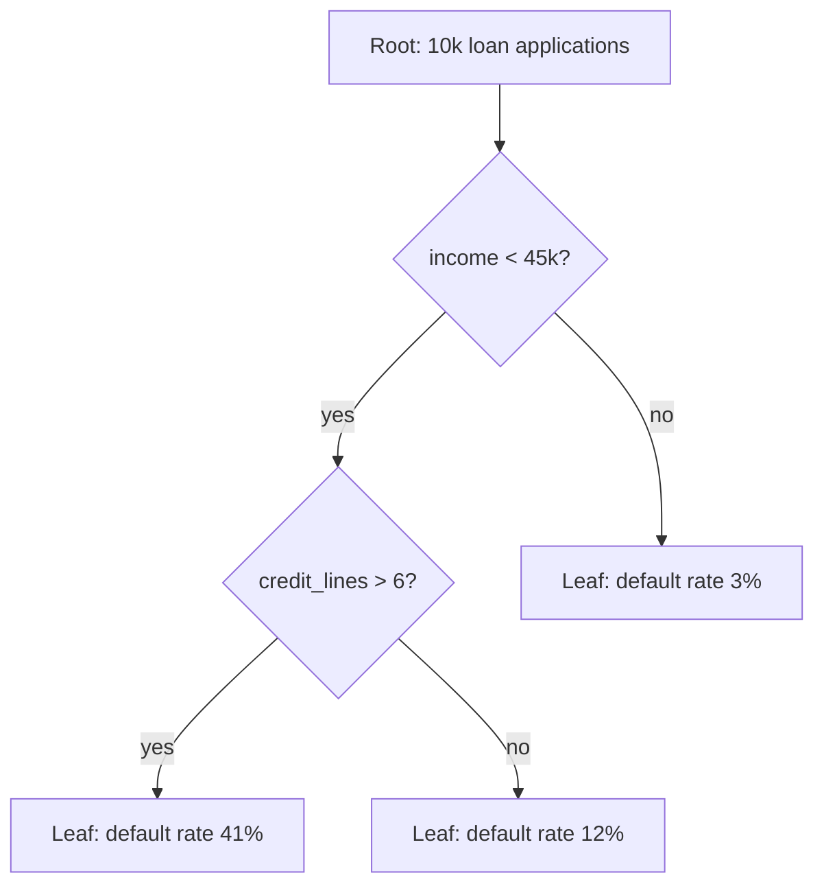

# Decision Trees

## TL;DR
A decision tree recursively splits the feature space into axis-aligned boxes, choosing at each node the
split that most reduces impurity, and predicts a constant inside each box. It is the weak learner that
every serious tabular model (random forest, XGBoost, LightGBM) is built from. Alone it is high-variance
and overfits; its value is interpretability and being a perfect base learner for ensembles.

## Intuition
Think of a game of twenty questions where each question must be of the form "is feature $x_j$ less than
$t$?". You want the question that splits the remaining crowd into the two purest possible groups. Ask it,
then repeat inside each group. When a group is pure enough or too small, stop and answer with the majority
label (or the mean) of whoever is left.

That greedy "best question now" rule is the whole algorithm. It never looks ahead, which is why a tree can
be badly suboptimal and why the optimal tree problem is NP-hard.

## The maths

### Impurity
Let node $m$ contain $N_m$ samples. For classification with $K$ classes, let
$$
p_{mk} = \frac{1}{N_m} \sum_{i \in m} \mathbb{1}[y_i = k]
$$
be the proportion of class $k$ in node $m$.

**Gini impurity** — expected error rate if you labelled a random sample by drawing from the node's own
label distribution:
$$
H_{\text{Gini}}(m) = \sum_{k=1}^{K} p_{mk}(1 - p_{mk}) = 1 - \sum_{k=1}^{K} p_{mk}^2
$$

**Entropy** — expected surprise in bits:
$$
H_{\text{ent}}(m) = -\sum_{k=1}^{K} p_{mk} \log_2 p_{mk}
$$

For regression, impurity is the within-node variance:
$$
H_{\text{reg}}(m) = \frac{1}{N_m}\sum_{i \in m}(y_i - \bar{y}_m)^2, \qquad \bar{y}_m = \frac{1}{N_m}\sum_{i\in m} y_i
$$

### The split criterion
A candidate split $s$ on feature $j$ at threshold $t$ sends node $m$ into left child $L$ with $N_L$
samples and right child $R$ with $N_R$ samples. The **impurity decrease** is
$$
\Delta(s) = H(m) - \frac{N_L}{N_m}H(L) - \frac{N_R}{N_m}H(R)
$$
and CART picks $\arg\max_{j,t} \Delta$. For entropy this quantity is exactly the **information gain**,
i.e. the mutual information between the split indicator and the label.

Gini and entropy agree in ranking splits the vast majority of the time. Entropy is slightly more
expensive (a log per class) and slightly more willing to split off small pure groups; Gini is the
scikit-learn default for that reason. Neither choice is usually worth tuning.

### Why the tree predicts a constant
Within a leaf the model minimises the same loss it split on. Squared error in a leaf is minimised by the
mean, so $\hat{y}_{\text{leaf}} = \bar{y}_m$. Misclassification / log-loss in a leaf is minimised by the
class proportions, so $\hat{p}_{\text{leaf}} = p_{mk}$. This "fit a constant per region" fact is what
gradient boosting generalises — see [[gradient-boosting]].

### Cost-complexity pruning
Grow the tree fully, then shrink it. For subtree $T$ with $|T|$ leaves,
$$
R_\alpha(T) = \sum_{m \in \text{leaves}(T)} N_m H(m) + \alpha |T|
$$
Increasing $\alpha$ trades fit against size and traces out a finite nested sequence of subtrees; pick
$\alpha$ by cross-validation. In scikit-learn this is `ccp_alpha`, and `cost_complexity_pruning_path`
gives you the candidate values.

### Complexity
Sorting each feature once costs $O(nd\log n)$; a level of the tree then costs $O(nd)$ to scan. A balanced
tree of depth $D$ is therefore $O(nd\log n + ndD)$. Prediction is $O(D)$ — a handful of comparisons.

## Diagram



## Code

```python
import numpy as np
from sklearn.datasets import make_classification
from sklearn.model_selection import train_test_split
from sklearn.tree import DecisionTreeClassifier, export_text

X, y = make_classification(n_samples=4000, n_features=12, n_informative=5, random_state=0)
Xtr, Xte, ytr, yte = train_test_split(X, y, test_size=0.25, random_state=0, stratify=y)

# Unconstrained tree: memorises the training set.
full = DecisionTreeClassifier(random_state=0).fit(Xtr, ytr)
print("full  train/test:", full.score(Xtr, ytr), full.score(Xte, yte))

# Constrained tree: the only knobs that matter much.
small = DecisionTreeClassifier(
    max_depth=5,
    min_samples_leaf=50,
    class_weight=None,
    random_state=0,
).fit(Xtr, ytr)
print("small train/test:", small.score(Xtr, ytr), small.score(Xte, yte))

# Cost-complexity pruning path, picked by CV.
from sklearn.model_selection import cross_val_score
path = DecisionTreeClassifier(random_state=0).cost_complexity_pruning_path(Xtr, ytr)
alphas = path.ccp_alphas[:-1][::max(1, len(path.ccp_alphas) // 20)]
scores = [
    cross_val_score(DecisionTreeClassifier(ccp_alpha=a, random_state=0), Xtr, ytr, cv=5).mean()
    for a in alphas
]
best_alpha = alphas[int(np.argmax(scores))]
print("best ccp_alpha:", best_alpha)

print(export_text(small, max_depth=2))
```

Computing impurity decrease by hand, to make the formula concrete:

```python
def gini(y):
    if len(y) == 0:
        return 0.0
    p = np.bincount(y, minlength=2) / len(y)
    return 1.0 - (p ** 2).sum()

def best_split(x, y):
    order = np.argsort(x)
    x, y = x[order], y[order]
    parent, n, best = gini(y), len(y), (None, -np.inf)
    for i in range(1, n):
        if x[i] == x[i - 1]:            # no valid threshold between equal values
            continue
        gain = parent - (i / n) * gini(y[:i]) - ((n - i) / n) * gini(y[i:])
        if gain > best[1]:
            best = ((x[i] + x[i - 1]) / 2, gain)
    return best

print(best_split(Xtr[:, 0], ytr))
```

## In practice
- **Use it when:** you need a genuinely explainable model a risk or compliance team will sign off on, a
  fast baseline on tabular data, or a base learner inside an ensemble. A depth-3 tree is also a great
  *segmentation* tool: use its leaves as human-readable customer buckets.
- **Defaults that work:** `max_depth=4..8`, `min_samples_leaf` around 1–2% of rows, `criterion='gini'`.
  Set `min_samples_leaf` rather than fiddling with `max_leaf_nodes` first — it directly bounds variance.
- **Breaks when:** the true boundary is diagonal or smooth (a tree approximates $x_1 + x_2 > c$ with a
  staircase of many splits); features are high-cardinality categoricals (impurity criteria are biased
  towards them); data is high-dimensional and sparse, e.g. text — use linear models there.
- **Cost / latency:** training is cheap and embarrassingly parallel over features; inference is a few
  branch comparisons, so single trees serve in microseconds and export cleanly to SQL or a rules engine.

> [!warning]
> Tree feature importance in scikit-learn (`feature_importances_`) is *mean impurity decrease*, which is
> biased toward high-cardinality and continuous features. Use permutation importance or SHAP for anything
> you will show a stakeholder — see [[model-interpretability-shap-lime]].

## Interview angle

**Q. Why does a single decision tree overfit so badly?**
Because the greedy search has enormous capacity relative to any regularisation. Grown unconstrained, it
keeps splitting until every leaf is pure, which means it can represent an arbitrary labelling of the
training set — zero bias, enormous variance. Small changes in the data change an early split, and because
splits are chosen sequentially, one changed split rewrites the whole subtree below it. That instability is
exactly what bagging exploits.

**Follow-up.** So how do you control it? → Two families: pre-pruning (`max_depth`, `min_samples_leaf`,
`min_impurity_decrease`) which stops growth early and is cheap but myopic — it can miss a bad split that
enables a great one beneath it; and post-pruning (cost-complexity, `ccp_alpha`) which grows fully then
prunes back on a validation criterion and is generally better but slower.

**Q. Gini vs entropy — which do you use?**
Practically it rarely matters; they agree on most splits and both are concave functions of the class
proportions that peak at a uniform distribution. Gini is $1 - \sum p_k^2$ and cheaper (no log); entropy is
$-\sum p_k \log p_k$ and is the criterion whose gain equals mutual information, so it is what you quote
when the interviewer wants the information-theoretic framing. I'd spend my tuning budget on depth and leaf
size instead.

**Q. Do you need to scale features for a tree?**
No. Splits are chosen by threshold on a single feature, and any monotone transform of that feature
produces the same ordering, hence the same candidate splits and the same tree. This is a genuine
advantage over distance- and gradient-based models — contrast [[feature-scaling-and-transforms]].

**Follow-up.** Does that mean transforms are useless for trees? → Monotone ones on inputs, yes. But
transforming the *target* (log of a skewed revenue target) changes the squared-error objective and
absolutely matters, and creating new features like ratios does too, because a tree cannot form $a/b$ by
itself without a deep staircase.

**Q. How does a tree handle missing values?**
CART's classical answer is surrogate splits: find another feature whose split best mimics the primary
split, and route missing rows by it. scikit-learn historically required imputation; modern boosting
libraries instead learn a default direction per node from the data, which is simpler and usually better —
see [[xgboost-deep-dive]] and [[missing-data-handling]].

**Q. A tree gives you a probability. Is it calibrated?**
Poorly, especially a deep one. Leaf proportions from pure leaves collapse to 0 and 1, so the model is
massively overconfident. Shallow trees are better but coarse. If the probability itself is the product,
calibrate — see [[probability-calibration]].

## Traps
- **"Trees are non-parametric so they can model anything."** They can model any axis-aligned partition.
  A 45-degree boundary needs a staircase of many splits, and extrapolation beyond the training range is
  flat — a tree will never predict a value outside the range of the training targets. That last point kills
  naive tree-based forecasting of a trending series; see [[time-series-forecasting]].
- **"Feature importance tells me what drives the outcome."** It tells you what the tree used, which is
  confounded by cardinality, correlation (two correlated features split the credit) and impurity bias.
  It is not causal — see [[causal-inference-basics]].
- **"Deeper is more accurate."** Deeper is lower-bias and higher-variance. Past the sweet spot, test error
  rises while train error keeps falling — the textbook picture in [[learning-curves-and-diagnostics]].
- **Pruning by looking at test performance.** If you choose `ccp_alpha` by test score, the test score is no
  longer an unbiased estimate. Use a validation fold or nested CV — see [[cross-validation]].
- **Assuming one tree explains the forest.** Plotting one tree out of a 500-tree random forest and calling
  it "the model's logic" is wrong; the forest's prediction is an average over 500 differently-shaped trees.

## Flashcards
What quantity does CART maximise at each split?::The weighted impurity decrease $H(m) - \frac{N_L}{N_m}H(L) - \frac{N_R}{N_m}H(R)$, searched greedily over all features and thresholds.
Write Gini impurity.::$1 - \sum_k p_k^2$, the expected error of labelling a random sample from the node's own class distribution.
Why is feature scaling unnecessary for trees?::Splits depend only on the ordering of a feature's values, and monotone transforms preserve ordering.
What does `ccp_alpha` control?::Cost-complexity pruning — the penalty $\alpha$ per leaf in $R_\alpha(T) = \sum N_m H(m) + \alpha|T|$; larger $\alpha$ gives smaller trees.
Why can't a tree extrapolate?::Every prediction is a leaf constant computed from training targets, so predictions are bounded by the training target range.
What is the main bias in scikit-learn's `feature_importances_`?::Mean-impurity-decrease importance favours continuous and high-cardinality features; prefer permutation importance or SHAP.
Is finding the optimal decision tree tractable?::No — it is NP-hard, which is why CART is greedy and why ensembles exist to repair greedy mistakes.

## Related
- [[random-forest]] — averaging many decorrelated trees to kill the variance
- [[bagging-vs-boosting]] — the two ways to combine trees, and when each wins
- [[gradient-boosting]] — trees fit sequentially to the gradient of a loss
- [[overfitting-and-underfitting]] — the failure mode a single tree exemplifies
- [[model-interpretability-shap-lime]] — what to use instead of impurity importance
- [[moc-classical-ml]] — map of this domain
