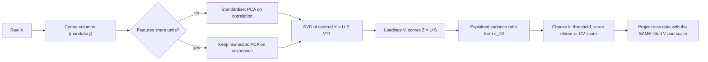

# Dimensionality Reduction — PCA

## TL;DR
PCA finds orthogonal directions of maximum variance. Equivalently, it is the SVD of the *centred* data
matrix, and equivalently it is the best rank-$k$ linear reconstruction in squared error. Centre always,
scale unless your features share units, and read the explained-variance ratio to choose $k$. It is
unsupervised, so a high-variance direction is not necessarily a predictive one.

## Intuition
A cloud of points shaped like a flattened cigar in 3-D. Its length carries most of the spread, its width
some, its thickness almost none. PCA finds those three axes in order and lets you throw away the
thickness, keeping nearly all the information in two numbers instead of three. The axes are found by the
data, not chosen by you, and they are always mutually perpendicular.

## The maths

Let $X \in \mathbb{R}^{n\times d}$ with rows $x_i^\top$ and columns already **centred**
($\frac1n\sum_i x_i = 0$). Write the sample covariance $\Sigma = \frac{1}{n-1}X^\top X$.

### Derivation 1 — variance maximisation
Find the unit vector $w$ maximising the variance of the projection $z_i = w^\top x_i$:

$$
\operatorname{Var}(w^\top x) = \frac{1}{n-1}\sum_i (w^\top x_i)^2 = w^\top \Sigma\, w
$$

Maximise subject to $\lVert w\rVert_2 = 1$ (without the constraint you could scale $w$ up forever). The
Lagrangian is $\mathcal{L} = w^\top\Sigma w - \lambda(w^\top w - 1)$, so

$$
\frac{\partial \mathcal{L}}{\partial w} = 2\Sigma w - 2\lambda w = 0
\quad \Longrightarrow \quad \Sigma w = \lambda w
$$

$w$ must be an **eigenvector** of $\Sigma$, and the variance attained is
$w^\top\Sigma w = \lambda w^\top w = \lambda$. So the maximiser is the eigenvector with the largest
eigenvalue. Subsequent components repeat this subject to orthogonality to the previous ones, giving the
eigenvectors in descending eigenvalue order. This is the derivation to be able to produce on a whiteboard
([[lagrange-multipliers-and-constraints]]).

### Derivation 2 — SVD of the centred matrix
Write the thin SVD $X = U S V^\top$ with $U^\top U = V^\top V = I$ and $S = \mathrm{diag}(s_1 \ge \dots \ge s_r)$.
Then

$$
\Sigma = \frac{X^\top X}{n-1} = \frac{V S U^\top U S V^\top}{n-1} = V \frac{S^2}{n-1} V^\top
$$

which *is* the eigendecomposition of $\Sigma$. Therefore:

- The **right singular vectors** $V$ are the principal directions (loadings).
- $\lambda_j = s_j^2/(n-1)$ — eigenvalues are scaled squared singular values.
- The **scores** (projected coordinates) are $Z = XV = US$.

This is not just an alternative proof; it is how PCA is actually computed. Forming $X^\top X$ squares the
condition number and loses precision, so every real implementation runs SVD on $X$ directly. Randomised
SVD gets the top $k$ components in roughly $O(ndk)$ without touching the rest
([[eigen-decomposition-and-svd]]).

### Derivation 3 — optimal linear reconstruction
By Eckart–Young, the rank-$k$ matrix minimising $\lVert X - \hat X\rVert_F^2$ is the truncated SVD
$X_k = U_k S_k V_k^\top$. Reconstructing from $k$ components gives error

$$
\lVert X - X_k \rVert_F^2 = \sum_{j > k} s_j^2 = (n-1)\sum_{j>k}\lambda_j
$$

So "maximise retained variance" and "minimise squared reconstruction error" are the same statement:
total variance $\sum_j \lambda_j$ splits into kept and discarded parts. This is the cleanest way to
explain PCA to someone who finds eigenvectors abstract.

### Explained variance ratio

$$
\mathrm{EVR}_j = \frac{\lambda_j}{\sum_{l=1}^{d}\lambda_l}, \qquad
\text{cumulative EVR}(k) = \frac{\sum_{j\le k}\lambda_j}{\sum_l \lambda_l}
$$

Choose $k$ by a cumulative threshold (90%, 95%), by the scree-plot elbow, or — better than either — by
downstream validation score. Kaiser's rule ($\lambda > 1$ on standardised data) is common and crude.

### Why scaling matters — and when it does not
$\Sigma$ is a covariance matrix, so it inherits the units of your features. A variable measured in rupees
has variance $10^6$ times one measured in lakhs and will dominate PC1 regardless of its importance. Two
regimes:

- **Different units** (age, income, counts): standardise first. PCA on the correlation matrix.
- **Same units and comparable meaning** (pixel intensities, spectra, all-log-returns): do *not*
  standardise — the relative variances are real information.

Centring, by contrast, is never optional. Skip it and the first component points at the data's mean
vector rather than at its direction of spread.

### Whitening
$Z_{\text{white}} = Z \Lambda^{-1/2}$ makes components unit-variance and uncorrelated. Useful when a
downstream method assumes isotropy, harmful when it amplifies noise: the smallest $\lambda_j$ get divided
by the smallest numbers, so trailing components become pure amplified noise. `whiten=True` with all
components is usually a mistake.

### Relatives worth naming
- **Kernel PCA**: run PCA in an RBF/polynomial feature space using the centred kernel matrix — nonlinear
  components, but $O(n^2)$ memory ([[support-vector-machines]] for the kernel idea).
- **Truncated SVD / LSA**: SVD *without* centring, so it works on sparse matrices (TF-IDF) where
  centring would destroy sparsity. Strictly this is not PCA.
- **PLS / LDA**: supervised — they find directions maximising covariance with $y$ or class separation,
  which is what you want when PCA discards the discriminative direction.
- **NMF**: non-negative factors, giving parts-based, more interpretable components for counts.

## Diagram



## Code

```python
import numpy as np
from sklearn.datasets import load_breast_cancer
from sklearn.decomposition import PCA
from sklearn.preprocessing import StandardScaler

X, y = load_breast_cancer(return_X_y=True)
Xs = StandardScaler().fit_transform(X)        # different units -> standardise

pca = PCA().fit(Xs)
evr = pca.explained_variance_ratio_
print("EVR of first 5:", evr[:5].round(4))
print("components for 95% variance:", np.searchsorted(np.cumsum(evr), 0.95) + 1)
```

PCA from SVD by hand — the identity worth verifying once:

```python
Xc = Xs - Xs.mean(axis=0)                     # already centred by StandardScaler, but be explicit
U, S, Vt = np.linalg.svd(Xc, full_matrices=False)

eig_from_svd = S ** 2 / (len(Xc) - 1)
print("eigenvalues match:", np.allclose(eig_from_svd, pca.explained_variance_))
print("loadings match up to sign:",
      np.allclose(np.abs(Vt), np.abs(pca.components_), atol=1e-8))

scores = U * S                                # == Xc @ Vt.T
print("scores match:", np.allclose(np.abs(scores), np.abs(pca.transform(Xs)), atol=1e-8))
# Sign is arbitrary: (-w) is as valid an eigenvector as w. Never interpret a sign in isolation.
```

Reconstruction error equals discarded variance:

```python
k = 5
Xk = pca.transform(Xs)[:, :k] @ pca.components_[:k]     # back-project
err = ((Xc - Xk) ** 2).sum()
print("reconstruction error:", round(err, 4))
print("discarded variance  :", round((len(Xc) - 1) * pca.explained_variance_[k:].sum(), 4))
```

Inside a pipeline — the only correct place for it:

```python
from sklearn.linear_model import LogisticRegression
from sklearn.model_selection import GridSearchCV, StratifiedKFold
from sklearn.pipeline import Pipeline

pipe = Pipeline([
    ("scale", StandardScaler()),
    ("pca",   PCA(svd_solver="randomized", random_state=0)),
    ("clf",   LogisticRegression(max_iter=2000)),
])
gs = GridSearchCV(pipe, {"pca__n_components": [2, 5, 10, 20, 0.95]},
                  cv=StratifiedKFold(5, shuffle=True, random_state=0), scoring="roc_auc", n_jobs=-1)
gs.fit(X, y)
print(gs.best_params_, round(gs.best_score_, 4))
# n_components as a float means "smallest k reaching this cumulative EVR".
# Fitting the scaler or PCA outside this pipeline would leak - see data-leakage.
```

The counterexample to keep in your pocket — PCA discarding the signal:

```python
rng = np.random.default_rng(0)
n = 4000
signal = rng.normal(0, 0.3, n)                 # small variance, but it IS the label
noise   = rng.normal(0, 10.0, n)               # huge variance, irrelevant
Xd = np.c_[signal + 0.01 * noise, noise, rng.normal(0, 8, n)]
yd = (signal > 0).astype(int)

p1 = PCA(n_components=1).fit(Xd)
print("PC1 loadings:", p1.components_.round(3))   # dominated by the noise axes
from sklearn.model_selection import cross_val_score
print("AUC on PC1      :", cross_val_score(LogisticRegression(), p1.transform(Xd), yd,
                                           cv=5, scoring="roc_auc").mean().round(3))
print("AUC on raw feats:", cross_val_score(LogisticRegression(), Xd, yd,
                                           cv=5, scoring="roc_auc").mean().round(3))
```

## In practice
- **Use it when:** features are numerous and correlated; you need to decorrelate before a method that
  suffers from multicollinearity; you want to compress embeddings for a vector index; you need 2-D
  visualisation as a first look; or you want to denoise by discarding low-variance components.
- **Defaults that work:** standardise unless units are shared; `svd_solver='randomized'` when $d$ is large
  and you want the top $k$; choose $k$ by cross-validated downstream score rather than by a variance
  threshold whenever a downstream task exists; always inside a `Pipeline`.
- **Breaks when:** the relationship is nonlinear (PCA is a rotation — use kernel PCA, an autoencoder, or
  UMAP for visualisation); variance and signal are unaligned (use PLS or LDA); features are sparse
  (centring destroys sparsity — use `TruncatedSVD`); or interpretability is required, because a component
  is a dense linear combination of every original feature and rarely means anything. `SparsePCA` trades
  some variance for readable loadings.
- **Cost / latency:** full SVD is $O(\min(n^2 d, nd^2))$; randomised SVD for the top $k$ is about
  $O(ndk)$. `IncrementalPCA` streams batches; Spark's `ml.feature.PCA` handles distributed data, though
  for very wide data a randomised sketch is usually faster. At inference PCA is a single matrix multiply —
  essentially free — and reduces every downstream cost, which is why cutting a 768-dim embedding to 128
  is a common, cheap production win.

> [!warning]
> The component signs are arbitrary — an eigenvector and its negation are both valid — and can flip
> between runs, library versions, or retrains. Never write business logic on the sign of a loading, and
> if you plot PC1 across two model versions, expect the picture to mirror.

## Interview angle

**Q. Derive PCA.**
Maximise $w^\top\Sigma w$ subject to $\lVert w\rVert = 1$. The Lagrangian gives $\Sigma w = \lambda w$, so
the optimal direction is an eigenvector of the covariance matrix and the variance it captures is its
eigenvalue $\lambda$. Take eigenvectors in descending eigenvalue order, each orthogonal to the previous.
Equivalently, by SVD $X = USV^\top$ on centred $X$: $V$ holds the directions, $\lambda_j = s_j^2/(n-1)$,
and scores are $US$. That is also the computationally stable route, since forming $X^\top X$ squares the
condition number.

**Follow-up.** And the third characterisation? → Eckart–Young: the truncated SVD is the best rank-$k$
approximation in Frobenius norm, so PCA also minimises squared reconstruction error. Maximising retained
variance and minimising reconstruction error are the same optimisation.

**Q. Why must you centre, and why usually scale?**
Centring: without it, the first component points toward the mean vector rather than the direction of
maximal spread, because $X^\top X$ is then a second-moment matrix, not a covariance matrix. Scaling: the
covariance matrix carries units, so a feature with a large numeric range dominates PC1 for reasons that
have nothing to do with information content. Skip scaling only when features share units and their
relative variances are genuinely meaningful.

**Q. How many components do you keep?**
If there is a downstream task, cross-validate $k$ — it is the only criterion that measures the thing you
care about. Otherwise: cumulative explained variance at 90–95%, or the scree-plot elbow. I would not use
Kaiser's $\lambda > 1$ rule as anything more than a sanity check.

**Q. Can PCA hurt a classifier?**
Yes, and this is the point people miss. PCA is unsupervised: it ranks directions by variance, not by
relationship to $y$. If the discriminative direction has small variance — a subtle signal on top of a
noisy high-variance feature — PCA will discard it first. The fix is supervised reduction (PLS, LDA) or
supervised feature selection. I can construct a two-line example where dropping to PC1 takes AUC from
0.95 to 0.5.

**Q. PCA vs t-SNE/UMAP?**
Different purposes. PCA is linear, deterministic, invertible, preserves global structure and gives you a
transform you can apply to new data — so it is the right tool for preprocessing and compression. t-SNE
and UMAP are nonlinear, stochastic, and optimised for *local* neighbourhood preservation — good for
visualisation, dangerous as features, and their inter-cluster distances are not meaningful
([[tsne-and-umap]]).

**Q. Are principal components interpretable?**
Rarely. Each is a dense linear combination of all $d$ features, and the signs are arbitrary. Sometimes PC1
has a clear reading ("overall size" in morphometrics, "market factor" in returns), but claiming
interpretability by default is a mistake. `SparsePCA` or factor rotation (varimax) buys readability at
some cost in retained variance.

**Q. PCA on 500M rows in Databricks?**
Randomised or incremental SVD, not a full eigendecomposition. `IncrementalPCA` if it streams through one
node; `pyspark.ml.feature.PCA` for distributed data. Critically, fit the scaler and PCA on the training
split only and persist both in the MLflow model so scoring applies exactly the same transform — a PCA
refitted at scoring time is a silent [[training-serving-skew]] bug.

## Traps
- **Forgetting to centre.** PC1 then points at the mean, not at the spread.
- **Not scaling features with different units.** PC1 becomes "whichever column has the biggest numbers".
- **Fitting PCA on the full dataset before splitting.** Leaks test-set covariance structure into training.
- **Assuming high variance means high information.** The counterexample is two lines of code.
- **Interpreting component signs or loadings as causal.** Signs are arbitrary; loadings are dense.
- **Using PCA on one-hot categorical data.** Binary indicator variance is a function of category
  frequency, so PC1 tracks how common categories are. Use MCA or target encoding.
- **Whitening with all components.** Divides the tiniest eigenvalues by themselves, amplifying pure noise.
- **Calling `TruncatedSVD` PCA.** It skips centring — necessary for sparse data, but a different transform.
- **Refitting PCA at scoring time.** Different components, silently different features.

## Flashcards
Derive the PCA objective's solution.::Maximise $w^\top\Sigma w$ s.t. $\lVert w\rVert=1$; the Lagrangian gives $\Sigma w = \lambda w$, so $w$ is the top eigenvector and the captured variance is $\lambda$.
Relate PCA to the SVD of the centred matrix.::$X = USV^\top$ gives $\Sigma = V\frac{S^2}{n-1}V^\top$; loadings are $V$, eigenvalues are $s_j^2/(n-1)$, scores are $US$.
What third characterisation does PCA have?::Best rank-k linear reconstruction in squared error (Eckart–Young) — maximising retained variance equals minimising reconstruction error.
Why compute PCA by SVD rather than eigendecomposing the covariance?::Forming $X^\top X$ squares the condition number and loses numerical precision.
When should you NOT standardise before PCA?::When all features share units and their relative variances are meaningful — pixels, spectra, returns.
Give a case where PCA hurts a classifier.::When the discriminative direction has low variance; PCA ranks by variance, not by relation to y, and discards it. Use PLS or LDA instead.
Why are PCA component signs meaningless?::An eigenvector and its negation are both valid solutions, so signs can flip between runs or library versions.
What is the difference between PCA and TruncatedSVD?::TruncatedSVD omits centring, so it works on sparse matrices; it is not strictly PCA.

## Related
- [[eigen-decomposition-and-svd]] — the linear algebra underneath
- [[tsne-and-umap]] — nonlinear reduction for visualisation
- [[curse-of-dimensionality]] — the problem PCA addresses
- [[feature-scaling-and-transforms]] — the prerequisite step
- [[feature-selection]] — the alternative that keeps original features
- [[lagrange-multipliers-and-constraints]] — the constrained-optimisation derivation
- [[clustering-kmeans]] — PCA as a preprocessing step for clustering
- [[autoencoders-and-representation-learning]] — the nonlinear generalisation
