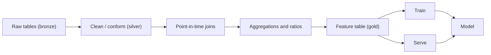

# Feature Engineering

## TL;DR
Feature engineering is encoding domain knowledge into the input space so the model does not have to
learn it from data it does not have. On tabular problems it moves the needle more than model choice:
a well-featured logistic regression routinely beats a raw-feature [[xgboost-deep-dive|XGBoost]]. The
hard part is not inventing features, it is computing them **at the same point in time in training
and in serving** without [[data-leakage|leaking]].

## Intuition
A model can only express relationships its hypothesis class can reach from the columns you gave it.
A tree can split on `amount` and on `avg_amount_30d`, but it cannot split on
`amount / avg_amount_30d` unless you compute it — a ratio needs an unbounded number of axis-aligned
splits to approximate. Feature engineering is handing the model the coordinate system in which the
boundary is simple.

## The maths
The learner searches a hypothesis space $\mathcal{H}$ over a representation $\phi(x)$. The achievable
risk is

$$
R^\star = \min_{h \in \mathcal{H}} \; \mathbb{E}_{(x,y)}\big[\,L(h(\phi(x)), y)\,\big]
$$

so $\phi$ bounds what any amount of capacity or tuning can reach. Changing $\phi$ changes $R^\star$;
changing hyperparameters only moves you within a fixed $R^\star$.

**Why ratios and interactions matter for trees.** A tree approximates the boundary
$x_1 / x_2 = c$ — a ray through the origin — by a staircase of axis-aligned rectangles. Error of a
depth-$d$ staircase on a diagonal boundary falls only as $O(2^{-d/p})$ in $p$ dimensions. Supplying
$x_1/x_2$ as a column makes the same boundary a single split.

**Target encoding as a shrunken posterior.** For a categorical level $c$ with $n_c$ rows and mean
target $\bar{y}_c$, the smoothed encoding is

$$
\text{enc}(c) = \frac{n_c \, \bar{y}_c + m \, \bar{y}}{n_c + m}
$$

where $\bar{y}$ is the global mean and $m > 0$ is a smoothing prior in units of "pseudo-rows". This is
the posterior mean of a Beta–Binomial with prior strength $m$; rare levels are pulled to the global
rate. Covered in depth in [[categorical-encoding]].

## Diagram



## Code

```python
import numpy as np
import pandas as pd

df = pd.DataFrame({
    "user_id": [1, 1, 1, 2, 2],
    "ts": pd.to_datetime(
        ["2026-01-01", "2026-01-05", "2026-01-09", "2026-01-02", "2026-01-06"]
    ),
    "amount": [100.0, 250.0, 80.0, 4000.0, 50.0],
})

df = df.sort_values(["user_id", "ts"])

# 1. Lagged / expanding aggregates. shift(1) is what makes it causal:
#    row t sees only rows strictly before t.
g = df.groupby("user_id")["amount"]
df["amt_mean_prior"] = g.transform(lambda s: s.shift(1).expanding().mean())
df["amt_max_prior"] = g.transform(lambda s: s.shift(1).expanding().max())

# 2. Ratio to own history — the feature a tree cannot build itself.
df["amt_over_mean"] = df["amount"] / df["amt_mean_prior"].replace(0, np.nan)

# 3. Recency.
df["days_since_prev"] = (
    df.groupby("user_id")["ts"].diff().dt.total_seconds() / 86400.0
)

# 4. Cyclical time encoding — hour 23 and hour 0 must be close.
hour = df["ts"].dt.hour
df["hour_sin"] = np.sin(2 * np.pi * hour / 24)
df["hour_cos"] = np.cos(2 * np.pi * hour / 24)

print(df[["user_id", "ts", "amount", "amt_mean_prior", "amt_over_mean"]])
```

PySpark equivalent, which is what the production version looks like on Databricks:

```python
from pyspark.sql import Window
from pyspark.sql import functions as F

w = (
    Window.partitionBy("user_id")
    .orderBy(F.col("ts").cast("long"))
    .rowsBetween(Window.unboundedPreceding, -1)   # strictly prior rows
)

feat = (
    events
    .withColumn("amt_mean_prior", F.avg("amount").over(w))
    .withColumn("amt_max_prior", F.max("amount").over(w))
    .withColumn("amt_over_mean", F.col("amount") / F.col("amt_mean_prior"))
)
```

The `rowsBetween(unboundedPreceding, -1)` is the whole safety argument: the current row is excluded,
so the feature cannot see its own outcome.

## In practice
- **Use it when:** always on tabular. The ROI ordering on a typical problem is
  data quality > features > model family > hyperparameters.
- **Defaults that work:** per-entity aggregates over multiple windows (7/30/90 day count, sum, mean,
  max, distinct-count); ratios of short window to long window; recency (`days_since_last_X`);
  counts of rare-event flags; cyclical encodings for hour/day-of-week; target encoding for
  high-cardinality IDs with out-of-fold fitting.
- **Breaks when:** the feature is not computable at prediction time, or is computable but with a
  different lag than in training — that is [[training-serving-skew]]. Also when you create thousands
  of features and let [[feature-selection]] run on the full dataset before splitting.
- **Cost / latency:** aggregate features need either a precomputed [[feature-stores|feature store]]
  or an online aggregation; a "30-day sum" that takes 400 ms to compute at request time is a
  latency budget problem, not a modelling problem. Decide batch vs on-demand per feature.

> [!warning]
> The single most common interview red flag is a candidate describing a beautiful feature and being
> unable to answer "and at scoring time, where does that number come from?"

## Interview angle

**Q. You have a churn model. Name five features you would build and say why.**
Recency (`days_since_last_login`) — churn is mostly a recency story. Trend
(`sessions_7d / sessions_30d`) — a ratio below 1 means decay, and it normalises away the user's
baseline activity level. Monetary (`avg_ticket_30d`, `refund_rate_90d`). Support friction
(`n_tickets_30d`, `time_to_first_response`). Tenure and lifecycle stage, because the churn hazard is
not flat over tenure. Each one I would compute with a point-in-time join as of the prediction date.

**Follow-up.** Why the ratio rather than both raw counts? → The model can learn the ratio from the two
counts only with many splits, and the ratio generalises across users with very different absolute
volumes. I would still keep both raw counts — the ratio is lossy about scale.

**Q. How do you build features without leaking?**
Every feature is defined as a function of data with timestamp strictly less than the prediction
timestamp, and I enforce that with a point-in-time (as-of) join rather than a plain key join. In
Spark that is a window frame ending at `-1` row or a range frame ending just before the event time.
Then all fitted transforms — scalers, encoders, imputers — go inside a `Pipeline` that is fit on
train folds only. See [[data-leakage]].

**Q. Do deep models make feature engineering obsolete?**
On perceptual data (images, audio, raw text) yes, largely — that is the point of representation
learning. On tabular business data, no: the signal usually lives in cross-row aggregates over
entity history, which no architecture recovers from a single flat row. Published tabular benchmarks
keep finding gradient-boosted trees on engineered features competitive with or better than deep
tabular models at typical enterprise data sizes.

**Follow-up.** What changes that? → Very large datasets with rich sequential structure, where you can
feed the raw event sequence to a sequence model and let it learn the aggregates. Then the "features"
become the tokenisation scheme.

**Q. How do you decide which of 800 candidate features to keep?**
Start with a cheap filter (drop zero-variance, drop near-duplicate correlated pairs), then an
embedded method — L1 or GBM gain — measured **inside** cross-validation, then check stability of the
selected set across folds. I care about the stable set, not the single best fold. Permutation
importance on a held-out set for the final sanity check, understanding that correlated features
split credit. Details in [[feature-selection]] and [[model-interpretability-shap-lime]].

## Traps
- **"More features is always better."** Wrong: irrelevant features raise variance and, worse, raise
  the chance that one of them is a leak. Each added feature is a maintenance and monitoring
  liability in production.
- **Fitting the encoder/scaler on the full dataset then splitting.** Wrong order. The statistics
  carry test information into training. Fit inside the [[cross-validation|CV]] loop.
- **"I one-hot encoded the 50,000 user IDs."** That is a sparse matrix nobody can train on and it
  memorises identity. Use target encoding with out-of-fold fitting, hashing, or an embedding.
- **Standardising features for a tree model.** Harmless but pointless — trees are invariant to
  monotone transforms of a single feature. Don't claim it helped.
- **Computing "total lifetime spend" as a feature for an event at time $t$.** If "lifetime" includes
  spend after $t$, the model is reading the future. This is the classic silent leak.
- **Ignoring the serving path.** A feature that requires a 6-table join over 2 years of history is
  fine offline and impossible at 50 ms p99.

## Flashcards
What does feature engineering change that hyperparameter tuning cannot::The achievable minimum risk R* of the hypothesis class over the representation — tuning only moves you within a fixed representation.
Why supply x1/x2 explicitly to a tree model::Trees make axis-aligned splits, so a ratio boundary needs an exponential staircase of splits to approximate; given as a column it is one split.
The smoothed target-encoding formula::enc(c) = (n_c * ybar_c + m * ybar) / (n_c + m), the posterior mean with prior strength m pseudo-rows.
Why encode hour as sin and cos::So that hour 23 and hour 0 are adjacent in the feature space instead of maximally distant.
What makes a window aggregate causal in Spark::A frame ending at -1 (rowsBetween unboundedPreceding to -1), which excludes the current row.
The one question to answer for every feature before shipping it::At scoring time, where does this number come from and with what lag?

## Related
- [[categorical-encoding]]
- [[feature-scaling-and-transforms]]
- [[feature-selection]]
- [[data-leakage]]
- [[feature-stores]]
- [[time-series-features-and-validation]]
- [[training-serving-skew]]
