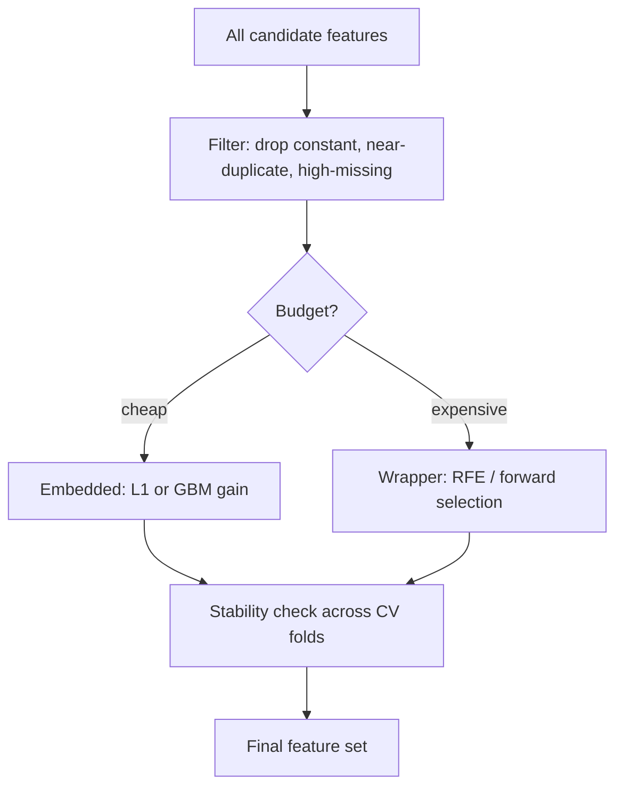

# Feature Selection

## TL;DR
Three families: **filter** (score each feature against the target, cheap, ignores interactions),
**wrapper** (search subsets by retraining, expensive, e.g. RFE), **embedded** (the model selects while
fitting — L1, tree gain). On tabular problems with a GBM, selection is mostly about maintenance cost,
stability and leak-surface, not accuracy. The one rule that decides pass/fail in an interview: the
selection step must live **inside** the [[cross-validation]] loop.

## Intuition
Adding a pure-noise column never reduces training error and usually increases test error slightly —
the model spends capacity fitting the noise. But a modern regularised GBM shrugs off a few hundred
junk columns. The real reasons to cut features are: fewer things to compute at serving time, fewer
things to monitor for [[data-drift-and-concept-drift|drift]], fewer chances that one of them is a
leak, and a model a stakeholder can read.

## The maths

**Mutual information** — the standard filter score, because unlike Pearson correlation it captures
non-linear dependence:

$$
I(X; Y) = \sum_{x}\sum_{y} p(x,y) \, \log \frac{p(x,y)}{p(x)\,p(y)} = H(Y) - H(Y \mid X)
$$

with $H$ the entropy. $I = 0$ exactly when $X \perp Y$. Weakness: it is computed one feature at a
time, so it keeps 50 copies of the same signal and drops a feature that is only useful jointly
(the XOR feature has $I = 0$ with the target marginally).

**mRMR** fixes the redundancy half by scoring a candidate $f$ against the already-selected set $S$:

$$
\text{score}(f) = I(f; Y) \;-\; \frac{1}{|S|}\sum_{s \in S} I(f; s)
$$

**L1 (lasso) as embedded selection.** Minimise

$$
\hat{\beta} = \arg\min_{\beta} \; \frac{1}{2n}\|y - X\beta\|_2^2 + \lambda \|\beta\|_1
$$

The subgradient condition at $\beta_j = 0$ is $|x_j^\top (y - X\beta)/n| \le \lambda$, so any feature
whose correlation with the current residual is below $\lambda$ stays exactly zero. That threshold —
a *kink* in the penalty at zero, which L2 does not have — is why L1 gives sparsity and L2 does not.
See [[regularization-l1-l2]].

**Permutation importance** is a model-agnostic wrapper-flavoured measure. For feature $j$:

$$
\text{PI}_j = \frac{1}{K}\sum_{k=1}^{K} L\big(y, \hat{f}(X^{(\pi_j^k)})\big) \;-\; L\big(y, \hat{f}(X)\big)
$$

where $X^{(\pi_j^k)}$ is $X$ with column $j$ randomly permuted. Measured on **held-out** data it
answers "how much does the fitted model rely on this column"; measured on train it measures
memorisation. Correlated features share credit, so both can score near zero while the pair is
essential.

## Diagram



## Code

```python
import numpy as np
from sklearn.datasets import make_classification
from sklearn.pipeline import Pipeline
from sklearn.preprocessing import StandardScaler
from sklearn.feature_selection import SelectKBest, mutual_info_classif
from sklearn.linear_model import LogisticRegression
from sklearn.model_selection import cross_val_score, StratifiedKFold
from sklearn.inspection import permutation_importance

X, y = make_classification(
    n_samples=2000, n_features=60, n_informative=8, n_redundant=10, random_state=0
)

# CORRECT: selection is a pipeline step, so it is refit on each training fold only.
pipe = Pipeline([
    ("select", SelectKBest(mutual_info_classif, k=15)),
    ("scale", StandardScaler()),
    ("clf", LogisticRegression(max_iter=1000)),
])

cv = StratifiedKFold(5, shuffle=True, random_state=0)
print("honest CV:", cross_val_score(pipe, X, y, cv=cv, scoring="roc_auc").mean())

# WRONG: selecting once on all of X before CV. The score is optimistically biased
# because the selector saw the validation rows' labels.
sel = SelectKBest(mutual_info_classif, k=15).fit(X, y)
X_leaky = sel.transform(X)
leaky_pipe = Pipeline([("scale", StandardScaler()),
                       ("clf", LogisticRegression(max_iter=1000))])
print("leaky CV:", cross_val_score(leaky_pipe, X_leaky, y, cv=cv, scoring="roc_auc").mean())
```

Stability + permutation importance on a held-out split:

```python
from sklearn.model_selection import train_test_split
from sklearn.ensemble import RandomForestClassifier

Xtr, Xte, ytr, yte = train_test_split(X, y, test_size=0.3, stratify=y, random_state=0)
rf = RandomForestClassifier(n_estimators=300, random_state=0).fit(Xtr, ytr)

pi = permutation_importance(rf, Xte, yte, n_repeats=20,
                            scoring="roc_auc", random_state=0)
order = np.argsort(-pi.importances_mean)[:10]
for j in order:
    print(f"f{j:<3} {pi.importances_mean[j]:+.4f} +/- {pi.importances_std[j]:.4f}")
```

A feature whose mean importance is within one standard deviation of zero is not evidence of
anything.

## In practice
- **Use it when:** you have more features than you can monitor, features that are expensive to
  compute at serving time, a linear model where multicollinearity destroys coefficient
  interpretability, or $p \gg n$ (genomics-style).
- **Defaults that work:** drop constants and >95%-missing columns; drop one of each pair with
  $|\rho| > 0.95$; fit a GBM, take features with non-zero split gain, then re-fit; check that the
  chosen set is stable across folds (selected in $\ge 4/5$ folds). For linear models, L1 or
  elastic-net with the penalty tuned in the same CV.
- **Breaks when:** features are strongly correlated (importance is split arbitrarily, so both look
  unimportant), when the target relationship is an interaction invisible marginally, and whenever
  selection happens outside the CV loop — that inflates CV scores by several points and is the most
  common source of "my CV was 0.89, production is 0.71".
- **Cost / latency:** RFE with $p$ features costs $O(p)$ model fits (or $O(p/\text{step})$);
  exhaustive subset search is $2^p$ and never worth it. Filters are one pass. Embedded is free.

## Interview angle

**Q. Walk me through the three families of feature selection.**
Filter methods score each feature against the target independently of any model — variance
threshold, chi-square, mutual information, ANOVA F. Cheap and model-agnostic, but blind to
redundancy and to interactions. Wrapper methods search subsets by actually retraining — forward
selection, backward elimination, RFE. They optimise the thing you care about but cost many fits and
overfit the validation set if the search is long. Embedded methods select as a side effect of
fitting: L1 drives coefficients exactly to zero, tree ensembles assign zero gain to unused features.
In practice I use a cheap filter to cut obvious junk, then embedded, then validate stability.

**Follow-up.** Why does L1 give exact zeros and L2 not? → The L1 penalty is non-differentiable at
zero, so the optimum sits at the kink whenever $|x_j^\top r|/n \le \lambda$. L2's penalty is smooth
with zero gradient at zero, so it shrinks proportionally but never hits it.

**Q. Your CV AUC is 0.91 and production AUC is 0.74. Where do you look first?**
Selection or preprocessing fitted outside the CV loop, and time-based leakage. I would re-run with
every fitted step — imputer, scaler, encoder, selector — inside a `Pipeline` passed to
`cross_val_score`, and if the data is temporal, re-split by time rather than at random. Those two
account for most of the gap I have seen. Then check whether a feature is only available in the
training warehouse and arrives late in production.

**Q. You have a GBM. Do you even need feature selection?**
For accuracy, usually marginal — boosting already ignores useless splits. I do it for three other
reasons: serving cost (each feature is a computation and a dependency), monitoring cost (each
feature is a drift alert), and risk (each feature is a place a leak can hide). I would drop features
by measured value-per-cost, not by chasing a fourth decimal of AUC.

**Q. Gain importance says feature A is the most important. Permutation importance says it is
useless. What is going on?**
Most likely A is highly correlated with B. Gain gives A credit for splits it happened to win during
training; permutation lets the model fall back on B, so removing A's information costs nothing.
Either the pair matters and neither individually does, or gain is inflated by cardinality — gain and
split-count importances are biased toward high-cardinality and continuous features because they get
more candidate split points. I would confirm with a drop-column refit or grouped permutation on
{A, B} together.

## Traps
- **Selecting on the full dataset, then cross-validating.** The textbook leakage. Report a number
  that does not survive contact with production.
- **Using correlation with the target as the only filter.** Misses non-linear and interaction
  signal, and keeps redundant near-duplicates.
- **Reading `feature_importances_` from sklearn's tree models as truth.** That is impurity/gain
  importance: biased toward high-cardinality features, computed on training data.
- **"I removed features with p > 0.05 from a regression."** Stepwise selection by p-value invalidates
  the p-values themselves and is unstable under resampling.
- **Dropping a feature because its permutation importance is ~0 without checking correlation.**
  Correlated features mask each other.
- **Confusing selection with dimensionality reduction.** [[dimensionality-reduction-pca|PCA]] makes
  new features from all of them — it does not reduce what you must compute or monitor.

## Flashcards
The three families of feature selection::Filter (score vs target, model-free), wrapper (retrain on subsets, e.g. RFE), embedded (selection during fit, e.g. L1 or tree gain).
Why L1 yields exact zeros::Its penalty has a non-differentiable kink at zero, so the optimum sits there whenever the feature's correlation with the residual is below lambda.
What mutual information misses::Redundancy between features and pure interaction effects like XOR that have zero marginal dependence with the target.
Permutation importance on train vs test::On train it measures memorisation; on held-out data it measures how much the fitted model actually relies on the column.
Why two correlated features can both show ~0 permutation importance::Each can be permuted away because the model falls back on the other; test them as a group or by drop-column refit.
The rule that decides pass/fail on this topic::Selection must be refit inside every CV fold — do it once on the full data and your CV score is optimistically biased.

## Related
- [[feature-engineering]]
- [[regularization-l1-l2]]
- [[cross-validation]]
- [[data-leakage]]
- [[model-interpretability-shap-lime]]
- [[curse-of-dimensionality]]
- [[dimensionality-reduction-pca]]
