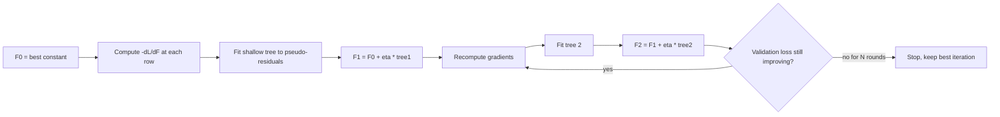

# Gradient Boosting

## TL;DR
Gradient boosting is gradient descent performed in *function space*: at each round you compute the negative
gradient of the loss with respect to the current predictions, fit a small tree to those pseudo-residuals,
and add a shrunken version of it to the ensemble. For squared loss the pseudo-residuals are literally the
residuals, which is the intuition everyone quotes; the gradient framing is what lets the same algorithm
handle log-loss, Poisson, quantile and ranking objectives.

## Intuition
You have a prediction that is wrong by some amount on every row. Fit a small tree not to the target, but to
*how wrong you are*. Add a fraction of that tree's output to your prediction. You are now slightly less
wrong. Repeat a thousand times, each time taking a small step.

The "small fraction" is the crucial bit. A model that takes a thousand timid steps in slightly different
directions ends up in a better place than one that takes fifty confident leaps, for the same reason a small
learning rate beats a large one in SGD: each step is fit on noisy data, and averaging many small
noisy corrections is more stable than committing hard to a few.

## The maths

### Boosting as gradient descent in function space
We want to minimise the empirical risk over functions:
$$
\mathcal{L}(F) = \sum_{i=1}^{n} L\big(y_i,\, F(x_i)\big)
$$
Ordinary gradient descent updates a parameter vector $\theta \leftarrow \theta - \eta \nabla_\theta \mathcal{L}$.
Here the "parameter" is the function $F$ itself, evaluated at the $n$ training points. The gradient of the
risk with respect to the prediction at point $i$ is
$$
g_i^{(m)} = \left.\frac{\partial L(y_i, F(x_i))}{\partial F(x_i)}\right|_{F = F_{m-1}}
$$
so the ideal descent step is to subtract $\eta g_i$ from the prediction at each training point. But that
only tells us what to do at the $n$ observed points — it gives no rule for a new $x$. So we fit a base
learner $h_m$ to the negative gradients:
$$
h_m = \arg\min_{h \in \mathcal{H}} \sum_{i=1}^{n} \big(-g_i^{(m)} - h(x_i)\big)^2
$$
which is the projection of the desired descent direction onto the space of trees. Then
$$
F_m(x) = F_{m-1}(x) + \eta\, h_m(x)
$$
with $\eta$ the **learning rate** (shrinkage). $-g_i$ are the **pseudo-residuals**.

### Why squared loss gives literal residuals
With $L(y, F) = \tfrac12 (y - F)^2$:
$$
\frac{\partial L}{\partial F} = -(y - F) \quad\Longrightarrow\quad -g_i = y_i - F_{m-1}(x_i)
$$
Exactly the residual. That is the special case, not the definition.

### Other losses, for contrast
| Loss | $-g_i$ (pseudo-residual) | Used for |
|---|---|---|
| Squared error $\tfrac12(y-F)^2$ | $y_i - F_i$ | Regression |
| Absolute error $\lvert y-F \rvert$ | $\operatorname{sign}(y_i - F_i)$ | Robust regression |
| Log-loss, $F$ = log-odds | $y_i - \sigma(F_i)$ | Binary classification |
| Poisson, $F$ = log-rate | $y_i - e^{F_i}$ | Counts, demand |
| Pinball at quantile $\tau$ | $\tau$ or $\tau - 1$ | Quantile forecasts |

Note the log-loss row: the pseudo-residual is *observed label minus predicted probability*, which is the
same elegant form as the softmax/cross-entropy gradient in neural networks. The model $F$ lives in log-odds
space and $\sigma$ is the logistic function.

### The line search step
Friedman's original algorithm adds one refinement: after fitting the tree's *structure* to the
pseudo-residuals, re-solve for the optimal constant in each leaf $R_{jm}$ under the actual loss:
$$
\gamma_{jm} = \arg\min_{\gamma} \sum_{x_i \in R_{jm}} L\big(y_i,\, F_{m-1}(x_i) + \gamma\big)
$$
$$
F_m(x) = F_{m-1}(x) + \eta \sum_j \gamma_{jm}\,\mathbb{1}[x \in R_{jm}]
$$
For squared loss $\gamma_{jm}$ is just the mean residual in the leaf (so the step is trivial); for log-loss
it has no closed form and is approximated. XGBoost replaces this whole step with a clean second-order
solution — see [[xgboost-deep-dive]].

### Initialisation
$F_0(x) = \arg\min_\gamma \sum_i L(y_i, \gamma)$ — the best constant. Mean for squared error, median for
absolute error, $\log\frac{p}{1-p}$ of the base rate for log-loss.

### Why shrinkage plus more trees beats fewer aggressive trees
Three ways to see it, and a good answer gives at least two.

1. **It is a step-size argument.** Each $h_m$ is fit to noisy pseudo-residuals, so it estimates the descent
   direction with error. Taking a full step ($\eta = 1$) commits fully to a noisy direction; taking
   $\eta = 0.05$ twenty times averages twenty independent direction estimates and cancels much of that
   noise. Same total distance travelled, far less variance in the path.

2. **It is regularisation.** Shrinkage is close to an $L_2$ penalty on the additive expansion: small $\eta$
   with early stopping traces a path through function space analogous to the ridge regularisation path, so
   stopping early lands on a simpler function. Empirically the test-error curve for small $\eta$ has a
   lower minimum *and* a much flatter basin, which makes the stopping round far less critical.

3. **It lets later trees fix earlier greed.** A tree fit greedily is suboptimal. If it is added at full
   weight, subsequent rounds must undo it. At 5% weight, later trees can re-steer cheaply.

The cost is compute: total work is roughly constant along the $\eta \cdot M \approx \text{const}$ curve, so
$\eta = 0.01$ needs ~10x the rounds of $\eta = 0.1$. The practical recipe is: pick the smallest $\eta$ your
training budget tolerates, set `n_estimators` absurdly high, and let early stopping choose $M$.

### Stochastic gradient boosting
Fit each tree on a random subsample (without replacement) of rows, `subsample` $\in [0.5, 0.9]$. This
decorrelates successive trees, adds a variance-reducing bagging flavour on top of the bias reduction, and
speeds each round up. It usually improves test error, not just runtime.

## Diagram



## Code

Gradient boosting from scratch for squared loss — this is a common whiteboard ask:

```python
import numpy as np
from sklearn.tree import DecisionTreeRegressor

class TinyGBM:
    def __init__(self, n_estimators=300, learning_rate=0.05, max_depth=3, subsample=1.0, seed=0):
        self.M, self.eta, self.depth, self.subsample = n_estimators, learning_rate, max_depth, subsample
        self.rng = np.random.default_rng(seed)

    def fit(self, X, y):
        self.F0 = y.mean()                       # argmin of squared loss over constants
        F = np.full(len(y), self.F0, dtype=float)
        self.trees = []
        n = len(y)
        for _ in range(self.M):
            residual = y - F                     # = -dL/dF for L = 0.5*(y-F)^2
            idx = (self.rng.choice(n, int(self.subsample * n), replace=False)
                   if self.subsample < 1.0 else np.arange(n))
            tree = DecisionTreeRegressor(max_depth=self.depth).fit(X[idx], residual[idx])
            F += self.eta * tree.predict(X)      # update on ALL rows, not just the subsample
            self.trees.append(tree)
        return self

    def predict(self, X):
        return self.F0 + self.eta * sum(t.predict(X) for t in self.trees)
```

Verifying the shrinkage claim rather than asserting it:

```python
from sklearn.datasets import make_friedman1
from sklearn.model_selection import train_test_split
from sklearn.metrics import mean_squared_error
from sklearn.ensemble import GradientBoostingRegressor

X, y = make_friedman1(n_samples=8000, noise=1.5, random_state=0)
Xtr, Xte, ytr, yte = train_test_split(X, y, test_size=0.3, random_state=0)

for eta, M in [(1.0, 60), (0.3, 200), (0.1, 600), (0.03, 2000)]:
    gb = GradientBoostingRegressor(learning_rate=eta, n_estimators=M, max_depth=3,
                                   subsample=0.8, random_state=0).fit(Xtr, ytr)
    curve = np.array([mean_squared_error(yte, p) ** 0.5 for p in gb.staged_predict(Xte)])
    print(f"eta={eta:<5} best rmse {curve.min():.3f} at round {curve.argmin():>4} "
          f"| rmse at final round {curve[-1]:.3f}")
```

You should see the best RMSE fall as $\eta$ shrinks, and — more importantly — the gap between "best round"
and "final round" shrink too. That flat basin is the real prize: with small $\eta$, being 100 rounds off
costs you almost nothing.

Production-shaped version with early stopping:

```python
gb = GradientBoostingRegressor(
    learning_rate=0.05, n_estimators=5000, max_depth=3, subsample=0.8,
    validation_fraction=0.15, n_iter_no_change=50, tol=1e-4, random_state=0,
).fit(Xtr, ytr)
print("rounds actually used:", gb.n_estimators_)
```

## In practice
- **Use it when:** tabular supervised learning of any shape — this family is still the state of the art
  there. Also when you need a non-Gaussian objective (Poisson for demand counts, pinball for forecast
  intervals, Cox for survival) that a forest cannot express.
- **Defaults that work:** `learning_rate=0.05`, `max_depth=4–6`, `subsample=0.8`,
  `colsample_bytree=0.8`, `n_estimators` very large with early stopping on a real validation set. Tune
  depth and the regularisation terms; leave the learning rate small.
- **Breaks when:** labels are noisy or partially mislabelled (boosting chases them — use a robust loss and
  stronger `min_child_weight`); the validation split leaks (early stopping then picks a round that is
  overfitting, and it looks fine right up until production); data is a small-n wide-p problem where a
  regularised linear model generalises better.
- **Cost / latency:** rounds are sequential, so wall-clock scales with $M$. Serving cost is $M \times$ depth
  comparisons — a 2000-round model is not free at p99 latency. If you need speed, trade a larger $\eta$ and
  fewer rounds, or distil into a smaller model.

> [!tip]
> scikit-learn's `HistGradientBoostingRegressor`/`Classifier` is the histogram-based implementation — same
> algorithm, binned features, native NaN handling, dramatically faster than `GradientBoostingRegressor` on
> anything above ~10k rows. If you are using plain `GradientBoosting*` on a large dataset in an interview
> exercise, say why.

## Interview angle

**Q. Derive gradient boosting. Why is it called "gradient"?**
We minimise $\sum_i L(y_i, F(x_i))$ over functions. Treat the vector of predictions at the training points
as the parameter; the gradient of the risk w.r.t. prediction $i$ is $g_i = \partial L / \partial F(x_i)$.
Steepest descent says move each prediction by $-\eta g_i$. That defines an update only at the training
points, so we fit a tree $h_m$ by least squares to $\{(x_i, -g_i)\}$ — projecting the descent direction onto
the space of trees — and set $F_m = F_{m-1} + \eta h_m$. It is gradient descent where the parameter is a
function and the tree is how we generalise the step to unseen $x$.

**Follow-up.** Why fit the tree with squared error even when the loss is log-loss? → Because that step is a
*projection*: we want the tree closest to the desired direction $-g$, and closeness in the function-space
descent argument is measured in $L_2$. The actual loss re-enters when we solve for leaf values (Friedman's
line search) or, in XGBoost, through the Hessian.

**Q. Why does shrinkage help? Isn't it just slower?**
It is slower and better. Each tree estimates the descent direction from noisy residuals; taking twenty
small steps averages twenty noisy direction estimates rather than committing to one. It also acts as
regularisation along the boosting path — small $\eta$ with early stopping lands on a smoother function —
and it lets later trees correct the greedy mistakes of earlier ones cheaply. The practical tell is that the
test-error curve for small $\eta$ has both a lower minimum and a much flatter basin around it.

**Q. For binary classification, what exactly is the tree fitting?**
$y_i - \sigma(F_{m-1}(x_i))$ — label minus predicted probability — because $F$ parameterises the log-odds
and that is the gradient of log-loss with respect to $F$. So you are boosting in log-odds space and
squashing at the end, which is why the raw `predict` of a booster is a margin, not a probability.

**Q. How do you choose the number of trees?**
I don't — early stopping does, on a validation set that respects the data's structure (grouped or
time-ordered where relevant). I set `n_estimators` far above what I expect, a small learning rate, and
`early_stopping_rounds` around 50. I then report the chosen round, and if it is pinned at the maximum I
raise the ceiling rather than accept it.

**Q. Gradient boosting vs random forest — beyond "one is sequential".**
Boosting reduces bias, so members are shallow and the ensemble needs early stopping; a forest reduces
variance, so members are deep and more trees never hurt. Boosting usually wins on accuracy per unit of
inference cost and supports arbitrary differentiable losses; a forest is more robust to noise, needs no
tuning, and gives OOB estimates for free. See [[bagging-vs-boosting]].

## Traps
- **"Gradient boosting fits the residuals."** Only for squared loss. It fits the *negative gradient*; for
  log-loss that is $y - \hat{p}$, for Poisson $y - e^{F}$. Saying "residuals" unqualified is the single most
  common half-right answer on this topic.
- **Increasing `n_estimators` to improve a model that has plateaued.** Past the validation minimum, more
  rounds strictly hurt. The lever is a smaller learning rate (with more rounds), or better features.
- **Tuning learning rate and n_estimators on a grid together.** They are coupled ($\eta M \approx$ const);
  you burn the budget rediscovering that. Fix $\eta$ small, early-stop on rounds, tune depth and
  regularisation.
- **Deep trees in a booster.** `max_depth=15` in XGBoost is usually a misunderstanding of the forest
  defaults. Boosted trees are corrections; keep them shallow.
- **Early stopping on the test set.** Then the test score is optimistically biased and you have no clean
  estimate left. Three-way split, or nested CV — see [[train-test-validation-split]].
- **Assuming boosted outputs are calibrated probabilities.** Boosting to convergence on log-loss tends to
  push probabilities toward the extremes. Check a reliability curve ([[probability-calibration]]).
- **Ignoring that `subsample` changes the algorithm, not just the speed.** Stochastic gradient boosting is
  usually *more* accurate, not a compromise.

## Flashcards
What is gradient boosting descending in?::Function space — the "parameter" is the vector of predictions, and each tree approximates the negative-gradient step so it generalises to new $x$.
What does each tree fit?::The negative gradient of the loss w.r.t. current predictions (pseudo-residuals) — literal residuals only for squared loss.
Pseudo-residual for log-loss?::$y_i - \sigma(F_i)$, since $F$ parameterises log-odds.
Why does shrinkage improve test error?::It averages many noisy descent-direction estimates, regularises along the boosting path, and lets later trees cheaply correct earlier greedy trees.
Relationship between learning rate and number of rounds?::Roughly inverse — $\eta \cdot M \approx$ constant; halve $\eta$ and you need about twice the rounds.
What is $F_0$?::The constant minimising the loss: mean for squared error, median for MAE, log-odds of the base rate for log-loss.
What does `subsample < 1` give you?::Stochastic gradient boosting — decorrelated trees, faster rounds, and usually better test error, not just speed.

## Related
- [[xgboost-deep-dive]] — the second-order, regularised formulation
- [[lightgbm-and-catboost]] — the faster and leakage-resistant variants
- [[bagging-vs-boosting]] — why the base learner is shallow here
- [[decision-trees]] — the base learner itself
- [[regularization-l1-l2]] — what shrinkage is doing in disguise
- [[hyperparameter-tuning]] — how to search this model's knobs efficiently
