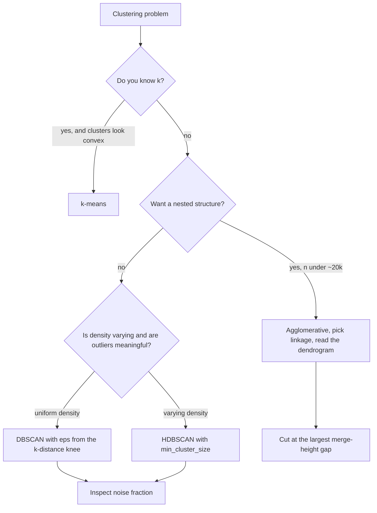

# Hierarchical and Density-Based Clustering

## TL;DR
Hierarchical clustering builds a tree of nested partitions — you pick the number of clusters *after*
seeing the structure, and Ward linkage is the k-means-like default. DBSCAN instead defines clusters as
dense regions separated by sparse ones: it finds arbitrary shapes, labels outliers explicitly, and needs
no $k$ — but needs $\varepsilon$, which is fragile. HDBSCAN removes $\varepsilon$ by clustering across
all density levels and is the modern default.

## Intuition
Hierarchical: start with everyone in their own group, repeatedly merge the two closest groups, and draw
the merge history as a tree. Cutting the tree at a height gives a partition; you choose the height by
looking at where the merges suddenly become expensive.

Density: imagine the data as a landscape of population density. Clusters are the hills; the valleys and
the empty plains are noise. Nothing is assumed about the shape of a hill — a long winding ridge is one
cluster, which is exactly what k-means cannot express.

## The maths

### Agglomerative hierarchical clustering
Start with $n$ singleton clusters. Repeatedly merge the pair $(A,B)$ minimising a linkage distance
$D(A,B)$ until one cluster remains. The merge heights form a **dendrogram**.

Linkage choices, which change the answer completely:

| Linkage | $D(A,B)$ | Behaviour |
|---|---|---|
| Single | $\min_{a\in A, b\in B} d(a,b)$ | Finds elongated / non-convex shapes; suffers *chaining* — a thin bridge of points merges two real clusters |
| Complete | $\max_{a\in A, b\in B} d(a,b)$ | Compact, roughly equal-diameter clusters; sensitive to outliers |
| Average (UPGMA) | $\frac{1}{\lvert A\rvert\lvert B\rvert}\sum_{a,b} d(a,b)$ | Compromise; not invariant to monotone transforms of $d$ |
| Ward | increase in within-cluster SS from merging | Minimises the same criterion as k-means; spherical, similar-size clusters |

Ward's merge cost has a clean closed form:

$$
\Delta(A,B) = \frac{\lvert A\rvert\,\lvert B\rvert}{\lvert A\rvert + \lvert B\rvert}\,\lVert \mu_A - \mu_B\rVert_2^2
$$

— the squared distance between centroids, weighted by the harmonic-mean size. So Ward is greedy
minimisation of the k-means objective, and it requires Euclidean distance to be meaningful.

The **Lance–Williams** update formula expresses all of these as one recurrence, which is how
implementations avoid recomputing distances from scratch after every merge.

Complexity: naive $O(n^3)$; $O(n^2 \log n)$ with a priority queue; $O(n^2)$ for single linkage (it is a
minimum spanning tree computation) and for Ward with the nearest-neighbour chain algorithm. Memory is
$O(n^2)$ for the distance matrix, which caps practical $n$ at roughly tens of thousands.

**Cutting the tree**: choose the number of clusters by looking for the largest vertical gap between
successive merge heights (a big jump means you merged two genuinely distant groups), or by an inconsistency
coefficient, or by a domain constraint.

### Divisive clustering
Top-down: start with one cluster and recursively split. Rarely used — the split step is itself a
clustering problem — except in the bisecting k-means form, which repeatedly splits the highest-inertia
cluster in two and is a fast, good hierarchy for large $n$.

### DBSCAN
Two parameters: $\varepsilon$ (neighbourhood radius) and `min_samples` = $m$.

Define $N_\varepsilon(p) = \{q : d(p,q) \le \varepsilon\}$. Then:

- $p$ is a **core point** if $\lvert N_\varepsilon(p)\rvert \ge m$.
- $q$ is **directly density-reachable** from core $p$ if $q \in N_\varepsilon(p)$.
- **Density-reachable** is the transitive closure of that over core points.
- A **cluster** is a maximal set of density-connected points; a non-core point within $\varepsilon$ of a
  core point is a **border** point; everything else is **noise**, labelled $-1$.

Properties that matter:

- No $k$ required, arbitrary cluster shapes, explicit noise labels.
- **Not fully deterministic**: border points reachable from two clusters are assigned by processing
  order. Core points and noise are stable.
- Complexity $O(n\log n)$ with a spatial index, $O(n^2)$ without — and indexes degrade past $d\approx 20$
  ([[curse-of-dimensionality]]).
- **The failure mode**: a single global $\varepsilon$ cannot handle clusters of different densities. Set
  $\varepsilon$ for the dense cluster and the sparse one becomes noise; set it for the sparse one and the
  dense clusters merge.

Choosing $\varepsilon$: plot the sorted distance to the $m$-th nearest neighbour for every point (the
**k-distance graph**) and take the knee. Set $m \ge d+1$, commonly $2d$; larger $m$ gives more noise
points and more robust clusters.

### HDBSCAN
Removes $\varepsilon$ by running DBSCAN at *all* density levels and extracting the most persistent
clusters.

Define the core distance $\mathrm{core}_m(x)$ = distance to the $m$-th nearest neighbour, and the
**mutual reachability distance**

$$
d_{\text{mreach}}(a,b) = \max\big\{\mathrm{core}_m(a),\ \mathrm{core}_m(b),\ d(a,b)\big\}
$$

This inflates distances in sparse regions, pushing noise away from dense cores. Build a minimum spanning
tree under $d_{\text{mreach}}$, convert it to a hierarchy by removing edges in decreasing weight order,
condense the tree using `min_cluster_size`, and select the clusters maximising **stability**

$$
S(C) = \sum_{x \in C}\left(\frac{1}{\lambda_{\text{death}}(x)} - \frac{1}{\lambda_{\text{birth}}(C)}\right),
\qquad \lambda = 1/d_{\text{mreach}}
$$

A cluster that persists over a wide range of density thresholds wins. The practical payoff: one intuitive
parameter (`min_cluster_size`), varying-density clusters handled correctly, and a soft membership
probability per point.

### Choosing between them

| | k-means | Hierarchical (Ward) | DBSCAN | HDBSCAN |
|---|---|---|---|---|
| Need $k$? | Yes | No (cut later) | No | No |
| Cluster shape | Convex only | Convex (Ward) / any (single) | Any | Any |
| Outliers | Forced into a cluster | Forced into a cluster | Labelled noise | Labelled noise, with probabilities |
| Varying density | Poor | Poor | Fails | Handles |
| Scales to $n$ | Millions | ~tens of thousands | ~hundreds of thousands | ~hundreds of thousands |
| Determinism | Seed-dependent | Deterministic | Border points ambiguous | Deterministic |

## Diagram



## Code

```python
import numpy as np
from sklearn.cluster import AgglomerativeClustering, DBSCAN
from sklearn.datasets import make_moons, make_blobs
from sklearn.metrics import adjusted_rand_score
from sklearn.neighbors import NearestNeighbors
from sklearn.preprocessing import StandardScaler
from scipy.cluster.hierarchy import dendrogram, linkage, fcluster

X, y = make_moons(n_samples=2000, noise=0.06, random_state=0)
Xs = StandardScaler().fit_transform(X)
```

Hierarchical, with the dendrogram and a principled cut:

```python
Z = linkage(Xs[:800], method="ward")      # scipy: rows are [idx_a, idx_b, height, size]
heights = Z[:, 2]
gaps = np.diff(heights[-15:])             # look at the last merges only
print("largest merge-height gap at the last", 15 - gaps.argmax() - 1, "clusters")

labels_h = fcluster(Z, t=2, criterion="maxclust")
dendrogram(Z, truncate_mode="lastp", p=20, no_labels=True)
```

Linkage choice changes everything — worth running once to internalise:

```python
for link in ["ward", "complete", "average", "single"]:
    lab = AgglomerativeClustering(n_clusters=2, linkage=link).fit_predict(Xs)
    print(f"{link:<9} ARI = {adjusted_rand_score(y, lab):.3f}")
# single ~1.0 (follows the crescents), ward/complete ~0.2-0.5 (cut them in half).
```

DBSCAN, with $\varepsilon$ chosen from the k-distance knee rather than guessed:

```python
m = 8
nn = NearestNeighbors(n_neighbors=m).fit(Xs)
kdist = np.sort(nn.kneighbors(Xs)[0][:, -1])
# The knee of this sorted curve is a defensible eps. Approximate it numerically:
x = np.arange(len(kdist))
line = np.linspace(kdist[0], kdist[-1], len(kdist))
eps = kdist[np.argmax(kdist - line)]
print(f"eps from knee: {eps:.3f}")

db = DBSCAN(eps=eps, min_samples=m).fit(Xs)
print("clusters:", len(set(db.labels_)) - (1 if -1 in db.labels_ else 0),
      " noise fraction:", (db.labels_ == -1).mean().round(3),
      " ARI:", round(adjusted_rand_score(y, db.labels_), 3))
```

The varying-density failure, and HDBSCAN fixing it:

```python
# One tight cluster, one diffuse cluster: no single eps works.
Xv = np.vstack([
    make_blobs(600, centers=[[0, 0]], cluster_std=0.25, random_state=0)[0],
    make_blobs(600, centers=[[6, 6]], cluster_std=1.6,  random_state=0)[0],
])
yv = np.r_[np.zeros(600), np.ones(600)]

for e in [0.3, 0.8, 1.5]:
    lab = DBSCAN(eps=e, min_samples=8).fit_predict(Xv)
    print(f"eps={e}: ARI={adjusted_rand_score(yv, lab):.3f}, "
          f"noise={(lab == -1).mean():.2f}")

import hdbscan
h = hdbscan.HDBSCAN(min_cluster_size=30, min_samples=8).fit(Xv)
print("HDBSCAN ARI:", round(adjusted_rand_score(yv, h.labels_), 3),
      " noise:", round((h.labels_ == -1).mean(), 3))
print("membership probabilities available:", h.probabilities_[:5].round(2))
```

## In practice
- **Use hierarchical when:** $n$ is small enough for an $O(n^2)$ distance matrix, you want to *see* the
  structure before committing to $k$, the domain is naturally nested (taxonomies, org structures, gene
  expression), or you need a deterministic, explainable partition to show a stakeholder.
- **Use DBSCAN/HDBSCAN when:** clusters are non-convex, outliers are meaningful and should be labelled
  rather than absorbed, and you genuinely do not know $k$. Classic fits: geospatial hotspots, network
  intrusion, sensor anomalies, deduplicating near-identical records, clustering embeddings after UMAP.
- **Defaults that work:** scale first, always. Hierarchical: Ward with Euclidean unless you specifically
  want chaining, and read the dendrogram before choosing the cut. DBSCAN: `min_samples` around $2d$,
  $\varepsilon$ from the k-distance knee. HDBSCAN: set `min_cluster_size` to the smallest group you would
  call a cluster and leave the rest alone.
- **Breaks when:** $d$ is high without reduction (density estimation is hopeless — reduce with PCA or UMAP
  first); memory for hierarchical at $n > \sim 50{,}000$; and DBSCAN whenever cluster densities differ,
  which is most real data.
- **Cost / latency:** none of these have a native `predict` for new points. DBSCAN and agglomerative are
  transductive — to assign a new point you either refit or use a nearest-core-point rule. HDBSCAN offers
  `approximate_predict`. If you need online assignment, k-means's $O(kd)$ lookup is the reason it still
  wins in production despite its weaker assumptions.

> [!tip]
> The standard modern recipe for clustering embeddings: L2-normalise, reduce to 5–50 dimensions with
> UMAP, then run HDBSCAN. UMAP preserves local density structure better than PCA, which is exactly what
> HDBSCAN needs — but remember UMAP is stochastic, so pin the seed or your "segments" change every run
> ([[tsne-and-umap]]).

## Interview angle

**Q. When would you pick DBSCAN over k-means?**
When clusters are not convex, when outliers matter and should be labelled rather than forced into a
cluster, and when $k$ is genuinely unknown. k-means partitions space into Voronoi cells, so it cannot
represent a crescent or a ring; DBSCAN grows clusters by density connectivity and can. The cost is that
I trade the $k$ parameter for $\varepsilon$, which is harder to set and does not tolerate varying density.

**Follow-up.** So how do you set $\varepsilon$? → Plot the sorted distance to each point's $m$-th nearest
neighbour and take the knee — below it you are inside clusters, above it you are in sparse space. And if
the densities genuinely differ across clusters, no single $\varepsilon$ works and I move to HDBSCAN.

**Q. What is Ward linkage doing?**
Greedily merging the pair whose union increases the within-cluster sum of squares least. The merge cost
is $\frac{|A||B|}{|A|+|B|}\lVert\mu_A - \mu_B\rVert^2$, so it is the same objective as k-means, optimised
greedily and bottom-up. It therefore shares k-means's bias toward spherical, similarly-sized clusters —
and it requires Euclidean distance to be meaningful.

**Q. What is chaining, and which linkage causes it?**
Single linkage. It merges on the *minimum* pairwise distance, so a thin bridge of a few points between
two dense groups is enough to fuse them. That sensitivity is also its strength — it is the linkage that
correctly follows elongated, non-convex shapes, because it is a minimum spanning tree computation.

**Q. Is DBSCAN deterministic?**
Core points and noise, yes. Border points, no — a point within $\varepsilon$ of two different clusters'
cores is assigned by processing order. It is a minor practical issue but a precise answer that shows you
have actually read the algorithm.

**Q. How does HDBSCAN improve on DBSCAN?**
It removes $\varepsilon$. It defines a mutual reachability distance that inflates distances in sparse
regions, builds a minimum spanning tree under it, and produces a hierarchy across all density thresholds;
then it selects the clusters with maximum *stability* — those persisting over the widest range of
thresholds. That handles varying density, leaves one intuitive parameter (`min_cluster_size`), and
returns per-point membership probabilities.

**Q. How do you evaluate a clustering with no labels?**
Internal indices — silhouette, Calinski–Harabasz, Davies–Bouldin — but knowing they encode shape
assumptions (silhouette favours convex clusters, so it will penalise a correct DBSCAN result on moons).
Better: bootstrap stability via adjusted Rand index across resamples, and external validity — do the
clusters differ on variables you did *not* cluster on, and do they behave differently downstream? A
segmentation that does not separate on revenue or retention is not useful, whatever its silhouette.

## Traps
- **Using Ward or complete linkage and expecting non-convex clusters.** Only single linkage (or
  density methods) follows shapes.
- **Not scaling before any distance-based clustering.** Same fatal error as k-means.
- **Running agglomerative on 500k rows.** $O(n^2)$ memory for the distance matrix; use `MiniBatchKMeans`
  or HDBSCAN, or subsample and assign the rest by nearest centroid.
- **Treating DBSCAN's noise label as a cluster.** `-1` means unassigned; a 60% noise fraction means your
  $\varepsilon$ is too small, not that 60% of your customers are anomalous.
- **Expecting DBSCAN to handle varying density.** It structurally cannot. Use HDBSCAN.
- **Using silhouette to validate a density clustering.** It assumes convexity and will reward the wrong
  answer.
- **Assuming a `predict` method exists.** DBSCAN and agglomerative are transductive; plan how new points
  get assigned before you put this in a pipeline.
- **Running HDBSCAN on 768-dimensional embeddings directly.** Density estimation in that dimension is
  meaningless; reduce first.
- **Forgetting UMAP's stochasticity.** Unpinned seeds give different segments every run, which destroys
  trust with stakeholders.

## Flashcards
Give Ward's merge cost formula.::$\Delta(A,B) = \frac{|A||B|}{|A|+|B|}\lVert\mu_A - \mu_B\rVert^2$ — greedy minimisation of the k-means objective.
Which linkage causes chaining and why is that sometimes good?::Single linkage — it merges on minimum pairwise distance, so a thin bridge fuses clusters; but it is also what lets it follow elongated non-convex shapes.
Define a DBSCAN core point.::A point with at least `min_samples` points (including itself) within radius $\varepsilon$.
How do you choose DBSCAN's eps?::The knee of the sorted k-distance graph — the distance to each point's m-th nearest neighbour, sorted ascending.
What is DBSCAN's structural limitation?::A single global $\varepsilon$ cannot fit clusters of different densities — dense clusters merge or sparse ones become noise.
Define mutual reachability distance.::$\max\{\mathrm{core}_m(a), \mathrm{core}_m(b), d(a,b)\}$ — it inflates distances in sparse regions so noise separates from dense cores.
How does HDBSCAN choose its clusters?::By maximising cluster stability over the condensed tree — clusters that persist across the widest range of density thresholds win.
Which of these algorithms can assign a brand-new point cheaply?::k-means ($O(kd)$). DBSCAN and agglomerative are transductive; HDBSCAN offers only `approximate_predict`.

## Related
- [[clustering-kmeans]] — the convex, $k$-required alternative
- [[tsne-and-umap]] — the reduction step before density clustering embeddings
- [[curse-of-dimensionality]] — why density estimation fails in high $d$
- [[anomaly-detection]] — DBSCAN noise labels as outlier detection
- [[dimensionality-reduction-pca]] — the cheaper preprocessing option
- [[k-nearest-neighbours]] — the neighbourhood machinery underneath
- [[vector-norms-and-distances]] — the metrics all of this depends on
