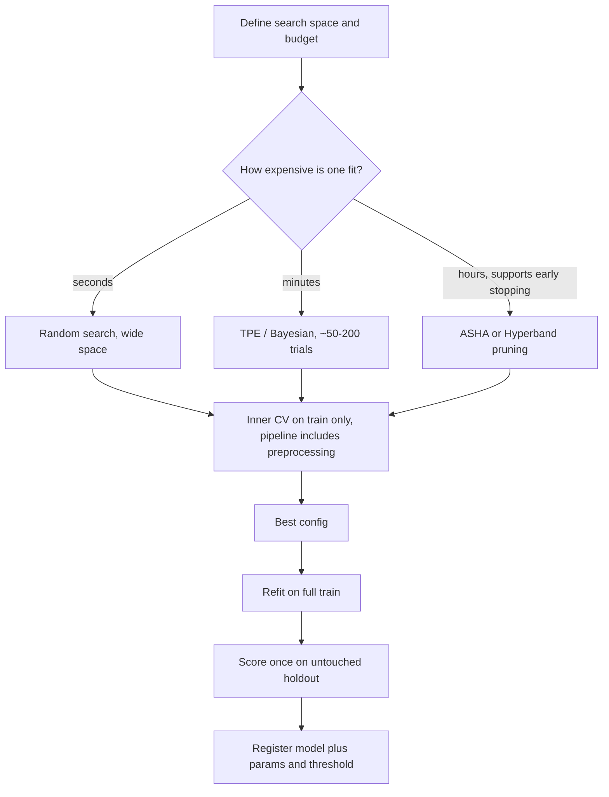

# Hyperparameter Tuning

## TL;DR
Random search beats grid search for the same budget because only a few hyperparameters matter and random
sampling gives every one of them many distinct values. Bayesian optimisation (TPE) beats random when
evaluations are expensive and the budget is moderate. Hyperband/ASHA beats both when you can stop bad
configs early. Tune inside cross-validation with all preprocessing in the pipeline, and keep a final
untouched holdout — because the tuning score is itself optimistically biased.

## Intuition
You are dialling in an espresso machine with grind, dose and temperature. Grid search tries every
combination on a lattice, wasting most of its budget varying a knob that does not matter. Random search
tries random settings and, because it never repeats a value of the knob that *does* matter, explores that
dimension far more finely. Bayesian search tastes each shot and lets the results decide where to dial
next. Hyperband takes one sip of many shots and pours away the bad ones before brewing them fully.

## The maths

### Why random beats grid
Suppose $d$ hyperparameters but only $k \ll d$ of them affect the score (the *low effective dimension*
observation of Bergstra & Bengio — almost always true in practice). With a budget of $n$ trials:

- **Grid** over $m$ values per dimension needs $m^d$ trials and gives only $m$ distinct values of the one
  parameter that matters, however large $n$ is.
- **Random** gives $n$ distinct values of *every* parameter.

If the good region occupies a fraction $p$ of the range of the important parameter, the probability that
random search finds it in $n$ trials is

$$
P(\text{hit}) = 1 - (1-p)^{n}
$$

For $p = 0.05$, $n = 60$ trials gives $1 - 0.95^{60} \approx 0.95$. That "60 random trials gets you into
the top 5% with 95% probability" is a genuinely useful, quotable result — and it is independent of $d$.

### Bayesian optimisation
Model the objective $f(\lambda)$ (validation score as a function of hyperparameters) with a surrogate,
then pick the next $\lambda$ by maximising an acquisition function that balances exploitation against
exploration. With a Gaussian process surrogate giving posterior mean $\mu(\lambda)$ and standard
deviation $\sigma(\lambda)$, Expected Improvement over the incumbent best $f^*$ is

$$
\mathrm{EI}(\lambda) = \mathbb{E}\big[\max(0,\ f(\lambda) - f^{*})\big]
= \sigma(\lambda)\big[z\,\Phi(z) + \phi(z)\big], \quad z = \frac{\mu(\lambda) - f^{*}}{\sigma(\lambda)}
$$

High $\mu$ (exploit) or high $\sigma$ (explore) both raise EI. GPs scale badly in dimension and handle
categorical/conditional spaces awkwardly, which is why the default in practice is **TPE**.

**Tree-structured Parzen Estimator** flips the modelling around. Split observed trials at a quantile
$\gamma$ into good ($l$) and bad ($g$) and model $p(\lambda \mid y)$ rather than $p(y\mid\lambda)$:

$$
p(\lambda \mid y) = \begin{cases} \ell(\lambda) & y < y^{*} \\ g(\lambda) & y \ge y^{*}\end{cases}
$$

Maximising EI reduces to maximising the ratio $\ell(\lambda)/g(\lambda)$ — sample where good trials
concentrate and bad ones do not. TPE handles conditional spaces naturally (`max_depth` only exists if the
learner is a tree), which is exactly what a real search space looks like. This is Optuna's and Hyperopt's
default sampler.

### Hyperband and ASHA — budget as a first-class variable
Successive halving: run $n$ configurations for a small budget $r$ (few boosting rounds, few epochs, a
data subsample), keep the best $1/\eta$, multiply the budget by $\eta$, repeat. Total cost is roughly
$n r \log_\eta n$ instead of $n r_{\max}$.

Successive halving has one free parameter tension: many configs with small budgets, or few configs with
large budgets? **Hyperband** resolves it by running several *brackets* with different $(n, r)$ tradeoffs,
hedging across the choice. **ASHA** is the asynchronous version — promote any configuration as soon as it
beats the promotion quantile at its rung, so hundreds of workers never idle waiting for a synchronisation
barrier. ASHA is what you want on a cluster.

The assumption underneath: performance at a small budget correlates with performance at a large budget.
That holds well for boosting rounds and epochs; it holds badly when a low learning rate needs many rounds
to overtake a high one, so pruning can kill the eventual winner early.

### Why the tuning score is biased
If you run $n$ trials and report the best CV score, you have taken a maximum over $n$ noisy estimates.
With per-fold noise of standard deviation $\sigma$, the expected maximum of $n$ draws exceeds the true
best by roughly $\sigma\sqrt{2\ln n}$. At $n = 200$ and $\sigma = 0.01$ AUC, that is about 0.03 AUC of
pure optimism. Hence: select on validation, **report on an untouched test set**.

The rigorous version is **nested CV** — an outer loop for estimating generalisation and an inner loop for
selection:

$$
\text{cost} = K_{\text{outer}} \times K_{\text{inner}} \times n_{\text{trials}} \times \text{fit cost}
$$

which is why it is standard in papers and rare in production. The pragmatic substitute is a single
untouched holdout.

## Diagram



## Code

```python
import numpy as np
import optuna
import xgboost as xgb
from sklearn.datasets import make_classification
from sklearn.model_selection import StratifiedKFold, cross_val_score, train_test_split
from sklearn.pipeline import Pipeline
from sklearn.impute import SimpleImputer

X, y = make_classification(n_samples=30000, n_features=40, n_informative=12,
                           weights=[0.9, 0.1], random_state=0)
Xfit, Xhold, yfit, yhold = train_test_split(X, y, test_size=0.2, stratify=y, random_state=0)
cv = StratifiedKFold(5, shuffle=True, random_state=0)

def objective(trial):
    params = dict(
        n_estimators=trial.suggest_int("n_estimators", 200, 1500, step=100),
        max_depth=trial.suggest_int("max_depth", 3, 10),
        learning_rate=trial.suggest_float("learning_rate", 1e-3, 0.3, log=True),
        subsample=trial.suggest_float("subsample", 0.5, 1.0),
        colsample_bytree=trial.suggest_float("colsample_bytree", 0.3, 1.0),
        min_child_weight=trial.suggest_float("min_child_weight", 1e-2, 20.0, log=True),
        reg_lambda=trial.suggest_float("reg_lambda", 1e-3, 50.0, log=True),
        reg_alpha=trial.suggest_float("reg_alpha", 1e-4, 10.0, log=True),
    )
    # Preprocessing lives INSIDE the pipeline so it is refit per fold - no leakage.
    pipe = Pipeline([
        ("impute", SimpleImputer(strategy="median")),
        ("clf", xgb.XGBClassifier(**params, tree_method="hist", n_jobs=-1, random_state=0)),
    ])
    return cross_val_score(pipe, Xfit, yfit, cv=cv, scoring="average_precision", n_jobs=1).mean()

study = optuna.create_study(
    direction="maximize",
    sampler=optuna.samplers.TPESampler(seed=0, n_startup_trials=20),   # random warm-up, then TPE
    pruner=optuna.pruners.HyperbandPruner(),
)
study.optimize(objective, n_trials=100, timeout=1800)
print(study.best_params, study.best_value)
```

Log-scale the ranges that matter. `learning_rate` between 0.001 and 0.3 sampled uniformly wastes 97% of
its draws above 0.01; `log=True` fixes that. This one detail is worth more than doubling the trial count.

Pruning inside a single fit — stop bad configs after a few hundred rounds:

```python
from optuna.integration import XGBoostPruningCallback
from sklearn.model_selection import train_test_split as tts

def objective_pruned(trial):
    Xa, Xb, ya, yb = tts(Xfit, yfit, test_size=0.25, stratify=yfit, random_state=trial.number)
    params = {
        "max_depth": trial.suggest_int("max_depth", 3, 10),
        "learning_rate": trial.suggest_float("learning_rate", 1e-3, 0.3, log=True),
        "subsample": trial.suggest_float("subsample", 0.5, 1.0),
        "eval_metric": "aucpr", "tree_method": "hist", "n_jobs": -1,
    }
    clf = xgb.XGBClassifier(n_estimators=3000, early_stopping_rounds=50, **params,
                            callbacks=[XGBoostPruningCallback(trial, "validation_0-aucpr")])
    clf.fit(Xa, ya, eval_set=[(Xb, yb)], verbose=False)
    trial.set_user_attr("best_iteration", clf.best_iteration)
    return clf.best_score
```

MLflow tracking, which is what makes a search auditable rather than a number in a notebook:

```python
import mlflow

mlflow.set_experiment("/Users/me/demand-forecast-tuning")

with mlflow.start_run(run_name="xgb-tpe-100"):
    mlflow.log_params({"sampler": "TPE", "n_trials": 100, "cv": "stratified-5", "metric": "PR-AUC"})
    study.optimize(objective, n_trials=100)

    for t in study.trials:                      # one nested run per trial: full search history
        with mlflow.start_run(nested=True, run_name=f"trial-{t.number}"):
            mlflow.log_params(t.params)
            if t.value is not None:
                mlflow.log_metric("cv_pr_auc", t.value)

    mlflow.log_params({f"best_{k}": v for k, v in study.best_params.items()})
    mlflow.log_metric("best_cv_pr_auc", study.best_value)

    final = xgb.XGBClassifier(**study.best_params, tree_method="hist", n_jobs=-1).fit(Xfit, yfit)
    from sklearn.metrics import average_precision_score
    mlflow.log_metric("holdout_pr_auc",
                      average_precision_score(yhold, final.predict_proba(Xhold)[:, 1]))
    mlflow.xgboost.log_model(final, "model")
```

> [!tip]
> On Databricks, parallelise the search with `optuna.integration` plus a shared study backed by a JDBC
> storage URL, or use Hyperopt's `SparkTrials` to fan trials across the cluster. Either way turn
> `mlflow.autolog()` on so every trial lands in the experiment automatically. Watch one thing: with
> `n_jobs=-1` inside each trial *and* parallel trials, you oversubscribe the cores and everything slows
> down. Pick one level to parallelise.

## In practice
- **Use it when:** after the data, features and validation scheme are settled. Tuning is the last 2–5% —
  a better feature or a fixed leak is worth ten times more, and interviewers listen for whether you know
  that ordering.
- **Defaults that work:** 20 random trials to map the space, then 50–150 TPE trials. Log-scale learning
  rates and regularisation. Fix `n_estimators` high and use early stopping rather than tuning it.
  For gradient boosting the order of importance is roughly: learning rate and number of rounds (jointly),
  then `max_depth` / `num_leaves` and `min_child_weight`, then `subsample` / `colsample`, then
  `reg_lambda` / `reg_alpha`.
- **Breaks when:** the CV score is noisier than the differences you are chasing. If fold-to-fold standard
  deviation is 0.02 and your best two configs differ by 0.003, you are tuning noise — use repeated CV,
  more folds, or accept that the configs are tied and pick the simpler one. Also breaks under any of the
  [[data-leakage]] patterns, which make the search optimise the leak.
- **Cost / latency:** budget is the real design variable. Estimate one fit's wall time, multiply by folds
  and trials, and choose the algorithm accordingly: under a minute per fit → random search is fine and
  simpler; minutes → TPE; hours with a learning curve → ASHA. Prefer a subsample of the data for the
  first pass of the search and refit the finalists on everything.

## Interview angle

**Q. Grid search or random search?**
Random, for a fixed budget. Only a few hyperparameters matter, and grid search spends its trials varying
the irrelevant ones while giving the important one only $m$ distinct values. Random gives $n$ distinct
values of every parameter, and the probability of landing in the top 5% region is $1-(1-0.05)^n$ — about
95% at 60 trials, independent of dimension. I would only use grid when the space is genuinely small and
discrete and I want reproducible full coverage.

**Follow-up.** When is Bayesian better than random? → When each evaluation is expensive and the budget is
moderate — tens to low hundreds of trials. It uses the observed trials to concentrate sampling. With
thousands of cheap trials, random catches up and is simpler; with a highly noisy objective, the surrogate
fits noise and Bayesian can be worse.

**Q. Explain TPE in one paragraph.**
It models $p(\lambda \mid y)$ instead of $p(y \mid \lambda)$. Trials are split at a quantile into good and
bad; kernel density estimates $\ell$ and $g$ are fitted to each group; the next candidate maximises
$\ell(\lambda)/g(\lambda)$, which is proportional to Expected Improvement. Because it is a density over
the search space rather than a regressor over it, it handles conditional and categorical spaces naturally
— which is why it is the practical default over Gaussian processes.

**Q. How do Hyperband and ASHA save budget?**
They make the training budget itself a variable. Start many configurations cheaply, evaluate at a rung,
keep the top $1/\eta$, and multiply the budget. Hyperband hedges over the "many cheap vs few expensive"
choice by running several brackets; ASHA does the promotion asynchronously so a cluster never idles. The
assumption is that low-budget performance ranks configurations similarly to full-budget performance —
which can fail when a low learning rate needs many rounds to win.

**Q. How do you tune without leaking?**
All preprocessing goes inside the estimator being cross-validated, so every fold refits its own imputer,
scaler and encoder. The tuning happens on the training portion only; the holdout is scored exactly once,
at the end. If I need an unbiased estimate of the whole tune-and-fit procedure, that is nested CV — outer
folds for estimation, inner folds for selection — but for most production work a single untouched holdout
is the honest, affordable version.

**Q. Why is the best CV score during tuning optimistic?**
Because it is a maximum over many noisy estimates. The expected maximum of $n$ draws with noise $\sigma$
exceeds the truth by roughly $\sigma\sqrt{2\ln n}$ — at 200 trials and 0.01 fold noise, about 0.03. Report
that best config's score on data the search never saw.

**Q. You have four hours on one cluster. What's the plan?**
Time one fit first. Then: cut the search to the 5–6 parameters that matter for the model family, subsample
the data for the first pass, run 20 random trials to bound the space, switch to TPE with ASHA pruning for
the remainder, track everything in MLflow, and reserve the last 30 minutes to refit the top three configs
on the full data and score them once on the holdout. Budget-aware beats exhaustive.

## Traps
- **Tuning before fixing features, validation or leakage.** The search will faithfully optimise a broken
  setup.
- **Preprocessing fitted outside the CV loop.** Leaks; the whole search is then optimising an inflated
  score ([[data-leakage]]).
- **Reporting the best tuning score as model performance.** It is a maximum over noise.
- **Uniform sampling of learning rate or regularisation strength.** Use log scale, or most of your budget
  lands in a useless region.
- **Tuning `n_estimators` for boosting.** Set it high and use early stopping; otherwise you are
  cross-validating a quantity that early stopping determines for free.
- **Ignoring fold variance.** Differences smaller than the fold standard deviation are not real.
- **Oversubscribing cores.** Parallel trials each with `n_jobs=-1` thrash. Parallelise at one level.
- **Letting the pruner kill slow starters.** With low learning rates, early rungs mis-rank; set the
  minimum resource high enough that the ranking is meaningful.
- **Searching a space that contains invalid combinations.** Define conditional spaces properly instead of
  letting trials crash and silently bias the search.

## Flashcards
Why does random search beat grid search at equal budget?::Few hyperparameters matter; random gives n distinct values of each, grid gives only m regardless of budget.
How many random trials to hit the top 5% region with 95% probability?::About 60, from $1-(1-0.05)^n \ge 0.95$ — and it does not depend on the number of dimensions.
What does TPE model, and what does it maximise?::It models $p(\lambda\mid y)$ as good/bad densities $\ell$ and $g$, and samples where $\ell(\lambda)/g(\lambda)$ is largest (proportional to EI).
Write Expected Improvement for a GP surrogate.::$\sigma(\lambda)[z\Phi(z)+\phi(z)]$ with $z=(\mu(\lambda)-f^*)/\sigma(\lambda)$ — high mean or high uncertainty both raise it.
What does ASHA add over successive halving?::Asynchronous promotion — a config is promoted as soon as it beats its rung's quantile, so workers never idle at a synchronisation barrier.
Why is the best CV score during a search biased upward?::It is a maximum over n noisy estimates; expected optimism is about $\sigma\sqrt{2\ln n}$.
What is nested cross-validation for?::An unbiased estimate of the entire tune-and-fit procedure: outer folds estimate generalisation, inner folds select hyperparameters.
Which hyperparameters matter most in gradient boosting?::Learning rate with number of rounds (via early stopping), then depth / min_child_weight, then subsampling, then L1/L2 regularisation.

## Related
- [[cross-validation]] — the scoring loop tuning sits inside
- [[data-leakage]] — the failure mode that invalidates any search
- [[xgboost-deep-dive]] — what each boosting knob actually does
- [[experiment-tracking-mlflow]] — making a search reproducible and auditable
- [[bias-variance-tradeoff]] — what you are navigating
- [[learning-curves-and-diagnostics]] — deciding whether tuning is even the bottleneck
- [[cost-optimization-for-ml]] — budget-aware search on a cluster
- [[databricks]] — running distributed searches in practice
