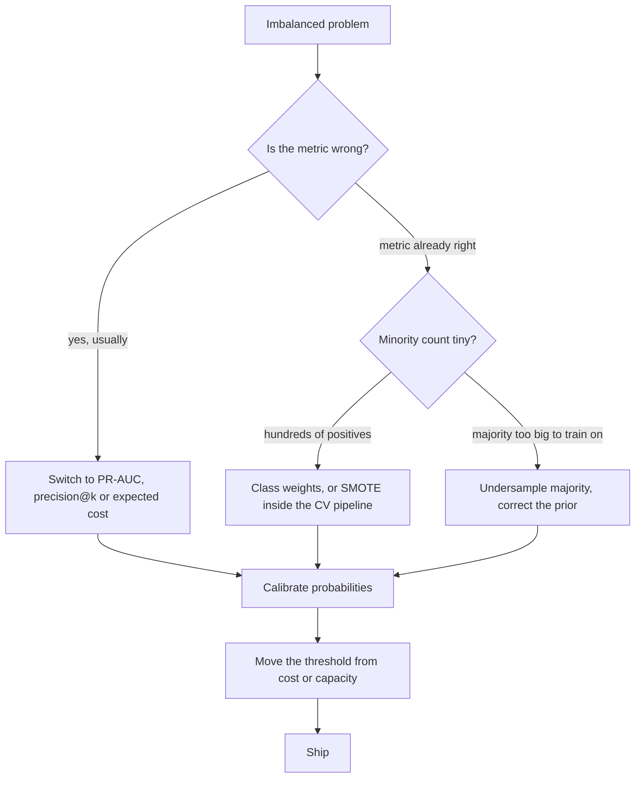

# Imbalanced Classification

## TL;DR
Imbalance is usually a *metric and threshold* problem, not a data problem. Accuracy is meaningless at
1% prevalence; use PR-AUC or a cost-weighted metric, keep the natural prior, and move the threshold.
Class weights and resampling both distort calibrated probabilities, and SMOTE rarely beats a well-chosen
threshold on real tabular data. Reach for resampling when the minority count is genuinely tiny or when
training time forces undersampling — not reflexively.

## Intuition
If 1 in 100 transactions is fraud, a model that always says "not fraud" is 99% accurate and worth
nothing. Nothing about the data is broken — the *evaluation* is. The model may already rank fraud above
non-fraud beautifully; you simply asked it a yes/no question at the wrong cut point. Rebalancing the data
to 50/50 is solving a problem the model does not have, and it silently replaces your real-world prior
with a fictional one.

The honest first question is not "how do I balance this?" but "what does a miss cost, and how many cases
can we review?"

## The maths

### What the loss actually sees
Standard log loss weights every row equally:

$$
\mathcal{L} = -\frac{1}{n}\sum_{i=1}^{n}\Big[y_i\log \hat p_i + (1-y_i)\log(1-\hat p_i)\Big]
$$

With 1% positives, 99% of the gradient signal comes from negatives. The model is not "ignoring" the
minority out of laziness; it is correctly minimising the objective you gave it. Change the objective if
you want a different answer.

### Class weights
Weight each class inversely to its frequency:

$$
w_c = \frac{n}{K\,n_c}, \qquad
\mathcal{L}_w = -\frac{1}{n}\sum_i w_{y_i}\Big[y_i\log\hat p_i + (1-y_i)\log(1-\hat p_i)\Big]
$$

This is mathematically equivalent to duplicating minority rows $w_1/w_0$ times — same expected gradient,
no synthetic data, no extra rows. In XGBoost, `scale_pos_weight` $= n_{neg}/n_{pos}$ does the same thing
on the positive-class gradient.

Crucially it shifts the effective prior, so the resulting scores are **not** calibrated to the true base
rate. Correcting the logit:

$$
\text{logit}_{\text{true}} = \text{logit}_{\text{weighted}} - \log\frac{w_1}{w_0}
$$

### Resampling and prior shift
Training on a sample with positive rate $\pi'$ instead of the true $\pi$ gives
$p' = P'(y=1\mid x)$, related to the truth by

$$
p = \frac{\pi\,p'/\pi'}{\pi\,p'/\pi' + (1-\pi)(1-p')/(1-\pi')}
$$

Undersampling the majority discards data (raising variance) but speeds training a lot. Oversampling the
minority by duplication adds no information and encourages memorising the duplicated points — with trees,
the same minority row appearing 50 times makes a pure leaf trivially easy to build.

### SMOTE
Synthetic Minority Over-sampling: for each minority point $x_i$, pick a random minority neighbour
$x_{nn}$ among its $k$ nearest minority neighbours and create

$$
x_{\text{new}} = x_i + \lambda (x_{nn} - x_i), \qquad \lambda \sim U(0,1)
$$

It interpolates along segments between minority points. Three things follow immediately:

1. It **assumes the minority class is locally convex** — that the midpoint of two fraud cases is also
   fraud. Often false; for genuinely multi-modal or scattered rare events it manufactures points in
   regions where the true class is the majority.
2. It is a **distance method**, so it inherits every problem of [[curse-of-dimensionality]] and requires
   scaling. On one-hot high-cardinality categoricals it produces fractional values that are not valid
   categories (SMOTE-NC exists for this, and is a patch, not a solution).
3. It **inflates minority density near the decision boundary**, which is exactly where it is least
   trustworthy. Borderline-SMOTE and ADASYN target the boundary deliberately; that is a feature when the
   boundary is real and a bug when it is noise.

Published gains from SMOTE are much stronger on small, low-dimensional, clean benchmarks than on large,
wide, noisy production tables. With a strong learner like gradient boosting plus a tuned threshold, it
very often adds nothing.

### Threshold moving
Keep the natural prior, get calibrated probabilities, and choose the cut from costs or capacity — see
[[threshold-selection]]. This is the option that changes no data, no objective, and no calibration. It is
the default answer that strong candidates give first.

### Metrics that survive imbalance

| Metric | Behaviour under imbalance | Verdict |
|---|---|---|
| Accuracy | Dominated by the majority | Never use |
| ROC-AUC | Prevalence-invariant, but FPR denominator is huge so it looks flattering | Use with caution |
| PR-AUC / average precision | Baseline = prevalence; sensitive to the positive class | Preferred |
| Precision@k, recall@k | Matches review-capacity reality | Preferred when capacity-bound |
| Expected cost | Directly the business objective | Best, when costs are known |
| Brier / log loss | Proper; keeps probabilities honest | Use alongside |

Why ROC-AUC flatters: with 1% positives, going from 100 to 1000 false positives moves FPR from 0.001 to
0.01 — invisible on an ROC plot — while precision collapses from 0.5 to 0.09. The PR curve shows this;
ROC does not ([[roc-auc-and-pr-curves]]).

## Diagram



## Code

```python
import numpy as np
from sklearn.datasets import make_classification
from sklearn.metrics import average_precision_score, brier_score_loss, roc_auc_score
from sklearn.model_selection import StratifiedKFold, train_test_split
import xgboost as xgb

X, y = make_classification(n_samples=60000, n_features=30, n_informative=10,
                           weights=[0.99, 0.01], flip_y=0.01, random_state=0)
Xtr, Xte, ytr, yte = train_test_split(X, y, test_size=0.3, stratify=y, random_state=0)
print("positives in train:", ytr.sum(), "of", len(ytr))

def report(name, p):
    print(f"{name:<22} AP={average_precision_score(yte, p):.4f}  "
          f"AUC={roc_auc_score(yte, p):.4f}  Brier={brier_score_loss(yte, p):.5f}")

base = xgb.XGBClassifier(n_estimators=400, max_depth=5, learning_rate=0.05,
                         subsample=0.8, colsample_bytree=0.8, eval_metric="aucpr",
                         n_jobs=-1, random_state=0)

report("baseline", base.fit(Xtr, ytr).predict_proba(Xte)[:, 1])

spw = (ytr == 0).sum() / (ytr == 1).sum()
weighted = xgb.XGBClassifier(**{**base.get_params(), "scale_pos_weight": spw})
report("scale_pos_weight", weighted.fit(Xtr, ytr).predict_proba(Xte)[:, 1])
# Typically: AP barely moves, Brier gets clearly WORSE. That trade is the whole story.
```

SMOTE, done correctly — inside a pipeline so it never touches a validation fold:

```python
from imblearn.over_sampling import SMOTE
from imblearn.pipeline import Pipeline as ImbPipeline
from sklearn.model_selection import cross_val_score

pipe = ImbPipeline([
    ("smote", SMOTE(k_neighbors=5, random_state=0)),
    ("clf",   xgb.XGBClassifier(n_estimators=400, max_depth=5, learning_rate=0.05,
                                n_jobs=-1, random_state=0)),
])
cv = StratifiedKFold(5, shuffle=True, random_state=0)
print("SMOTE pipeline AP:", cross_val_score(pipe, Xtr, ytr, cv=cv, scoring="average_precision").mean())
print("plain AP        :", cross_val_score(base,  Xtr, ytr, cv=cv, scoring="average_precision").mean())
```

> [!warning]
> `SMOTE().fit_resample(X, y)` before `train_test_split` is the single most common bug in this area. The
> synthetic points are interpolated from rows that end up in the test set, so the test set is no longer
> held out and the reported score is fiction. See [[data-leakage]].

The answer that usually wins — keep the prior, calibrate, move the threshold:

```python
from sklearn.calibration import CalibratedClassifierCV
from sklearn.metrics import confusion_matrix

cal = CalibratedClassifierCV(base, method="isotonic", cv=5).fit(Xtr, ytr)
p = cal.predict_proba(Xte)[:, 1]

COST_FP, COST_FN = 100.0, 5000.0
tau = COST_FP / (COST_FP + COST_FN)

tn, fp, fn, tp = confusion_matrix(yte, (p >= tau).astype(int)).ravel()
print(f"tau={tau:.3f}  recall={tp/(tp+fn):.3f}  precision={tp/(tp+fp):.3f}  "
      f"cost={fp*COST_FP + fn*COST_FN:,.0f}")

tn, fp, fn, tp = confusion_matrix(yte, (p >= 0.5).astype(int)).ravel()
print(f"tau=0.500  recall={tp/(tp+fn):.3f}  cost={fp*COST_FP + fn*COST_FN:,.0f}")
```

## In practice
- **Use it when:** prevalence below roughly 10%, and always below 1%. Below ~0.1% treat it as an anomaly
  detection problem instead ([[anomaly-detection]]).
- **Defaults that work:** stratified splits; `eval_metric='aucpr'` with early stopping; keep the natural
  prior; calibrate; derive the threshold from cost or capacity. If you must intervene on the data, try
  class weights first (cheap, reversible, no synthetic rows), and only then SMOTE — measured honestly
  inside a pipeline, against a tuned-threshold baseline.
- **Breaks when:** you have very few positives in absolute terms. 50 positives is a small-sample problem,
  not an imbalance problem: no resampling scheme creates information, and your CV estimate will have a
  huge variance. Use repeated stratified CV, report intervals, and consider whether a rules-based system
  or a semi-supervised approach is more honest.
- **Cost / latency:** undersampling the majority is often a genuine engineering win — on Databricks,
  training on all 500M negatives to learn from 200k positives is mostly wasted compute. Undersample
  negatives by 10×, train fast, then correct the prior analytically. That is a legitimate use of
  resampling and a good thing to say.

> [!tip]
> When you undersample for compute reasons on Spark, do it with `df.sampleBy("label", fractions={0: 0.1, 1: 1.0})`
> and record the sampling fraction in MLflow, because you need it to undo the prior shift at scoring time.

## Interview angle

**Q. You have 1% positives. What do you do?**
First, fix the metric: accuracy is useless, so I move to PR-AUC or, better, expected cost. Second, keep
the natural class prior and get calibrated probabilities. Third, set the threshold from the cost ratio or
review capacity. Only after that would I consider class weights or resampling, and I would measure them
against the tuned-threshold baseline rather than against 0.5. Very often the baseline wins.

**Follow-up.** So when *would* you resample? → Two cases. When the majority class is so large that
training on all of it is wasteful — undersample for compute, then correct the prior. And when minority
examples are in the low hundreds and the model is high-variance, where oversampling can act as a crude
regulariser. Neither is the default.

**Q. What does SMOTE assume, and when does it fail?**
That the minority class is locally convex — that a point interpolated between two minority examples is
also minority. It fails when the minority is multi-modal or scattered (you generate points inside
majority territory), in high dimensions (interpolation along near-meaningless distances), and with
categorical features (interpolation gives invalid categories). It also densifies exactly the boundary
region where the class identity is least certain.

**Q. How do class weights and resampling affect probabilities?**
Both change the effective class prior, so the output is $P(y=1\mid x)$ under a fictional base rate, not
yours. Symptom: probabilities cluster near 0.5 in a 1%-positive problem. Fix by subtracting the log
prior-odds ratio from the logit, or by recalibrating on an unresampled held-out set
([[probability-calibration]]).

**Q. ROC-AUC or PR-AUC here?**
PR-AUC. ROC-AUC is prevalence-invariant, which sounds like a virtue but means it hides the thing you care
about: with 1% positives, a tenfold increase in false positives barely moves FPR while precision
collapses. PR-AUC's baseline is the prevalence itself, so it responds to exactly that change. Report AUC
too if you like, but decide on PR-AUC or expected cost.

**Q. Is there a way to change the model rather than the data?**
Yes — change the loss. Focal loss down-weights easy examples by $(1-p_t)^\gamma$ so the gradient
concentrates on hard ones; it comes from dense object detection where imbalance is extreme. Cost-sensitive
learning bakes the cost matrix into the loss directly. Both are cleaner than resampling because they do
not fabricate data, though they still shift calibration.

**Q. When is imbalance genuinely not the problem?**
When the classes are separable. Imbalance only hurts when it interacts with overlap and small minority
counts. A 1%-positive problem with a crisp boundary trains fine at any prevalence. The real diagnosis is
"how many positives do I have, and how much do the classes overlap?" — not the ratio alone.

## Traps
- **Reporting accuracy.** At 1% prevalence the trivial model scores 99%.
- **SMOTE or any resampling before the train/test split.** Contaminates the holdout; the reported gain is
  not real.
- **Resampling and then using threshold 0.5.** You moved the prior and kept the default cut — two
  uncontrolled changes at once.
- **"SMOTE improved my recall."** Of course it did — you shifted the effective threshold. Compare against
  a baseline whose threshold was tuned, or the comparison is meaningless.
- **Balancing the validation set.** Validation must reflect production prevalence or every metric you
  compute is for a world that does not exist.
- **Applying SMOTE to one-hot encoded or high-cardinality categorical data.** Interpolated categories are
  not categories.
- **Treating a 50-positive dataset as an imbalance problem.** It is a small-sample problem; no resampling
  method creates information.
- **Assuming ratio alone determines difficulty.** Absolute minority count and class overlap matter far more.

## Flashcards
What is the first thing to change in an imbalanced problem?::The metric — accuracy is meaningless; move to PR-AUC, precision@k, or expected cost.
Are class weights equivalent to oversampling?::Yes in expectation — weighting the loss by $w_c$ matches duplicating rows at that rate, without synthetic data.
State what SMOTE does and its core assumption.::Interpolates $x_{new} = x_i + \lambda(x_{nn} - x_i)$ between minority neighbours; assumes the minority class is locally convex.
Why does resampling hurt calibration?::It trains under a different class prior, so outputs estimate $P(y=1\mid x)$ for a fictional base rate; correct by shifting the logit by the log prior-odds ratio.
Why does ROC-AUC flatter an imbalanced model?::FPR's denominator is the huge negative class, so large increases in false positives barely move it while precision collapses.
What is XGBoost's scale_pos_weight set to?::$n_{neg}/n_{pos}$ — it scales the positive class's gradient contribution.
Name a legitimate reason to undersample.::Compute: training on hundreds of millions of negatives is wasteful; undersample, train fast, then correct the prior analytically.
When is imbalance not really the problem?::When the classes are separable or the absolute minority count is adequate — overlap and minority count matter more than the ratio.

## Related
- [[threshold-selection]] — the fix that changes neither data nor prior
- [[probability-calibration]] — undoing the prior shift resampling causes
- [[roc-auc-and-pr-curves]] — why PR beats ROC here
- [[classification-metrics]] — what each metric assumes
- [[data-leakage]] — resampling before the split
- [[anomaly-detection]] — where extreme rarity should send you instead
- [[cross-validation]] — stratification and repeated CV with few positives
- [[xgboost-deep-dive]] — `scale_pos_weight` and `aucpr` early stopping
