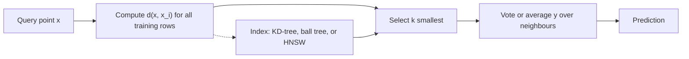

# k-Nearest Neighbours

## TL;DR
Store the training set; to predict, find the $k$ closest points and vote (or average). No training,
all the cost at inference, and everything depends on the distance metric — which means scaling is
mandatory and high dimensions are fatal. Its real modern life is not as a classifier but as the
retrieval primitive behind vector search and recommenders.

## Intuition
If you want to know what a house sells for, look at the five most similar houses on the same street.
"Similar" is doing all the work: get the notion of distance wrong — wrong units, irrelevant features,
too many dimensions — and the five nearest houses are effectively five random houses.

## The maths

### The rule
Given a query $x$, let $N_k(x)$ be the indices of the $k$ training points minimising a distance $d(x, x_i)$.

- Regression: $\hat{f}(x) = \frac{1}{k}\sum_{i \in N_k(x)} y_i$
- Classification: $\hat{P}(y = c \mid x) = \frac{1}{k}\sum_{i \in N_k(x)} \mathbb{1}[y_i = c]$

Distance-weighted variants use $w_i \propto 1/d(x,x_i)$ so nearer neighbours count more, which smooths
the step-function behaviour at decision boundaries.

Common metrics (see [[vector-norms-and-distances]]):
$d_2(x,x') = \lVert x - x'\rVert_2$, Manhattan $\lVert x - x'\rVert_1$, and cosine
$1 - \frac{x^\top x'}{\lVert x\rVert \lVert x'\rVert}$ for direction-only similarity (text, embeddings).

### $k$ is the bias–variance knob
$k = 1$ interpolates the training data: zero training error, decision boundary shattered by every noisy
point — maximum variance, minimum bias. As $k$ grows the prediction averages more points: variance
falls roughly as $1/k$, bias rises because you are averaging over a larger, less local neighbourhood.
$k = n$ predicts the global mean. The classic heuristic is $k \approx \sqrt{n}$, but tune it by CV.

Effective degrees of freedom for kNN regression is approximately $n/k$, which is a useful way to
compare its flexibility to a parametric model.

### The 1-NN error bound
A genuinely quotable result (Cover & Hart): as $n \to \infty$, the 1-NN error rate $R_{1NN}$ satisfies

$$
R^* \le R_{1NN} \le R^*\left(2 - \frac{M}{M-1}R^*\right) \le 2R^*
$$

where $R^*$ is the Bayes error and $M$ the number of classes. So asymptotically 1-NN is at most twice
as bad as the optimal classifier — with no model at all. The catch is hidden in "as $n \to \infty$":
the number of points needed for the nearest neighbour to actually be *near* grows exponentially in $d$.

### Why high dimensions kill it
In $d$ dimensions, to capture a fraction $r$ of the data volume in a hypercube neighbourhood you need
edge length $r^{1/d}$. For $d = 10$ and $r = 0.01$, the edge is $0.01^{0.1} \approx 0.63$ — 63% of the
range of every feature. "Local" is no longer local. See [[curse-of-dimensionality]].

## Diagram



## Code

```python
import numpy as np
from sklearn.datasets import load_wine
from sklearn.model_selection import GridSearchCV, train_test_split
from sklearn.neighbors import KNeighborsClassifier
from sklearn.pipeline import Pipeline
from sklearn.preprocessing import StandardScaler

X, y = load_wine(return_X_y=True)
Xtr, Xte, ytr, yte = train_test_split(X, y, test_size=0.25, random_state=0, stratify=y)

# Unscaled vs scaled: the whole lesson of kNN in four lines.
raw = KNeighborsClassifier(n_neighbors=5).fit(Xtr, ytr)
pipe = Pipeline([("sc", StandardScaler()), ("knn", KNeighborsClassifier(n_neighbors=5))]).fit(Xtr, ytr)
print("unscaled:", raw.score(Xte, yte), " scaled:", pipe.score(Xte, yte))

grid = GridSearchCV(
    pipe,
    {"knn__n_neighbors": [1, 3, 5, 11, 21, 41],
     "knn__weights": ["uniform", "distance"],
     "knn__p": [1, 2]},                      # Manhattan vs Euclidean
    cv=5, n_jobs=-1,
)
grid.fit(Xtr, ytr)
print(grid.best_params_, grid.best_score_)
```

> [!warning]
> `StandardScaler` must live **inside** the pipeline that `GridSearchCV` clones, not be fitted on all of
> `X` beforehand. Fitting the scaler on the full dataset leaks test statistics into every fold — see
> [[data-leakage]].

Approximate nearest neighbours, which is what kNN actually looks like in production:

```python
# Exact search is O(n*d) per query. At million-scale you use an ANN index instead,
# trading a small recall loss for orders-of-magnitude speedup.
import numpy as np, faiss

emb = np.random.rand(200_000, 128).astype("float32")
faiss.normalize_L2(emb)                      # cosine via inner product on unit vectors
index = faiss.IndexHNSWFlat(128, 32)         # M=32 graph connections per node
index.add(emb)
index.hnsw.efSearch = 64                     # recall/latency knob at query time

q = emb[:5]
scores, ids = index.search(q, k=10)
print(ids.shape, scores[0][:3])
```

## In practice
- **Use it when:** you need a fast, assumption-free baseline on low-dimensional data; you want a local
  model where the decision boundary is genuinely irregular; or — the real case — you need *retrieval*:
  vector search, deduplication, "customers like this one", candidate generation for a recommender.
- **Defaults that work:** scale first (`StandardScaler`, or L2-normalise for embeddings), Euclidean for
  continuous scaled features, cosine for embeddings, `k` tuned by CV starting near $\sqrt{n}$, odd $k$
  for binary classification to avoid ties, `weights='distance'` when the density varies a lot.
- **Breaks when:** $d$ is large (distances concentrate), features are on different scales, classes are
  imbalanced (the majority class wins every vote — a 95/5 split makes kNN predict the majority nearly
  always; see [[imbalanced-classification]]), features are mixed categorical/numeric (there is no honest
  distance across types), or memory is tight (you store the entire training set).
- **Cost / latency:** training $O(1)$; exact query $O(nd)$ brute force, or $O(d\log n)$ with a KD-tree —
  but KD-trees degrade to brute force past roughly $d > 20$. Memory is $O(nd)$, forever. This inverted
  cost profile (free training, expensive inference) is the opposite of every parametric model and is the
  main reason kNN rarely serves real-time traffic without an ANN index
  ([[ann-algorithms-hnsw-ivf]]).

## Interview angle

**Q. Why is kNN called a lazy or non-parametric learner?**
Lazy because there is no training phase — fitting is just storing the data, and all computation is
deferred to query time. Non-parametric because the number of effective parameters grows with $n$: the
model *is* the dataset, so its complexity is not fixed in advance.

**Follow-up.** What is its effective complexity then? → Roughly $n/k$ degrees of freedom. That is why
small $k$ overfits and large $k$ underfits, and why $k$ is the single most important hyperparameter.

**Q. How does $k$ affect bias and variance?**
Small $k$ → low bias, high variance; the boundary follows individual noisy points and $k=1$ has zero
training error by construction. Large $k$ → high bias, low variance; predictions smooth toward the
global mean. Pick by cross-validation, not by rule of thumb.

**Q. Why must you scale features for kNN?**
Because the model is entirely a distance. If salary is in rupees (range $10^6$) and experience in years
(range $10$), Euclidean distance is $\approx$ the salary difference and every other feature is invisible.
Standardise, or use a metric that accounts for covariance such as Mahalanobis.

**Q. What happens to kNN in 100 dimensions?**
Distances concentrate: the ratio of the farthest to the nearest neighbour distance tends to 1, so
"nearest" stops carrying information, and any neighbourhood containing a meaningful fraction of the data
spans almost the entire feature range. Fix it by reducing dimension first (PCA, a learned embedding) or
by using a metric adapted to the data — but often the honest answer is to use a different model family.

**Q. You have 50M rows and need sub-10 ms lookups. Still kNN?**
Yes, but approximate. Build an HNSW or IVF-PQ index; you accept ~95–99% recall for a 100×+ speedup and a
compressed memory footprint. That is exactly the retrieval layer in a RAG system or a recommender's
candidate generation stage ([[vector-databases]], [[recommender-systems-basics]]).

**Q. How do you handle categorical features?**
There is no principled Euclidean distance on categories. Options: one-hot then use Hamming/Jaccard,
target-encode carefully (watch [[data-leakage]]), use Gower distance for mixed types, or — usually best —
switch to a tree model which handles mixed types natively ([[categorical-encoding]]).

## Traps
- **Forgetting to scale.** The most common and most fatal kNN error.
- **Fitting the scaler outside the CV loop.** Leaks fold statistics; the CV score is optimistic.
- **Assuming kNN is cheap.** Training is free but inference is not, and the model's memory footprint is
  the whole training set. Production kNN needs an index.
- **Using even $k$ for binary classification.** Ties resolved arbitrarily; use odd $k$.
- **Expecting good probabilities.** $\hat{P}$ can only take values in $\{0, 1/k, \dots, 1\}$ — with
  $k=5$ your probabilities are coarse multiples of 0.2. Not calibrated, not smooth.
- **Ignoring class imbalance.** Neighbourhoods drawn from a 99/1 split are almost all majority class.
  Weight votes by inverse class frequency or move the threshold.
- **Claiming "1-NN is within 2× of Bayes error, so it's fine."** That bound is asymptotic in $n$ and the
  required $n$ grows exponentially with $d$. Quote it with the caveat or not at all.

## Flashcards
What is kNN's training cost and query cost?::Training $O(1)$ (just store data); brute-force query $O(nd)$ per point, memory $O(nd)$ permanently.
How does k control bias and variance?::Small k = low bias, high variance (k=1 interpolates); large k = high bias, low variance. Effective dof ≈ n/k.
Why is feature scaling mandatory for kNN?::The model is purely a distance, so a large-scale feature dominates it and all others become invisible.
State the Cover–Hart 1-NN bound.::Asymptotically $R_{1NN} \le 2R^*$ where $R^*$ is the Bayes error — but only as $n \to \infty$.
Why does kNN fail in high dimensions?::Distances concentrate (nearest/farthest ratio → 1) and any neighbourhood holding a real fraction of data spans most of each feature's range.
When do KD-trees stop helping?::Past roughly d > 20 they degrade to brute-force scanning; use ANN methods like HNSW or IVF instead.
Why are kNN probabilities poor?::They are multiples of 1/k — coarse, discontinuous, and uncalibrated.
Where is kNN actually used in modern systems?::As retrieval, not classification: vector search for RAG, dedup, and candidate generation in recommenders.

## Related
- [[curse-of-dimensionality]] — why "nearest" stops meaning anything
- [[vector-norms-and-distances]] — the metrics kNN depends on
- [[feature-scaling-and-transforms]] — the mandatory preprocessing
- [[ann-algorithms-hnsw-ivf]] — how kNN is actually served at scale
- [[bias-variance-tradeoff]] — what $k$ trades off
- [[recommender-systems-basics]] — kNN as candidate generation
- [[support-vector-machines]] — what a large-$\gamma$ RBF SVM collapses into
