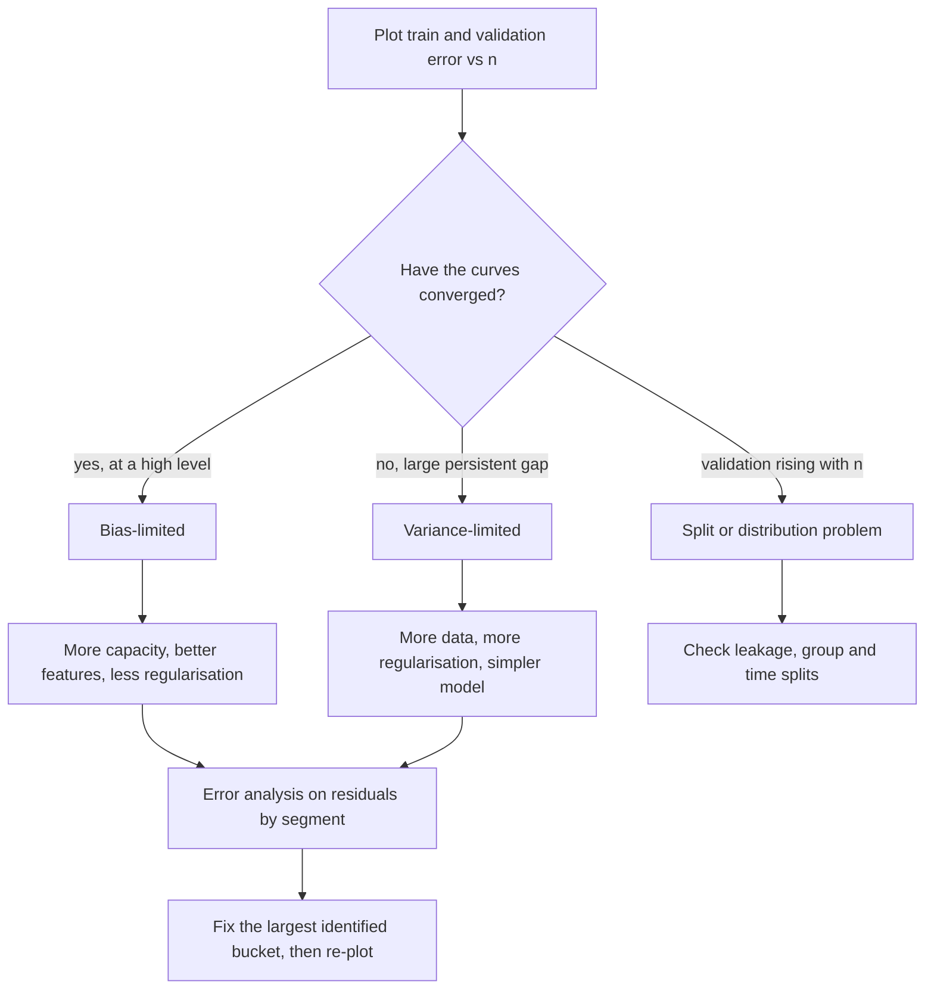

# Learning Curves and Diagnostics

## TL;DR
Before tuning anything, find out what is actually limiting you. Plot train and validation error against
training-set size: a high, converged pair means bias (more data will not help — change the model or the
features); a persistent gap means variance (more data or more regularisation will help). Then do error
analysis on the residuals, because the biggest wins usually come from a segment you have not noticed, not
from a hyperparameter.

## Intuition
Two curves, one story. Training error starts near zero (the model memorises a handful of points) and
rises as more data forces it to generalise. Validation error starts terrible and falls as the model sees
more. Where they end up, and how far apart, tells you which of the two levers to pull — and crucially,
tells you when neither will help and you need different features.

## The maths

### The decomposition being diagnosed
For squared error at a point $x$ ([[bias-variance-tradeoff]]):

$$
\mathbb{E}\big[(y - \hat f(x))^2\big] = \underbrace{\sigma^2}_{\text{irreducible}}
+ \underbrace{\big(\mathbb{E}[\hat f(x)] - f(x)\big)^2}_{\text{bias}^2}
+ \underbrace{\mathbb{E}\big[(\hat f(x) - \mathbb{E}[\hat f(x)])^2\big]}_{\text{variance}}
$$

Learning curves are the empirical read-out. As $n \to \infty$:

- Variance $\to 0$, so the two curves converge.
- Bias and irreducible error do not move, so the **converged level** is $\text{bias}^2 + \sigma^2$.
- The **gap** between the curves at finite $n$ is the variance.

Hence the two readings: level and gap.

### Reading the four shapes

| Train error | Validation error | Gap | Diagnosis | What to do |
|---|---|---|---|---|
| High | High | Small | Underfitting / bias-limited | More capacity, better features, less regularisation, longer training |
| Low | High | Large | Overfitting / variance-limited | More data, more regularisation, fewer features, simpler model |
| Low | Low | Small | Fine | Stop; spend effort elsewhere |
| Low | High and *rising* with n | Growing | Distribution mismatch or leakage | Check the split, check point-in-time correctness |

That last row is the one people miss. Validation error that gets *worse* as you add training data is not
a normal shape — it signals that the added data comes from a different distribution than validation, or
that the validation split is broken.

### The Bayes-error ceiling
You cannot beat $\sigma^2$. Estimate it before you set a target:

- Human performance on the same inputs (a strong proxy for many perception and text tasks).
- The disagreement rate between two independent labellers — if annotators disagree 8% of the time, 92%
  accuracy is roughly the ceiling.
- The performance of a much larger model on the same features.

"Avoidable bias" is $\text{train error} - \text{Bayes error}$. Chasing it below zero is chasing label noise.

### Asymptotics of the curves
For a well-specified parametric model, excess risk falls as $O(p/n)$ with $p$ parameters — so the gap
shrinks roughly linearly in $1/n$ and doubling the data halves it. For nonparametric methods the rate is
$n^{-2s/(2s+d)}$ and the return on more data is far worse in high dimension
([[curse-of-dimensionality]]). Practically: fit a curve to your last few points and extrapolate before
you commission an expensive labelling exercise. If the projected gain from doubling the data is 0.004 AUC,
say so and go do something else.

### Validation curves
A different plot, often confused with learning curves: score versus *one hyperparameter*, at fixed $n$.
The classic U-shape — train error monotonically improving, validation error falling then rising — locates
the capacity sweet spot and tells you whether you are on the under- or over-regularised side.

## Diagram



## Code

```python
import numpy as np
import matplotlib.pyplot as plt
from sklearn.datasets import make_classification
from sklearn.ensemble import RandomForestClassifier
from sklearn.model_selection import StratifiedKFold, learning_curve, validation_curve

X, y = make_classification(n_samples=20000, n_features=30, n_informative=8,
                           flip_y=0.08, random_state=0)
cv = StratifiedKFold(5, shuffle=True, random_state=0)
model = RandomForestClassifier(n_estimators=200, min_samples_leaf=1, n_jobs=-1, random_state=0)

sizes, train_sc, val_sc = learning_curve(
    model, X, y, cv=cv, scoring="neg_log_loss", n_jobs=-1,
    train_sizes=np.linspace(0.05, 1.0, 12), shuffle=True, random_state=0,
)
train_err, val_err = -train_sc.mean(1), -val_sc.mean(1)

fig, ax = plt.subplots(figsize=(6, 4))
ax.plot(sizes, train_err, "o-", label="train")
ax.plot(sizes, val_err, "o-", label="validation")
ax.fill_between(sizes, -val_sc.mean(1) - val_sc.std(1), -val_sc.mean(1) + val_sc.std(1), alpha=0.15)
ax.set_xlabel("training examples"); ax.set_ylabel("log loss"); ax.legend()

print(f"final gap = {val_err[-1] - train_err[-1]:.4f}  (variance)")
print(f"final train level = {train_err[-1]:.4f}   (bias + irreducible)")
```

Extrapolating the value of more data — the calculation that saves a labelling budget:

```python
# Fit err(n) = a * n^(-b) + c on the validation curve and read off the asymptote c.
from scipy.optimize import curve_fit

def power_law(n, a, b, c):
    return a * n ** (-b) + c

(a, b, c), _ = curve_fit(power_law, sizes, val_err, p0=(1.0, 0.5, val_err[-1]), maxfev=20000)
n_now = sizes[-1]
print(f"asymptotic floor ~ {c:.4f}")
print(f"predicted at 2x data: {power_law(2 * n_now, a, b, c):.4f} "
      f"(gain {val_err[-1] - power_law(2 * n_now, a, b, c):.4f})")
```

Validation curve — capacity, not sample size:

```python
depths = [2, 3, 4, 6, 8, 12, 16, None]
tr, va = validation_curve(
    RandomForestClassifier(n_estimators=200, n_jobs=-1, random_state=0),
    X, y, param_name="max_depth", param_range=depths, cv=cv, scoring="neg_log_loss", n_jobs=-1,
)
for d, t, v in zip(depths, -tr.mean(1), -va.mean(1)):
    print(f"max_depth={str(d):<5} train={t:.4f} val={v:.4f} gap={v - t:.4f}")
```

Error analysis — where the loss actually lives:

```python
import pandas as pd
from sklearn.metrics import log_loss
from sklearn.model_selection import train_test_split

Xtr, Xte, ytr, yte = train_test_split(X, y, test_size=0.25, stratify=y, random_state=0)
m = RandomForestClassifier(n_estimators=300, n_jobs=-1, random_state=0).fit(Xtr, ytr)
p = m.predict_proba(Xte)[:, 1]

df = pd.DataFrame({"y": yte, "p": p})
df["loss"] = -(df.y * np.log(np.clip(p, 1e-9, 1)) + (1 - df.y) * np.log(np.clip(1 - p, 1e-9, 1)))
df["segment"] = pd.qcut(Xte[:, 0], 5, labels=[f"q{i}" for i in range(1, 6)])

summary = df.groupby("segment", observed=True).agg(
    n=("loss", "size"), mean_loss=("loss", "mean"), pos_rate=("y", "mean")
)
summary["loss_share"] = df.groupby("segment", observed=True)["loss"].sum() / df["loss"].sum()
print(summary.sort_values("loss_share", ascending=False))

# Then read the 30 worst rows by loss. Patterns there are worth more than 100 tuning trials.
print(df.nlargest(30, "loss").describe())
```

## In practice
- **Use it when:** at the *start* of the modelling loop and after every significant change. A learning
  curve is 20 minutes of compute that can save a week of pointless tuning.
- **Defaults that work:** 8–12 training sizes on a log-ish scale, the same CV splitter you use for
  everything else, a proper scoring rule (log loss or Brier) rather than accuracy so the curve is smooth
  and informative, and shaded standard-deviation bands so you do not over-read noise.
- **Breaks when:** the curve is computed on shuffled subsets of time-ordered or grouped data — then it
  measures a fantasy. Subsample *within* the correct split structure. Also breaks when the metric is
  discrete and noisy (accuracy on a small validation set) and the curve is dominated by jitter.
- **Cost / latency:** $\approx$ (number of sizes) × (folds) × average fit cost, which is cheaper than it
  looks because most points use a fraction of the data. On Databricks, run the sweep as one job and log
  the curve as an MLflow artefact so the "will more data help?" question is answered in the run, not
  re-litigated in a meeting.

> [!tip]
> The most valuable diagnostic is not a curve at all: read the 30 worst-loss examples by hand. Almost
> every real project has a discoverable cluster in there — a mislabelled source system, a unit mismatch,
> a segment with a genuinely different data-generating process — and no hyperparameter search will find it.

## Interview angle

**Q. How do you tell bias from variance in practice?**
Plot train and validation error against training-set size. If they converge at a high level, I am
bias-limited — more data will not help and I need a different model class or better features. If a large
gap persists, I am variance-limited — more data, more regularisation, or a simpler model. I also anchor
against an estimate of the irreducible error, because "high" is only meaningful relative to the ceiling.

**Follow-up.** Both are high and the gap is large. What now? → Both problems at once, which is common.
Fix bias first: a bias-limited model cannot be diagnosed further because regularisation changes will be
confounded. Increase capacity until the training error approaches your Bayes estimate, *then* attack the
gap with data and regularisation.

**Q. How do you decide whether to spend money on more labelled data?**
Fit a power law $a n^{-b} + c$ to the validation curve and extrapolate. If doubling the data buys 0.003
AUC and doubling costs ₹8 lakh of annotation, that is a straightforward no. If the curve is still falling
steeply, data is the cheapest lever available. Quantifying this rather than asserting it is the difference
between a senior and a mid-level answer.

**Q. What if validation error *increases* as you add training data?**
That is not a normal learning curve. Either the added data is from a different distribution than the
validation set (a new time period, a new channel, a new source system), or the split is broken — grouped
rows leaking, or a time-ordered dataset shuffled. I would check the split construction before touching
the model.

**Q. What is error analysis and why does it beat tuning?**
Slice the held-out loss by segment — customer tier, geography, time bucket, source, label value — and
find which slices contribute disproportionately to total loss. Then read the worst individual examples.
This surfaces data problems and missing features, which move the metric far more than hyperparameters do.
The rough ordering of returns is: fix leakage > fix labels > add features > add data > tune.

**Q. Your training loss is still falling but validation has plateaued. Stop or continue?**
Stop — that is the definition of the early-stopping point, and continuing only widens the gap. But check
the *shape* first: with a low learning rate a plateau can be temporary, so use patience rather than
stopping at the first flat epoch, and restore the best checkpoint rather than the last.

**Q. How do learning curves differ for a deep model?**
The x-axis is usually epochs rather than sample size, so the curves diagnose optimisation as well as
generalisation — a training loss that will not fall is a learning-rate or initialisation problem, not a
capacity problem. The sample-size learning curve is still the right tool for the "more data?" question;
for large models it tends to follow a power law over several orders of magnitude
([[llm-scaling-laws]]).

## Traps
- **Tuning before diagnosing.** If you are bias-limited, no amount of regularisation search will help.
- **Reading the gap without reading the level.** A tiny gap at 40% error is a badly underfit model, not a
  well-regularised one.
- **Computing learning curves on shuffled time-series or grouped data.** The curve then describes a data
  regime that does not exist.
- **Using accuracy as the curve's metric.** Discrete and noisy; use log loss or Brier for a readable shape.
- **Ignoring the error bars.** Small validation sets produce curves whose wiggles are pure noise.
- **Assuming more data always helps.** Past the knee, returns are brutal. Extrapolate before you ask for
  budget.
- **Treating irreducible error as zero.** If two annotators disagree 8% of the time, 95% accuracy is a
  fantasy target and pursuing it means fitting label noise.
- **Skipping manual inspection of worst-case errors.** The single highest-yield hour in most projects.

## Flashcards
What do the level and the gap of a learning curve tell you?::The converged level is bias plus irreducible error; the gap between train and validation is variance.
Which curve shape means more data will not help?::Train and validation converged at a high error level — a bias-limited model.
What does it mean if validation error rises as training size grows?::Distribution mismatch between the added data and the validation set, or a broken split (leakage, shuffled time series, grouped rows).
How do you estimate the irreducible error?::Human performance on the same inputs, or the disagreement rate between independent annotators.
How do you decide if more labelled data is worth buying?::Fit $a n^{-b} + c$ to the validation curve, extrapolate the gain from doubling n, and compare against the annotation cost.
Learning curve vs validation curve?::Learning curve varies training-set size at fixed hyperparameters; validation curve varies one hyperparameter at fixed n.
What is the usual ordering of returns on effort?::Fix leakage > fix labels > add features > add data > tune hyperparameters.
Why use log loss rather than accuracy on a learning curve?::It is continuous and proper, so the curve is smooth and readable rather than dominated by threshold jitter.

## Related
- [[bias-variance-tradeoff]] — the decomposition being measured
- [[overfitting-and-underfitting]] — the two failure modes the curves separate
- [[cross-validation]] — the splitter the curves must respect
- [[hyperparameter-tuning]] — what to do only after diagnosis
- [[data-leakage]] — the cause of impossible-looking curves
- [[regression-metrics]] — choosing the curve's y-axis
- [[training-tricks-and-debugging]] — the deep-learning analogue
