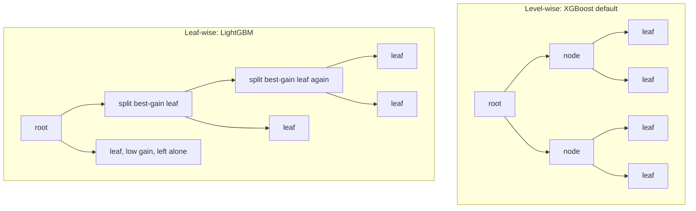

# LightGBM and CatBoost

## TL;DR
All three major GBDT libraries optimise the same regularised second-order objective; they differ in *how
they grow the tree* and *how they handle categoricals*. LightGBM grows **leaf-wise** (best-gain leaf first)
and speeds up training with GOSS and EFB. CatBoost grows **symmetric/oblivious** trees and uses **ordered
target statistics** plus **ordered boosting** to eliminate the target leakage that ordinary mean-encoding
and ordinary boosting both suffer from. Pick LightGBM for speed on wide data, CatBoost for many
high-cardinality categoricals and good out-of-the-box behaviour, XGBoost for everything else.

## Intuition
XGBoost builds a tree *level by level*: it splits every node at depth 2 before touching depth 3. That is
balanced and easy to parallelise but wastes effort on nodes that are already nearly pure.

LightGBM instead keeps a priority queue of leaves and always splits the single leaf with the highest gain.
For a fixed number of leaves it reaches a lower training loss — and a much more lopsided, deeper tree,
which is why `num_leaves` has to be controlled deliberately.

CatBoost's concern is different: it noticed that both mean-target encoding *and* standard boosting use the
target of a row while building a model that will be evaluated on that same row. Its fix in both cases is
the same trick — pretend the data arrived in some order, and for each row use only the rows *before* it.

## The maths

### Leaf-wise vs level-wise growth
Both use the same gain criterion (see [[xgboost-deep-dive]]):
$$
\text{Gain} = \frac{1}{2}\left[\frac{G_L^2}{H_L+\lambda} + \frac{G_R^2}{H_R+\lambda} - \frac{(G_L+G_R)^2}{H_L+H_R+\lambda}\right] - \gamma
$$
The difference is scheduling. Level-wise expands all nodes at depth $d$ before depth $d+1$. Leaf-wise
(best-first) maintains all current leaves and repeatedly splits $\arg\max_{\text{leaf}} \text{Gain}$ until
`num_leaves` is reached.

For a fixed leaf budget $T$, leaf-wise attains a weakly lower training objective by construction — it is a
greedy selection over the same candidate set with fewer constraints. It also produces unbalanced trees of
effective depth up to $T-1$, hence higher variance. The controls are `num_leaves` (primary),
`min_data_in_leaf`, and `max_depth` as a safety cap. Rule of thumb: keep `num_leaves` well below
$2^{\texttt{max\_depth}}$ — e.g. `max_depth=8`, `num_leaves=63` rather than 255.

### GOSS — Gradient-based One-Side Sampling
Observation: in gradient boosting, a row's contribution to the split gain is driven by its gradient
magnitude $|g_i|$. Rows the model already fits well have $g_i \approx 0$ and barely affect any $G_j$. So
subsample them, but correct for the bias.

GOSS: sort rows by $|g_i|$; keep the top $a\cdot n$ ("large-gradient" set $A$); randomly sample $b\cdot n$
from the remaining $(1-a)n$ ("small-gradient" set $B$); discard the rest. To keep the gain estimate
unbiased, **upweight the sampled small-gradient rows** by
$$
\frac{1-a}{b}
$$
so that the variance estimator over the feature split becomes
$$
\tilde{V}_j(t) = \frac{1}{n}\left[
\frac{\big(\sum_{i \in A_l} g_i + \frac{1-a}{b}\sum_{i \in B_l} g_i\big)^2}{n_l(t)}
+ \frac{\big(\sum_{i \in A_r} g_i + \frac{1-a}{b}\sum_{i \in B_r} g_i\big)^2}{n_r(t)}
\right]
$$
where $A_l, B_l$ are the kept large- and small-gradient rows falling left of threshold $t$. The factor
$\frac{1-a}{b}$ restores the small-gradient group to its original total mass; without it GOSS would
systematically under-count the easy examples and distort every split.

Cost drops from $O(n)$ to $O((a+b)n)$ per feature scan. Note `boosting_type='goss'` is a deliberate choice
in LightGBM, not the default (`gbdt` with plain `bagging_fraction` is).

### EFB — Exclusive Feature Bundling
On sparse data (one-hot columns, count features) many feature pairs are **mutually exclusive**: they are
rarely non-zero on the same row. Such features can be packed into a single bundle by offsetting their value
ranges — feature A takes bin values $[0, 10)$, feature B is shifted into $[10, 30)$ — so one histogram
serves both. Split points on the bundled feature still recover the original splits.

Finding the optimal bundling is graph colouring (vertices = features, edges = pairs with too much conflict),
which is NP-hard; LightGBM uses a greedy degree-ordered heuristic with a `max_conflict_rate` tolerance.
Histogram build cost falls from $O(n \times \#\text{features})$ to $O(n \times \#\text{bundles})$.

Together GOSS and EFB are where LightGBM's headline speed comes from: fewer rows scanned, fewer feature
histograms built.

### Ordered target statistics — CatBoost's categorical encoding
Plain mean-target encoding replaces a category $c$ with
$$
\hat{x}_c = \frac{\sum_{i: x_i = c} y_i + a\, p}{|\{i : x_i = c\}| + a}
$$
($p$ a prior, usually the global mean; $a$ a smoothing count). The row's own $y_i$ is in the numerator.
For a rare category with one observation, the encoded value is essentially that row's label — the tree
splits on it, training loss collapses, and the model has learned nothing generalisable. That is **target
leakage**, and it is why naive target encoding wins on CV and dies in production.

CatBoost's fix: impose a random permutation $\sigma$ of the rows and, for row $i$, compute the statistic
**only from rows that precede it** in that permutation:
$$
\hat{x}_{\sigma(i)} = \frac{\sum_{j : \sigma(j) < \sigma(i),\ x_j = x_i} y_j \;+\; a\,p}{\big|\{j : \sigma(j) < \sigma(i),\ x_j = x_i\}\big| \;+\; a}
$$
Each row's encoding is now a function of other rows' labels only, so $\mathbb{E}[\hat{x}_i \mid y_i]$ does
not depend on $y_i$ — the encoding is unbiased with respect to the row it is used for. This is exactly the
logic of out-of-fold target encoding, taken to its limit: instead of $K$ folds it is $n$ nested "folds".

Two refinements: early rows in the permutation have almost no history and therefore very high-variance
encodings, so CatBoost uses **several permutations** and averages/rotates between them; and it builds
**feature combinations** greedily (pairs, then triples of categoricals encoded jointly), which is how it
captures categorical interactions a tree would otherwise need many splits to express.

### Ordered boosting — the same trick for the gradients
Standard gradient boosting has a subtler version of the same problem, which the CatBoost authors call
**prediction shift**. At round $t$ the gradient $g_i$ for row $i$ is computed from $F_{t-1}(x_i)$ — but
$F_{t-1}$ was trained *on* row $i$. So $g_i$ is not an unbiased estimate of the gradient the model would
have at a fresh point, and the bias compounds over rounds. On small datasets this is a real source of
overfitting.

Ordered boosting maintains supporting models $M_1, \dots, M_n$ where $M_k$ is trained only on the first $k$
rows in the permutation; the gradient for row $i$ is computed from $M_{\sigma(i)-1}$, which never saw row
$i$. The naive version costs $O(n^2)$ models; CatBoost approximates it with $O(\log n)$ models on
geometrically-growing prefixes, shared across permutations. `boosting_type='Ordered'` enables it (default
on small data; `'Plain'` on large, where the bias matters less and the cost does).

### Oblivious (symmetric) trees
Every node at the same depth of a CatBoost tree uses the **same** split (feature, threshold). A depth-$d$
tree therefore has exactly $2^d$ leaves and a row's leaf index is a $d$-bit number you can compute with $d$
comparisons and bit shifts — vectorised, branch-free inference that is dramatically faster than walking a
general tree. The cost is expressive power per tree: an oblivious tree is a weaker learner, which CatBoost
compensates for with more rounds. It also acts as strong regularisation, part of why CatBoost's defaults
tend to work without tuning.

## Diagram



## Code

```python
import numpy as np, pandas as pd
import lightgbm as lgb
from sklearn.model_selection import train_test_split
from sklearn.metrics import roc_auc_score

rng = np.random.default_rng(0)
n = 60_000
df = pd.DataFrame({
    "num1": rng.normal(size=n),
    "num2": rng.gamma(2.0, size=n),
    "city": pd.Categorical(rng.choice([f"city_{i}" for i in range(400)], size=n)),
    "device": pd.Categorical(rng.choice(["ios", "android", "web"], size=n)),
})
logit = 0.8 * df.num1 - 0.3 * df.num2 + df.city.cat.codes.to_numpy() * 0.004
df["y"] = (rng.random(n) < 1 / (1 + np.exp(-logit))).astype(int)

X, y = df.drop(columns="y"), df.y
Xtr, Xva, ytr, yva = train_test_split(X, y, test_size=0.25, random_state=0, stratify=y)

lgbm = lgb.LGBMClassifier(
    objective="binary",
    n_estimators=4000,
    learning_rate=0.03,
    num_leaves=63,           # the primary complexity knob for leaf-wise growth
    max_depth=8,             # safety cap: keep num_leaves << 2**max_depth
    min_data_in_leaf=100,
    feature_fraction=0.8,
    bagging_fraction=0.8,
    bagging_freq=1,
    reg_lambda=5.0,
    n_jobs=-1,
    random_state=0,
)
lgbm.fit(
    Xtr, ytr,
    eval_set=[(Xva, yva)], eval_metric="auc",
    categorical_feature=["city", "device"],       # pandas category dtype is handled natively
    callbacks=[lgb.early_stopping(100, verbose=False), lgb.log_evaluation(0)],
)
print("lgbm best iter:", lgbm.best_iteration_, "auc:", roc_auc_score(yva, lgbm.predict_proba(Xva)[:, 1]))
```

```python
from catboost import CatBoostClassifier, Pool

cat_cols = ["city", "device"]
train_pool = Pool(Xtr, ytr, cat_features=cat_cols)
valid_pool = Pool(Xva, yva, cat_features=cat_cols)

cb = CatBoostClassifier(
    iterations=4000,
    learning_rate=0.03,
    depth=6,                 # symmetric trees: exactly 2**depth leaves
    l2_leaf_reg=5.0,
    loss_function="Logloss",
    eval_metric="AUC",
    boosting_type="Plain",   # 'Ordered' on small data for the prediction-shift fix
    od_type="Iter", od_wait=100,
    random_seed=0,
    verbose=0,
)
cb.fit(train_pool, eval_set=valid_pool)
print("catboost best iter:", cb.get_best_iteration(),
      "auc:", roc_auc_score(yva, cb.predict_proba(Xva)[:, 1]))
```

Demonstrating why leaky target encoding is dangerous — this is worth being able to show:

```python
from sklearn.model_selection import cross_val_score
from sklearn.tree import DecisionTreeClassifier

noise = pd.Series(rng.choice(range(50_000), size=n), name="junk_id")  # pure noise, huge cardinality
leaky = df.y.groupby(noise).transform("mean")                          # in-fold mean encoding
print("CV AUC on a LEAKY encoding of pure noise:",
      cross_val_score(DecisionTreeClassifier(max_depth=6, random_state=0),
                      leaky.to_frame(), df.y, cv=5, scoring="roc_auc").mean())
```

A meaningless ID scores far above 0.5 because each row's own label leaked into its feature. Ordered or
out-of-fold statistics remove that; see [[categorical-encoding]] and [[data-leakage]].

## In practice

| | XGBoost | LightGBM | CatBoost |
|---|---|---|---|
| Growth | Level-wise (`grow_policy` can switch) | Leaf-wise, best-first | Symmetric / oblivious |
| Main complexity knob | `max_depth` | `num_leaves` | `depth` |
| Speed on wide/sparse data | Good | Fastest (GOSS + EFB) | Moderate |
| Categorical handling | Native partitions (`enable_categorical`) | Native, gradient-sorted | Ordered target statistics + combinations |
| Overfit risk out of the box | Moderate | Higher (leaf-wise) | Lowest |
| Inference speed | Good | Good | Very fast (branch-free oblivious trees) |
| Spark/distributed maturity | Most mature | Available | Weakest of the three |

- **Use LightGBM when:** rows are in the millions, features are many or sparse, or you are iterating fast
  and training time is the bottleneck.
- **Use CatBoost when:** the dataset is categorical-heavy with high cardinality (Indian e-commerce /
  fintech datasets full of `pincode`, `merchant_id`, `bank_code` are the archetype), data is small enough
  that prediction shift matters, or you want strong results with minimal tuning.
- **Use XGBoost when:** you need the most mature distributed and Spark story, the widest tooling support,
  or the team already runs it — which for this vault's Databricks stack is the usual answer.
- **Breaks when:** LightGBM is given a large `num_leaves` on small data (overfits quickly and quietly);
  CatBoost is given wide numeric-only data with tight training budgets (slower, and its advantages do not
  apply); any of them is validated with random folds on temporal data.
- **Cost / latency:** CatBoost's oblivious trees usually give the cheapest inference; LightGBM the cheapest
  training. Measure rather than assume — the ranking flips with data shape.

> [!warning]
> The single most common LightGBM mistake is treating `num_leaves` like `max_depth`. `num_leaves=255` with
> `max_depth=-1` on 50k rows will overfit hard while the training loss looks wonderful. Set
> `min_data_in_leaf` to something meaningful (100+) and keep `num_leaves` modest.

## Interview angle

**Q. Leaf-wise vs level-wise — what is the tradeoff?**
Level-wise expands the whole depth before descending: balanced trees, predictable complexity, easy
parallelism. Leaf-wise always splits the highest-gain leaf, so for the same number of leaves it reaches a
lower training loss, but produces deep lopsided trees with higher variance. So leaf-wise converges in fewer
trees and overfits more readily, and you control it with `num_leaves` and `min_data_in_leaf` rather than
`max_depth`.

**Q. Explain GOSS and why the reweighting factor is necessary.**
GOSS keeps the top $a$ fraction of rows by $|g_i|$ — the examples the model still gets wrong, which
dominate the split gain — and randomly samples a fraction $b$ from the rest. Because the small-gradient
rows were downsampled, their contribution to $G$ would be under-counted, biasing every gain estimate toward
the hard examples' feature preferences. Multiplying their gradients by $\frac{1-a}{b}$ restores their
original total mass, so the gain estimate stays approximately unbiased while the scan cost falls from
$O(n)$ to $O((a+b)n)$.

**Q. What is EFB?**
Exclusive Feature Bundling. Sparse features that are rarely non-zero simultaneously (one-hot blocks are the
canonical case) are packed into one feature by offsetting their bin ranges, so one histogram covers several
original columns. Optimal bundling is graph colouring, so it is greedy with a conflict tolerance. It cuts
histogram construction from per-feature to per-bundle.

**Q. Why is mean target encoding dangerous, and how does CatBoost fix it?**
Because the row's own label appears in its own encoded value. For rare categories the encoding essentially
*is* the label, so the model splits on a near-copy of the target: cross-validation looks fine if the
encoding was computed before splitting, and the model collapses on new data. CatBoost computes the
statistic under a random permutation using only rows that precede the current one, so the encoding for row
$i$ depends only on other rows' labels. It averages over several permutations to reduce the variance
suffered by early rows.

**Follow-up.** Is out-of-fold target encoding good enough? → Usually yes, and it is what I'd do in a
scikit-learn pipeline. Ordered statistics are the $n$-fold limit of the same idea, plus they avoid the
fold-boundary discontinuities. The non-negotiable part is that the statistic never sees the row it encodes,
and that it is fit inside the CV loop, not before it.

**Q. What is prediction shift, and what is ordered boosting?**
At round $t$ the gradient for row $i$ is computed from a model that was trained on row $i$, so it is
biased — the residual for a training row is systematically smaller than it would be for a fresh row, and
that bias compounds over rounds. Ordered boosting computes each row's gradient from a supporting model
trained only on the rows preceding it in a permutation, making the gradient estimate unbiased. Full
ordering is $O(n^2)$, so CatBoost uses $O(\log n)$ prefix models. It matters most on small datasets; on
large ones `Plain` boosting is fine and much faster.

**Q. Why are CatBoost's trees symmetric?**
All nodes at a depth share one split, so a depth-$d$ tree has exactly $2^d$ leaves and the leaf index is a
$d$-bit number computed with $d$ vectorised comparisons — very fast, branch-free inference. It is also
strong regularisation, since the tree cannot specialise different branches. The price is a weaker learner
per tree, made up for with more rounds.

**Q. You have to pick one for a Databricks pipeline. Which?**
XGBoost, unless there's a reason not to — `xgboost.spark` is the most mature distributed integration, it
logs cleanly to MLflow, and the team already knows it. I'd benchmark LightGBM single-node on a sampled
Delta table if training wall clock becomes the bottleneck, and CatBoost if the feature set is dominated by
high-cardinality categoricals where its ordered statistics would remove a whole class of leakage bugs from
my own encoding code.

## Traps
- **"LightGBM is just a faster XGBoost."** It optimises the same objective but with a different growth
  schedule that changes the bias–variance profile; you cannot port hyperparameters across.
- **Porting `max_depth=6` to LightGBM and leaving `num_leaves` at 31 or 255.** The constraint that matters
  is the leaf budget.
- **Claiming CatBoost "handles categoricals automatically" without saying how.** The mechanism — ordered
  target statistics computed from preceding rows only — is the answer being asked for.
- **Computing a target encoding on the full training set before cross-validation.** Every fold is then
  contaminated. The encoder must be fit inside the fold — see [[data-leakage]].
- **Assuming GOSS is on by default in LightGBM.** The default `boosting_type` is `gbdt` with row bagging;
  GOSS is opt-in.
- **Benchmarking libraries at their defaults and declaring a winner.** Defaults encode different
  philosophies (CatBoost's are conservative, LightGBM's are aggressive). Tune each to a comparable budget
  or the comparison is meaningless.
- **Ignoring that oblivious trees make CatBoost's feature importances read differently** — the same split
  applies across a whole level, so per-split attributions are not comparable to XGBoost's.

## Flashcards
Leaf-wise vs level-wise growth?::Leaf-wise splits the highest-gain leaf anywhere in the tree (lower training loss per leaf, deeper and higher-variance); level-wise expands a full depth at a time (balanced, easier to control).
What is LightGBM's primary complexity parameter?::`num_leaves` — not `max_depth`; keep it well below $2^{\texttt{max\_depth}}$ and pair it with `min_data_in_leaf`.
What does GOSS do?::Keeps the top $a$ fraction of rows by gradient magnitude, samples $b$ from the rest, and upweights those by $(1-a)/b$ to keep gain estimates unbiased.
Why the $(1-a)/b$ factor?::To restore the downsampled small-gradient rows' original total mass, otherwise every split gain is biased toward the hard examples.
What is EFB?::Exclusive Feature Bundling — packing mutually-exclusive sparse features into one histogram by offsetting their value ranges; the bundling problem is greedy graph colouring.
How do CatBoost's ordered target statistics avoid leakage?::Under a random permutation, each row's category statistic is computed only from rows preceding it, so the row's own label never enters its own feature.
What is prediction shift?::The bias from computing a training row's gradient with a model that was trained on that row; ordered boosting uses prefix-trained supporting models to remove it.
Why are CatBoost trees oblivious?::All nodes at a depth share one split, giving exactly $2^d$ leaves, branch-free vectorised inference, and strong regularisation at the cost of a weaker per-tree learner.

## Related
- [[xgboost-deep-dive]] — the objective all three share
- [[gradient-boosting]] — the underlying algorithm
- [[categorical-encoding]] — target encoding done safely outside CatBoost
- [[data-leakage]] — the failure mode ordered statistics were designed against
- [[hyperparameter-tuning]] — searching `num_leaves` and friends
- [[bagging-vs-boosting]] — the wider family
