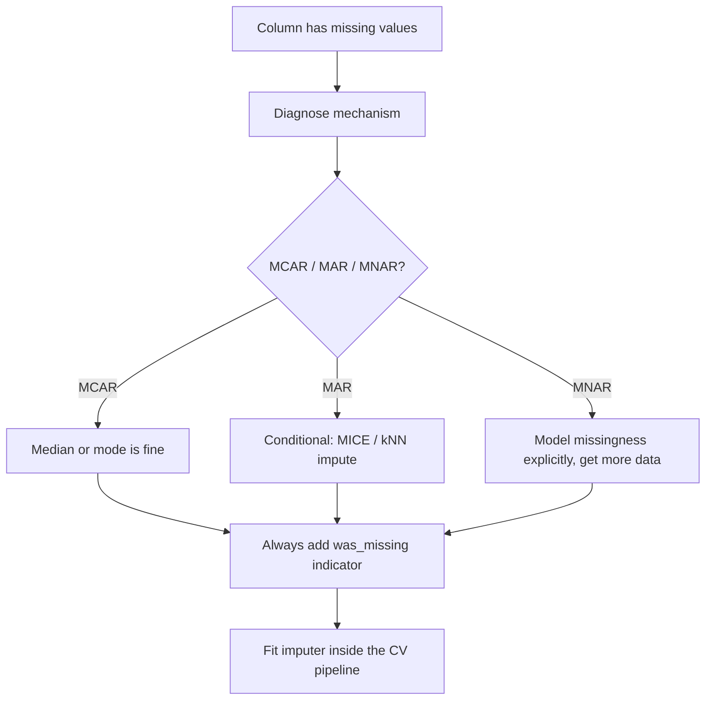

# Missing Data Handling

## TL;DR
First diagnose the **mechanism** — MCAR, MAR, MNAR — because it decides whether any imputation is
honest. Then pick: trees and XGBoost handle NaN natively and often best; median/mode imputation plus
a `was_missing` indicator is the strong simple baseline; iterative/MICE imputation is better when
missingness is MAR given observed columns. Dropping rows is only safe under MCAR and is almost never
safe at serving time, where the row still has to be scored.

## Intuition
Missingness is data. "Income not provided" on a loan application is not a hole to be patched, it is
a signal about the applicant. The mistake is to treat imputation as a cleaning step; it is a
modelling decision that either preserves that signal or erases it.

## The maths

Let $R$ be the missingness indicator matrix, $X_{\text{obs}}$ the observed entries and
$X_{\text{mis}}$ the missing ones. Rubin's taxonomy classifies $P(R \mid X_{\text{obs}}, X_{\text{mis}})$:

- **MCAR** — $P(R \mid X) = P(R)$. Missingness independent of everything. A sensor dropped packets at
  random. Complete-case analysis is unbiased, just less efficient.
- **MAR** — $P(R \mid X) = P(R \mid X_{\text{obs}})$. Missingness depends only on observed columns.
  Income missing more often for young applicants, where `age` is observed. Conditional imputation
  using the observed columns is valid.
- **MNAR** — depends on the unobserved value itself. High earners decline to state income. No
  imputation from the observed data alone recovers the truth; you need either external data or an
  explicit model of the missingness process (selection models, pattern-mixture models).

**Why mean imputation is biased even under MCAR (for anything but the mean).** Replace all missing
$x$ with $\bar{x}$. The mean is preserved but the variance is not: with fraction $p$ missing,

$$
\widehat{\operatorname{Var}}(x_{\text{imputed}}) = (1-p)\,\operatorname{Var}(x_{\text{obs}})
$$

so variance is shrunk by $(1-p)$, correlations with other variables are attenuated toward zero, and
standard errors are understated. Single imputation of any kind understates uncertainty because it
pretends the imputed value was observed.

**Multiple imputation (MICE)** addresses that. Generate $M$ imputed datasets, fit the model on each
to get $\hat{\theta}_m$, and combine with Rubin's rules:

$$
\bar{\theta} = \frac{1}{M}\sum_{m=1}^M \hat{\theta}_m, \qquad
T = \underbrace{\frac{1}{M}\sum_m U_m}_{\text{within}} + \Big(1 + \tfrac{1}{M}\Big)
\underbrace{\frac{1}{M-1}\sum_m (\hat{\theta}_m - \bar{\theta})^2}_{\text{between}}
$$

$U_m$ is the within-imputation variance from dataset $m$. The between term is what single imputation
throws away. $M = 5$–$10$ is the usual range.

**How XGBoost handles NaN.** At each split, missing values are not imputed — they are assigned as a
block to whichever child gives the larger gain, and that *default direction* is learned per node and
stored in the tree. Effectively the model learns the optimal imputation per split, conditional on
everything the path above has already decided. LightGBM does the same. This is why "just pass the
NaN to XGBoost" is a legitimate and often winning answer.

## Diagram



## Code

```python
import numpy as np
import pandas as pd
from sklearn.experimental import enable_iterative_imputer  # noqa: F401
from sklearn.impute import SimpleImputer, IterativeImputer, KNNImputer
from sklearn.pipeline import Pipeline
from sklearn.compose import ColumnTransformer
from sklearn.preprocessing import StandardScaler, OneHotEncoder
from sklearn.linear_model import LogisticRegression
from sklearn.model_selection import cross_val_score, StratifiedKFold

num = ["age", "income", "tenure"]
cat = ["city", "product"]

numeric = Pipeline([
    # add_indicator appends the was_missing flags automatically — cheap and usually helps.
    ("impute", SimpleImputer(strategy="median", add_indicator=True)),
    ("scale", StandardScaler()),
])
categorical = Pipeline([
    ("impute", SimpleImputer(strategy="constant", fill_value="__MISSING__")),
    ("ohe", OneHotEncoder(handle_unknown="ignore")),
])

pre = ColumnTransformer([("num", numeric, num), ("cat", categorical, cat)])
pipe = Pipeline([("pre", pre), ("clf", LogisticRegression(max_iter=1000))])

# The imputer's medians are recomputed on each training fold. Fitting SimpleImputer
# on the full frame before CV leaks test-set distribution into training.
# cross_val_score(pipe, df[num + cat], y, cv=StratifiedKFold(5), scoring="roc_auc")
```

Measuring whether missingness is informative — a test worth knowing:

```python
def missingness_signal(df: pd.DataFrame, y: pd.Series) -> pd.DataFrame:
    """Positive-rate difference between rows where a column is missing vs observed."""
    rows = []
    for c in df.columns:
        m = df[c].isna()
        if m.sum() == 0 or m.sum() == len(df):
            continue
        rows.append({
            "column": c,
            "missing_rate": m.mean(),
            "target_if_missing": y[m].mean(),
            "target_if_observed": y[~m].mean(),
            "lift": y[m].mean() - y[~m].mean(),
        })
    return pd.DataFrame(rows).sort_values("lift", key=abs, ascending=False)
```

A large `lift` means the indicator is a feature. It also means the mechanism is not MCAR, so a
naive median fill is throwing information away.

XGBoost with native NaN:

```python
import xgboost as xgb

# No imputation at all. missing=np.nan is the default; the learned default
# direction per node is the imputation.
model = xgb.XGBClassifier(
    n_estimators=400, max_depth=5, learning_rate=0.05, missing=np.nan,
    eval_metric="auc",
)
```

## In practice
- **Use it when:** every real tabular project. The question is never "is there missing data" but
  "what does it mean".
- **Defaults that work:** (1) compute the missingness matrix and correlate with the target before
  touching anything; (2) native NaN if the model supports it; (3) otherwise median for numeric, a
  `__MISSING__` level for categorical, plus `add_indicator=True`; (4) MICE only when you have
  evidence of MAR structure and the extra fit cost is justified; (5) drop a column above ~70–80%
  missing unless the indicator itself is predictive.
- **Breaks when:** the missingness mechanism differs between train and serving — e.g. an upstream
  field becomes mandatory, so a column that was 40% missing in training is 0% missing in production.
  The model's learned default direction is now never used and behaviour shifts silently. Monitor
  per-column missing rates as first-class drift metrics.
- **Cost / latency:** `SimpleImputer` is free. `IterativeImputer` fits one regression per column per
  round and can dominate training time on wide frames. `KNNImputer` is $O(n^2)$ in rows at transform
  time and is usually impractical at serving latency.

> [!warning]
> Imputing with statistics computed over train **and** test is the single most common leakage bug on
> this topic. The median is a statistic; computing it from the test set is reading the test set.

## Interview angle

**Q. Define MCAR, MAR and MNAR and say why the distinction matters.**
MCAR: the probability of being missing is independent of both observed and unobserved data, so
complete-case analysis is unbiased. MAR: it depends only on observed variables, so conditioning on
those observed variables — which is exactly what MICE or a conditional imputer does — gives valid
inference. MNAR: it depends on the missing value itself, so nothing in the observed data identifies
the distribution; you need external information or an explicit missingness model, and any imputation
carries an unverifiable assumption. It matters because MCAR is the only case where dropping rows is
safe, and MNAR is the only case where the honest answer is "I can't fix this with imputation".

**Follow-up.** Can you test which one you have? → You can test MCAR against MAR (Little's test, or
just: does the missingness indicator predict anything observed?). You cannot test MAR against MNAR
from the observed data alone — that is an identification problem, not a power problem. You argue it
from domain knowledge and you run a sensitivity analysis.

**Q. 30% of `income` is missing in a credit model. What do you do?**
First check whether missingness correlates with default; in lending it almost always does, because
non-disclosure is a behaviour. If it does, I keep an explicit `income_missing` flag no matter what
else I do. Then: if the model is XGBoost I pass NaN through and let the default direction be
learned. If I need a linear scorecard, I bin income into WoE bands with "missing" as its own band —
that is standard scorecard practice and it sidesteps imputation entirely. I would not mean-impute,
because it fabricates a modal applicant at the population average and erases the signal.

**Q. Why is mean imputation bad even when data is MCAR?**
It preserves the mean but shrinks variance by a factor of $(1-p)$ and attenuates correlations toward
zero, so any downstream coefficient or standard error is biased. And it is a single imputation: it
asserts the filled value with certainty, so confidence intervals are too narrow. Multiple imputation
fixes that by propagating between-imputation variance through Rubin's rules.

**Q. How does XGBoost handle missing values internally?**
It does not impute. At each split it tries sending all missing rows left and all right, computes the
gain both ways, and stores the better direction as that node's default. So the "imputation" is
learned, split-specific, and conditional on the path. That is usually better than a global median
because the right fill for income may differ by age bracket.

**Follow-up.** What if a feature is never missing in training but missing at serving? → The node has
no learned default from data; implementations fall back to a fixed direction, which is arbitrary.
That is a real production failure mode — add a schema/contract check that rejects or flags columns
whose missing rate at serving is outside the training range.

**Q. When would you drop rows?**
Only when missingness is plausibly MCAR, the fraction is small (a few percent), and I am doing
offline analysis rather than building a scorer. In production I cannot drop a row — the request
arrives and needs a prediction — so any drop-rows strategy in training creates
[[training-serving-skew]] unless serving has a matching fallback.

## Traps
- **Dropping rows with any NaN by default.** On a wide frame, "drop rows with any missing" can delete
  most of the data, and it biases the sample unless MCAR.
- **Imputing before splitting.** Leak. The imputer is a fitted transformer; it belongs in the
  `Pipeline`.
- **Imputing with zero for numeric columns.** Zero is a meaningful value for income, balance and
  temperature; the model cannot distinguish "zero" from "unknown".
- **Forgetting the missingness indicator.** Free feature, often one of the strongest, and it makes
  any imputation less damaging because the model can undo it conditionally.
- **Using KNNImputer in a low-latency service.** Transform requires neighbour search against the
  training set — fine offline, not at 20 ms p99.
- **Treating "not applicable" as "missing".** `months_since_last_claim` is not missing for a customer
  with no claims; it is undefined. Encode it as a separate category, not NaN.
- **Ignoring that imputation statistics drift.** The median income from your 2024 training set is
  the wrong fill value in 2026.

## Flashcards
MCAR / MAR / MNAR::MCAR — missingness independent of all data; MAR — depends only on observed variables; MNAR — depends on the unobserved value itself.
Which mechanism makes complete-case analysis unbiased::MCAR only.
Can you test MAR vs MNAR from the data::No — it is an identification problem; argue it from domain knowledge and run a sensitivity analysis.
Why mean imputation hurts even under MCAR::It shrinks variance by (1-p) and attenuates correlations, and as a single imputation it understates uncertainty.
Rubin's rules total variance::T = within-imputation variance + (1 + 1/M) * between-imputation variance.
How XGBoost handles NaN::It learns a default direction per node by trying missing-left vs missing-right and keeping the higher-gain option — a learned, split-local imputation.
The free feature you should always add::A was_missing binary indicator per column with meaningful missingness.
Production failure mode to monitor::A shift in per-column missing rate between training and serving — track it as a drift metric.

## Related
- [[feature-engineering]]
- [[data-leakage]]
- [[xgboost-deep-dive]]
- [[data-quality-and-validation]]
- [[outlier-detection]]
- [[training-serving-skew]]
- [[data-drift-and-concept-drift]]
