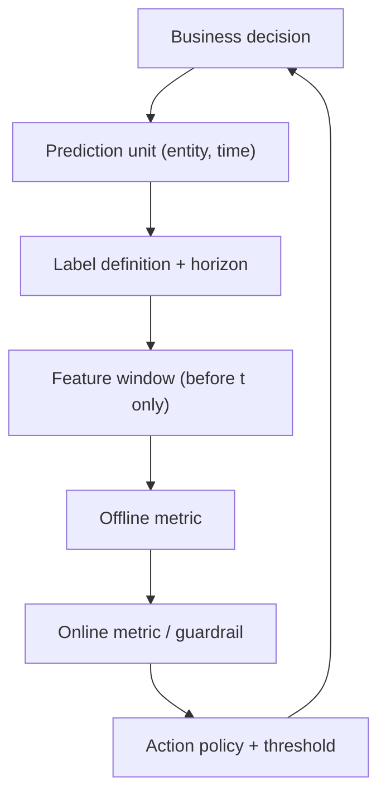

# ML Problem Framing

## TL;DR
Framing is turning a business sentence into a supervised learning problem with a defined unit of
prediction, a label with a timestamp, an offline metric that correlates with a business metric, and
a decision that consumes the prediction. Most failed ML projects failed here, not in modelling.
In interviews, the candidate who asks "what decision does this score drive?" before naming an
algorithm is the one who gets the senior band.

## Intuition
A model is a vending machine: something goes in (an entity at a point in time), something comes out
(a number), and someone *acts* on it. If you cannot name the actor and the action, you have not got
a problem — you have got a dashboard. The framing questions all fall out of that: who is the entity,
when is the prediction made, what information exists at that moment, and what does the actor do with
each possible output?

## The maths
Framing fixes four objects before any model exists.

**Prediction unit.** A tuple $(e, t)$ — entity $e$ at decision time $t$. "Customer × month",
"transaction at authorisation", "SKU × store × day". Everything downstream (train/test split,
leakage rules, feature windows) is defined relative to $t$.

**Label.** A function $y = g(e, t, \Delta)$ where $\Delta$ is the **label horizon**: the window after
$t$ in which the outcome is observed. Churn is not a fact, it is a definition — "no transaction in
the 60 days following $t$" is a different label from "closed the account within 90 days" and the two
models are not comparable.

**Feature availability constraint.** Features must be measurable using only information available at
or before $t$:

$$
x = \phi\big(\{\text{events } e_i : \tau_i \le t\}\big)
$$

Violating this is [[data-leakage]] — and it is the single most common silent bug.

**Objective.** Choose $\hat{f}$ minimising expected loss under the *deployment* distribution:

$$
\hat{f} = \arg\min_{f \in \mathcal{F}} \; \mathbb{E}_{(x,y)\sim \mathcal{D}_{\text{deploy}}}\big[L(y, f(x))\big]
$$

The gap between $\mathcal{D}_{\text{train}}$ and $\mathcal{D}_{\text{deploy}}$ is the whole game;
see [[training-serving-skew]].

**Cost-sensitive framing.** When the two error types cost differently, do not tune accuracy. With
cost $c_{\text{FP}}$ for a false positive and $c_{\text{FN}}$ for a false negative, the
expected-cost-minimising threshold on a calibrated probability $p = P(y=1\mid x)$ is

$$
p^{*} = \frac{c_{\text{FP}}}{c_{\text{FP}} + c_{\text{FN}}}
$$

Derivation: act positive when $p \cdot 0 + (1-p)\,c_{\text{FP}} < p\, c_{\text{FN}} + (1-p)\cdot 0$,
i.e. when $p > c_{\text{FP}}/(c_{\text{FP}}+c_{\text{FN}})$. This is why
[[probability-calibration]] matters more than raw ranking when a threshold drives money, and why
[[threshold-selection]] is a separate step from training.

## Diagram



## Code

```python
import pandas as pd

# Framing as code: build (entity, t) rows, label from a FUTURE window,
# features from a PAST window only.
events = pd.DataFrame({
    "customer_id": [1, 1, 1, 2, 2],
    "ts": pd.to_datetime(["2026-01-05", "2026-02-10", "2026-04-02",
                          "2026-01-20", "2026-03-15"]),
    "amount": [100.0, 250.0, 90.0, 40.0, 60.0],
})

def build_row(df, entity, t, feat_days=90, label_days=60):
    past = df[(df.customer_id == entity) & (df.ts <= t) &
              (df.ts > t - pd.Timedelta(days=feat_days))]
    future = df[(df.customer_id == entity) & (df.ts > t) &
                (df.ts <= t + pd.Timedelta(days=label_days))]
    return {
        "customer_id": entity,
        "as_of": t,
        "txn_count_90d": len(past),
        "amount_sum_90d": float(past.amount.sum()),
        "churn_60d": int(len(future) == 0),   # label = no activity in the horizon
    }

cutoff = pd.Timestamp("2026-02-28")
rows = [build_row(events, e, cutoff) for e in events.customer_id.unique()]
print(pd.DataFrame(rows))
```

The `as_of` column is not decoration — it is what you sort by for
[[time-series-features-and-validation]] style splitting, and what you join on in a feature store
([[feature-stores]]) to get point-in-time-correct features.

## In practice
- **Use it when:** always, and explicitly at the start of any case round. Write the prediction unit
  on the whiteboard in the first two minutes.
- **Defaults that work:** start with the simplest unit that supports the decision; pick a label
  horizon matching the action's lead time (a retention offer that takes 2 weeks to act needs a
  horizon longer than 2 weeks); define one primary offline metric plus one guardrail.
- **Breaks when:** the label is defined by the current system's behaviour (a fraud label that only
  exists for transactions the old rules flagged is a selection-biased label); the horizon is longer
  than the business can wait to retrain; the "prediction" is really a causal question — uplift, not
  propensity. See [[causal-inference-basics]].
- **Cost / latency:** the decision point fixes your latency budget. A score consumed at checkout
  needs online inference; a score consumed in a Monday campaign is a batch job. Decide this during
  framing, not after the model exists — see [[batch-vs-realtime-inference]].

## Interview angle

**Q. A product manager says "build a model to reduce churn." What do you ask first?**
What action follows the score, and who takes it. If the answer is "we send a discount," then the
real problem is uplift — who churns *and* is persuadable — not who churns. Then: what is the entity
and scoring cadence, what defines churn and over what horizon, what data exists at scoring time, and
what would success look like as a number we could read in a month.

**Follow-up.** *How would you do the uplift version with the same data?* → You cannot, without
randomisation. You need a holdout that gets no offer. Simplest practical design: two-model approach
(one trained on treated, one on control, score the difference), or a single model with treatment as
a feature and score $\hat{f}(x, T{=}1) - \hat{f}(x, T{=}0)$. Both need an experiment first.

**Q. How do you choose the offline metric?**
Pick the one whose improvement mechanically implies improvement in the business number, given the
action policy. If the team acts on a top-$k$ list, optimise precision@k or PR-AUC, not ROC-AUC. If a
monetary threshold drives the action, optimise a calibrated log loss and set the threshold from
costs. Detail in [[classification-metrics]] and [[roc-auc-and-pr-curves]].

**Q. The label takes 90 days to mature. How do you ship anything this quarter?**
Two moves. First, use a proxy label that matures fast and correlates with the real one (30-day
inactivity as a proxy for 90-day churn), validated by measuring the correlation on historical
cohorts. Second, train on cohorts old enough to have matured labels and accept that your most recent
90 days are unlabelled — that is normal, and it is why the test set must be a *later* period, not a
random sample.

**Q. When is the honest answer "don't use ML"?**
When a deterministic rule captures most of the value (a business rule on three fields), when there
are not enough positive examples to learn anything (a few dozen fraud cases), when the cost of a
wrong prediction is unbounded and unreviewable, or when no one will change behaviour because of the
score. Saying this in an interview reads as senior, not lazy — but always follow it with the
baseline you would ship instead.

**Q. What is your baseline?**
The current process, quantified. If ops currently flags accounts by a rule, measure that rule's
precision and recall on the same test set. A model that beats a random baseline but loses to the
existing rule is a negative result, and reporting it that way is the point.

## Traps
- **"Accuracy is the metric."** Wrong on any skewed problem — 99% accuracy on 1% fraud is the
  constant-zero model. State the class balance before you state a metric. See
  [[imbalanced-classification]].
- **Defining the label after looking at the features.** That is how "customer called support" ends
  up predicting "customer churned" — the call happened *because* of the cancellation.
  Fix the timeline first.
- **Random train/test split on a temporal problem.** Leaks the future into the past. Use a
  time-based split — [[train-test-validation-split]].
- **Assuming labels are objective.** Churn, fraud, "good lead" and "relevant document" are all
  policy choices. Write the definition down and get it signed off; two stakeholders will otherwise
  have two definitions.
- **Optimising a metric the action cannot move.** Improving AUC from 0.81 to 0.83 changes nothing
  if ops can only review 200 cases a day — that is a precision@200 problem.
- **Skipping feasibility of the data at serving time.** A feature that exists in the warehouse but
  not in the request payload is a feature you cannot use. Check serving availability during framing.

## Flashcards
What is a prediction unit::The (entity, decision-time) tuple that one row of training data represents — e.g. customer × month, or transaction at authorisation.
Why does a label need a horizon::Because outcomes are only observed within a window after the decision time; changing the window changes the label and makes models incomparable.
Cost-optimal threshold on calibrated probability::p* = c_FP / (c_FP + c_FN) — act positive above it.
First question to ask about any ML request::What decision does the prediction drive, and who takes the action?
Propensity vs uplift::Propensity = who will churn; uplift = who churns only if untreated. Uplift needs randomised treatment data.
Why a proxy label::When the real label matures too slowly to train or iterate; validate by correlating proxy and true label on historical cohorts.
Sign that ML is the wrong tool::A deterministic rule captures most value, positives are too few, or nobody changes behaviour based on the score.

## Related
- [[supervised-vs-unsupervised]]
- [[data-leakage]]
- [[train-test-validation-split]]
- [[classification-metrics]]
- [[threshold-selection]]
- [[ml-system-design-framework]]
- [[requirements-and-metrics-definition]]
- [[moc-classical-ml]]
