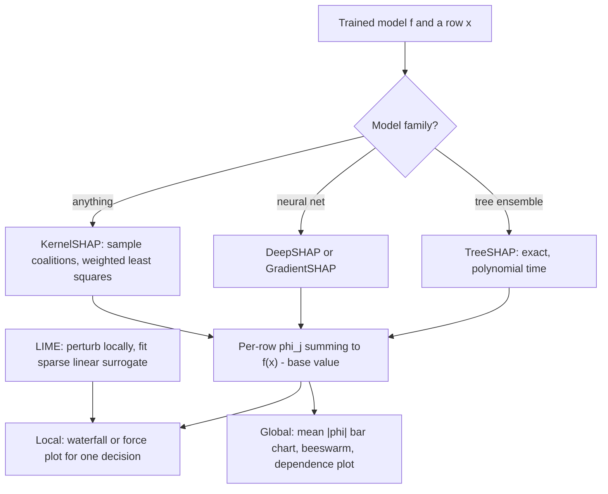

# Model Interpretability — SHAP and LIME

## TL;DR
SHAP attributes a prediction to features using Shapley values from cooperative game theory: the average
marginal contribution of each feature across all possible orderings. It is the only additive attribution
satisfying local accuracy, missingness and consistency simultaneously — and TreeSHAP computes it exactly
in polynomial time for tree ensembles. LIME instead fits a sparse local surrogate around one point:
cheaper, model-agnostic, and much less stable. Both mislead when features are correlated.

## Intuition
Four people jointly earn ₹100. How much did each contribute? Shapley's answer: consider every order in
which they could have joined the team, measure how much the total rose when each person joined, and
average over all orders. The features of a prediction form the same kind of coalition — the "payout" is
how far the prediction sits from the average prediction, and SHAP splits that gap fairly among features.

LIME asks a different question: near this one point, what simple linear model imitates the black box?
Useful, but the answer depends on how you define "near".

## The maths

### Shapley values
Let $N$ be the set of $d$ features and $v(S)$ the model output using only the features in coalition
$S \subseteq N$. The Shapley value of feature $j$ is

$$
\phi_j = \sum_{S \subseteq N \setminus \{j\}} \frac{|S|!\,(d - |S| - 1)!}{d!}\Big[v(S \cup \{j\}) - v(S)\Big]
$$

The fraction is the probability of that coalition arising in a uniformly random ordering, so $\phi_j$ is
the expected marginal contribution of $j$ over all $d!$ permutations.

Shapley values are the unique attribution satisfying four axioms:

- **Efficiency / local accuracy**: $\sum_j \phi_j = v(N) - v(\emptyset)$ — the attributions sum exactly to
  the gap between this prediction and the base value.
- **Symmetry**: two features with identical marginal contributions get equal credit.
- **Dummy**: a feature that never changes $v$ gets $\phi_j = 0$.
- **Additivity**: attributions for a sum of models are the sum of attributions — this is what makes
  TreeSHAP over an ensemble the sum of per-tree values.

That uniqueness theorem is why SHAP is defended and gain importance is not.

### The SHAP model
SHAP defines $v(S) = \mathbb{E}\big[f(x) \mid x_S\big]$ — the expected prediction given the features in
$S$ are fixed at the observed values. The explanation is the additive surrogate

$$
f(x) \approx \phi_0 + \sum_{j=1}^{d}\phi_j, \qquad \phi_0 = \mathbb{E}[f(X)]
$$

**Consistency** is the property gain importance lacks: if you change the model so that a feature's
marginal contribution never decreases, its SHAP value cannot decrease. Split-gain importance can and does
go *down* when a feature is made more influential, which makes it unusable for comparing models.

The practical subtlety is how $\mathbb{E}[f(x)\mid x_S]$ is estimated. Two choices:

- **Interventional / marginal**: replace the missing features with samples from the marginal
  distribution — $\mathbb{E}_{x_{\bar S}}[f(x_S, x_{\bar S})]$. This is a *causal* intervention on the
  model and can evaluate $f$ at impossible feature combinations (age 25, 40 years of service).
- **Conditional / observational**: sample from $P(x_{\bar S}\mid x_S)$, staying on the data manifold but
  spreading credit to correlated features that the model never actually used.

Neither is "right"; they answer different questions, and the difference only appears under correlation.

### Why exact SHAP is expensive, and TreeSHAP
The sum is over $2^d$ coalitions — intractable beyond ~20 features. Practical estimators:

- **KernelSHAP**: model-agnostic. Samples coalitions and solves a weighted least squares problem with the
  Shapley kernel $\pi(S) = \frac{d-1}{\binom{d}{|S|}|S|(d-|S|)}$ — the weighting that makes the linear
  regression solution equal the Shapley values. Slow: thousands of model calls per explained row.
- **TreeSHAP**: exact, for tree ensembles, in $O(T L D^2)$ where $T$ = trees, $L$ = max leaves,
  $D$ = max depth. It works by pushing all $2^d$ subsets down each tree simultaneously, tracking the
  proportion of subsets that reach each node. Exponential → polynomial. This is why SHAP is practical on
  XGBoost and nearly nobody runs KernelSHAP at scale.
- **DeepSHAP / GradientSHAP**: backprop-based approximations for neural nets.

### LIME
For a point $x$, LIME solves

$$
\xi(x) = \arg\min_{g \in G}\ \mathcal{L}\big(f, g, \pi_x\big) + \Omega(g)
$$

where $G$ is a class of interpretable models (usually sparse linear), $\pi_x$ is a proximity kernel
(commonly $\exp(-D(x,z)^2/\sigma^2)$), $\mathcal{L}$ is weighted squared error over perturbed samples $z$,
and $\Omega$ penalises complexity (number of non-zero coefficients). In words: perturb the input, get
black-box predictions, fit a weighted sparse linear model, report its coefficients.

LIME's weakness is $\sigma$. The explanation can change materially with the kernel width and with the
random perturbations — run LIME twice on the same point and you can get different top features. SHAP is
deterministic given its background set; LIME is not. In fact KernelSHAP *is* LIME with a specific choice
of kernel, loss and regulariser — the choice that makes the result satisfy the Shapley axioms.

### Global importance: permutation vs gain vs SHAP

| Method | What it measures | Failure mode |
|---|---|---|
| Split gain / impurity | Total loss reduction from splits on the feature, on training data | Biased toward high-cardinality and continuous features; inconsistent; computed on training data so it rewards overfitting |
| Permutation | Drop in held-out score when the column is shuffled | Evaluates impossible feature combinations under correlation; correlated features share credit so both look unimportant |
| Mean \|SHAP\| | Average magnitude of per-row attribution | Consistent and local-to-global, but still splits credit among correlated features |

Permutation importance answers "what does this trained model *need*", not "what is informative". Drop a
feature and retrain, and a correlated substitute takes over with no loss — so a zero permutation
importance never means the feature is useless.

### Why SHAP misleads with correlated features
Three distinct problems:

1. **Credit splitting.** If $x_1$ and $x_2$ are near-duplicates and the model uses only $x_1$, the
   conditional formulation gives both roughly half the credit, while the interventional one gives $x_1$
   all of it. Your "top features" table depends on a methodological choice most people never make
   explicitly.
2. **Off-manifold evaluation.** Interventional SHAP asks the model for $f$ at feature combinations that
   never occur. Tree models extrapolate arbitrarily there, so the attribution reflects the model's
   behaviour in regions where it was never trained and never validated.
3. **Causal misreading.** SHAP explains the *model*, never the world. A high SHAP value on
   `number_of_support_calls` for churn does not mean reducing support calls reduces churn — both are
   effects of dissatisfaction. Stakeholders will make this error unless you pre-empt it
   ([[causal-inference-basics]]).

## Diagram



## Code

```python
import numpy as np
import shap
import xgboost as xgb
from sklearn.datasets import fetch_california_housing
from sklearn.model_selection import train_test_split

X, y = fetch_california_housing(return_X_y=True, as_frame=True)
Xtr, Xte, ytr, yte = train_test_split(X, y, test_size=0.2, random_state=0)

model = xgb.XGBRegressor(n_estimators=400, max_depth=5, learning_rate=0.05,
                         subsample=0.8, n_jobs=-1, random_state=0).fit(Xtr, ytr)

# TreeSHAP: exact Shapley values for tree ensembles.
explainer = shap.TreeExplainer(model)
sv = explainer(Xte)                      # Explanation object: .values, .base_values, .data

# Local accuracy check - the defining axiom, worth verifying out loud.
recon = sv.values.sum(axis=1) + sv.base_values
assert np.allclose(recon, model.predict(Xte), atol=1e-4)
print("local accuracy holds: sum(phi) + base == prediction")
```

```python
# Global view, derived from the local values - this is the key SHAP idea.
mean_abs = np.abs(sv.values).mean(axis=0)
for name, imp in sorted(zip(X.columns, mean_abs), key=lambda t: -t[1])[:5]:
    print(f"{name:<12} mean|SHAP| = {imp:.4f}")

shap.plots.beeswarm(sv)                  # distribution and direction per feature
shap.plots.waterfall(sv[0])              # one prediction, decomposed
shap.plots.scatter(sv[:, "MedInc"], color=sv)   # dependence plot with interaction colouring
```

Comparing the three importance notions — the point is that they disagree:

```python
from sklearn.inspection import permutation_importance

perm = permutation_importance(model, Xte, yte, n_repeats=10, random_state=0, n_jobs=-1)
gain = model.get_booster().get_score(importance_type="gain")

import pandas as pd
cmp = pd.DataFrame({
    "gain":        [gain.get(c, 0.0) for c in X.columns],
    "permutation": perm.importances_mean,
    "mean_abs_shap": mean_abs,
}, index=X.columns)
print(cmp.rank(ascending=False).astype(int).sort_values("mean_abs_shap"))
```

Interventional vs conditional under correlation — reproduce the disagreement yourself:

```python
# `data=` makes TreeSHAP use the interventional (marginal) expectation against a background set.
interventional = shap.TreeExplainer(
    model, data=shap.sample(Xtr, 200), feature_perturbation="interventional"
)(Xte[:500])

tree_path = shap.TreeExplainer(model, feature_perturbation="tree_path_dependent")(Xte[:500])

print("rank correlation of global importance between the two:",
      pd.Series(np.abs(interventional.values).mean(0))
        .corr(pd.Series(np.abs(tree_path.values).mean(0)), method="spearman"))
```

LIME, for contrast:

```python
from lime.lime_tabular import LimeTabularExplainer

lime_exp = LimeTabularExplainer(Xtr.values, feature_names=list(X.columns), mode="regression")
for seed in (0, 1):
    e = lime_exp.explain_instance(Xte.values[0], model.predict, num_features=5)
    print(seed, e.as_list())
# Run it twice: the coefficients, and sometimes the ordering, move. That instability is the point.
```

## In practice
- **Use it when:** a human must act on the output (credit declines, fraud review queues, medical triage),
  regulation requires an explanation, you are debugging a model that behaves oddly, or you need to spot
  leakage — a nonsensical feature dominating the SHAP ranking is the loudest leakage alarm there is
  ([[data-leakage]]).
- **Defaults that work:** `TreeExplainer` for tree ensembles, always; a background sample of 100–1000
  rows for interventional SHAP; beeswarm for the global picture, waterfall for a single decision,
  dependence plots to spot interactions. Log SHAP summary plots as MLflow artefacts per training run so
  you can diff importance across versions ([[experiment-tracking-mlflow]]).
- **Breaks when:** features are heavily correlated (credit splits arbitrarily); you need causal claims
  (SHAP explains the model, not the world); the model is a pipeline whose SHAP values are in a transformed
  space that stakeholders cannot read; or the audience wants a rule, not an attribution — in which case
  a surrogate decision tree or a monotonic-constrained GBM is a better deliverable than a SHAP plot.
- **Cost / latency:** TreeSHAP is roughly $O(TLD^2)$ per row and comfortably runs in batch on Spark
  (map over partitions with a broadcast booster). KernelSHAP costs thousands of model calls per row —
  fine for a handful of explanations, hopeless for a nightly batch of millions. If you need real-time
  explanations, precompute them in batch or restrict to trees.

> [!warning]
> Never present a SHAP plot without stating that it explains the model's behaviour, not a causal effect.
> Stakeholders will otherwise design an intervention from it. The sentence to have ready: "this shows
> what drives the prediction, not what would happen if we changed the feature."

## Interview angle

**Q. What is a Shapley value and why is it the right notion of attribution?**
The average marginal contribution of a feature across all possible orderings of features joining the
coalition. It is the *unique* attribution satisfying efficiency (contributions sum to the prediction
minus the base value), symmetry, dummy and additivity. That uniqueness theorem is the argument — not
that SHAP is popular, but that any attribution with those four properties is Shapley.

**Follow-up.** What does consistency give you that gain importance does not? → If you modify the model so
a feature's marginal contribution never decreases, its SHAP value cannot go down. Gain importance can
decrease in exactly that situation, so you cannot compare gain importances across two models — a fairly
serious flaw for something people put in slide decks.

**Q. Why is TreeSHAP fast when exact Shapley is exponential?**
Because trees have structure. Instead of enumerating $2^d$ coalitions, TreeSHAP pushes all subsets down
each tree at once, tracking at each node what fraction of subsets reach it — giving exact values in
$O(TLD^2)$. Additivity then lets you sum per-tree attributions for the ensemble.

**Q. How does SHAP relate to LIME?**
KernelSHAP is LIME with a particular proximity kernel, loss and regulariser — the ones that force the
fitted local linear coefficients to equal the Shapley values. LIME leaves those choices free, so it is
faster and more flexible but has no axiomatic guarantee, is not additive, and is unstable across
perturbation seeds and kernel widths.

**Q. My two most important SHAP features are `city` and `pincode`, which are nearly redundant. What is
happening?**
Credit splitting under correlation. The tree-path-dependent estimator effectively uses a conditional
expectation and spreads attribution across correlated features regardless of which one the model actually
split on; the interventional estimator concentrates it but evaluates the model at impossible feature
combinations. Neither is wrong; they answer different questions. I would decide which question I mean,
say so, and ideally drop one of the redundant features before explaining at all.

**Q. Permutation importance says a feature is useless. Can I drop it?**
Not from that evidence alone. Permutation importance measures what *this trained model relies on*. A
correlated substitute can carry the same information, so both features permute to near-zero while the
information is genuinely used. The test for "can I drop it" is drop-column retraining, or a grouped
permutation over the correlated cluster.

**Q. A regulator asks why a loan was declined. Is a SHAP waterfall enough?**
It is a good start — it gives a signed, additive attribution summing exactly to the score. But it is a
statement about the model, and adverse-action reasoning usually wants counterfactual language ("your
score would have been approved if income were above X"), which is a different computation. I would pair
SHAP with counterfactual examples, and prefer a monotonic-constrained model so the direction of each
feature's effect is guaranteed and explainable in one sentence.

## Traps
- **Reading SHAP causally.** It explains the model. Full stop.
- **Using `feature_importances_` (gain) for anything a stakeholder sees.** Biased toward high-cardinality
  features, computed on training data, and inconsistent across models.
- **Explaining a model that is not yet validated.** An explanation of an overfit model is an explanation
  of noise. Establish generalisation first.
- **Ignoring the background dataset.** Interventional SHAP values are defined relative to it; a
  background of all-zeros or an unrepresentative sample changes every number.
- **Treating zero permutation importance as "feature is irrelevant."** Correlated substitutes hide it.
- **Averaging signed SHAP values for global importance.** They cancel. Use mean absolute value.
- **Running KernelSHAP on millions of rows.** Thousands of model evaluations each; use TreeSHAP or
  precompute.
- **Explaining post-transformation features.** A SHAP value on `pca_component_7` or a target-encoded
  column is unreadable to a business user; map back or explain a simpler model.
- **Presenting LIME output from a single run as stable.** Re-run with different seeds before trusting it.

## Flashcards
Define the Shapley value in words.::The average marginal contribution of a feature over all possible orderings in which features join the coalition.
Name the four axioms Shapley values uniquely satisfy.::Efficiency (local accuracy), symmetry, dummy, and additivity.
What does local accuracy mean for SHAP?::$\sum_j \phi_j + \phi_0 = f(x)$ — the attributions plus the base value reconstruct the prediction exactly.
Why is TreeSHAP polynomial rather than exponential?::It propagates all feature subsets through each tree simultaneously, tracking the fraction of subsets reaching each node — $O(TLD^2)$.
How does KernelSHAP relate to LIME?::KernelSHAP is LIME with the specific kernel, loss and regulariser that make the local linear coefficients equal the Shapley values.
Interventional vs conditional SHAP — the difference?::Interventional samples missing features from the marginal (can evaluate impossible points); conditional samples from $P(x_{\bar S}\mid x_S)$ (stays on-manifold but spreads credit to correlated features).
Why is gain importance unusable for model comparison?::It is inconsistent — making a feature more influential can lower its gain importance — and it is biased toward high-cardinality features.
What does permutation importance actually measure?::What the trained model relies on, not what is informative; a correlated substitute makes both features look unimportant.

## Related
- [[xgboost-deep-dive]] — the model TreeSHAP was built for
- [[feature-selection]] — importance measures and their proper use
- [[data-leakage]] — SHAP as a leakage detector
- [[causal-inference-basics]] — why attribution is not effect
- [[decision-trees]] — the structure TreeSHAP exploits
- [[random-forest]] — impurity importance and its bias
- [[model-monitoring]] — tracking importance drift across retrains
