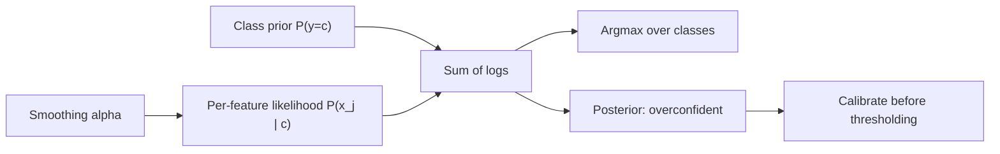

# Naive Bayes

## TL;DR
Naive Bayes applies Bayes' theorem with the assumption that features are conditionally independent
given the class, which reduces a joint density over $p$ features to a product of $p$ univariate
densities. That assumption is almost always false, yet the classifier often ranks well because the
argmax survives distortions that the probabilities do not. It trains in one pass, needs almost no
data, and produces badly calibrated probabilities.

## Intuition
You are trying to work out which of two authors wrote a document. The correct approach models how
words co-occur, which is hopeless with limited data. Naive Bayes pretends every word was drawn
independently from that author's vocabulary and just multiplies the per-word evidence. Correlated
words ("New" and "York") get counted twice, so the confidence is wildly overstated — but the
*winner* is usually still right, because the double-counting inflates both classes' scores in
roughly the same direction.

## The maths

**Bayes' theorem** ([[bayes-theorem-and-conditional-probability]]):

$$
P(y = c \mid x) = \frac{P(x \mid y=c)\,P(y=c)}{P(x)}
$$

$P(x)$ is constant across classes, so for classification

$$
\hat{y} = \arg\max_{c} \; P(y=c) \, P(x \mid y = c)
$$

**The naive assumption.** Modelling $P(x_1,\dots,x_p \mid y)$ needs exponentially many parameters.
Assume conditional independence given the class:

$$
P(x_1,\dots,x_p \mid y=c) = \prod_{j=1}^{p} P(x_j \mid y=c)
$$

so

$$
\hat{y} = \arg\max_{c}\;\Big[\log P(y=c) + \sum_{j=1}^{p} \log P(x_j \mid y=c)\Big]
$$

Work in logs: products of thousands of small probabilities underflow.

**Why it is a linear classifier.** For the Bernoulli or multinomial case the log-posterior is
$\log P(y=c) + \sum_j x_j \log \theta_{cj}$ — linear in $x$. So the decision boundary is a
hyperplane, exactly like [[logistic-regression]]; the difference is entirely in how the weights are
estimated. Naive Bayes is the **generative** estimator (fit $P(x\mid y)$ by counting, apply Bayes);
logistic regression is the **discriminative** one (fit $P(y\mid x)$ directly by maximising conditional
likelihood). Generative converges faster to its (higher) asymptotic error; discriminative is slower
but reaches a lower asymptote. That is the crossover interviewers like to probe: Naive Bayes wins at
small $n$, logistic regression wins as $n$ grows.

**Variants.**
- **Multinomial**: features are counts. $P(x_j \mid c) = \theta_{cj}$ with
  $\hat\theta_{cj} = \dfrac{N_{cj} + \alpha}{N_c + \alpha p}$ — Laplace/Lidstone smoothing.
- **Bernoulli**: features are binary presence indicators; explicitly models absence as evidence.
- **Gaussian**: continuous features, $P(x_j \mid c) = \mathcal{N}(\mu_{cj}, \sigma_{cj}^2)$ fitted by
  per-class mean and variance. With a *shared* covariance this becomes LDA; the diagonal-covariance
  restriction is exactly the naive assumption.
- **Complement NB**: uses statistics from all classes *other* than $c$, which is more robust on
  imbalanced text.

**Why smoothing is not optional.** If a token never appears in class $c$ in training, $\hat\theta_{cj}
= 0$, and one zero annihilates the entire product — the class is ruled out on a single unseen word.
Additive smoothing with $\alpha = 1$ (Laplace) is the MAP estimate under a symmetric Dirichlet prior
$\text{Dir}(\alpha+1)$; $\alpha \in [0.01, 1]$ is the usual tuning range.

**Why calibration is bad.** Correlated features contribute nearly-duplicate log-evidence, so the
summed log-odds are inflated by roughly the redundancy factor. The result is posteriors pinned near
0 or 1. The *ordering* is largely preserved, so AUC can be decent while log loss and Brier score are
terrible. Fix with Platt scaling or isotonic regression ([[probability-calibration]]) — and never
threshold a raw Naive Bayes probability against a cost-derived cutoff.

## Diagram



## Code

```python
import numpy as np
from sklearn.datasets import fetch_20newsgroups
from sklearn.feature_extraction.text import TfidfVectorizer, CountVectorizer
from sklearn.naive_bayes import MultinomialNB, ComplementNB
from sklearn.pipeline import make_pipeline
from sklearn.linear_model import LogisticRegression
from sklearn.metrics import accuracy_score, log_loss

cats = ["sci.space", "rec.sport.hockey", "talk.politics.misc"]
tr = fetch_20newsgroups(subset="train", categories=cats, remove=("headers", "footers", "quotes"))
te = fetch_20newsgroups(subset="test", categories=cats, remove=("headers", "footers", "quotes"))

nb = make_pipeline(CountVectorizer(min_df=2), MultinomialNB(alpha=0.1)).fit(tr.data, tr.target)
lr = make_pipeline(TfidfVectorizer(min_df=2),
                   LogisticRegression(max_iter=2000)).fit(tr.data, tr.target)

for name, m in [("MultinomialNB", nb), ("LogReg", lr)]:
    p = m.predict_proba(te.data)
    print(f"{name:<14} acc={accuracy_score(te.target, p.argmax(1)):.3f} "
          f"logloss={log_loss(te.target, p):.3f}")

# Small-sample regime: NB degrades far more gracefully.
for n in [30, 100, 400]:
    idx = np.random.RandomState(0).choice(len(tr.data), n, replace=False)
    sub = [tr.data[i] for i in idx]; suby = tr.target[idx]
    a = make_pipeline(CountVectorizer(min_df=1), MultinomialNB(alpha=0.1)).fit(sub, suby)
    b = make_pipeline(TfidfVectorizer(min_df=1),
                      LogisticRegression(max_iter=2000)).fit(sub, suby)
    print(f"n={n:>4}  NB={accuracy_score(te.target, a.predict(te.data)):.3f} "
          f"LR={accuracy_score(te.target, b.predict(te.data)):.3f}")
```

Expect Naive Bayes to be close to or ahead of logistic regression at $n=30$ and behind it by
$n=400$ — that crossover is the empirical version of the generative/discriminative argument.

## In practice
- **Use it when:** you need a baseline in five minutes, on text or high-dimensional sparse counts,
  with very little labelled data, or under tight training-cost constraints. It is also a genuinely
  good streaming model — counts update incrementally, so `partial_fit` works naturally.
- **Defaults that work:** `MultinomialNB(alpha=0.1)` on raw counts (or TF-IDF, which often helps
  despite violating the count model), `ComplementNB` when classes are imbalanced,
  `GaussianNB(var_smoothing=1e-9)` for continuous features after checking each feature is roughly
  unimodal per class.
- **Breaks when:** features are strongly correlated (duplicated evidence), you need calibrated
  probabilities, features are continuous and far from Gaussian, or a categorical level is unseen at
  serving time and smoothing was disabled.
- **Cost / latency:** training is a single pass of counting, $O(n \cdot \bar{d})$ for average
  non-zeros $\bar{d}$; prediction is a sparse dot product. It is the cheapest classifier that is not
  a constant, which is why it survives in spam filters and first-pass routing.

## Interview angle

**Q. What is "naive" about Naive Bayes, and why does it still work?**
The assumption that features are conditionally independent given the class. It works because
classification only needs the *argmax* of the posterior, not its value. Correlated features distort
each class's log-score, but often in a way that preserves the ranking. Precisely: Naive Bayes can be
badly wrong about $P(y\mid x)$ and still put the right class on top.

**Follow-up.** *So when does the ranking break too?* → When the correlation structure differs
*between* classes. If two features are redundant in class A but independent in class B, the
double-counting inflates A only, and the argmax genuinely flips.

**Q. Generative vs discriminative — where does Naive Bayes sit and what does that buy you?**
Generative: it models $P(x\mid y)$ and the prior, then inverts with Bayes. The payoff is sample
efficiency — parameter estimates are simple counts, so it converges at roughly $O(\log p)$ examples
versus $O(p)$ for the discriminative pair — and the ability to generate data and handle missing
features by marginalising. The cost is a higher asymptotic error because the model of $P(x\mid y)$ is
wrong. Logistic regression is the discriminative counterpart with the same hypothesis class.

**Q. Why do you need Laplace smoothing?**
Without it, a feature value unseen for a class gives $\hat{P}(x_j \mid c) = 0$, and because the
scores are products, that single zero eliminates the class no matter what the other 10 000 features
say. Additive smoothing is the MAP estimate under a Dirichlet prior and keeps every estimate
strictly positive.

**Q. Your Naive Bayes spam filter has 0.94 AUC but log loss of 2.1. Explain.**
Classic Naive Bayes calibration failure. Correlated tokens contribute near-duplicate evidence, so the
posterior saturates at 0 or 1; ranking survives (good AUC) while the probability values are
nonsense (bad log loss). Fix by wrapping it in `CalibratedClassifierCV` with sigmoid or isotonic
calibration fitted on a held-out fold, then set the threshold from costs.

**Q. Would you use Naive Bayes in production today for text?**
As a baseline and as a latency-critical first-pass filter, yes. As the final model, rarely — a
linear model over TF-IDF usually beats it once you have a few thousand labels, and a fine-tuned
transformer or an embedding-plus-classifier beats that ([[embeddings]]). But the NB number is what
tells you whether the expensive model is earning its cost.

## Traps
- **"Naive Bayes assumes features are independent."** It assumes *conditional* independence given the
  class, which is a weaker and different claim.
- **Trusting its probabilities.** They are systematically overconfident. Calibrate before using them
  for anything with a threshold or an expected-value calculation.
- **Turning off smoothing (`alpha=0`) because it "distorts the estimates".** It converts a soft
  penalty into a hard veto on unseen tokens.
- **Using `GaussianNB` on skewed or multimodal features without a transform.** The per-class normal
  fit is then simply wrong; log or quantile transforms help ([[feature-scaling-and-transforms]]).
- **Feeding `MultinomialNB` negative values.** Standardised features break it — multinomial NB needs
  non-negative counts or TF-IDF weights.
- **Claiming it cannot handle correlated features at all.** It handles them; it just miscounts the
  evidence. The practical failure mode is calibration, not usually accuracy.
- **Forgetting to use log-space.** Multiplying thousands of probabilities underflows to zero in
  float64.

## Flashcards
The naive assumption::Features are conditionally independent given the class, so P(x|y) factorises into a product of univariate terms.
Naive Bayes decision rule::argmax over c of [log P(y=c) + Σ_j log P(x_j | y=c)] — computed in log space to avoid underflow.
Why is Naive Bayes a linear classifier::For multinomial/Bernoulli the log-posterior is linear in x, so the boundary is a hyperplane — same class as logistic regression, different estimator.
Generative vs discriminative pairing::Naive Bayes estimates P(x|y) generatively; logistic regression estimates P(y|x) discriminatively. NB wins at small n, LR at large n.
Laplace smoothing formula::θ̂_cj = (N_cj + α) / (N_c + αp) — the MAP estimate under a symmetric Dirichlet prior.
Why smoothing is essential::A single unseen feature value gives probability zero and annihilates the whole product for that class.
Why are Naive Bayes probabilities overconfident::Correlated features contribute duplicated log-evidence, pushing posteriors toward 0 or 1 while leaving the ranking mostly intact.
Which variant for imbalanced text::ComplementNB, which estimates parameters from the complement of each class.

## Related
- [[bayes-theorem-and-conditional-probability]]
- [[logistic-regression]]
- [[probability-calibration]]
- [[text-preprocessing]]
- [[classification-metrics]]
- [[curse-of-dimensionality]]
- [[moc-classical-ml]]
