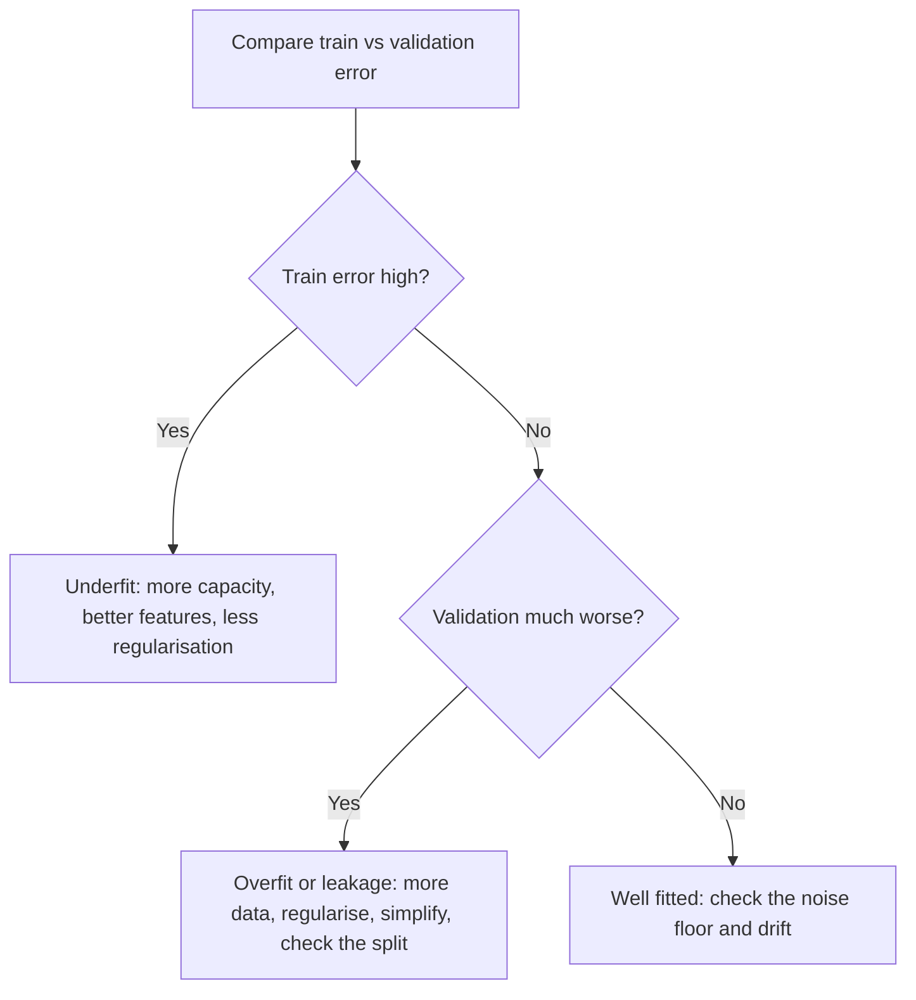

# Overfitting and Underfitting

## TL;DR
Overfitting is fitting the noise: training error keeps falling while validation error rises.
Underfitting is a model class too rigid to capture the signal: both errors are high and close.
Diagnose from the gap between training and validation error plus the shape of the learning curve,
then apply the matching remedy — capacity down for overfit, capacity up for underfit. A large gap
that appears suddenly is usually leakage or a split bug, not classical overfitting.

## Intuition
A student who memorises past papers scores 100% on them and fails the exam (overfit). A student who
only learned "answer C" gets a consistent 25% everywhere (underfit). The revealing test is not the
score on the practice papers — it is the difference between the two scores.

## The maths

Generalisation gap:

$$
\text{gap} = R(\hat{f}) - \hat{R}_{\text{train}}(\hat{f})
$$

Classical bounds have the form

$$
R(\hat{f}) \;\le\; \hat{R}_{\text{train}}(\hat{f}) + O\!\left(\sqrt{\frac{h + \log(1/\delta)}{n}}\right)
$$

with probability $1-\delta$, where $h$ is a capacity measure (VC dimension, or an effective
parameter count). Two readings that matter in interviews:

1. The gap shrinks like $1/\sqrt{n}$ — quadrupling the data roughly halves it. That is why "more
   data" is a *variance* remedy and why its returns are slow.
2. The gap grows with capacity $h$. Capacity is not just parameter count: for ridge the **effective
   degrees of freedom** is

$$
\mathrm{df}(\lambda) = \operatorname{tr}\big(X(X^\top X + \lambda I)^{-1}X^\top\big)
= \sum_{j=1}^{p} \frac{d_j^{2}}{d_j^{2} + \lambda}
$$

where $d_j$ are the singular values of $X$. At $\lambda = 0$ this is $p$; as $\lambda \to \infty$ it
goes to $0$. So one continuous knob moves capacity smoothly, which is exactly what you want for
tuning.

**Why training error is not an estimate of test error.** With $p$ free parameters fitted by least
squares on $n$ points, $\mathbb{E}[\hat{R}_{\text{train}}] = \sigma^2 (1 - p/n)$ while the expected
in-sample prediction error is $\sigma^2(1 + p/n)$. The difference $2\sigma^2 p/n$ — the optimism —
is exactly the correction Mallows' $C_p$ and AIC apply:

$$
\mathrm{AIC} = -2\log \hat{L} + 2p, \qquad \mathrm{BIC} = -2\log \hat{L} + p\log n
$$

BIC penalises capacity harder for large $n$, so it selects smaller models than AIC. Both are
analytic stand-ins for what cross-validation measures directly.

**Connection to the decomposition.** Underfitting = bias-dominated; overfitting = variance-dominated
— see [[bias-variance-tradeoff]] for the derivation.

## Diagram



## Code

```python
import numpy as np
from sklearn.pipeline import make_pipeline
from sklearn.preprocessing import PolynomialFeatures
from sklearn.linear_model import LinearRegression
from sklearn.metrics import mean_squared_error
from sklearn.model_selection import train_test_split

rng = np.random.RandomState(0)
X = np.sort(rng.rand(80, 1), axis=0)
y = np.sin(2 * np.pi * X[:, 0]) + rng.normal(0, 0.25, 80)
Xtr, Xte, ytr, yte = train_test_split(X, y, test_size=0.35, random_state=0)

for deg in [1, 3, 9, 20]:
    m = make_pipeline(PolynomialFeatures(deg), LinearRegression()).fit(Xtr, ytr)
    tr = mean_squared_error(ytr, m.predict(Xtr))
    te = mean_squared_error(yte, m.predict(Xte))
    verdict = ("underfit" if tr > 0.15 else
               "overfit" if te > 3 * tr else "reasonable")
    print(f"degree={deg:>2}  train={tr:.3f}  test={te:.3f}  -> {verdict}")
```

Degree 1 underfits (both errors high), degree 20 overfits (train near zero, test large), degree 3
sits near the noise floor of $0.25^2 = 0.0625$.

## In practice
- **Use it when:** the first thing you compute after any fit is the train/validation pair. A single
  validation number with no training number is undiagnosable.
- **Defaults that work:**
  - Overfit remedies, in order of cost: stronger regularisation
    ([[regularization-l1-l2]]), fewer/better features ([[feature-selection]]), early stopping,
    simpler model class, bagging, more data.
  - Underfit remedies: richer features and interactions ([[feature-engineering]]), a
    nonlinear model ([[gradient-boosting]]), weaker regularisation, train longer.
- **Breaks when:** the "overfit" is really [[data-leakage]] (a gap of 0.99 train AUC vs 0.55
  validation on tabular data is almost never plain overfitting — look for a leaked column first) or
  a grouping violation; or the validation set is drawn from a different period and you are seeing
  drift, not variance.
- **Cost / latency:** adding capacity costs training time and serving latency; regularising is free.
  Try the free move first.

> [!warning]
> The single highest-yield sanity check on a suspiciously good model: sort features by importance and
> ask, for the top one, "would this column exist at prediction time, with this value?" Most dramatic
> "overfitting" in industry is a leaked column.

## Interview angle

**Q. How do you know a model is overfitting?**
Training error much lower than validation error, and a learning curve where validation error is flat
or rising while training error keeps falling. Confirm with cross-validation — a single split's gap
could be fold noise. Then rule out leakage, because a very large gap on tabular data is more often
a leaked feature than genuine variance.

**Follow-up.** *Training accuracy 100%, validation 98%. Overfitting?* → Only in the technical sense
that the gap is nonzero; at 98% validation you care whether the remaining 2% matters and whether the
validation set represents production. A tree model hitting 100% train is expected and harmless if
validation holds. The gap is a signal, not a verdict.

**Q. Name five ways to reduce overfitting, and say which one you would try first and why.**
More training data, stronger regularisation, fewer features, a lower-capacity model, early stopping,
ensembling by bagging, and adding noise/augmentation. First move is regularisation strength tuned by
CV, because it is a single continuous knob that costs no new data and no new engineering. More data
is usually the most effective and the most expensive.

**Q. Can a model underfit and overfit at the same time?**
Yes, in different regions of input space. A linear model with heavy interactions on a dense region
may overfit a sparse tail while underfitting the bulk. Diagnose by error-slicing: compute the metric
per segment rather than globally. This is also how you catch a model that is fine overall and broken
for a minority segment.

**Q. What is the effective number of parameters for a ridge model?**
$\operatorname{tr}(X(X^\top X+\lambda I)^{-1}X^\top) = \sum_j d_j^2/(d_j^2+\lambda)$ where $d_j$ are
the singular values of $X$. It interpolates continuously from $p$ at $\lambda=0$ toward $0$, which
is why ridge gives smooth control over capacity where feature deletion gives discrete jumps.

**Q. Your XGBoost model has train AUC 0.99 and validation AUC 0.72. Walk me through your next hour.**
First 15 minutes: check the split — grouped? temporal? duplicates across sets? Then look at the top
feature importances for anything that could not exist at prediction time. If the split and features
are clean, treat it as variance: lower `max_depth`, raise `min_child_weight`, add `subsample` and
`colsample_bytree` below 1, lower the learning rate with early stopping on a validation fold, and
increase `reg_lambda`. Re-measure with CV, not a single split. Details in [[xgboost-deep-dive]].

## Traps
- **"Overfitting means the model is too complex."** It means capacity is too high *relative to the
  information in the data*. The same model can underfit on 10 million rows and overfit on 500.
- **Treating a big train/validation gap as automatically overfitting.** Check leakage, grouping and
  drift first — they are more common and the remedies are entirely different.
- **Adding data to fix underfitting.** Does nothing; the bias comes from the model class.
- **Early stopping on the test set.** The stopping round is a hyperparameter; choose it on
  validation — [[train-test-validation-split]].
- **Using training error to compare models of different capacity.** Training error monotonically
  favours the more flexible model; it carries no information about generalisation.
- **Fixing overfitting by deleting features at random.** Use a principled selection method and
  measure; blind removal often deletes signal and converts an overfit model into an underfit one.
- **Assuming a perfectly fitted training set is always bad.** Interpolating models can generalise
  well (random forests, over-parameterised nets). Judge by validation, not by train error.

## Flashcards
Overfitting signature::Training error low and still falling while validation error is flat or rising — a large and growing generalisation gap.
Underfitting signature::Training and validation error both high and close together, with a flat learning curve.
How fast does the generalisation gap shrink with n::Roughly 1/√n — quadrupling the data about halves it.
Effective degrees of freedom for ridge::tr(X(XᵀX+λI)⁻¹Xᵀ) = Σ d_j²/(d_j²+λ), going from p at λ=0 toward 0.
Optimism of training error in least squares::About 2σ²p/n — the correction behind Mallows' Cp and AIC.
AIC vs BIC::AIC penalty 2p, BIC penalty p·log n; BIC penalises capacity more as n grows and picks smaller models.
First suspect for a huge train/validation gap on tabular data::Data leakage or a bad split, not classical overfitting.
Cheapest overfitting remedy to try first::Tune regularisation strength by cross-validation — one continuous knob, no new data.

## Related
- [[bias-variance-tradeoff]]
- [[regularization-l1-l2]]
- [[learning-curves-and-diagnostics]]
- [[cross-validation]]
- [[data-leakage]]
- [[hyperparameter-tuning]]
- [[moc-classical-ml]]
