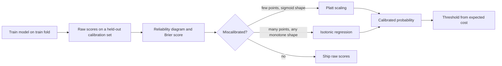

# Probability Calibration

## TL;DR
A model is calibrated if, among all cases it scores 0.7, about 70% are positive. Ranking metrics like
AUC are blind to this — you can have perfect AUC and hopeless probabilities. Diagnose with a reliability
diagram and the Brier score; fix by fitting a monotone map from score to probability on *held-out* data,
using Platt (sigmoid) when data is scarce and isotonic when it is not.

## Intuition
Two weather forecasters both rank rainy days above dry days perfectly. One says "70% chance", and it
rains on 70% of those days. The other says "99% chance" on the same days. Both have AUC 1.0. Only the
first is usable for deciding whether to carry an umbrella — or, in your job, for multiplying by a rupee
value to get an expected loss.

Calibration matters exactly when the *number* enters a downstream calculation: expected revenue, a
credit-limit decision, a triage queue, an insurance premium, a threshold derived from a cost matrix.

## The maths

### Definition
Let $\hat{p}(x)$ be the model's predicted probability of the positive class. Perfect calibration means

$$
P\big(Y = 1 \mid \hat{p}(X) = p\big) = p \quad \text{for all } p \in [0,1]
$$

This is a statement about *conditional frequencies*, not about accuracy. The constant predictor
$\hat p \equiv \bar y$ is perfectly calibrated and completely useless — so calibration alone is never the
goal. You want a model that is both sharp (predictions pushed toward 0 and 1) and calibrated.

### Brier score and its decomposition
The Brier score is just the mean squared error on probabilities:

$$
\mathrm{BS} = \frac{1}{n}\sum_{i=1}^{n}\left(\hat{p}_i - y_i\right)^2
$$

Its value is that it decomposes (Murphy) into

$$
\mathrm{BS} = \underbrace{\mathbb{E}\!\left[(\hat p - \bar y_{\hat p})^2\right]}_{\text{reliability (calibration), lower is better}}
- \underbrace{\mathbb{E}\!\left[(\bar y_{\hat p} - \bar y)^2\right]}_{\text{resolution (sharpness), higher is better}}
+ \underbrace{\bar y (1 - \bar y)}_{\text{uncertainty, fixed by the data}}
$$

where $\bar y_{\hat p}$ is the observed positive rate among cases with that predicted score. So a single
number confounds calibration and discrimination — always report the decomposition or a reliability plot
alongside it. Log loss is the other proper scoring rule; it penalises confident mistakes far harder
(unbounded as $\hat p \to 0$ on a positive), which makes it the right choice when catastrophic
overconfidence is the risk.

Both are **proper scoring rules**: they are minimised in expectation by reporting your true belief.
Accuracy and F1 are not, which is why optimising F1 can actively destroy calibration.

### Expected Calibration Error
Bin predictions into $M$ bins $B_m$:

$$
\mathrm{ECE} = \sum_{m=1}^{M} \frac{|B_m|}{n}\left|\ \overline{\mathrm{acc}}(B_m) - \overline{\mathrm{conf}}(B_m)\ \right|
$$

Useful and widely quoted, but bin-count-sensitive; equal-mass bins are more stable than equal-width ones,
and with few positives the estimate is noisy. Treat ECE as a summary of the reliability diagram, not a
replacement for it.

### Platt scaling (sigmoid)
Fit a one-parameter-pair logistic regression on the model's raw score $s$:

$$
\hat{p} = \sigma(A s + B) = \frac{1}{1 + e^{-(As + B)}}
$$

$A$ and $B$ are fitted by minimising log loss on a calibration set. Two parameters only, so it works with
a few hundred calibration points, but it can only correct *sigmoid-shaped* distortion. If the miscalibration
has a different shape, Platt cannot represent the fix.

### Isotonic regression
Fit the non-decreasing step function $g$ minimising $\sum_i (g(s_i) - y_i)^2$ subject to monotonicity,
solved exactly by the pool-adjacent-violators algorithm in $O(n)$ after sorting. It can represent any
monotone distortion, so it is strictly more flexible — and correspondingly overfits on small calibration
sets, producing wide flat steps and never predicting outside the observed score range.

Rule of thumb: under roughly 1000 calibration points, sigmoid; above a few thousand, isotonic. Beta
calibration sits between them (three parameters, handles more shapes than Platt without isotonic's
variance).

### Why boosted trees are miscalibrated
Gradient boosting with log loss *does* optimise a proper scoring rule, so in principle it should be
calibrated. In practice it is pushed toward the extremes: the stagewise fit keeps reducing the loss on
already-correct points by driving their margins further out, and regularisation (shrinkage, subsampling,
early stopping) stops before the probabilities settle. The typical reliability curve for boosted trees
is sigmoid-shaped — overconfident at both ends.

Contrast: **random forests are usually under-confident**. Averaging many trees' 0/1-ish votes pulls
probabilities toward the middle, so they rarely output below 0.05 or above 0.95. Their reliability curve
bends the other way. **SVMs** output a margin, not a probability, and need calibration by construction.
**Naive Bayes** is severely overconfident because multiplying correlated likelihoods as if independent
compounds evidence many times over.

### Why resampling distorts probabilities
If you train on a rebalanced sample, you have trained on a different prior. With true positive rate
$\pi$ and resampled rate $\pi'$, the model estimates $P'(y=1\mid x)$ under the wrong base rate. The
correction (prior shift) is:

$$
p = \frac{\pi\, \frac{p'}{\pi'}}{\pi\,\frac{p'}{\pi'} + (1-\pi)\,\frac{1-p'}{1-\pi'}}
$$

Equivalently, subtract $\log\frac{\pi'/(1-\pi')}{\pi/(1-\pi)}$ from the logit. This is why "I used SMOTE
and now my probabilities are all around 0.5" happens — and why class weights, which scale the loss rather
than the sample, distort calibration in the same way ([[imbalanced-classification]]).

## Diagram



## Code

```python
import numpy as np
import matplotlib.pyplot as plt
from sklearn.calibration import CalibratedClassifierCV, calibration_curve
from sklearn.datasets import make_classification
from sklearn.ensemble import RandomForestClassifier
from sklearn.metrics import brier_score_loss, log_loss, roc_auc_score
from sklearn.model_selection import train_test_split
from sklearn.naive_bayes import GaussianNB

X, y = make_classification(n_samples=20000, n_features=20, n_informative=6,
                           weights=[0.9, 0.1], random_state=0)
Xtr, Xte, ytr, yte = train_test_split(X, y, test_size=0.3, stratify=y, random_state=0)

models = {
    "random forest": RandomForestClassifier(n_estimators=300, n_jobs=-1, random_state=0),
    "naive bayes":   GaussianNB(),
}

for name, m in models.items():
    m.fit(Xtr, ytr)
    p = m.predict_proba(Xte)[:, 1]
    print(f"{name:<15} AUC={roc_auc_score(yte, p):.3f}  "
          f"Brier={brier_score_loss(yte, p):.4f}  logloss={log_loss(yte, p):.4f}")
# AUC can be nearly identical while Brier differs by 2-3x. That gap IS the calibration problem.
```

Reliability diagram — the plot to bring to the interview:

```python
fig, ax = plt.subplots(figsize=(5, 5))
ax.plot([0, 1], [0, 1], "k--", label="perfect")
for name, m in models.items():
    p = m.predict_proba(Xte)[:, 1]
    frac_pos, mean_pred = calibration_curve(yte, p, n_bins=10, strategy="quantile")
    ax.plot(mean_pred, frac_pos, "o-", label=name)
ax.set_xlabel("mean predicted probability")
ax.set_ylabel("observed fraction of positives")
ax.legend()
```

Calibrating correctly — note `cv` handles the held-out split for you:

```python
base = RandomForestClassifier(n_estimators=300, n_jobs=-1, random_state=0)

# Cross-validated calibration: fits the base model and the calibrator on disjoint folds,
# then averages the calibrators. Uses all training data without leaking.
cal_sig = CalibratedClassifierCV(base, method="sigmoid",  cv=5).fit(Xtr, ytr)
cal_iso = CalibratedClassifierCV(base, method="isotonic", cv=5).fit(Xtr, ytr)

for name, m in [("raw", base.fit(Xtr, ytr)), ("sigmoid", cal_sig), ("isotonic", cal_iso)]:
    p = m.predict_proba(Xte)[:, 1]
    print(f"{name:<9} Brier={brier_score_loss(yte, p):.4f}  AUC={roc_auc_score(yte, p):.4f}")
# AUC is essentially unchanged - both calibrators are monotone, so ranking is preserved.
```

Undoing a resampling prior shift analytically:

```python
def correct_prior(p_resampled, pi_true, pi_resampled):
    """Map probabilities from a rebalanced training prior back to the true prior."""
    odds_shift = (pi_true / (1 - pi_true)) / (pi_resampled / (1 - pi_resampled))
    odds = p_resampled / (1 - p_resampled) * odds_shift
    return odds / (1 + odds)

print(correct_prior(0.50, pi_true=0.01, pi_resampled=0.50))   # ~0.01
```

## In practice
- **Use it when:** the probability is consumed by anything other than a hard label — expected-value
  ranking, cost-based thresholding, risk scores shown to humans, a downstream optimiser, or blending
  model outputs. Also whenever you trained on a resampled or class-weighted objective.
- **Defaults that work:** `CalibratedClassifierCV(base, method='isotonic', cv=5)` when you have tens of
  thousands of rows and a few thousand positives; `method='sigmoid'` when positives are in the hundreds.
  Calibrate on data the base model never saw. Evaluate with Brier and a quantile-binned reliability plot
  on a *third* split.
- **Breaks when:** the calibration set is tiny (isotonic overfits into near-deterministic steps); the
  true relationship between score and probability is non-monotone (no standard calibrator can fix that —
  it means the model is wrong, not just miscalibrated); or the deployment distribution has drifted, since
  calibration is the first thing drift destroys ([[data-drift-and-concept-drift]]).
- **Cost / latency:** negligible at inference — the calibrator is a sigmoid or a step-function lookup.
  Training cost is the `cv` multiplier on base-model fits. Log the calibrator as part of the MLflow model
  so serving cannot accidentally use raw scores ([[experiment-tracking-mlflow]]).

> [!warning]
> Calibrating on the *training* scores is the classic mistake. The model is overfit on its training rows,
> so the fitted map corrects a distortion that does not exist on new data and makes calibration worse.
> Use `CalibratedClassifierCV` with `cv`, or a genuinely held-out split.

## Interview angle

**Q. My model has 0.92 AUC. Is it good?**
It discriminates well — it ranks positives above negatives. Whether it is *good* depends on the use. AUC
is invariant to any monotone transform of the scores, so it tells you nothing about whether 0.7 means 70%.
If the score feeds an expected-cost decision or is shown to a human as a risk, I would check a reliability
diagram and Brier score before calling it good.

**Follow-up.** Does calibrating change AUC? → Essentially no, because both Platt and isotonic are monotone
maps and AUC only depends on ordering. Isotonic can tie scores together, which can move AUC by a hair;
sigmoid cannot. If calibration changes your AUC materially, you leaked the calibration set.

**Q. Platt vs isotonic — how do you choose?**
Data volume and distortion shape. Platt is two parameters, so it is stable on a few hundred calibration
points but can only fix sigmoid-shaped miscalibration. Isotonic is nonparametric and fixes any monotone
distortion, but needs a few thousand points and clips predictions to the observed score range. With a
rare positive class, count the *positives* in the calibration set, not the rows.

**Q. Why are boosted trees miscalibrated if they optimise log loss?**
Because they are stopped and regularised before the optimum. Shrinkage, subsampling and early stopping
all mean the stagewise fit has not converged to the log-loss minimiser, and the residual-fitting dynamic
pushes margins on already-correct points outward, so scores pile up near 0 and 1. The empirical signature
is a sigmoid-shaped reliability curve. Random forests show the opposite — averaging pulls them to the
middle and they are under-confident.

**Q. You applied SMOTE and your probabilities are all near 0.5. Explain.**
You trained under a different class prior. The model is estimating $P(y=1\mid x)$ for a 50/50 world, not
your 1% world. Either correct the logit by the log prior-odds ratio, recalibrate on an unresampled
held-out set, or — usually better — do not resample at all and move the threshold instead.

**Q. Where does calibration break in production?**
Under drift. The score-to-probability map is fitted on a distribution; when the base rate shifts (a
festive-season spike, a new acquisition channel, a policy change) the mapping is stale even if the
ranking is still fine. Monitor the mean predicted probability against the realised positive rate and
recalibrate on recent labelled data — recalibration is far cheaper than retraining
([[model-monitoring]], [[model-retraining-strategies]]).

**Q. What is a proper scoring rule and why care?**
One minimised in expectation by reporting your true belief — Brier and log loss qualify, accuracy and F1
do not. If you tune to a non-proper metric you are rewarding the model for shading its probabilities
toward the threshold, which is exactly how you destroy calibration while improving the headline number.

## Traps
- **"High AUC means good probabilities."** AUC is rank-only and invariant to monotone transforms. It
  cannot see calibration at all.
- **Calibrating on training scores.** Fits a map to the model's overfit behaviour. Always hold out.
- **Isotonic on a small calibration set.** Produces a coarse staircase, ties many scores, and cannot
  extrapolate beyond the observed range.
- **Assuming log loss and Brier rank models the same way.** Log loss punishes confident errors much
  harder; a model can win on Brier and lose badly on log loss.
- **Calibrating and then resampling, or resampling and forgetting to correct the prior.** Order matters —
  calibrate last, on data with the production base rate.
- **Reporting ECE alone.** It is bin-count dependent and hides *where* the miscalibration is. Show the
  curve.
- **Thinking calibration fixes a bad model.** A perfectly calibrated model with no discrimination just
  outputs the base rate everywhere. You need sharpness *and* reliability.
- **Calibrating each class independently in multiclass and forgetting to renormalise.** Probabilities must
  still sum to 1.

## Flashcards
Define a calibrated classifier.::Among all cases scored $p$, the observed positive rate is $p$ — i.e. $P(Y=1 \mid \hat p(X)=p)=p$.
Why can't AUC detect miscalibration?::AUC depends only on the ordering of scores and is invariant under any monotone transform.
Write the Brier score and name its three components.::$\frac1n\sum(\hat p_i - y_i)^2$ = reliability − resolution + uncertainty.
Platt vs isotonic — when each?::Platt (sigmoid, 2 params) for small calibration sets and sigmoid-shaped distortion; isotonic (nonparametric, monotone) for thousands of points and arbitrary monotone distortion.
Which way do boosted trees and random forests miscalibrate?::Boosted trees are overconfident (pushed to 0/1); random forests are under-confident (averaged toward the middle).
Why does SMOTE distort probabilities?::It changes the class prior, so the model estimates $P(y=1\mid x)$ under a rebalanced base rate; correct by shifting the logit by the log prior-odds ratio.
What is a proper scoring rule?::One minimised in expectation by reporting the true probability — Brier and log loss are proper; accuracy and F1 are not.
Where must the calibrator be fitted?::On data the base model never saw — use CalibratedClassifierCV with cv, never the training scores.

## Related
- [[threshold-selection]] — what you do with a calibrated probability
- [[classification-metrics]] — proper vs improper scoring rules
- [[roc-auc-and-pr-curves]] — the rank-only metrics calibration is invisible to
- [[imbalanced-classification]] — resampling and its effect on the prior
- [[gradient-boosting]] — why boosted scores skew to the extremes
- [[model-monitoring]] — detecting calibration drift in production
- [[logistic-regression]] — the naturally calibrated baseline
