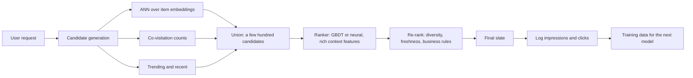

# Recommender Systems — Basics

## TL;DR
Content-based recommends items similar to what a user liked; collaborative filtering recommends what
similar users liked. Matrix factorisation learns latent user and item vectors whose dot product predicts
affinity, and with implicit feedback you must model *confidence in an unlabelled negative*, not a rating.
Real systems are two-stage — cheap candidate generation over millions of items, then an expensive ranker
over hundreds. Offline recall@k and NDCG guide development; only an online A/B test decides.

## Intuition
Two ways to recommend a film. "You liked three Tamil crime thrillers, here is a fourth" uses the item's
own attributes — content-based, works from day one but never surprises you. "People who watched what you
watched also watched this" uses the behaviour matrix — collaborative, finds non-obvious connections
nobody tagged, but knows nothing about a brand-new item or user.

Almost every production system does both, plus a ranking model on top that decides the final order using
context the retrieval stage cannot afford to look at.

## The maths

### The setup
Users $u \in \{1..M\}$, items $i \in \{1..N\}$, an interaction matrix $R \in \mathbb{R}^{M\times N}$ that
is 99.9%+ missing. Two regimes:

- **Explicit feedback**: $r_{ui}$ is a rating. Missing means "not rated" — genuinely unknown.
- **Implicit feedback**: $r_{ui}$ is a click, watch, purchase. Missing means "not interacted", which is a
  mixture of *disliked* and *never seen*. This distinction drives everything below, and getting it right
  is what separates a real answer from a textbook one.

### Content-based
Represent each item by a feature vector $v_i$ (TF-IDF of description, category one-hots, or a learned
embedding). Build a user profile as a weighted average of what they engaged with:

$$
p_u = \frac{\sum_{i \in I_u} r_{ui}\, v_i}{\sum_{i \in I_u} r_{ui}}, \qquad
\mathrm{score}(u,i) = \cos(p_u, v_i)
$$

Handles new items immediately (they have features) but not new users, and it is trapped inside the
feature space — it will never recommend something outside the user's demonstrated taste (the *filter
bubble* / over-specialisation problem).

### Neighbourhood collaborative filtering
Item-item CF, which is what Amazon popularised because item-item similarities are more stable than
user-user and can be precomputed:

$$
\hat{r}_{ui} = \frac{\sum_{j \in N_k(i) \cap I_u} \mathrm{sim}(i,j)\, r_{uj}}
{\sum_{j \in N_k(i)\cap I_u} \lvert \mathrm{sim}(i,j)\rvert}
$$

with cosine or adjusted-cosine similarity. Simple and explainable ("because you watched X"), but
$O(N^2)$ to build the similarity matrix and it does not generalise past co-occurrence.

### Matrix factorisation
Learn $P \in \mathbb{R}^{M\times f}$ and $Q \in \mathbb{R}^{N\times f}$ with $f \ll \min(M,N)$ so that

$$
\hat{r}_{ui} = \mu + b_u + b_i + p_u^\top q_i
$$

The bias terms matter more than people expect — $\mu$ is the global mean, $b_u$ captures "this user rates
everything highly", $b_i$ captures "this film is universally liked". A bias-only model is a strong
baseline and often gets most of the achievable RMSE.

For explicit ratings, minimise over observed entries only:

$$
\min_{P,Q,b}\ \sum_{(u,i)\in \mathcal{K}}\big(r_{ui} - \mu - b_u - b_i - p_u^\top q_i\big)^2
+ \lambda\big(\lVert p_u\rVert^2 + \lVert q_i\rVert^2 + b_u^2 + b_i^2\big)
$$

Optimise by SGD (scales to huge sparse data, easy to add features) or ALS (fix $Q$, solve for $P$ in
closed form, alternate — each subproblem is ridge regression, embarrassingly parallel, which is why Spark
implements ALS and not SGD).

**Why this is not PCA.** The sum is over *observed* entries only; the matrix has no values elsewhere to
decompose. That missing-data-aware objective is exactly what makes it a learning problem rather than an
SVD ([[dimensionality-reduction-pca]]).

### Implicit feedback (the Hu–Koren–Volinsky formulation)
Split the signal into a binary preference and a confidence:

$$
p_{ui} = \begin{cases} 1 & r_{ui} > 0\\ 0 & r_{ui} = 0\end{cases}, \qquad
c_{ui} = 1 + \alpha r_{ui}
$$

and minimise over **all** $(u,i)$ pairs, weighted by confidence:

$$
\min_{P,Q}\ \sum_{u,i} c_{ui}\big(p_{ui} - p_u^\top q_i\big)^2 + \lambda\big(\lVert p_u\rVert^2 + \lVert q_i\rVert^2\big)
$$

Three things to notice. Unobserved pairs are included as weak negatives with confidence 1 — you are not
ignoring them, you are saying "probably not, but we are not sure". Observed pairs get confidence growing
with interaction count $r_{ui}$ ($\alpha$ typically 15–40). And the sum over all $M\times N$ pairs looks
intractable but is not: a Gram-matrix trick reduces each ALS step to $O(f^2\lvert\mathcal{K}\rvert + f^3 M)$.

The ranking-loss alternative is **BPR**, which maximises the probability that an observed item outranks a
sampled unobserved one:

$$
\max \sum_{(u,i,j)} \ln\sigma\!\big(\hat{r}_{ui} - \hat{r}_{uj}\big) - \lambda\lVert\Theta\rVert^2
$$

BPR optimises ranking directly rather than pointwise reconstruction, which usually matters more for
top-$k$ quality.

### Two-stage architecture
You cannot score 10 million items per request in 50 ms. So:

1. **Candidate generation (retrieval)**: reduce $N$ to a few hundred. Multiple cheap sources unioned —
   ANN search over item embeddings ([[ann-algorithms-hnsw-ivf]]), co-visitation counts, trending,
   recently-viewed, editorially curated. Optimised for **recall**: a relevant item missed here can never
   be recovered.
2. **Ranking**: a heavy model (gradient boosting with LambdaRank, or a neural ranker) scoring a few
   hundred candidates with rich features — user history, item features, context (time, device, session),
   and cross features. Optimised for **precision at the top**.
3. **Re-ranking / business rules**: diversity (MMR), freshness, inventory, promotional boosts, dedup,
   exploration slots.

This is the answer to "design a recommender" and the stage decomposition is most of the score
([[case-recommendation-system]], [[case-search-ranking]]).

### Cold start

| Case | Problem | Mitigation |
|---|---|---|
| New user | No interactions | Popularity baseline, onboarding preference picker, demographic priors, contextual bandit to learn fast |
| New item | No interactions | Content features into a hybrid model; explicit exploration budget so it gets impressions |
| New system | No matrix at all | Content-based or rules until interaction volume accrues |

The structural fix is a **two-tower model**: a user tower and an item tower, each mapping *features* (not
ids) to a shared embedding space, trained with in-batch sampled softmax. Because the item tower consumes
features, a brand-new item gets an embedding with zero interactions. This is the standard modern answer
to item cold start.

### Offline metrics
All computed on a held-out set, at cutoff $k$:

$$
\mathrm{Recall@}k = \frac{\lvert \text{relevant} \cap \text{top-}k\rvert}{\lvert\text{relevant}\rvert},
\qquad
\mathrm{Precision@}k = \frac{\lvert \text{relevant} \cap \text{top-}k\rvert}{k}
$$

$$
\mathrm{DCG@}k = \sum_{j=1}^{k}\frac{2^{\mathrm{rel}_j} - 1}{\log_2(j+1)},
\qquad \mathrm{NDCG@}k = \frac{\mathrm{DCG@}k}{\mathrm{IDCG@}k}
$$

NDCG is the one to know: the numerator rewards highly relevant items, the $\log_2(j+1)$ denominator
discounts lower positions, and normalising by the ideal ordering makes it comparable across users with
different numbers of relevant items. MAP and MRR (for "find the one right answer" tasks) round out the set.

Beyond accuracy, report **coverage** (fraction of catalogue ever recommended), **diversity** (intra-list
dissimilarity) and **novelty** (inverse popularity). A recommender that only shows the top 50 items scores
well and slowly kills the long tail.

### Why offline and online disagree
This is the deepest point in the topic, and interviewers probe it.

- **Presentation bias**: you only observe feedback on items the *old* system showed. Offline evaluation
  scores a new model on the old model's candidate distribution.
- **Position bias**: rank 1 gets clicked far more than rank 10 regardless of relevance.
- **Feedback loops**: today's model shapes tomorrow's training data, so popularity compounds.
- **Missing counterfactual**: you cannot observe what a user would have done with a recommendation they
  never saw.

Partial mitigations: inverse propensity weighting, off-policy evaluation, and an epsilon-greedy
exploration slot that deliberately logs unbiased data. But the decision is always an online A/B test
([[ab-testing-design]]).

## Diagram



## Code

```python
import numpy as np
from scipy.sparse import csr_matrix

rng = np.random.default_rng(0)
n_users, n_items = 5000, 2000
rows = rng.integers(0, n_users, 60000)
cols = rng.integers(0, n_items, 60000)
vals = rng.integers(1, 6, 60000).astype(float)          # interaction counts
R = csr_matrix((vals, (rows, cols)), shape=(n_users, n_items))
print("sparsity:", 1 - R.nnz / (n_users * n_items))
```

Implicit ALS from scratch — short enough to write in an interview and it proves you understand the
confidence weighting:

```python
def implicit_als(R, f=32, alpha=20.0, reg=0.1, iters=15, seed=0):
    """Hu-Koren-Volinsky implicit ALS. R is a sparse count matrix."""
    rng = np.random.default_rng(seed)
    M, N = R.shape
    P = 0.01 * rng.normal(size=(M, f))
    Q = 0.01 * rng.normal(size=(N, f))
    C = R.copy(); C.data = alpha * C.data               # c_ui - 1, nonzero only where observed
    Rt, Ct = R.T.tocsr(), C.T.tocsr()

    def solve_side(X, Y, Cs, Rs):
        YtY = Y.T @ Y                                    # the Gram trick: shared across all rows
        I = np.eye(Y.shape[1])
        out = np.empty_like(X)
        for u in range(X.shape[0]):
            s, e = Rs.indptr[u], Rs.indptr[u + 1]
            idx, cu = Rs.indices[s:e], Cs.data[s:e]      # only the observed items for this user
            Yu = Y[idx]
            A = YtY + (Yu * cu[:, None]).T @ Yu + reg * I
            b = ((1.0 + cu) * Yu.T).sum(axis=1)          # p_ui = 1 on observed entries
            out[u] = np.linalg.solve(A, b)
        return out

    for _ in range(iters):
        P = solve_side(P, Q, C, R)
        Q = solve_side(Q, P, Ct, Rt)
    return P, Q

P, Q = implicit_als(R)
print(P.shape, Q.shape)
```

Recall@k and NDCG@k, implemented explicitly:

```python
def recall_at_k(ranked, relevant, k):
    if not relevant:
        return np.nan
    return len(set(ranked[:k]) & set(relevant)) / len(relevant)

def ndcg_at_k(ranked, relevance_map, k):
    """relevance_map: item -> graded relevance (0 if absent)."""
    gains = [relevance_map.get(i, 0) for i in ranked[:k]]
    dcg = sum((2 ** g - 1) / np.log2(j + 2) for j, g in enumerate(gains))
    ideal = sorted(relevance_map.values(), reverse=True)[:k]
    idcg = sum((2 ** g - 1) / np.log2(j + 2) for j, g in enumerate(ideal))
    return dcg / idcg if idcg > 0 else 0.0

def recommend(u, P, Q, seen, k=10):
    scores = Q @ P[u]
    scores[list(seen)] = -np.inf                     # never recommend an already-seen item
    return np.argpartition(-scores, k)[:k][np.argsort(-scores[np.argpartition(-scores, k)[:k]])]

u = 7
seen = set(R[u].indices)
print(recommend(u, P, Q, seen, k=10))
```

Serving the retrieval stage — factorisation plus ANN is the whole trick:

```python
import faiss

Qn = Q.astype("float32").copy()
faiss.normalize_L2(Qn)                                # cosine via inner product on unit vectors
index = faiss.IndexHNSWFlat(Qn.shape[1], 32)
index.add(Qn)

query = P[u : u + 1].astype("float32").copy()
faiss.normalize_L2(query)
_, cand = index.search(query, 500)                    # 500 candidates in sub-millisecond time
# Those 500 then go to the ranker with full context features.
```

> [!tip]
> On Databricks, `pyspark.ml.recommendation.ALS` gives you distributed implicit ALS out of the box
> (`implicitPrefs=True`, `alpha`, `rank`, `regParam`) and `recommendForAllUsers` for batch scoring into a
> gold table. Crucially, set `coldStartStrategy="drop"` during evaluation or NaN predictions for unseen
> users silently corrupt your metrics.

## In practice
- **Use it when:** you have a catalogue too large to browse and interaction data to learn from. Below
  roughly 10k interactions, popularity plus content-based rules will beat any learned model.
- **Defaults that work:** popularity baseline first, always — it is shockingly hard to beat and it
  calibrates expectations. Then implicit ALS or BPR with $f = 32$–$128$. Split by **time**, not randomly.
  Report recall@k for retrieval and NDCG@k for ranking, plus coverage and a popularity-bias measure.
- **Breaks when:** the catalogue churns fast (news, flash sales) so items never accumulate interactions —
  go content-heavy or two-tower; the session matters more than the user (anonymous visitors) — use a
  sequential/session-based model; or the feedback is dominated by position and presentation bias, which
  offline metrics will happily hide from you.
- **Cost / latency:** the two-stage split exists entirely for this. Retrieval must be sub-10 ms over
  millions of items, which is an ANN index over precomputed item vectors; ranking is 10–50 ms over a few
  hundred candidates. Precompute user embeddings in batch where you can, and cache aggressively —
  recommendations rarely need to be fresh to the second ([[caching-strategies]],
  [[latency-and-throughput-budgets]]).

## Interview angle

**Q. Content-based vs collaborative filtering — tradeoffs?**
Content-based uses item attributes, so it handles new items immediately and is easy to explain, but it
cannot discover taste outside the feature space and needs good metadata. Collaborative filtering uses the
behaviour matrix, so it finds non-obvious connections nobody tagged, but it fails cold start in both
directions and amplifies popularity. Production systems hybridise — typically content features feeding
the item tower of a collaborative model, which gets both properties.

**Follow-up.** How does a two-tower model solve item cold start? → Because the item tower maps *features*
to the embedding, not an id lookup. A brand-new item with zero interactions still has a category, a
price, a text description, so it gets a reasonable embedding from day one and can be retrieved.

**Q. How does implicit feedback change matrix factorisation?**
Missing entries stop being unknown and become weak negatives. The Hu–Koren–Volinsky formulation sums over
*all* user-item pairs with a binary preference $p_{ui}$ and a confidence $c_{ui} = 1 + \alpha r_{ui}$, so
unobserved pairs contribute with low confidence and repeated interactions contribute with high confidence.
Naively treating missing as zero rating would be wrong — most unwatched films are simply unseen, not
disliked. The alternative is a pairwise ranking loss like BPR, which optimises ordering directly.

**Q. Design a recommender for 10 million items and 50 ms latency.**
Two stages. Candidate generation reduces 10M to a few hundred using an ANN index over item embeddings,
unioned with co-visitation, trending and recently-viewed sources — optimised for recall, because anything
missed here is unrecoverable. Then a ranker scores those few hundred with rich context features (session,
time, device, cross features), optimised for precision at the top. Then re-ranking for diversity,
freshness, dedup and business rules, plus a small exploration slot to generate unbiased training data.

**Q. Why do offline gains often not reproduce online?**
Four reasons. Presentation bias — you only have feedback on what the *old* system showed, so offline
evaluation scores the new model on the old model's candidate distribution. Position bias — clicks reflect
rank as much as relevance. Feedback loops — the model shapes its own future training data. And the
missing counterfactual — you cannot observe responses to recommendations never shown. Mitigate with
inverse propensity weighting and an exploration slot, but decide with an A/B test.

**Q. What offline metrics do you report and why?**
Recall@k for the retrieval stage — its only job is not to lose relevant items. NDCG@k for ranking,
because it is position-discounted and handles graded relevance, so it measures the thing users actually
experience. Plus coverage and popularity bias, because an accuracy-only view rewards a system that
recommends the same 50 items forever and quietly kills the long tail.

**Q. How do you split data for evaluation?**
By time, with a global cutoff, or leave-one-last-item-out per user. Never randomly: a random split lets
the model see a user's future interactions while predicting their past, which is textbook temporal
leakage and inflates every metric ([[data-leakage]]).

**Q. Users complain the recommendations are boring.**
Over-specialisation from a feedback loop. The measures: maximal marginal relevance re-ranking to trade
some relevance for intra-list diversity; an exploration budget (epsilon-greedy or a bandit) so novel items
get impressions; a popularity penalty in the ranker; and switching the objective from click to a
longer-horizon signal like session length or next-week retention, since click-optimisation is what
produces the boring loop in the first place.

## Traps
- **Random train/test split.** Leaks the future; split by time.
- **Treating implicit missing entries as negative ratings.** Missing is mostly "never seen".
- **Evaluating with RMSE on an implicit-feedback top-$k$ task.** Rating accuracy does not imply good
  ranking; use recall@k and NDCG@k.
- **Skipping the popularity baseline.** Often within a few percent of a tuned model, and it exposes
  whether your gains are real.
- **Recommending items the user has already seen or bought.** Mask them; this is the most common demo bug.
- **Ignoring position and presentation bias.** Offline numbers on logged data are systematically
  optimistic for the incumbent policy.
- **Optimising clicks alone.** Produces clickbait and a narrowing feedback loop; optimise a
  longer-horizon objective.
- **Forgetting `coldStartStrategy` in Spark ALS.** NaNs for unseen users silently break evaluation.
- **Building one giant model instead of two stages.** You cannot score millions of items per request.
- **Reporting only accuracy metrics.** Coverage and diversity are what keep the catalogue alive.

## Flashcards
Content-based vs collaborative filtering in one line each.::Content-based scores item-feature similarity to a user profile (handles new items, no serendipity); collaborative uses the interaction matrix (finds hidden structure, fails cold start).
Write the biased matrix factorisation prediction.::$\hat r_{ui} = \mu + b_u + b_i + p_u^\top q_i$ — global mean plus user and item biases plus the latent dot product.
How does implicit ALS treat unobserved pairs?::As weak negatives: preference $p_{ui}=0$ with confidence $c_{ui}=1$, while observed pairs get $c_{ui} = 1 + \alpha r_{ui}$.
Why is matrix factorisation not just SVD?::The loss sums only over observed entries (or confidence-weights all of them); the matrix is mostly missing, not zero.
What does BPR optimise?::The probability that an observed item ranks above a sampled unobserved one — a pairwise ranking loss rather than pointwise reconstruction.
Write NDCG@k.::$\mathrm{DCG@}k / \mathrm{IDCG@}k$ where $\mathrm{DCG@}k = \sum_j (2^{rel_j}-1)/\log_2(j+1)$ — position-discounted, graded, normalised.
Why two stages, and what does each optimise?::Retrieval cuts millions of items to hundreds and optimises recall; ranking scores those hundreds with rich features and optimises precision at the top.
Name three reasons offline recsys gains fail online.::Presentation bias (only logged items observed), position bias, and feedback loops shaping future training data.
What solves item cold start structurally?::A two-tower model whose item tower maps features (not ids) to the embedding space, so a new item gets a vector with zero interactions.

## Related
- [[case-recommendation-system]] — the full system design walkthrough
- [[case-search-ranking]] — the same two-stage pattern for search
- [[ann-algorithms-hnsw-ivf]] — how retrieval is served
- [[embeddings]] — the representation both towers produce
- [[ab-testing-design]] — the only evaluation that decides
- [[data-leakage]] — why recsys splits must be temporal
- [[dimensionality-reduction-pca]] — the contrast with missing-data-aware factorisation
- [[classification-metrics]] — ranking metrics in context
