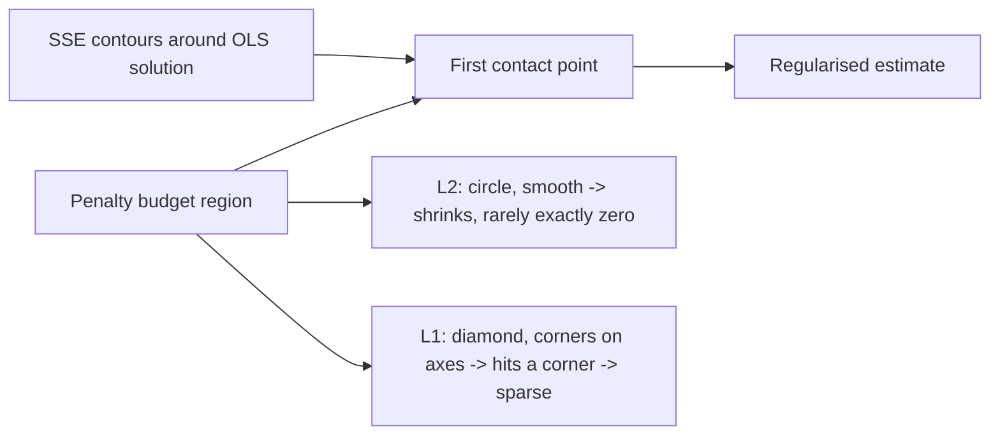

# Regularisation — L1, L2 and Elastic Net

## TL;DR
Regularisation adds a penalty on coefficient size to the loss, trading a little bias for a large cut
in variance. L2 (ridge) shrinks everything smoothly and has a closed form; L1 (lasso) drives
coefficients exactly to zero and therefore selects features. The sparsity comes from the geometry of
the $\ell_1$ ball's corners; equivalently, from a Laplace prior in the MAP view. Elastic net mixes
both to handle correlated predictors.

## Intuition
Picture the least-squares error surface as elliptical contours around the OLS solution, and the
penalty as a budget region centred at the origin that the coefficient vector must stay inside. The
solution is where the smallest contour first touches the budget region. A circle (L2) is smooth, so
the touch point is almost never on an axis. A diamond (L1) has sharp corners *on* the axes, and an
expanding ellipse hits a corner far more often than a flat edge — a corner means some coefficient is
exactly zero. That is the whole sparsity argument.

## The maths

Constrained and penalised forms are equivalent by Lagrangian duality
([[lagrange-multipliers-and-constraints]]): for every $t$ there is a $\lambda$ giving the same
solution.

$$
\min_\beta \; \lVert y - X\beta\rVert_2^2 \quad \text{s.t.} \quad \lVert\beta\rVert_q^q \le t
\qquad \Longleftrightarrow \qquad
\min_\beta \; \lVert y - X\beta\rVert_2^2 + \lambda \lVert\beta\rVert_q^q
$$

**Ridge ($q=2$).** Closed form:

$$
\hat\beta_{\text{ridge}} = (X^\top X + \lambda I)^{-1} X^\top y
$$

In the SVD basis $X = UDV^\top$ with singular values $d_j$, the fitted values are

$$
\hat{y} = \sum_{j=1}^{p} u_j \frac{d_j^{2}}{d_j^{2} + \lambda}\, u_j^\top y
$$

so each principal direction is shrunk by $d_j^2/(d_j^2+\lambda)$: directions with tiny $d_j$
(collinear, low-variance directions) are shrunk hardest. This is exactly the right behaviour,
because those are the directions where OLS variance $\sigma^2/d_j^2$ blows up. See
[[eigen-decomposition-and-svd]].

**Lasso ($q=1$).** No closed form in general, but for an orthonormal design ($X^\top X = I$) it is
soft thresholding:

$$
\hat\beta_j^{\text{lasso}} = \operatorname{sign}(\hat\beta_j^{\text{OLS}})\,
\big(|\hat\beta_j^{\text{OLS}}| - \tfrac{\lambda}{2}\big)_{+}
$$

versus ridge's uniform scaling $\hat\beta_j^{\text{ridge}} = \hat\beta_j^{\text{OLS}}/(1+\lambda)$.
Soft thresholding *sets to zero* everything below the threshold; scaling never does.

**Why L1 gives sparsity — the subgradient argument.** $\lvert \beta_j \rvert$ is not differentiable
at $0$; its subdifferential there is the interval $[-1, 1]$. The optimality condition at
$\beta_j = 0$ is

$$
\left| \frac{\partial}{\partial \beta_j} \lVert y - X\beta \rVert_2^2 \right|_{\beta_j = 0} \le \lambda
\quad\Longrightarrow\quad \hat\beta_j = 0
$$

i.e. zero is optimal for a whole *range* of data, not just at a single knife-edge. For L2 the
derivative of $\beta_j^2$ at zero is $0$, so the penalty exerts no force at the origin and the
stationarity condition $-2x_j^\top(y-X\beta) + 2\lambda\beta_j = 0$ has $\beta_j = 0$ only when the
correlation is exactly zero — a measure-zero event. That is the rigorous version of "the diamond has
corners".

**MAP / prior view.** With Gaussian likelihood $y \mid X,\beta \sim \mathcal{N}(X\beta, \sigma^2 I)$:

$$
\hat\beta_{\text{MAP}} = \arg\max_\beta \big[\log p(y\mid\beta) + \log p(\beta)\big]
$$

- Gaussian prior $\beta_j \sim \mathcal{N}(0, \tau^2)$ gives
  $\log p(\beta) = -\sum_j \beta_j^2/(2\tau^2) + c$ → **ridge** with $\lambda = \sigma^2/\tau^2$.
- Laplace prior $\beta_j \sim \text{Laplace}(0, b)$ gives
  $\log p(\beta) = -\sum_j |\beta_j|/b + c$ → **lasso** with $\lambda = \sigma^2/b$ (up to the factor
  convention on the SSE term).

The Laplace density has a sharp peak at zero and heavier tails than the Gaussian: it says "most
coefficients are near zero, but a few may be large" — which is precisely a sparsity belief. Note the
MAP point estimate of the Laplace posterior is sparse even though the posterior itself puts zero
probability mass on exact zeros; lasso's zeros are an artefact of taking the mode, not of the
posterior. Worth saying in a Bayesian-leaning interview — see [[bayesian-inference-basics]].

**Elastic net.**

$$
\min_\beta \; \lVert y - X\beta\rVert_2^2 + \lambda\Big(\alpha \lVert\beta\rVert_1
+ \tfrac{1-\alpha}{2}\lVert\beta\rVert_2^2\Big)
$$

Two reasons it exists. First, with $p > n$ lasso selects at most $n$ variables — a hard structural
limit. Second, among a group of highly correlated predictors lasso picks one essentially arbitrarily
and zeroes the rest, so the selected set is unstable across resamples; the $\ell_2$ term induces a
**grouping effect** that pulls correlated coefficients toward each other so the group enters or
leaves together.

**Scaling is mandatory.** Both penalties are on raw coefficient magnitude, so a feature measured in
rupees and one in lakhs get incomparable penalties. Standardise inside the pipeline
([[feature-scaling-and-transforms]]). Never penalise the intercept.

## Diagram



## Code

```python
import numpy as np
from sklearn.datasets import make_regression
from sklearn.linear_model import RidgeCV, LassoCV, ElasticNetCV
from sklearn.pipeline import make_pipeline
from sklearn.preprocessing import StandardScaler

X, y, coef = make_regression(n_samples=200, n_features=60, n_informative=8,
                             noise=12.0, coef=True, random_state=0)
# inject a correlated twin to expose lasso instability
X = np.column_stack([X, X[:, 0] + np.random.RandomState(1).normal(0, 0.01, len(X))])

alphas = np.logspace(-3, 2, 60)
ridge = make_pipeline(StandardScaler(), RidgeCV(alphas=alphas)).fit(X, y)
lasso = make_pipeline(StandardScaler(), LassoCV(alphas=alphas, cv=5, max_iter=50000)).fit(X, y)
enet  = make_pipeline(StandardScaler(),
                      ElasticNetCV(l1_ratio=[0.1, 0.5, 0.9, 1.0], alphas=alphas,
                                   cv=5, max_iter=50000)).fit(X, y)

nz = lambda m, step: int(np.sum(np.abs(m[-1].coef_) > 1e-8))
print("nonzero  ridge:", nz(ridge, 0), " lasso:", nz(lasso, 0), " enet:", nz(enet, 0))
print("lasso alpha:", round(lasso[-1].alpha_, 4),
      " enet l1_ratio:", enet[-1].l1_ratio_)

# The twin columns: lasso keeps one, elastic net splits weight between them.
print("lasso  cols 0 & last:", np.round(lasso[-1].coef_[[0, -1]], 3))
print("enet   cols 0 & last:", np.round(enet[-1].coef_[[0, -1]], 3))
```

`RidgeCV` uses the efficient LOOCV formula, so scanning 60 alphas is nearly free;
`LassoCV`/`ElasticNetCV` use coordinate descent along a warm-started path, which is why a full path
costs little more than a single fit.

## In practice
- **Use it when:** any linear or logistic model with more than a handful of features, any time $p$
  is large relative to $n$, and always when predictors are correlated.
- **Defaults that work:** start with L2 and tune $\lambda$ over a log grid spanning six orders of
  magnitude. Reach for L1 when you specifically want a short, explainable feature list. Use elastic
  net with `l1_ratio` around 0.5 when features are correlated and you still want sparsity. In
  scikit-learn, `LogisticRegression`'s `C` is the *inverse* of regularisation strength — small `C`
  means strong penalty, which is the opposite convention to `alpha` in `Ridge`/`Lasso`, and mixing
  them up is a classic live-coding slip.
- **Breaks when:** features are unscaled; the intercept is penalised; you use lasso for feature
  *selection* on correlated data and then report the selected set as "the important features" — it
  is one of many equally good sets. For stability, use bootstrap/stability selection or elastic net.
- **Cost / latency:** negligible at inference. At training, ridge is one linear solve; lasso and
  elastic net use coordinate descent over a path — still fast up to very high dimension because the
  solution is sparse.

> [!tip]
> L1 versus L2 is not the only axis. Group lasso zeroes whole feature groups (all dummies of one
> categorical), and tree ensembles regularise through depth limits, `min_child_weight`, shrinkage
> and column subsampling — different mechanics, same purpose. See [[xgboost-deep-dive]].

## Interview angle

**Q. Why does L1 produce sparsity and L2 does not?**
Two equivalent answers, give both. Geometrically, the $\ell_1$ budget region is a cross-polytope
whose corners lie on the axes; the expanding SSE ellipse touches a corner for a large set of data
configurations, and a corner has some coordinates exactly zero. The $\ell_2$ ball is smooth, so the
touch point has zero probability of landing exactly on an axis. Analytically, $|\beta_j|$ has a
subgradient of $[-1,1]$ at zero, so zero remains optimal for an interval of gradient values —
concretely, whenever $|x_j^\top r| \le \lambda/2$ — whereas $\beta_j^2$ has derivative zero at the
origin and exerts no force to hold a coefficient there.

**Follow-up.** *Show it for orthonormal design.* → Lasso is soft thresholding
$\operatorname{sign}(\hat\beta)(|\hat\beta| - \lambda/2)_+$; ridge is uniform shrinkage
$\hat\beta/(1+\lambda)$. Thresholding zeroes, scaling does not.

**Q. Give the Bayesian interpretation.**
Both are MAP estimates under a Gaussian likelihood. Gaussian prior on coefficients → L2 penalty,
$\lambda = \sigma^2/\tau^2$. Laplace prior → L1 penalty. The Laplace has a sharp peak at zero and
fatter tails, encoding "most effects are negligible, a few are substantial". Caveat: the exact zeros
come from taking the posterior *mode*; the full posterior assigns zero mass to exact zeros, so true
Bayesian variable selection uses spike-and-slab priors instead.

**Q. When would you prefer elastic net over lasso?**
When $p > n$ (lasso can select at most $n$ features), or when predictors are strongly correlated —
lasso picks one of a correlated group arbitrarily and its choice flips across bootstrap resamples,
which makes the "selected features" story indefensible to a stakeholder. Elastic net's ridge
component induces a grouping effect so correlated features enter together.

**Q. How do you choose $\lambda$?**
Cross-validation over a log-spaced grid, scoring with the metric you actually care about. Two useful
refinements: warm-started coordinate descent computes the whole path for roughly the cost of one
fit, and the "one-standard-error rule" picks the largest $\lambda$ whose CV score is within one
standard error of the best — deliberately biasing toward a simpler, more stable model.

**Q. Does regularisation help a tree model?**
Not L1/L2 on inputs — trees are scale-invariant and do not have coefficients. Trees regularise
through depth, minimum samples/hessian per leaf, shrinkage (learning rate), row and column
subsampling, and in XGBoost through explicit `reg_alpha`/`reg_lambda` on *leaf weights*, which is
genuinely L1/L2 but on the leaf values, not on the features.

## Traps
- **Not scaling before penalising.** The penalty then depends on units, so the model quietly favours
  large-scale features. Standardise inside the pipeline.
- **Penalising the intercept.** Makes the model non-equivariant to shifting $y$; libraries exclude it
  by default — do not re-introduce it by adding a constant column manually.
- **Reading lasso's selected set as "the important variables".** With correlated predictors it is
  one arbitrary representative set. Say so.
- **Confusing `C` and `alpha`.** In `LogisticRegression` and `SVC`, larger `C` means *weaker*
  regularisation. In `Ridge`/`Lasso`, larger `alpha` means stronger.
- **Claiming L1 is always better for high dimensions.** If the truth is dense — many small effects —
  ridge generally beats lasso. Sparsity is an assumption about the world, not a free win.
- **Using L1 as a substitute for thinking about features.** It shrinks coefficients, it does not
  remove leakage, it does not fix a badly specified label.
- **Expecting exact zeros from `ElasticNet(l1_ratio=0)`.** That is pure ridge; nothing goes to zero.

## Flashcards
Ridge closed form::β̂ = (XᵀX + λI)⁻¹Xᵀy — always invertible for λ>0, which is why it fixes collinearity.
Ridge shrinkage in the SVD basis::Each direction j is scaled by d_j²/(d_j²+λ), so low-variance (collinear) directions are shrunk hardest.
Geometric reason L1 is sparse::The ℓ1 budget region has corners on the coordinate axes; the expanding SSE ellipse touches a corner, and a corner has coordinates exactly zero.
Subgradient reason L1 is sparse::|β_j| has subdifferential [−1,1] at 0, so β_j=0 stays optimal for a whole range of gradients; β_j² has derivative 0 there and exerts no force.
Lasso under orthonormal design::Soft thresholding: sign(β̂_OLS)(|β̂_OLS| − λ/2)₊, versus ridge's β̂_OLS/(1+λ).
Prior corresponding to L2::Gaussian prior on coefficients, λ = σ²/τ².
Prior corresponding to L1::Laplace (double-exponential) prior — sharp peak at zero, heavy tails.
Two reasons for elastic net::Lasso selects at most n features when p>n, and it picks arbitrarily among correlated predictors; the ℓ2 term adds a grouping effect.
One-standard-error rule::Choose the largest λ whose CV score is within one SE of the best, favouring a simpler and more stable model.
Why scaling is mandatory::The penalty acts on raw coefficient magnitude, so unscaled features receive incomparable penalties.

## Related
- [[linear-regression]]
- [[logistic-regression]]
- [[bias-variance-tradeoff]]
- [[overfitting-and-underfitting]]
- [[feature-selection]]
- [[feature-scaling-and-transforms]]
- [[convexity-and-optimization-basics]]
- [[moc-classical-ml]]
