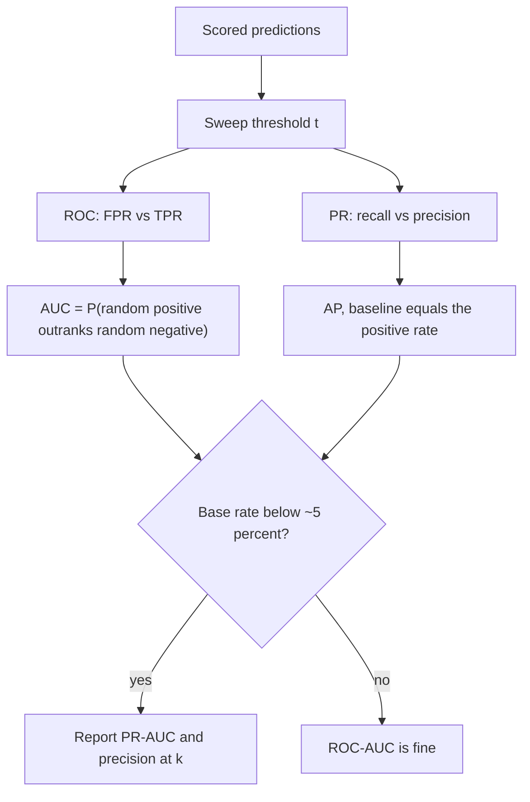

# ROC-AUC and PR Curves

## TL;DR
ROC-AUC is the probability that a randomly chosen positive is scored above a randomly chosen
negative — a pure **ranking** measure, invariant to the class balance and to any monotone
transformation of the scores. That invariance is exactly why it lies to you under heavy imbalance:
the false-positive *rate* is divided by a huge negative count, so a visually tiny FPR hides an
enormous absolute number of false alarms. PR curves put precision on the y-axis, so they feel the
base rate, and PR-AUC's baseline is the positive rate $\pi$ rather than 0.5.

## Intuition
ROC asks: if I pick one fraud and one legitimate transaction at random, does the model rank the fraud
higher? That question does not care that there are 99 legitimate transactions for every fraud. The
business does. Precision is the quantity that notices there are 99 of them, which is why the PR
curve is the one the fraud ops manager should be shown.

## The maths

With $S$ the model score, $Y \in \{0,1\}$:

$$
\text{TPR}(t) = P(S \ge t \mid Y=1), \qquad \text{FPR}(t) = P(S \ge t \mid Y=0)
$$

The ROC curve is $\{(\text{FPR}(t), \text{TPR}(t)) : t \in \mathbb{R}\}$.

**Probabilistic interpretation (the interview question).**

$$
\text{AUC} = \int_0^1 \text{TPR}\,d(\text{FPR}) = P\big(S^+ > S^-\big) + \tfrac{1}{2}P\big(S^+ = S^-\big)
$$

where $S^+ \sim S \mid Y=1$ and $S^- \sim S \mid Y=0$ drawn independently. Sketch of the proof: for a
random negative with score $s$, $\text{FPR}(s)$ is the fraction of negatives scoring above it, so
integrating TPR over the FPR axis accumulates, for each negative, the fraction of positives above
it — which is the concordance probability.

Equivalently AUC is the normalised **Mann–Whitney U** statistic,
$\text{AUC} = U/(n_+ n_-)$, where $U$ counts concordant positive–negative pairs. Consequences worth
saying out loud: AUC is rank-based, so it is invariant to any strictly increasing transform of the
scores (a badly calibrated model can still have AUC 0.99); AUC = 0.5 is random; AUC < 0.5 means your
scores are anti-correlated and flipping the sign helps.

**The precision identity — this is the whole imbalance argument in one line.** With base rate
$\pi = P(Y=1)$,

$$
\text{Precision}(t) = \frac{\pi\,\text{TPR}(t)}{\pi\,\text{TPR}(t) + (1-\pi)\,\text{FPR}(t)}
$$

TPR and FPR do not depend on $\pi$; precision does, through that $(1-\pi)/\pi$ lever. As $\pi \to 0$
the FPR term dominates the denominator and precision collapses **even though the ROC curve is
unchanged**.

### Worked numbers — ROC-AUC looks fine, precision is terrible

100,000 transactions, 1,000 fraudulent ($\pi = 1\%$), 99,000 legitimate. Model has ROC-AUC $= 0.95$.
Pick the operating point TPR $= 0.90$, FPR $= 0.10$ — a point comfortably on a 0.95-AUC curve.

| | Predicted fraud | Predicted clean |
|---|---|---|
| **Actual fraud (1,000)** | TP = 900 | FN = 100 |
| **Actual clean (99,000)** | FP = 9,900 | TN = 89,100 |

$$
\text{Precision} = \frac{900}{900 + 9{,}900} = 0.0833
$$

You flag 10,800 transactions a day and **11 out of 12 are wrong**. The ROC curve shows a barely
noticeable 0.10 on the x-axis; the ops team sees 9,900 angry customers. Accuracy, meanwhile, is
$(900 + 89{,}100)/100{,}000 = 90\%$, which sounds great and is worse than the 99% you get by
predicting "never fraud".

Now move to FPR $= 0.01$ at the same TPR $= 0.90$ — a shift that is visually trivial on the ROC plot:

$$
\text{Precision} = \frac{900}{900 + 990} = 0.476
$$

A 0.09 move on the ROC x-axis took precision from 8% to 48%, a 5.7× change. **The ROC x-axis has no
resolution in the region you actually operate in.** The PR curve does, because precision is the
y-axis.

**PR-AUC baseline.** A random classifier has precision $= \pi$ at every recall, so its PR curve is
the horizontal line $y = \pi$ and PR-AUC $= \pi = 0.01$ here. ROC-AUC's baseline is always 0.5. So
"PR-AUC 0.35" on this problem is a 35× lift over random and genuinely strong; "ROC-AUC 0.95" is
uninformative until you know the operating point. Average precision is the preferred estimator:

$$
\text{AP} = \sum_{k} \big(R_k - R_{k-1}\big)\, P_k
$$

— the step-wise sum, not the trapezoid, because linear interpolation in PR space is not achievable
by any classifier.

## Diagram



## Code

```python
import numpy as np
from sklearn.metrics import roc_auc_score, average_precision_score, roc_curve, precision_recall_curve

rng = np.random.default_rng(7)
n_pos, n_neg = 1_000, 99_000                      # 1% base rate
# Overlapping score distributions giving a good-but-not-perfect ranker.
s_pos = rng.normal(2.3, 1.0, n_pos)
s_neg = rng.normal(0.0, 1.0, n_neg)

y = np.r_[np.ones(n_pos), np.zeros(n_neg)]
s = np.r_[s_pos, s_neg]

print("ROC-AUC :", round(roc_auc_score(y, s), 4))
print("PR-AUC  :", round(average_precision_score(y, s), 4), " baseline =", n_pos / len(y))

# AUC really is the concordance probability - verify it by sampling pairs.
a = rng.choice(s_pos, 200_000)
b = rng.choice(s_neg, 200_000)
print("P(pos > neg) by simulation:", round(((a > b) + 0.5 * (a == b)).mean(), 4))

# The operating point is where the truth lives.
fpr, tpr, thr = roc_curve(y, s)
for target_tpr in (0.90, 0.80, 0.50):
    i = np.searchsorted(tpr, target_tpr)
    tp = target_tpr * n_pos
    fp = fpr[i] * n_neg
    print(f"TPR={target_tpr:.2f}  FPR={fpr[i]:.4f}  "
          f"alerts={tp + fp:8.0f}  precision={tp / (tp + fp):.3f}")
```

Why ROC-AUC does not move under imbalance but PR-AUC does — the experiment to run once and remember:

```python
def metrics_at_base_rate(keep_neg_frac, seed=0):
    r = np.random.default_rng(seed)
    neg = s_neg[r.random(n_neg) < keep_neg_frac]
    yy = np.r_[np.ones(n_pos), np.zeros(len(neg))]
    ss = np.r_[s_pos, neg]
    return roc_auc_score(yy, ss), average_precision_score(yy, ss), n_pos / len(yy)

for frac in (1.0, 0.1, 0.01):
    auc, ap, pi = metrics_at_base_rate(frac)
    print(f"base rate {pi:6.3f}  ROC-AUC {auc:.4f}  PR-AUC {ap:.4f}")
```

ROC-AUC is essentially constant across the three; PR-AUC climbs as the problem becomes easier. Same
model, same scores. This is also the reason you must never report precision or PR-AUC on a
downsampled or SMOTE'd evaluation set — you have silently changed $\pi$ and inflated the number.

## In practice
- **Use it when:** you need to compare rankers independently of the threshold, or you are tuning and
  want a threshold-free objective. ROC-AUC is the right default for roughly balanced problems and
  for model selection where the operating point is not yet decided.
- **Defaults that work:** report **both**, plus precision and recall at the actual operating
  threshold, plus alert volume. For $\pi < \sim5\%$, lead with PR-AUC / average precision. For
  capacity-constrained review queues, precision@k where $k$ is the daily review budget. Use
  `average_precision_score`, not `auc(recall, precision)`.
- **Breaks when:** the base rate differs between your evaluation set and production (the PR curve
  moves, the ROC curve does not); when you compare PR-AUC across datasets with different $\pi$ (the
  baselines differ, so the numbers are not comparable); when two ROC curves cross, in which case a
  single AUC number hides that model A is better at low FPR and model B at high FPR — and low FPR is
  usually where you operate. Partial AUC over the FPR range you care about is the fix.
- **Cost / latency:** $O(n \log n)$ to sort. Irrelevant compute-wise; the real cost is
  organisational, from reporting the wrong one.

> [!warning]
> ROC-AUC is invariant to monotone transforms of the score, so it says **nothing** about whether the
> probabilities are usable. A model with AUC 0.97 can output 0.9 for events that happen 30% of the
> time. If a downstream system multiplies your probability by a rupee amount, you need
> [[probability-calibration]], not a higher AUC.

## Interview angle

**Q. What does an AUC of 0.85 actually mean?**
It means that if I draw one positive and one negative at random, there is an 85% chance the model
scores the positive higher (ties counted as half). It is the normalised Mann–Whitney U statistic —
a concordance probability over pairs, not an accuracy. That is why it is unchanged if I apply any
strictly increasing function to the scores, and why 0.5 is the random baseline.

**Follow-up.** Can AUC be below 0.5? → Yes, and it means the ranking is systematically inverted;
flipping the sign gives $1 - \text{AUC}$. In practice it usually indicates a label-polarity bug.

**Q. When is ROC-AUC misleading?**
When positives are rare. FPR divides false positives by the number of negatives, which is huge, so a
change from FPR 0.10 to 0.01 is invisible on the plot but is the difference between 9,900 and 990
false alarms. Concretely: 1% fraud, 100k transactions, TPR 0.90 at FPR 0.10 gives 900 catches and
9,900 false alarms — precision 8.3% — on a curve whose AUC is 0.95. The PR curve exposes this
because precision is on the axis, and PR-AUC's random baseline is the positive rate, 0.01, rather
than 0.5.

**Follow-up.** So should you never use ROC-AUC on imbalanced data? → You can still use it for model
*selection* and for monitoring ranking quality over time, since it is base-rate invariant and
therefore stable when the positive rate drifts. Just never report it as evidence the model is
deployable. Report both and always show the confusion matrix at the operating point.

**Q. Two models: A has ROC-AUC 0.92, B has 0.89. Which do you ship?**
Not enough information. First, are the curves crossing? If B dominates in the FPR < 0.02 region and
that is where our alert budget puts us, B is better where it counts and I would compare partial AUC
or precision@k instead. Second, what is the base rate and what is the operating threshold? Third,
is either model calibrated, if anything downstream consumes the probability? I would decide on
expected cost at the chosen operating point, not on the AUC gap.

**Q. Why do people say PR-AUC should not be computed with the trapezoidal rule?**
Because linear interpolation between two points on a PR curve corresponds to no achievable
classifier — precision is not linear in recall as you move the threshold, so the trapezoid
over-estimates. Average precision uses the step-wise sum $\sum_k (R_k - R_{k-1})P_k$, which is the
correct estimator and is what `average_precision_score` computes.

**Q. Your PR-AUC dropped from 0.42 to 0.31 month over month. Is the model worse?**
Maybe not. PR-AUC depends on the base rate; if the fraud rate halved because an upstream rule
started blocking a segment, PR-AUC falls with an unchanged model. I would check ROC-AUC first — if
that is flat, the ranking is intact and the change is a base-rate shift, not model degradation.
That complementarity is the practical reason to track both.

## Traps
- **"AUC 0.95, so the model is production-ready."** Precision at the operating point can still be
  under 10% on a rare-positive problem. Show the confusion matrix.
- **Reporting PR-AUC on a resampled test set.** You changed $\pi$, so you changed precision by
  construction. Evaluate on the natural distribution.
- **Comparing PR-AUC across datasets.** Different baselines ($\pi$ each time). Report the lift over
  baseline if you must compare.
- **Assuming high AUC implies calibrated probabilities.** AUC is rank-only. Check reliability
  diagrams and Brier score separately.
- **Averaging AUC across folds with very different positive counts without noting it.** A fold with
  three positives has an AUC with enormous variance.
- **Using `auc(recall, precision)` instead of `average_precision_score`.** Trapezoid in PR space
  over-estimates.
- **Ignoring curve crossings.** A single scalar over the whole curve is the wrong summary when you
  only operate in one region.
- **Forgetting ROC-AUC's usefulness.** It is the most stable monitoring signal you have when the
  base rate drifts — do not throw it away, just stop using it as the deployment decision.

## Flashcards
Probabilistic definition of ROC-AUC::P(score of a random positive > score of a random negative), with ties counted as one half — the normalised Mann-Whitney U statistic.
Why is ROC-AUC invariant to class balance::TPR and FPR are conditional on the true class, so neither depends on the positive rate pi.
Precision in terms of TPR, FPR and base rate::Precision = pi*TPR / (pi*TPR + (1-pi)*FPR) — the (1-pi)/pi term is why precision collapses under imbalance.
Worked case: 1% fraud, TPR 0.9, FPR 0.1::900 TP and 9,900 FP, so precision = 8.3% on a curve whose ROC-AUC is about 0.95.
Baseline of a PR curve::The positive rate pi (a horizontal line), not 0.5 — so PR-AUC values are not comparable across datasets.
Why not use the trapezoidal rule for PR-AUC::Linear interpolation in PR space corresponds to no achievable classifier; use average precision, the step-wise sum.
Does a high AUC mean calibrated probabilities::No — AUC depends only on rank order, so any monotone rescaling of the scores leaves it unchanged.
When is ROC-AUC still the right metric under imbalance::For model selection and for monitoring ranking quality across a drifting base rate, because it is base-rate invariant.

## Related
- [[classification-metrics]]
- [[threshold-selection]]
- [[probability-calibration]]
- [[imbalanced-classification]]
- [[logistic-regression]]
- [[model-monitoring]]
- [[case-fraud-detection]]
