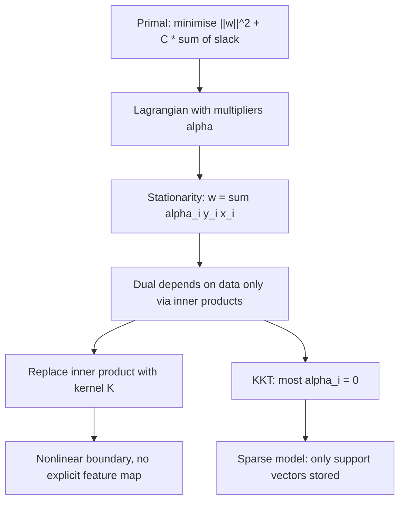

# Support Vector Machines

## TL;DR
Find the separating hyperplane with the largest margin, because the widest gap is the most robust
decision boundary. The optimisation is convex, its dual depends on the data only through inner
products, and replacing that inner product with a kernel buys you a nonlinear boundary without ever
materialising the nonlinear features. $C$ trades margin width against violations; $\gamma$ sets how
local each RBF support vector's influence is.

## Intuition
Many lines separate two linearly separable clouds. Pick the one that pushes the widest possible slab
between them — the boundary that would survive the most jitter in the data. Only the points touching
the slab's edges hold it in place; everything else could be deleted without changing the answer.
Those touching points are the *support vectors*, and the whole model is just them plus their weights.

## The maths

### Margin maximisation (hard margin)
Labels $y_i \in \{-1, +1\}$, features $x_i \in \mathbb{R}^d$, hyperplane $w^\top x + b = 0$.
The signed geometric distance from $x_i$ to the plane is $\frac{y_i(w^\top x_i + b)}{\lVert w \rVert}$.

We can rescale $(w, b)$ freely, so fix the *functional* margin of the closest points to 1:
$y_i(w^\top x_i + b) \ge 1$. The geometric margin is then $1/\lVert w\rVert$ per side, so the slab
width is $2/\lVert w \rVert$. Maximising the width is minimising $\lVert w \rVert$:

$$
\min_{w,b} \ \tfrac{1}{2}\lVert w \rVert^2
\quad \text{s.t.} \quad y_i(w^\top x_i + b) \ge 1 \ \ \forall i
$$

This is a convex quadratic program: one global optimum, no random restarts.

### Soft margin
Real data overlaps. Introduce slack $\xi_i \ge 0$ measuring how far point $i$ intrudes into (or past)
the margin:

$$
\min_{w,b,\xi} \ \tfrac{1}{2}\lVert w \rVert^2 + C\sum_{i=1}^{n}\xi_i
\quad \text{s.t.}\quad y_i(w^\top x_i + b) \ge 1 - \xi_i,\ \ \xi_i \ge 0
$$

Eliminating $\xi$ gives the unconstrained *hinge-loss* form, which is how to see SVM as just another
regularised ERM problem:

$$
\min_{w,b}\ \underbrace{\sum_{i=1}^{n}\max\!\left(0,\ 1 - y_i(w^\top x_i + b)\right)}_{\text{hinge loss}}
+ \frac{1}{2C}\lVert w \rVert^2
$$

So $1/C$ is the L2 regularisation strength. Large $C$ = penalise violations hard = narrow margin that
bends to fit outliers = low bias, high variance. Small $C$ = wide, smooth margin that tolerates
misclassification = high bias, low variance. See [[regularization-l1-l2]].

### The dual, and why anyone bothers
Form the Lagrangian with multipliers $\alpha_i \ge 0$ on the margin constraints (see
[[lagrange-multipliers-and-constraints]]). Stationarity in $w$ gives the key identity

$$
w = \sum_{i=1}^{n}\alpha_i y_i x_i
$$

Substituting back eliminates $w$ and $b$ and leaves the dual:

$$
\max_{\alpha} \ \sum_{i=1}^{n}\alpha_i - \frac{1}{2}\sum_{i=1}^{n}\sum_{j=1}^{n}\alpha_i\alpha_j y_i y_j \, \langle x_i, x_j\rangle
\quad \text{s.t.}\quad 0 \le \alpha_i \le C,\ \ \sum_i \alpha_i y_i = 0
$$

Two consequences do all the work:

1. **The data enters only as inner products** $\langle x_i, x_j \rangle$. Nothing else about $x$ is used.
2. **KKT complementary slackness** forces $\alpha_i = 0$ for every point strictly outside the margin.
   Only margin and violating points get $\alpha_i > 0$ — the *support vectors*. Prediction is
   $\hat{y}(x) = \operatorname{sign}\!\left(\sum_{i \in SV}\alpha_i y_i \langle x_i, x\rangle + b\right)$,
   a weighted vote of stored training points.

The dual also exposes the $C$ upper bound: $\alpha_i = C$ marks a point inside the margin or misclassified.

### Why the kernel trick works
Suppose we map $x \mapsto \phi(x)$ into a high (possibly infinite) dimensional space and run the same
program. The dual needs only $\langle \phi(x_i), \phi(x_j)\rangle$. If a function $K(x, x')$ equals that
inner product for *some* $\phi$, we never need $\phi$ itself.

Mercer's condition tells us when: if $K$ is symmetric and positive semi-definite (every Gram matrix
$K_{ij} = K(x_i,x_j)$ has non-negative eigenvalues), then $K$ is an inner product in some reproducing
kernel Hilbert space. That is the entire justification — not a trick, a theorem.

Common kernels:

| Kernel | $K(x, x')$ | Notes |
|---|---|---|
| Linear | $x^\top x'$ | Use when $d \gg n$ (text, one-hot) |
| Polynomial | $(\gamma x^\top x' + r)^p$ | Explicit finite feature map; numerically touchy for large $p$ |
| RBF / Gaussian | $\exp(-\gamma \lVert x - x' \rVert^2)$ | Infinite-dimensional feature map; the default |

The RBF map is infinite-dimensional — expand $e^{2\gamma x^\top x'}$ as a power series and each term is
a polynomial kernel of a different degree. You could never write $\phi$ down, yet optimisation over that
space costs $O(n^2)$ kernel evaluations.

### What $\gamma$ does geometrically
$K(x,x') = \exp(-\gamma \lVert x - x'\rVert^2)$ is a bump of width $\sim 1/\sqrt{\gamma}$ around each
support vector. The decision function is a sum of such bumps.

- **Small $\gamma$**: wide bumps, each support vector influences the whole space, boundary is nearly
  linear, high bias.
- **Large $\gamma$**: narrow bumps, influence dies just past each training point, the boundary becomes
  islands around individual points — memorisation. In the limit every point is its own support vector
  and you have a 1-NN classifier with perfect training accuracy and no generalisation.

$C$ and $\gamma$ interact: both increase effective capacity, so they must be tuned *jointly* on a 2-D
grid, never one at a time.

## Diagram



## Code

```python
import numpy as np
from sklearn.datasets import make_circles
from sklearn.model_selection import GridSearchCV, train_test_split
from sklearn.pipeline import make_pipeline
from sklearn.preprocessing import StandardScaler
from sklearn.svm import SVC

X, y = make_circles(n_samples=1200, noise=0.12, factor=0.45, random_state=0)
Xtr, Xte, ytr, yte = train_test_split(X, y, test_size=0.25, random_state=0, stratify=y)

# Scaling is NOT optional: the RBF kernel is a distance, so unscaled units dominate it.
pipe = make_pipeline(StandardScaler(), SVC(kernel="rbf"))

grid = GridSearchCV(
    pipe,
    {"svc__C": np.logspace(-2, 3, 6), "svc__gamma": np.logspace(-4, 1, 6)},
    cv=5, scoring="roc_auc", n_jobs=-1,
)
grid.fit(Xtr, ytr)
print(grid.best_params_, grid.best_score_)

best = grid.best_estimator_.named_steps["svc"]
print("support vectors:", best.n_support_, "of", len(ytr))
print("test accuracy:", grid.score(Xte, yte))
```

Verifying that the model really is a weighted sum of support vectors:

```python
sv = best.support_vectors_            # already in scaled space
alpha_y = best.dual_coef_[0]          # alpha_i * y_i, signed
Xte_s = grid.best_estimator_.named_steps["standardscaler"].transform(Xte)

gamma = best._gamma
d2 = ((Xte_s[:, None, :] - sv[None, :, :]) ** 2).sum(-1)
manual = np.exp(-gamma * d2) @ alpha_y + best.intercept_[0]
print(np.allclose(manual, best.decision_function(Xte_s)))   # True
```

Large-$n$ alternative — approximate the RBF map explicitly and fit a linear model:

```python
from sklearn.kernel_approximation import Nystroem
from sklearn.linear_model import SGDClassifier

fast = make_pipeline(
    StandardScaler(),
    Nystroem(gamma=0.5, n_components=500, random_state=0),
    SGDClassifier(loss="hinge", alpha=1e-4, random_state=0),
).fit(Xtr, ytr)
print("nystroem+linear accuracy:", fast.score(Xte, yte))
```

## In practice
- **Use it when:** $n$ is small-to-moderate (say under ~50k rows), $d$ is large relative to $n$, the
  boundary is genuinely nonlinear, and you want a convex problem with a unique optimum. Text
  classification with a **linear** kernel and `LinearSVC` is still an excellent, very fast baseline.
- **Defaults that work:** always scale first; `kernel='rbf'`, `C` and `gamma` searched on a log grid
  (`C` in $10^{-2}..10^{3}$, `gamma` in $10^{-4}..10^{1}$); `class_weight='balanced'` for skew.
  `gamma='scale'` (= $1/(d\cdot \operatorname{Var}(X))$) is a sane starting point.
- **Breaks when:** $n$ is large. Kernel SVM training is roughly $O(n^2)$ to $O(n^3)$ and the kernel
  matrix is $O(n^2)$ memory — 100k rows is already 80 GB in float64. Also breaks when you need
  probabilities (SVM outputs a margin, not a probability; `probability=True` runs internal Platt
  scaling with 5-fold CV, which is slow and can disagree with `decision_function`'s sign).
- **Cost / latency:** inference is $O(n_{SV} \cdot d)$ per prediction. On noisy data the number of
  support vectors grows roughly linearly with $n$, so a "sparse" model can end up storing half the
  training set. XGBoost with 200 shallow trees is usually both more accurate and faster to serve on
  tabular data ([[vs-xgboost-vs-neural-networks]]).

> [!warning]
> Forgetting to scale is the single most common SVM mistake. An RBF kernel on raw features where
> `income` is in lakhs and `age` is in years computes a distance entirely determined by income; the
> model will look broken and no amount of tuning $C$ will fix it.

## Interview angle

**Q. Derive the SVM dual and say what it buys you.**
Start from $\min \frac12\lVert w\rVert^2$ subject to $y_i(w^\top x_i + b) \ge 1$. Attach multipliers
$\alpha_i \ge 0$, set $\partial_w L = 0$ to get $w = \sum \alpha_i y_i x_i$ and $\partial_b L = 0$ to get
$\sum \alpha_i y_i = 0$, substitute back, and the primal variables vanish leaving a QP in $\alpha$ whose
only data dependence is $\langle x_i, x_j\rangle$. Two payoffs: the solution is sparse in $\alpha$ by KKT
complementary slackness, and inner products can be swapped for a kernel.

**Follow-up.** Why can't I kernelise logistic regression the same way? → You can — that is kernel
logistic regression, and the representer theorem gives the same $w = \sum \alpha_i \phi(x_i)$ form. The
difference is that the log-loss is smooth and positive everywhere, so no $\alpha_i$ is exactly zero: you
lose sparsity and must store all $n$ points. Hinge loss's flat region at $z \ge 1$ is what makes SVMs sparse.

**Q. What actually is the kernel trick, in one sentence?**
The dual objective and the prediction rule touch the data only through inner products, so any positive
semi-definite $K(x,x')$ — which Mercer's theorem guarantees equals $\langle \phi(x), \phi(x')\rangle$ for
some feature map — lets us optimise in $\phi$'s space while only ever computing $K$ in the original space.

**Q. My RBF SVM has 100% training accuracy and 60% test accuracy. Which knob?**
$\gamma$ is too large — the bumps are so narrow that each training point is memorised in isolation.
Lower $\gamma$ first (widen influence), then lower $C$ (allow violations). Re-tune both jointly; they are
not independent.

**Q. When would you choose a linear kernel over RBF?**
When $d$ is large relative to $n$ — high-dimensional sparse data like TF-IDF is usually already linearly
separable, and the RBF's extra capacity only buys variance. Also whenever you need to train on hundreds
of thousands of rows, where `LinearSVC` / `SGDClassifier(loss='hinge')` scale linearly and kernel SVC does not.

**Q. How does an SVM handle multi-class?**
It does not, natively — the formulation is binary. scikit-learn's `SVC` does one-vs-one ($k(k-1)/2$
classifiers, each trained only on its two classes, so each is small) and `LinearSVC` does one-vs-rest
($k$ classifiers). OvO scales better in training time for kernel SVMs because of the superlinear cost in $n$.

**Q. What is $\nu$-SVM?**
A reparameterisation where $\nu \in (0,1]$ upper-bounds the fraction of margin errors and lower-bounds
the fraction of support vectors. Same solution family as $C$-SVM, but $\nu$ has an interpretable scale,
which makes it easier to set than a raw $C$.

## Traps
- **"SVMs work well on huge datasets."** Wrong direction — kernel SVM is the classic *small-to-medium*
  $n$, large $d$ method. Say the $O(n^2)$ memory and be right.
- **Skipping scaling.** The RBF kernel is a Euclidean distance; unscaled features make it meaningless.
  Not a preference, a requirement.
- **Treating `decision_function` output as a probability.** It is an unbounded margin score. Monotone,
  so ranking metrics like AUC are fine, but it is not $P(y=1\mid x)$. Calibrate explicitly
  ([[probability-calibration]]).
- **Tuning $C$ then $\gamma$ separately.** They jointly control capacity; a 1-D sweep of one at a fixed
  bad value of the other finds nothing. Use a 2-D log grid or random search.
- **"More support vectors means a better model."** The opposite. A large support-vector fraction signals
  heavy overlap or overfitting and directly slows inference.
- **Claiming SVMs are immune to outliers because of the margin.** Soft-margin with large $C$ is *very*
  sensitive to a single mislabelled point near the boundary, since hinge loss grows linearly forever.

## Flashcards
What does an SVM maximise, and what is the slab width in terms of w?::The geometric margin; the slab width is $2/\lVert w\rVert$, so maximising margin = minimising $\lVert w\rVert^2$.
Write the SVM as regularised empirical risk minimisation.::Hinge loss $\sum \max(0, 1 - y_i f(x_i))$ plus $\frac{1}{2C}\lVert w\rVert^2$ — so $1/C$ is the L2 strength.
Why is the SVM solution sparse?::KKT complementary slackness forces $\alpha_i = 0$ for points strictly outside the margin, leaving only support vectors.
Why does the kernel trick work?::The dual and the prediction rule use the data only via inner products, and a PSD kernel is an inner product in some feature space (Mercer).
Geometric effect of large gamma in an RBF kernel?::Narrow bumps around each support vector — very local, wiggly boundary, overfitting; in the limit it becomes 1-NN.
Effect of large C?::Heavily penalises margin violations — narrow margin, fits outliers, low bias and high variance.
Training complexity of kernel SVM?::Roughly $O(n^2)$–$O(n^3)$ time and $O(n^2)$ memory for the Gram matrix — the reason it does not scale.
How do you scale kernel SVM ideas to large n?::Approximate the feature map (Nystroem or random Fourier features) then fit a linear model with SGD.

## Related
- [[logistic-regression]] — the smooth-loss sibling, and what you lose by dropping sparsity
- [[lagrange-multipliers-and-constraints]] — the machinery behind the dual
- [[convexity-and-optimization-basics]] — why the SVM has a unique global optimum
- [[regularization-l1-l2]] — $1/C$ as an L2 penalty
- [[feature-scaling-and-transforms]] — the mandatory preprocessing step
- [[k-nearest-neighbours]] — what a large-$\gamma$ RBF SVM degenerates into
- [[probability-calibration]] — turning margins into probabilities
