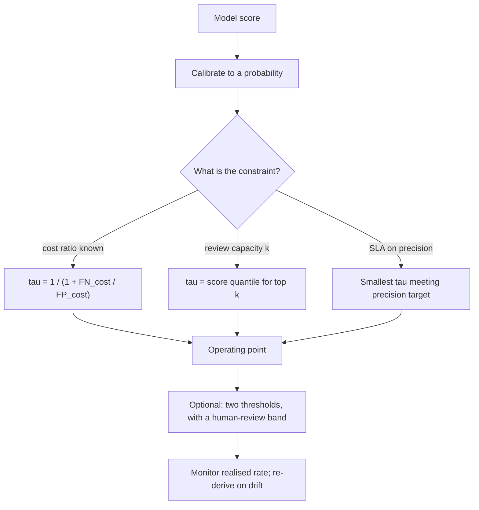

# Threshold Selection

## TL;DR
0.5 is a default, not a decision. The optimal threshold comes from the cost of each error type and the
class prior: with a calibrated probability, act positive when expected cost of acting is lower than
expected cost of not acting, which gives a closed-form threshold. Pick it on validation data, report it
as part of the model, and monitor it — because when the base rate drifts, the right threshold moves.

## Intuition
A model gives you a probability. A *decision* needs a price list. Missing a fraudulent transaction of
₹50,000 and wrongly blocking a genuine one are not the same event, so the point at which you flip from
"allow" to "block" has nothing to do with 0.5 — it depends entirely on those two numbers and on how
often fraud actually happens. The model ranks; the business sets the line.

## The maths

### The Bayes-optimal threshold from a cost matrix
Define costs for each outcome: $C_{TP}, C_{FP}, C_{TN}, C_{FN}$ (costs, so a benefit is negative). With
calibrated $p = P(y=1\mid x)$:

$$
\begin{aligned}
\mathbb{E}[\text{cost} \mid \text{predict } 1] &= p\,C_{TP} + (1-p)\,C_{FP} \\
\mathbb{E}[\text{cost} \mid \text{predict } 0] &= p\,C_{FN} + (1-p)\,C_{TN}
\end{aligned}
$$

Predict 1 when the first is smaller. Solving for $p$:

$$
p^{*} = \frac{C_{FP} - C_{TN}}{(C_{FP} - C_{TN}) + (C_{FN} - C_{TP})}
$$

Writing $\Delta_{FP} = C_{FP} - C_{TN}$ (the extra cost of a false alarm) and
$\Delta_{FN} = C_{FN} - C_{TP}$ (the extra cost of a miss):

$$
\boxed{\ p^{*} = \frac{\Delta_{FP}}{\Delta_{FP} + \Delta_{FN}} = \frac{1}{1 + \Delta_{FN}/\Delta_{FP}}\ }
$$

Only the *ratio* of the two error costs matters — you never need absolute rupee values, which makes this
a tractable conversation with a product owner. If a miss costs 9× a false alarm, $p^* = 1/10 = 0.1$.
If they are equal, $p^* = 0.5$ — that is where the default comes from, and it is almost never true.

Note this assumes calibrated probabilities. With an uncalibrated score, the formula gives the wrong
operating point, which is why [[probability-calibration]] comes first.

### Threshold under a capacity constraint
Often the constraint is not a cost but a budget: the fraud team can review 500 cases a day, the sales
team can call 2000 leads a month. Then the threshold is a *quantile* of the score distribution, not a
cost-derived value:

$$
\tau = Q_{1 - k/n}\big(\hat{p}\big)
$$

Take the top $k$ by score. The relevant metric becomes precision@k or recall@k, not F1. This is far more
common in practice than the cost-matrix case and is worth saying explicitly in an interview.

### Where the standard metrics sit on the curve
Every threshold is a point on the ROC and PR curves ([[roc-auc-and-pr-curves]]):

- Maximising **F1** implicitly assumes $\Delta_{FN} = \Delta_{FP}$ relative to precision/recall balance —
  it is an arbitrary choice dressed up as principled. It also ignores true negatives entirely.
- **Youden's J** = $\max_\tau (\mathrm{TPR} - \mathrm{FPR})$ picks the ROC point furthest from the
  diagonal, which is the cost-optimal point only when errors are equally costly *and* classes are balanced.
- The **iso-cost line** on an ROC plot has slope $\frac{(1-\pi)\Delta_{FP}}{\pi\,\Delta_{FN}}$ where
  $\pi$ is the positive prevalence; the optimal operating point is where a line of that slope is tangent
  to the ROC curve. This is the geometric statement of the same formula and is a strong thing to draw.

### Why the threshold moves when the prior moves
$p^*$ depends only on costs, but the *score distribution* depends on the prior. If you trained at a 1%
positive rate and production drifts to 3%, a calibrated model's scores shift upward and the count of
cases above a fixed $\tau$ roughly triples — blowing your review capacity even though nothing about the
model is broken. Under a capacity constraint the threshold must be re-derived from the current score
quantile, not frozen at training time.

### Multiclass and multi-threshold settings
For $K$ classes with a cost matrix $C \in \mathbb{R}^{K\times K}$, the Bayes rule is

$$
\hat{y}(x) = \arg\min_{k}\ \sum_{j=1}^{K} p_j(x)\, C_{kj}
$$

— pick the action minimising expected cost, not the argmax of the probability. And you are not limited to
two actions: a three-way rule ("auto-approve below $\tau_1$, auto-reject above $\tau_2$, send
$[\tau_1, \tau_2]$ to a human") is usually the right design and lets you tune coverage against
manual-review cost independently.

## Diagram



## Code

```python
import numpy as np
from sklearn.datasets import make_classification
from sklearn.ensemble import HistGradientBoostingClassifier
from sklearn.calibration import CalibratedClassifierCV
from sklearn.metrics import confusion_matrix, precision_recall_curve
from sklearn.model_selection import train_test_split

X, y = make_classification(n_samples=40000, n_features=25, n_informative=8,
                           weights=[0.98, 0.02], random_state=0)
Xtr, Xtmp, ytr, ytmp = train_test_split(X, y, test_size=0.4, stratify=y, random_state=0)
Xva, Xte, yva, yte = train_test_split(Xtmp, ytmp, test_size=0.5, stratify=ytmp, random_state=0)

clf = CalibratedClassifierCV(
    HistGradientBoostingClassifier(max_iter=300, random_state=0), method="isotonic", cv=5
).fit(Xtr, ytr)

p_va = clf.predict_proba(Xva)[:, 1]
p_te = clf.predict_proba(Xte)[:, 1]
```

Threshold from a cost matrix, both analytically and empirically:

```python
# Rupee costs relative to doing nothing. A miss costs 40x a false alarm.
COST_FP, COST_FN = 200.0, 8000.0

tau_analytic = COST_FP / (COST_FP + COST_FN)
print(f"analytic threshold: {tau_analytic:.4f}")      # 0.0244, not 0.5

def total_cost(y_true, p, tau):
    tn, fp, fn, tp = confusion_matrix(y_true, (p >= tau).astype(int), labels=[0, 1]).ravel()
    return fp * COST_FP + fn * COST_FN

grid = np.linspace(0.001, 0.999, 999)
costs = np.array([total_cost(yva, p_va, t) for t in grid])
tau_empirical = grid[costs.argmin()]

print(f"empirical threshold: {tau_empirical:.4f}")
print(f"cost at 0.5  : {total_cost(yte, p_te, 0.5):,.0f}")
print(f"cost at tau  : {total_cost(yte, p_te, tau_empirical):,.0f}")
# The analytic and empirical thresholds agree closely when the model is well calibrated.
# If they diverge badly, your calibration is the problem, not your threshold search.
```

Threshold from a capacity budget, and from a precision SLA:

```python
DAILY_CAPACITY = 300
n_days = 30
tau_capacity = np.quantile(p_va, 1 - (DAILY_CAPACITY * n_days) / len(p_va))
print(f"capacity threshold: {tau_capacity:.4f}, flags {(p_te >= tau_capacity).sum()} of {len(p_te)}")

prec, rec, thr = precision_recall_curve(yva, p_va)
TARGET_PRECISION = 0.60
ok = prec[:-1] >= TARGET_PRECISION
tau_prec = thr[ok][np.argmax(rec[:-1][ok])]   # highest recall meeting the precision floor
print(f"precision-SLA threshold: {tau_prec:.4f}, recall {rec[:-1][thr == tau_prec][0]:.3f}")
```

Bootstrap the threshold so you know how stable it is — a single-point estimate from few positives is noisy:

```python
rng = np.random.default_rng(0)
taus = []
for _ in range(300):
    idx = rng.integers(0, len(yva), len(yva))
    c = np.array([total_cost(yva[idx], p_va[idx], t) for t in grid])
    taus.append(grid[c.argmin()])
print(f"threshold 90% interval: {np.percentile(taus, [5, 95]).round(4)}")
```

## In practice
- **Use it when:** any time you convert a score to an action. Which is every deployed classifier.
- **Defaults that work:** calibrate, then derive $\tau$ from a cost ratio if one exists, a capacity
  quantile if one does not, and a precision or recall SLA if the stakeholder speaks that language. Choose
  $\tau$ on a validation split, report performance at that $\tau$ on an untouched test split. Log the
  threshold in the model registry as a parameter, versioned with the model.
- **Breaks when:** probabilities are uncalibrated (the formula is then meaningless); the positive class is
  so rare that the validation set has too few positives to estimate the threshold stably (bootstrap it and
  show the interval); costs are genuinely unknowable — in which case use a capacity constraint, which is
  usually the real constraint anyway.
- **Cost / latency:** free at inference. The operational cost is human: re-deriving the threshold after
  drift, and the alert-fatigue cost of setting it too low.

> [!tip]
> Ship the threshold *with* the model, not in application config. In MLflow, log it as a parameter and
> wrap the threshold inside a `pyfunc` model so the serving layer cannot silently keep a stale 0.5. A
> threshold living in someone's YAML while the model is retrained weekly is a recurring production
> incident ([[model-registry-and-versioning]]).

## Interview angle

**Q. Why not just use 0.5?**
Because 0.5 is the Bayes-optimal threshold only when a false positive and a false negative cost exactly
the same. Derive it: predict 1 when $p\,C_{FN} + (1-p)C_{TN} > p\,C_{TP} + (1-p)C_{FP}$, which gives
$p^* = \Delta_{FP}/(\Delta_{FP} + \Delta_{FN})$. Equal costs give 0.5; anything else does not. In fraud,
churn, medical screening or credit, the costs are never equal.

**Follow-up.** What if the business can't give me costs? → Get the *ratio*, not absolute values — "is a
miss worth ten false alarms or two?" is a question people can answer. If even that fails, fall back to
the operational constraint: how many cases can the team actually review per day? That gives a quantile
threshold and is usually the binding constraint regardless.

**Q. Why is maximising F1 a weak way to pick a threshold?**
F1 is the harmonic mean of precision and recall, which encodes one specific and arbitrary cost tradeoff
and ignores true negatives entirely. It happens to be defensible when you have no information, but if you
*do* know the cost ratio, the cost-optimal threshold is strictly better and defensible to a stakeholder.
Also, F1 is not a proper scoring rule, so tuning to it can degrade the probabilities themselves.

**Q. How does class imbalance change the threshold?**
It does not change the cost-optimal $p^*$, which depends only on costs — but it moves the score
distribution, so the *number of cases* above a fixed threshold depends heavily on the prevalence. That is
why threshold moving, not resampling, is the cleanest response to imbalance: you keep an honestly
calibrated model and shift the decision line ([[imbalanced-classification]]).

**Q. Your fraud model's threshold was set six months ago. What could have gone wrong?**
Prevalence drift and score drift. If fraud rates rose, the same threshold now flags many more cases than
the review team can handle; if the population shifted, calibration is stale and the threshold no longer
corresponds to the cost ratio it was derived from. I would monitor the flag rate, the realised precision
on reviewed cases, and mean predicted probability versus realised positive rate, and re-derive the
threshold on recent labelled data.

**Q. Would you ever use more than one threshold?**
Frequently. A two-threshold design — auto-approve, auto-reject, and a human-review band in between — lets
you set automation coverage explicitly. You then optimise three quantities: automation rate, error rate
inside the automated bands, and review-team load. That is a much better answer than a single number, and
it maps directly onto how real risk systems are built ([[human-in-the-loop-patterns]]).

**Q. Draw where the optimal threshold sits on an ROC curve.**
It is where a line of slope $\frac{(1-\pi)\Delta_{FP}}{\pi \Delta_{FN}}$ is tangent to the curve. Rare
positives make the slope steep, pushing the optimum toward the low-FPR, low-TPR corner — which is the
geometric reason rare-event models operate at low recall.

## Traps
- **Reporting metrics at 0.5 and calling it the model's performance.** Report at the operating point you
  will actually deploy.
- **Choosing the threshold on the test set.** That is leakage of the evaluation; pick on validation,
  report on test ([[data-leakage]]).
- **Deriving a cost-optimal threshold from uncalibrated scores.** The formula assumes $p$ is a
  probability. Calibrate first.
- **Freezing the threshold forever.** Prevalence drifts; a capacity-based threshold must be re-derived.
- **Fixing imbalance by resampling and *then* still using 0.5.** You have shifted the prior and the
  threshold simultaneously, in uncontrolled directions. Pick one mechanism.
- **Optimising the threshold on very few positives.** With 40 positives, the argmin of the cost curve is
  extremely noisy. Bootstrap and quote an interval.
- **Assuming one global threshold is right for all segments.** If cost or base rate differs by segment
  (geography, channel, customer tier), per-segment thresholds are often the largest available win — but
  check fairness implications before shipping them.

## Flashcards
Derive the cost-optimal threshold.::Predict 1 when expected cost of acting < not acting; solving gives $p^* = \Delta_{FP}/(\Delta_{FP}+\Delta_{FN})$, i.e. $1/(1 + \text{FN cost}/\text{FP cost})$.
Why is 0.5 the default threshold?::It is optimal only when false positives and false negatives cost the same.
What do you need from the business to set a threshold?::Only the cost *ratio* of a miss to a false alarm — absolute values are unnecessary.
How do you set a threshold with no cost information?::From the operational constraint: take the top k by score, where k is review capacity — threshold is a score quantile.
What is the slope of the iso-cost line on an ROC plot?::$\frac{(1-\pi)\Delta_{FP}}{\pi \Delta_{FN}}$; the optimum is where that line is tangent to the ROC curve.
Why must probabilities be calibrated before cost-based thresholding?::The formula equates $p$ with a true probability; an uncalibrated score gives the wrong operating point.
What is the multiclass generalisation?::Choose the action minimising $\sum_j p_j C_{kj}$ — expected cost, not argmax probability.
Why is a two-threshold design often better?::It creates an explicit human-review band, letting you tune automation coverage against review load separately from accuracy.

## Related
- [[probability-calibration]] — the prerequisite for cost-based thresholds
- [[classification-metrics]] — what each metric assumes about costs
- [[roc-auc-and-pr-curves]] — the curve every threshold is a point on
- [[imbalanced-classification]] — threshold moving as the preferred fix
- [[requirements-and-metrics-definition]] — eliciting costs from stakeholders
- [[model-monitoring]] — detecting when the threshold has gone stale
- [[human-in-the-loop-patterns]] — the review band between two thresholds
