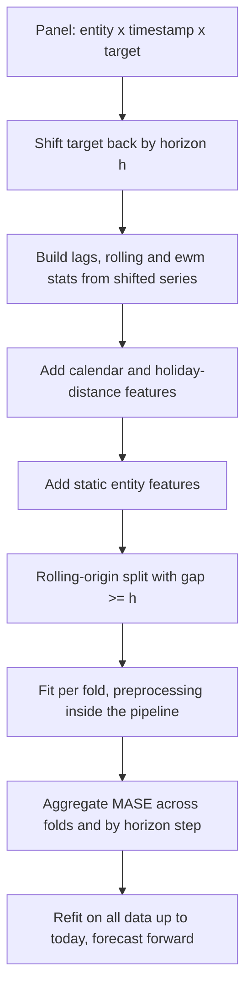
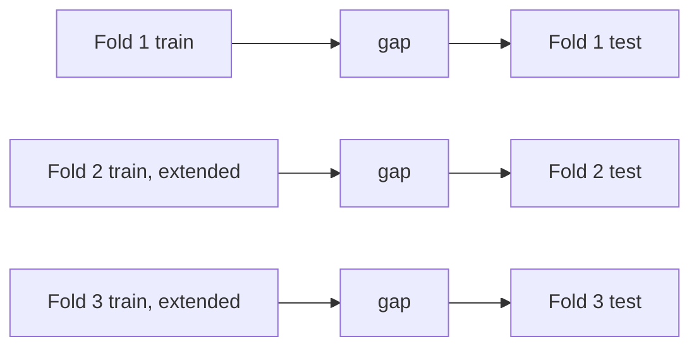

# Time Series Features and Validation

## TL;DR
Every feature must be computable from data strictly before the forecast origin, shifted by the full
horizon. Validate with rolling origin — expanding or sliding windows that always train on the past and
test on the future, with a gap equal to the horizon. The leakage traps are centred rolling windows,
unshifted lags, global scalers and target encodings fitted across time, and evaluating a 28-day forecast
with 1-day-old features.

## Intuition
Stand at a point in time and cover everything to the right of it with your hand. Any feature you cannot
compute from what remains visible is a feature you will not have in production. That is the entire
discipline — and almost every time-series bug is a failure to keep your hand over the right part of the
timeline.

## The maths

### The invariant
For a forecast made at origin $t$ for target $y_{t+h}$, every feature must satisfy

$$
x_j \in \sigma\big(\{y_s, z_s : s \le t\}\big)
$$

— measurable with respect to the information available at $t$. Concretely, a lag-$k$ feature used to
predict $h$ steps ahead must be shifted by $h + k - 1$, not by $k$:

$$
\text{lag}_k^{(h)}(t) = y_{t - (h + k - 1)}
$$

Get this off by one and the model trains on information it will never have.

### The feature families

**Lags.** $y_{t-1}, y_{t-7}, y_{t-28}, y_{t-364}$ — pick lags at the seasonal periods, not arbitrarily.
For daily data with weekly seasonality, 7 and 14 and 28; for yearly seasonality, 364 (keeps the day of
week aligned) rather than 365.

**Rolling aggregates.** Mean, std, min, max, median over trailing windows, always shifted first:
`y.shift(h).rolling(w).mean()`. Long windows capture level, short windows capture recent regime. The
std captures volatility, which is often a better feature than another lag.

**Expanding aggregates.** Cumulative mean/count from the series start — a slowly-updating baseline that
is naturally leak-free.

**Exponentially weighted.** `y.shift(h).ewm(halflife=7).mean()` — smoother than a rectangular window and
responds faster to regime change.

**Differences and ratios.** $y_t - y_{t-7}$, $y_t / y_{t-7}$, and the acceleration
$(y_t - y_{t-1}) - (y_{t-1} - y_{t-2})$. These are what make trees able to represent trend, because they
turn an extrapolation problem into an interpolation one ([[time-series-forecasting]]).

**Calendar.** Day of week, day of month, month, quarter, week of year, is-month-end, is-quarter-end,
payday proximity. Encode cyclical variables as sine/cosine pairs so December and January are adjacent:

$$
\text{doy}_{\sin} = \sin\!\left(\frac{2\pi\,\text{dayofyear}}{365.25}\right), \qquad
\text{doy}_{\cos} = \cos\!\left(\frac{2\pi\,\text{dayofyear}}{365.25}\right)
$$

Trees can learn month effects from an integer, so the cyclical encoding matters more for linear and
neural models — but it also reduces the number of splits a tree needs.

**Holidays.** Not a binary flag. Signed *distance* to the nearest holiday (−3, −2, −1, 0, +1, +2) captures
the pre-holiday build-up and post-holiday slump that a flag cannot. For India this is essential and
non-trivial: Diwali, Holi and Eid move in the Gregorian calendar, regional holidays differ by state, and
the effect spans a week either side. A `holiday_name` categorical plus `days_to_holiday` plus
`is_long_weekend` is the usable trio.

**Static / entity features.** Store size, region, category, tenure. In a global model these let the tree
learn different seasonal responses per segment from a single fit.

**Exogenous.** Price, promotion, weather, marketing spend. Only usable if you will *have* their future
values at forecast time — you control price and promotion; you do not control weather (a forecast of a
forecast) ([[feature-engineering]]).

### Validation: rolling origin
A single train/test split gives one estimate of performance at one point in time, which for a series with
changing regimes is nearly worthless. Rolling-origin (backtesting) evaluation repeats the
train-and-forecast exercise at $K$ successive origins:

**Expanding window**: training set grows, always starting at the series beginning.
Use when more history always helps and the process is stable.

$$
\text{fold } k:\quad \text{train } [1,\ T_0 + (k-1)\delta],\quad \text{test } (T_0 + (k-1)\delta,\ T_0 + (k-1)\delta + h]
$$

**Sliding window**: fixed-length training set that moves forward.
Use when older data is stale — after a regime change, or when the process drifts.

Both need a **gap** of at least the horizon between train end and test start. Without it, the last
training observations overlap the period whose outcome you are predicting.

`TimeSeriesSplit(n_splits=k, gap=g, max_train_size=m)` gives you expanding with `max_train_size=None`
and sliding when you set it.

### Aggregate the fold errors correctly
Do not average MAPE across folds and series — it is dominated by small-denominator series. Prefer MASE,
which is scale-free, or a weighted absolute error where weights are business value:

$$
\text{wMAPE} = \frac{\sum_{i,t}\lvert y_{it} - \hat y_{it}\rvert}{\sum_{i,t}\lvert y_{it}\rvert}
$$

Also report error **by horizon step** — a 28-day forecast that is excellent at $h=1$ and terrible at
$h=28$ has a completely different remedy from one that is uniformly mediocre.

### The leakage traps, concretely

| Trap | Why it leaks | Fix |
|---|---|---|
| `rolling(7, center=True)` | Window includes future values | Trailing window: `.shift(h).rolling(7)` |
| `.rolling(7).mean()` without `.shift()` | Includes the current value $y_t$ itself | Shift by the horizon first |
| Random `KFold` | Trains on the future, tests on the past | `TimeSeriesSplit` or explicit date cutoffs |
| `StandardScaler().fit(X)` on all data | Scaling statistics computed from the future | Fit inside the pipeline, per fold |
| Target encoding across the full series | Category means include future outcomes | Expanding-window encoding computed as of each date |
| No `gap` with a multi-step horizon | Last training labels overlap the test period | `gap >= horizon` |
| Filling NaNs with `bfill` | Copies future values backwards | `ffill` only, or leave NaN for trees |
| Deduplicating or resampling after the split | Same period on both sides | Do it before |
| Joining a *current-state* dimension table | Every historical row gets today's attributes | Point-in-time join against an SCD2 dimension |
| Features built at the latest snapshot | Restated data (revised actuals, late-arriving rows) is not what you had then | Use the as-of-then vintage |

That last one is the subtle one and worth knowing: many source systems restate history. Yesterday's
number for last Tuesday is not the same as today's number for last Tuesday. Training on restated values
and serving on fresh, unrestated values is a silent train/serve mismatch
([[training-serving-skew]]).

## Diagram





## Code

```python
import numpy as np
import pandas as pd

rng = np.random.default_rng(0)
dates = pd.date_range("2022-01-01", "2025-06-30", freq="D")
sites = [f"site_{i}" for i in range(12)]
panel = pd.MultiIndex.from_product([sites, dates], names=["site_id", "ds"]).to_frame(index=False)
panel["demand"] = (
    100
    + panel.groupby("site_id").ngroup() * 15
    + 10 * np.sin(2 * np.pi * panel.ds.dt.dayofweek / 7)
    + 0.03 * (panel.ds - panel.ds.min()).dt.days
    + rng.normal(0, 5, len(panel))
)
```

Leak-free feature construction — the `shift(horizon)` is the whole safety mechanism:

```python
HORIZON = 28

def build_features(df, horizon=HORIZON, target="demand", group="site_id", time="ds"):
    df = df.sort_values([group, time]).copy()
    g = df.groupby(group, group_keys=False)[target]

    # Everything derives from the horizon-shifted series, so no feature can see t+1..t+h.
    base = g.shift(horizon)

    for lag in [0, 6, 13, 27, 363]:                       # effective lags h, h+6, h+13, ...
        df[f"lag_{horizon + lag}"] = g.shift(horizon + lag)

    for w in [7, 28, 91]:
        df[f"roll_mean_{w}"] = base.rolling(w, min_periods=max(2, w // 2)).mean()
        df[f"roll_std_{w}"]  = base.rolling(w, min_periods=max(2, w // 2)).std()
    df["ewm_14"] = base.ewm(halflife=14).mean()

    df["diff_7"]  = base - g.shift(horizon + 7)
    df["ratio_7"] = base / (g.shift(horizon + 7) + 1e-9)

    ts = df[time]
    df["dow"] = ts.dt.dayofweek
    df["dom"] = ts.dt.day
    df["month"] = ts.dt.month
    df["is_month_end"] = ts.dt.is_month_end.astype(int)
    df["doy_sin"] = np.sin(2 * np.pi * ts.dt.dayofyear / 365.25)
    df["doy_cos"] = np.cos(2 * np.pi * ts.dt.dayofyear / 365.25)
    return df

feat = build_features(panel)
```

An assertion that catches the off-by-one bug — worth putting in your test suite:

```python
def assert_no_future_leak(df, horizon, target="demand", group="site_id", time="ds"):
    """A feature correlating with the target more than the horizon-shifted target does
    is a red flag worth investigating."""
    one = df[df[group] == df[group].iloc[0]].sort_values(time)
    legit = one[target].shift(horizon).corr(one[target])
    for c in one.columns:
        if c.startswith(("lag_", "roll_", "ewm_", "diff_", "ratio_")):
            r = one[c].corr(one[target])
            assert abs(r) <= abs(legit) + 0.05, f"{c} correlates {r:.3f} vs legit {legit:.3f}"
    print("no obvious future leak detected")

assert_no_future_leak(feat, HORIZON)
```

Holiday-distance features, which matter a lot in the Indian calendar:

```python
holidays = pd.to_datetime(["2024-01-26", "2024-03-25", "2024-08-15",
                           "2024-10-02", "2024-11-01", "2025-01-26", "2025-03-14"])

def holiday_distance(ts: pd.Series, holidays: pd.DatetimeIndex, window=7):
    h = np.sort(holidays.values.astype("datetime64[D]").astype(int))
    d = ts.values.astype("datetime64[D]").astype(int)
    pos = np.searchsorted(h, d)
    prev = np.where(pos > 0, d - h[np.clip(pos - 1, 0, len(h) - 1)], 10**6)
    nxt  = np.where(pos < len(h), h[np.clip(pos, 0, len(h) - 1)] - d, 10**6)
    signed = np.where(nxt <= prev, nxt, -prev)            # negative = just past, positive = upcoming
    return np.clip(signed, -window, window)

feat["days_to_holiday"] = holiday_distance(feat["ds"], holidays)
```

Rolling-origin backtesting, done explicitly so the gap is visible:

```python
import lightgbm as lgb
from sklearn.model_selection import TimeSeriesSplit

def mase(y_true, y_pred, y_train, m=7):
    scale = np.mean(np.abs(y_train[m:] - y_train[:-m]))
    return np.mean(np.abs(y_true - y_pred)) / scale

data = feat.dropna().sort_values("ds")
cols = [c for c in data.columns if c not in ("ds", "site_id", "demand")]

origins = pd.date_range("2024-09-30", "2025-05-31", freq="MS")
scores = []
for origin in origins:
    train = data[data.ds <= origin]
    test  = data[(data.ds > origin) & (data.ds <= origin + pd.Timedelta(days=HORIZON))]
    if len(test) == 0:
        continue
    m = lgb.LGBMRegressor(n_estimators=600, learning_rate=0.05, num_leaves=31,
                          verbose=-1, random_state=0).fit(train[cols], train["demand"])
    s = mase(test["demand"].values, m.predict(test[cols]), train["demand"].values)
    scores.append({"origin": origin.date(), "mase": s, "n_test": len(test)})

bt = pd.DataFrame(scores)
print(bt)
print("mean MASE:", round(bt.mase.mean(), 3), "  worst fold:", round(bt.mase.max(), 3))
# Report the spread, not just the mean. A model with mean 0.7 and worst 1.9 is not production-ready.
```

The scikit-learn splitter, with the gap that most people omit:

```python
tscv = TimeSeriesSplit(n_splits=5, gap=HORIZON, test_size=HORIZON * len(sites))
for k, (tr, te) in enumerate(tscv.split(data)):
    print(f"fold {k}: train {data.ds.iloc[tr].min().date()}..{data.ds.iloc[tr].max().date()}  "
          f"test {data.ds.iloc[te].min().date()}..{data.ds.iloc[te].max().date()}")
# gap=HORIZON is what stops the last training labels overlapping the test period.
```

Error by horizon step — the diagnostic that tells you what to fix:

```python
origin = pd.Timestamp("2025-03-31")
train = data[data.ds <= origin]
test  = data[(data.ds > origin) & (data.ds <= origin + pd.Timedelta(days=HORIZON))].copy()
m = lgb.LGBMRegressor(n_estimators=600, learning_rate=0.05, verbose=-1,
                      random_state=0).fit(train[cols], train["demand"])
test["pred"] = m.predict(test[cols])
test["step"] = (test.ds - origin).dt.days
print(test.groupby("step").apply(
    lambda g: np.mean(np.abs(g.demand - g.pred)), include_groups=False).round(2))
```

> [!tip]
> On Databricks, build the feature panel once as a Delta table keyed on `(entity_id, ds)` with every
> column already horizon-shifted, and register it in the feature store. Training and inference then read
> the *same* table through a point-in-time lookup, which eliminates the whole class of feature-skew bugs
> by construction ([[feature-stores]], [[delta-lake]]).

## In practice
- **Use it when:** any model whose data has a time index — which includes churn, fraud and credit risk,
  not just forecasting. A churn model trained with random K-fold on a customer-month panel is making the
  same mistake.
- **Defaults that work:** lags at seasonal multiples, rolling mean and std over short/medium/long windows,
  cyclical calendar encodings, signed holiday distance, entity statics. Rolling origin with 5–10 folds,
  `gap = horizon`, expanding window unless the process drifts. Report MASE mean *and* worst fold, plus
  error by horizon step.
- **Breaks when:** history is too short for both the longest lag and several folds (a 364-day lag needs
  more than two years before it is usable); the series is intermittent so rolling means are mostly zero;
  or a structural break makes older folds meaningless — weight recent folds more heavily, or switch to a
  sliding window.
- **Cost / latency:** feature building on a wide panel is the expensive step; it is a groupby-shift-rolling
  chain that vectorises well in pandas and parallelises across entities in Spark. Backtesting multiplies
  training cost by the number of origins, so use fewer, well-spaced origins during development and a full
  backtest before release.

## Interview angle

**Q. Why can't you use K-fold cross-validation on a time series?**
Because it trains on the future to predict the past. Random folds break the temporal ordering, so the
model sees observations after the prediction point — which it never will in production — and the CV score
is systematically optimistic. Use rolling origin: every fold trains strictly before its test period.

**Follow-up.** Expanding or sliding window? → Expanding when more history helps and the process is stable;
sliding when older data is stale after a drift or regime change. If the two give very different results,
that itself is evidence of non-stationarity and worth reporting.

**Q. What is the `gap` parameter for, and how do you size it?**
It blocks the label horizon from overlapping the validation period. If I predict 28 days ahead, the last
28 days of training data have labels determined by events inside the test window, so without a gap those
labels leak. Set `gap >= horizon`. Same logic applies to a 30-day churn label: gap of at least 30 days.

**Q. Name the rolling-feature leakage bug and its fix.**
`df['y'].rolling(7).mean()` includes $y_t$ itself, and `center=True` includes future values entirely. The
fix is `df['y'].shift(horizon).rolling(7).mean()` — shift first by the full horizon, then aggregate
trailing. The off-by-one version, shifting by 1 instead of by the horizon, is the more insidious variant
because it produces a plausible-looking model that fails in production.

**Q. How do you build calendar features for the Indian market?**
Day of week, day of month, month, and month-end / quarter-end flags because business volume spikes there.
For festivals, a signed distance to the nearest holiday rather than a binary flag, since demand builds for
days before Diwali and slumps after; a `holiday_name` categorical so the model can learn different
magnitudes; and state-level flags, since regional holidays differ. Critically, the holiday calendar must
be available for *future* dates — which it is, unlike weather.

**Q. Your backtest looks great but production is worse. What do you check?**
In order: an off-by-one in the horizon shift; a scaler or encoder fitted across the full timeline; a
missing gap; and data restatement — whether the training data uses revised values that were not available
at the original forecast time. Then whether the production feature pipeline is genuinely the same code as
the training one, which is what a feature store guarantees and ad-hoc notebooks do not.

**Q. How do you report backtest results?**
MASE averaged across folds *and* the worst fold, because a model with mean 0.7 and worst 1.9 will fail
during exactly the period the business cares about. Plus error by horizon step, error by entity segment,
and a plot of forecast versus actual over time so structural breaks are visible. A single mean number
hides everything that matters.

## Traps
- **Shifting by 1 instead of by the horizon.** The most common and most costly bug in the topic.
- **Centred rolling windows.** They include the future by definition.
- **`bfill` for missing values.** Copies future values backwards. `ffill` only.
- **Omitting the gap.** Label-horizon overlap is invisible and inflates every metric.
- **Global scalers, encoders or imputers fitted on the full timeline.** Fold statistics leak backwards.
- **Target encoding a category across all time.** Use expanding-window encoding computed as of each date.
- **A single train/test split.** One estimate at one moment tells you nothing about stability.
- **Averaging MAPE across series.** Small-denominator series dominate. Use MASE or wMAPE.
- **Using exogenous variables you will not have at forecast time.** Weather, competitor price, next
  month's marketing spend.
- **Ignoring data restatement.** If the warehouse revises history, train on the vintage you would have
  had, not the corrected one.
- **Deduplicating or resampling after splitting.** Puts the same period on both sides.

## Flashcards
State the feature-timing invariant for time series.::Every feature must be computable from data at or before the forecast origin t; a lag-k feature for horizon h must be shifted by h+k−1.
What does the `gap` in TimeSeriesSplit prevent?::Label-horizon overlap — training labels whose outcome window extends into the validation period.
Expanding vs sliding window validation?::Expanding grows the training set from the series start (stable process); sliding keeps a fixed-length recent window (drifting process or regime change).
Give the leaky rolling feature and its fix.::`rolling(w).mean()` (includes $y_t$) or `center=True` (includes the future); fix with `.shift(horizon).rolling(w).mean()`.
Why encode day-of-year as sine and cosine?::So the representation is cyclical — 31 December and 1 January are adjacent rather than maximally distant.
Why use signed holiday distance rather than a binary flag?::Demand builds before and slumps after a festival; a flag captures only the day itself.
Why prefer MASE over MAPE when aggregating across series?::MAPE explodes on near-zero actuals and is asymmetric; MASE is scale-free and benchmarked against seasonal naive.
What is data restatement and why does it matter?::Source systems revise historical values; training on revised data while serving on unrevised data is a silent train/serve mismatch.
Which metric breakdown tells you what to fix?::Error by horizon step — uniformly mediocre means weak features, degrading with h means the model cannot carry the signal forward.

## Related
- [[time-series-forecasting]] — the models these features feed
- [[data-leakage]] — the general theory of this page's traps
- [[cross-validation]] — the splitters and when each applies
- [[feature-engineering]] — general feature construction
- [[feature-stores]] — point-in-time correctness enforced by the platform
- [[case-demand-forecasting]] — the end-to-end case
- [[training-serving-skew]] — what restatement and pipeline drift produce
- [[regression-metrics]] — MASE, wMAPE and friends
