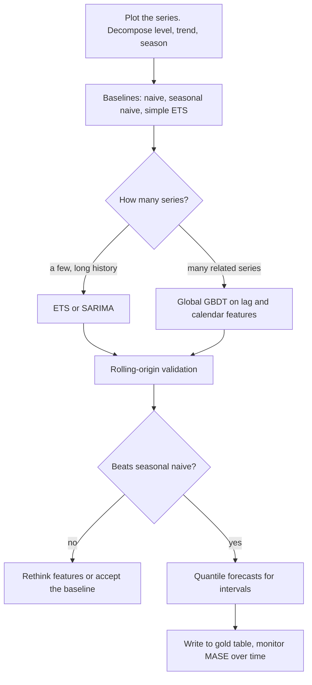

# Time Series Forecasting

## TL;DR
Classical methods (ARIMA, exponential smoothing) model the series' own structure and are excellent for a
few well-behaved series with clean seasonality. The modern production answer for hundreds or thousands of
related series is a single global gradient-boosting model on lag, rolling and calendar features — it
shares strength across series, absorbs covariates naturally, and scales — but it cannot extrapolate trend,
needs careful horizon handling, and will quietly leak if you build features carelessly.

## Intuition
Three questions, always in this order. What is the *level* (where is it now)? What is the *trend* (which
way and how fast)? What is the *season* (what regular pattern repeats)? Exponential smoothing answers all
three with weighted averages of the past. ARIMA answers them by modelling how today's value relates to
yesterday's value and yesterday's surprise. Gradient boosting answers none of them explicitly — it just
learns a function of features you hand it, which is why the features carry the whole burden.

## The maths

### Stationarity
A series is (weakly) stationary if its mean, variance and autocovariance do not depend on $t$:

$$
\mathbb{E}[y_t] = \mu, \quad \operatorname{Var}(y_t) = \sigma^2, \quad
\operatorname{Cov}(y_t, y_{t+h}) = \gamma(h)
$$

ARMA theory requires it — without it, sample autocorrelations estimate nothing stable. Achieve it by
differencing ($\nabla y_t = y_t - y_{t-1}$ removes a linear trend, $\nabla^s$ removes seasonality) and by
variance-stabilising transforms (log or Box–Cox when variance grows with level, which is typical for
demand and revenue).

Test with **ADF** (null: unit root, i.e. non-stationary — so a small p-value is *good*) and **KPSS**
(null: stationary — so a small p-value is bad). Run both; they disagree in informative ways, and citing
that you use both is a quick credibility signal.

A caution: stationarity is a requirement of *ARMA*, not of forecasting. A gradient-boosting model on lag
features does not require it — though differencing still often helps, for a different reason (it lets the
model extrapolate, see below).

### ACF and PACF
- **ACF** $\rho(h) = \gamma(h)/\gamma(0)$ — correlation with lag $h$, including indirect paths through
  intermediate lags.
- **PACF** $\phi_{hh}$ — correlation with lag $h$ after regressing out lags $1..h-1$; the *direct* effect.

The identification table, which is the classic exam question:

| Model | ACF | PACF |
|---|---|---|
| AR($p$) | Decays (exponentially or in damped sine) | Cuts off after lag $p$ |
| MA($q$) | Cuts off after lag $q$ | Decays |
| ARMA($p,q$) | Decays | Decays |

The intuition for why: an AR($p$) has only $p$ direct dependencies, so PACF is zero beyond $p$ while ACF
propagates indirectly forever. An MA($q$) is a finite weighted sum of the last $q$ shocks, so
observations more than $q$ apart share no shocks and the ACF is exactly zero there.

Significance band is roughly $\pm 1.96/\sqrt{n}$.

### ARIMA
ARIMA($p,d,q$) using the lag operator $L y_t = y_{t-1}$:

$$
\underbrace{\left(1 - \sum_{i=1}^{p}\phi_i L^i\right)}_{\text{AR}}
\underbrace{(1-L)^d}_{\text{differencing}} y_t
= c + \underbrace{\left(1 + \sum_{j=1}^{q}\theta_j L^j\right)}_{\text{MA}}\varepsilon_t
$$

- **AR($p$)**: today is a linear function of the last $p$ values — momentum and mean reversion.
- **I($d$)**: difference $d$ times to reach stationarity.
- **MA($q$)**: today depends on the last $q$ *shocks* — the model's own recent errors, which is how a
  one-off event decays out over a few periods.

SARIMA$(p,d,q)(P,D,Q)_s$ adds seasonal terms at lag $s$. SARIMAX adds exogenous regressors — and note
that to forecast with exogenous variables you need their *future* values, which for price or promotion is
fine (you set them) and for weather is a forecast of a forecast.

Fit by maximum likelihood ([[maximum-likelihood-estimation]]); select $(p,d,q)$ by AIC/BIC, which
`auto_arima` automates.

### Exponential smoothing (ETS)
Holt–Winters additive, the form worth memorising:

$$
\begin{aligned}
\ell_t &= \alpha\,(y_t - s_{t-m}) + (1-\alpha)(\ell_{t-1} + b_{t-1}) &&\text{level}\\
b_t &= \beta\,(\ell_t - \ell_{t-1}) + (1-\beta)\,b_{t-1} &&\text{trend}\\
s_t &= \gamma\,(y_t - \ell_t) + (1-\gamma)\,s_{t-m} &&\text{season}\\
\hat{y}_{t+h\mid t} &= \ell_t + h\,b_t + s_{t+h-m(\lfloor (h-1)/m\rfloor + 1)}
\end{aligned}
$$

Each component is an exponentially weighted average of recent observations, with $\alpha,\beta,\gamma \in (0,1)$
controlling how fast each adapts. Use the multiplicative seasonal form when seasonal amplitude scales with
the level — which it usually does for demand. A **damped trend** ($\phi < 1$ multiplying $b_t$) prevents
a linear trend running away over long horizons and is one of the most reliably useful tweaks in
forecasting practice.

Simple exponential smoothing (no trend, no season) is the $h$-step-flat baseline; seasonal naive
($\hat y_{t+h} = y_{t+h-m}$) is the other. Beat both before claiming anything.

### The modern answer: global GBDT on lag features
Reframe forecasting as supervised regression. For each (series, timestamp) row, build features from the
past only, and train **one model across all series**.

Why global models win when you have many related series:

- Each series contributes data on the *shared* seasonal and promotional response, so short-history series
  borrow strength from long-history ones.
- Covariates (price, promotion, holiday, store attributes, weather) drop straight in as columns; in ARIMA
  each would need to be an exogenous regressor per series.
- One model to train, tune, monitor and deploy, instead of 5,000 ARIMAs.
- Nonlinearity and interactions come for free.

The costs, which you must name:

- **Trees cannot extrapolate.** A leaf predicts a constant from the training target range, so a growing
  series flatlines at the historical maximum. Fixes: model the difference or the log-ratio
  $\log(y_t/y_{t-1})$ rather than the level; or fit a linear trend and boost the residual; or use a
  linear leaf model (LightGBM's `linear_tree`).
- **No native uncertainty.** Fit quantile objectives at 0.1/0.5/0.9 for prediction intervals — which is
  usually what capacity planning actually needs.
- **Horizon handling.** Two strategies:
  - *Direct*: a separate model per horizon $h$, each predicting $y_{t+h}$ from features at $t$. No error
    accumulation, but $H$ models.
  - *Recursive*: one 1-step model applied iteratively, feeding its own predictions back as lags. One
    model, but errors compound and the model is evaluated on inputs (its own predictions) whose
    distribution differs from training.
  - Direct is the safer default for a moderate $H$; a single model with horizon as a feature is the
    practical middle ground.

> [!example]
> **Capacity forecasting on Databricks.** Daily volume per site for 400 sites, 18-month history, 28-day
> horizon, driven strongly by weekday, month-end and Indian festival calendar. A per-site SARIMA ignores
> the shared festival response and needs 400 fits. One LightGBM on lags {1,7,14,28}, rolling means over
> {7,28,91} shifted by the horizon, weekday/month/is-month-end, a holiday-distance feature and site
> attributes, trained on the union of all sites with `site_id` as a categorical, beats it and retrains in
> minutes. Validate with rolling origin, log the run to MLflow, write the forecast to a gold Delta table
> ([[medallion-architecture]], [[case-demand-forecasting]]).

### When classical still wins
- Few series (under ~20) with long, clean history.
- Strong, stable seasonality and little covariate influence.
- You need well-founded prediction intervals from a generative model.
- Stakeholders need an interpretable decomposition into level, trend and season.
- Short history — a GBDT with 60 observations per series will overfit; ETS will not.

Always run the naive baselines. A substantial fraction of "forecasting projects" are beaten by seasonal
naive, and finding that out in week one is a gift.

## Diagram



## Code

```python
import numpy as np
import pandas as pd

# Synthetic daily demand with trend, weekly season and noise.
rng = np.random.default_rng(0)
n = 900
idx = pd.date_range("2023-01-01", periods=n, freq="D")
trend = np.linspace(100, 160, n)
weekly = 12 * np.sin(2 * np.pi * idx.dayofweek / 7)
y = trend + weekly + rng.normal(0, 6, n)
s = pd.Series(y, index=idx, name="demand")
```

Stationarity diagnostics, ACF and PACF:

```python
from statsmodels.tsa.stattools import adfuller, kpss, acf, pacf

def stationarity(x, label):
    adf_p = adfuller(x, autolag="AIC")[1]
    kpss_p = kpss(x, regression="c", nlags="auto")[1]
    print(f"{label:<12} ADF p={adf_p:.4f} (small = stationary)  "
          f"KPSS p={kpss_p:.4f} (small = NON-stationary)")

stationarity(s, "level")
stationarity(s.diff().dropna(), "differenced")

print("ACF :", np.round(acf(s.diff().dropna(), nlags=10), 3))
print("PACF:", np.round(pacf(s.diff().dropna(), nlags=10), 3))
# Significance band is roughly +/- 1.96/sqrt(n).
```

Classical models:

```python
from statsmodels.tsa.statespace.sarimax import SARIMAX
from statsmodels.tsa.holtwinters import ExponentialSmoothing

H = 28
train, test = s.iloc[:-H], s.iloc[-H:]

sarima = SARIMAX(train, order=(1, 1, 1), seasonal_order=(1, 1, 1, 7),
                 enforce_stationarity=False).fit(disp=False)
f_sarima = sarima.forecast(H)

ets = ExponentialSmoothing(train, trend="add", damped_trend=True,
                           seasonal="add", seasonal_periods=7).fit()
f_ets = ets.forecast(H)

naive_seasonal = pd.Series(train.iloc[-7:].values.tolist() * 4, index=test.index)[:H]
```

Metrics — MASE is the one to use, because it is scale-free and benchmarked against naive:

```python
def mase(y_true, y_pred, y_train, m=7):
    """Mean absolute scaled error: MAE divided by the in-sample seasonal-naive MAE."""
    scale = np.mean(np.abs(y_train[m:] - y_train[:-m]))
    return np.mean(np.abs(y_true - y_pred)) / scale

def smape(y_true, y_pred):
    return 200 * np.mean(np.abs(y_pred - y_true) / (np.abs(y_true) + np.abs(y_pred)))

for name, f in [("seasonal naive", naive_seasonal), ("SARIMA", f_sarima), ("ETS", f_ets)]:
    print(f"{name:<15} MASE={mase(test.values, np.asarray(f), train.values):.3f} "
          f"sMAPE={smape(test.values, np.asarray(f)):.2f}")
# MASE < 1 means you beat in-sample seasonal naive. MASE > 1 means you did not.
```

The global GBDT approach, with leakage-safe feature construction:

```python
import lightgbm as lgb

def make_features(df, horizon, target="demand", group="series_id"):
    """All features use data at or before t, and predict t + horizon.
    The .shift(horizon) is what enforces that - remove it and you leak."""
    g = df.groupby(group)[target]
    out = df.copy()
    for lag in [1, 7, 14, 28, 364]:
        out[f"lag_{lag}"] = g.shift(horizon + lag - 1)
    for w in [7, 28, 91]:
        base = g.shift(horizon)
        out[f"roll_mean_{w}"] = base.rolling(w).mean().reset_index(level=0, drop=True)
        out[f"roll_std_{w}"]  = base.rolling(w).std().reset_index(level=0, drop=True)
    ts = out.index.get_level_values(-1) if isinstance(out.index, pd.MultiIndex) else out["ds"]
    out["dow"] = ts.dayofweek
    out["month"] = ts.month
    out["is_month_end"] = ts.is_month_end.astype(int)
    out["doy_sin"] = np.sin(2 * np.pi * ts.dayofyear / 365.25)
    out["doy_cos"] = np.cos(2 * np.pi * ts.dayofyear / 365.25)
    return out

panel = pd.DataFrame({"ds": idx, "series_id": "A", "demand": y})
feat = make_features(panel, horizon=28).dropna()

cut = feat["ds"].max() - pd.Timedelta(days=28)
tr, va = feat[feat.ds <= cut], feat[feat.ds > cut]
cols = [c for c in feat.columns if c not in ("ds", "series_id", "demand")]

model = lgb.LGBMRegressor(n_estimators=1200, learning_rate=0.03, num_leaves=31,
                          subsample=0.8, colsample_bytree=0.8, random_state=0)
model.fit(tr[cols], tr["demand"], eval_set=[(va[cols], va["demand"])],
          callbacks=[lgb.early_stopping(80, verbose=False)])
print("GBDT MASE:", round(mase(va["demand"].values, model.predict(va[cols]), tr["demand"].values), 3))
```

Prediction intervals via quantile objectives, and handling the extrapolation problem:

```python
qmodels = {}
for q in (0.1, 0.5, 0.9):
    qmodels[q] = lgb.LGBMRegressor(objective="quantile", alpha=q, n_estimators=800,
                                   learning_rate=0.05, random_state=0).fit(tr[cols], tr["demand"])
lo, mid, hi = (qmodels[q].predict(va[cols]) for q in (0.1, 0.5, 0.9))
print("80% interval coverage:", np.mean((va["demand"] >= lo) & (va["demand"] <= hi)).round(3))

# Extrapolation fix: predict the log-ratio instead of the level, then reconstruct.
# target = np.log(y_t / y_{t-1}); forecast cumulatively from the last known value.
```

## In practice
- **Use it when:** the target is indexed by time and the past informs the future. Capacity and demand
  planning, staffing, inventory, revenue, infrastructure load.
- **Defaults that work:** always start with naive and seasonal naive. Then ETS with damped trend for a few
  series, or a global LightGBM on lag/rolling/calendar features for many. Use MASE for cross-series
  comparison, rolling-origin validation, and quantile forecasts if anyone downstream makes a capacity
  decision.
- **Breaks when:** there is a structural break (a policy change, a pandemic, a pricing overhaul) — no
  model extrapolates through a regime change, and the right response is to shorten the training window or
  add an intervention feature; the series is intermittent/sparse (many zeros) where Croston's method or a
  two-part hurdle model is the correct tool; or the horizon far exceeds the history.
- **Cost / latency:** forecasting is almost always batch. On Databricks, either train one global model on
  the full panel, or use `applyInPandas` to fan out per-series classical fits across the cluster. Write
  point and quantile forecasts to a gold Delta table partitioned by forecast date, and keep every
  vintage — comparing forecast vintages against actuals is how you detect degradation
  ([[model-monitoring]]).

## Interview angle

**Q. What is stationarity and why does ARIMA need it?**
Constant mean, variance and autocovariance structure over time. ARMA's coefficients describe a fixed
relationship between a value and its lags; if the mean or variance drifts, sample autocorrelations
estimate a moving target and the fitted model is meaningless. The "I" in ARIMA is differencing to get
there. Note that a gradient-boosting model on lag features does *not* formally require stationarity,
though differencing still helps it extrapolate.

**Follow-up.** ADF and KPSS have opposite nulls — why run both? → ADF's null is a unit root, so a small
p-value supports stationarity; KPSS's null is stationarity, so a small p-value rejects it. They can both
be inconclusive, and running both tells you whether you have evidence or just failure to reject.

**Q. How do you read ACF and PACF?**
PACF cutting off after lag $p$ with a decaying ACF indicates AR($p$); ACF cutting off after lag $q$ with a
decaying PACF indicates MA($q$); both decaying indicates a mixed ARMA. The reason is that AR($p$) has
exactly $p$ direct dependencies — so PACF, which removes intermediate lags, is zero beyond $p$ — while an
MA($q$) is a finite sum of $q$ shocks, so observations more than $q$ apart share none.

**Q. When would you use gradient boosting instead of ARIMA?**
When I have many related series and useful covariates. A global GBDT shares seasonal and promotional
structure across series so short-history series borrow strength, absorbs price, promotion, holiday and
store-attribute features as plain columns, and is one artefact to deploy instead of thousands. I would
still keep ARIMA or ETS for the handful of high-value series with long clean history, and I would always
benchmark both against seasonal naive.

**Follow-up.** What is the main weakness? → Trees cannot extrapolate. Leaves predict constants within the
training target range, so a growing series flatlines. I model differences or log-ratios, or fit a linear
trend and boost the residual. Also no native uncertainty, so I fit quantile objectives for intervals.

**Q. Direct or recursive multi-step forecasting?**
Direct trains a separate model per horizon, so there is no error accumulation and each model can use
horizon-appropriate features — but it is $H$ models. Recursive applies a 1-step model iteratively,
feeding predictions back as inputs, which compounds errors and creates a train/serve mismatch because the
model is scored on its own outputs. I default to direct for a moderate horizon, or a single model with
horizon as a feature as the practical compromise.

**Q. Which error metric?**
MASE — mean absolute error divided by the in-sample seasonal-naive MAE — because it is scale-free, so it
averages sensibly across series of different magnitudes, and it has a built-in interpretation: below 1 you
beat naive, above 1 you did not. MAPE breaks on near-zero actuals and penalises over- and
under-forecasting asymmetrically. RMSE is fine within one series if large errors are disproportionately
costly ([[regression-metrics]]).

**Q. Your forecast was excellent for six months then collapsed. What happened?**
Most likely a structural break — a pricing change, a competitor entry, a new distribution channel, a
policy change. No statistical model extrapolates through a regime change. I would check whether the error
jumped at a specific date, add an intervention indicator or shorten the training window, and separately
verify that the feature pipeline did not change upstream. Continuous rolling-origin backtesting is what
catches this early.

## Traps
- **Random train/test split.** Destroys the temporal order and leaks the future. Split by time.
- **Skipping naive baselines.** Seasonal naive beats a surprising number of models.
- **Using MAPE with near-zero values.** It explodes, and it penalises over-forecasting more than
  under-forecasting.
- **Assuming trees extrapolate.** They flatline. Difference the target or model a ratio.
- **Fitting the log transform without care at reconstruction.** $\exp(\mathbb{E}[\log y]) \ne \mathbb{E}[y]$;
  apply a smearing or variance correction if you need an unbiased level forecast.
- **Adding exogenous regressors you will not have at forecast time.** SARIMAX needs the *future* values
  of $X$.
- **Over-differencing.** It injects negative autocorrelation and inflates variance. One $d$ and one $D$
  are almost always enough.
- **Tuning on the test period.** The test period is the future; use rolling-origin validation on training
  data ([[time-series-features-and-validation]]).
- **Reporting only a point forecast for a capacity decision.** The decision needs a quantile.
- **Treating a structural break as a modelling failure.** It is a data regime change; respond with
  features or a shorter window, not more tuning.

## Flashcards
Define weak stationarity.::Mean, variance and autocovariance do not depend on t — only on the lag h.
ADF vs KPSS nulls?::ADF's null is a unit root (small p supports stationarity); KPSS's null is stationarity (small p rejects it). Run both.
How do ACF and PACF identify AR vs MA order?::AR(p): PACF cuts off at p, ACF decays. MA(q): ACF cuts off at q, PACF decays. ARMA: both decay.
What do the three letters of ARIMA(p,d,q) mean?::AR order p (dependence on past values), differencing order d (to reach stationarity), MA order q (dependence on past shocks).
Write Holt-Winters' three update equations in words.::Level = weighted average of deseasonalised observation and last level-plus-trend; trend = weighted average of level change and last trend; season = weighted average of detrended observation and last season.
Why can't gradient boosting extrapolate a trend?::Leaves predict constants bounded by the training target range, so a growing series flatlines. Model differences or log-ratios instead.
Direct vs recursive multi-step forecasting?::Direct trains one model per horizon (no error accumulation, H models); recursive iterates a 1-step model on its own predictions (one model, compounding errors).
Define MASE and how to read it.::MAE divided by in-sample seasonal-naive MAE; scale-free, and below 1 means you beat the naive benchmark.
When does a global GBDT beat per-series ARIMA?::Many related series with covariates — it shares seasonal and promotional structure, absorbs features as columns, and is one artefact to deploy.

## Related
- [[time-series-features-and-validation]] — the features and the validation scheme
- [[case-demand-forecasting]] — the end-to-end capacity forecasting case
- [[lightgbm-and-catboost]] — the model of choice for global forecasting
- [[data-leakage]] — the temporal leakage traps
- [[regression-metrics]] — MASE, sMAPE, RMSE compared
- [[maximum-likelihood-estimation]] — how ARIMA is fitted
- [[medallion-architecture]] — where forecasts land on Databricks
- [[model-monitoring]] — tracking forecast vintages against actuals
