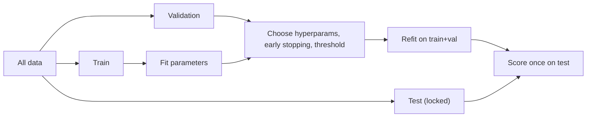

# Train / Validation / Test Split

## TL;DR
Train fits parameters, validation chooses hyperparameters and stops training, test is looked at once
to report a number. The test set stops being a test set the moment you make a decision from it. In
temporal or grouped data a random split is not a split at all — it is leakage wearing a disguise.

## Intuition
Three sets exist because there are three different things you are estimating, and each estimate is
optimistically biased by the data it was chosen on. Fit on train and train error is optimistic. Pick
the best of 50 configurations on validation and validation error is optimistic — you have run 50
lottery tickets and kept the winner. The test set is the only number that has not been optimised
against, and it only stays that way while you resist looking.

## The maths

Let $\hat{f}_\lambda$ be the model fitted on the training set with hyperparameters $\lambda$.
Validation error

$$
\hat{R}_{\text{val}}(\lambda) = \frac{1}{n_{\text{val}}}\sum_{i \in \text{val}} L\big(y_i, \hat{f}_\lambda(x_i)\big)
$$

is an unbiased estimate of $R(\hat{f}_\lambda)$ **for a fixed $\lambda$**. Once you take
$\hat{\lambda} = \arg\min_\lambda \hat{R}_{\text{val}}(\lambda)$ over $m$ candidates, the minimum of
$m$ noisy estimates is biased low — the **winner's curse**:

$$
\mathbb{E}\big[\hat{R}_{\text{val}}(\hat{\lambda})\big] \;<\; R\big(\hat{f}_{\hat{\lambda}}\big)
$$

and the gap grows roughly like $\sigma \sqrt{2\log m}$ for $m$ independent estimates with noise
$\sigma$ — the expected maximum of $m$ Gaussians. This is why a separate test set exists and why
[[cross-validation]] nested inside model selection is the honest version.

**How big should the test set be?** For an accuracy estimate, the standard error is

$$
\text{SE} = \sqrt{\frac{p(1-p)}{n_{\text{test}}}}
$$

At $p = 0.9$, $n = 1000$ gives $\text{SE} \approx 0.0095$ — a 95% CI of roughly $\pm 1.9$ points.
If you need to distinguish two models that differ by 0.5 points, 1000 test rows cannot do it. Size
the test set from the smallest difference you need to detect, not from a habit of 20%.

For a rare positive class, what matters is the count of positives, not the row count: 10 000 rows at
0.5% prevalence gives 50 positives and a recall estimate with an SE near $0.07$.

## Diagram



## Code

```python
import numpy as np
import pandas as pd
from sklearn.model_selection import train_test_split, GroupShuffleSplit

rng = np.random.RandomState(0)
df = pd.DataFrame({
    "user_id": rng.randint(0, 200, 2000),
    "as_of": pd.to_datetime("2026-01-01") + pd.to_timedelta(rng.randint(0, 365, 2000), "D"),
    "x": rng.normal(size=2000),
})
df["y"] = (df.x + rng.normal(0, 0.5, 2000) > 0.3).astype(int)

# 1. Stratified random split -- valid only for i.i.d. rows.
tr, tmp = train_test_split(df, test_size=0.4, stratify=df.y, random_state=0)
val, test = train_test_split(tmp, test_size=0.5, stratify=tmp.y, random_state=0)

# 2. Grouped split -- a user must never appear in two sets.
gss = GroupShuffleSplit(n_splits=1, test_size=0.2, random_state=0)
tr_idx, te_idx = next(gss.split(df, df.y, groups=df.user_id))
assert set(df.iloc[tr_idx].user_id) & set(df.iloc[te_idx].user_id) == set()

# 3. Temporal split -- the only correct one when the deployment is "predict the future".
cut_val = df.as_of.quantile(0.70)
cut_test = df.as_of.quantile(0.85)
tr_t  = df[df.as_of <= cut_val]
val_t = df[(df.as_of > cut_val) & (df.as_of <= cut_test)]
te_t  = df[df.as_of > cut_test]
print(len(tr_t), len(val_t), len(te_t))
```

On Spark, the same discipline applies — do the temporal cut with a `where` on the as-of column, not
`randomSplit`, and persist the split boundaries as constants so a rerun is reproducible
([[reproducibility]]).

## In practice
- **Use it when:** always. Even a quick experiment gets a held-out set; the ten seconds it costs is
  the cheapest insurance in ML.
- **Defaults that work:** 60/20/20 for tens of thousands of rows; with millions of rows a fixed
  validation and test of 50k–100k each is plenty and leaves more for training. Below ~5000 rows,
  skip the fixed validation split and use k-fold [[cross-validation]] with a small locked test set.
- **Breaks when:** rows are not independent — repeated users, sessions, sensor readings from one
  device, near-duplicate documents, oversampled rows. Group on the unit of dependence. Also breaks
  when the deployment is temporal: a random split over-reports because the model has seen the
  future for the same entity.
- **Cost / latency:** negligible; the expensive failure is discovering after deployment that the
  offline number was fiction.

> [!warning]
> Refit on train+validation before the final test score only if the hyperparameters are stable and
> the refit recipe is identical. For early-stopped models (XGBoost, neural nets) the stopping round
> was chosen on validation — refit using that fixed round, not a new early-stopping run on data that
> now includes it.

## Interview angle

**Q. Why do you need a validation set if you already have a test set?**
Because every decision made by looking at a set contaminates it. Hyperparameters, feature choices,
the classification threshold and the stopping round are all decisions. If they are made on the test
set, the test number is an optimistic in-sample number and the model will underperform in
production. The validation set absorbs that optimism; the test set reports the truth once.

**Follow-up.** *You looked at test three times while iterating. What now?* → Be honest: the test
estimate is now optimistic by an unknown amount. Practical fix is to hold out a fresh slice of
later data as a new test set, or run the final model on a time period that did not exist when you
were iterating. In a production setting, the shadow-deployment window is the real test —
[[shadow-and-canary-deployment]].

**Q. Random vs time-based split for a demand forecasting model.**
Time-based, always. A random split lets the model learn Tuesday's demand from Wednesday's for the
same SKU and week, which is information it will never have at inference. Expect the honest time-based
number to be much worse than the random-split number — that gap *is* the leakage you would have
shipped. See [[time-series-features-and-validation]].

**Q. Your data has 200 000 rows but only 3000 unique customers, and 12 rows per customer. Split?**
Group split on customer. With a random row split, a customer's other 11 rows sit in train and the
model can memorise customer-level effects it will not have for a new customer. If the deployment is
scoring *existing* customers at a new time, then a time split is the right one instead — match the
split to the deployment, not to the data shape.

**Q. How large should the test set be?**
Big enough that its standard error is smaller than the difference you care about. Use
$\sqrt{p(1-p)/n}$ for proportions; for rare positives count positives, not rows. Reporting an
accuracy of "0.912" from 300 test rows is false precision — the CI is roughly ±3 points.

## Traps
- **Fitting the scaler, imputer or encoder before splitting.** Test-set statistics leak into
  training. Wrap everything in a `Pipeline` so the transform is fit inside the split.
- **Oversampling (SMOTE) before splitting.** Synthetic copies of a test row end up in train.
  Resample inside the training fold only — [[imbalanced-classification]].
- **Deduplicating after splitting.** Near-duplicate rows across train and test inflate the score;
  dedupe first, then split.
- **Choosing the classification threshold on test.** The threshold is a hyperparameter; choose it on
  validation — [[threshold-selection]].
- **Reporting the best of many random seeds.** That is selection on noise. Report the mean and
  spread across seeds.
- **Assuming stratification fixes temporal drift.** Stratifying on the label balances classes; it
  does nothing about a distribution that has moved — [[data-drift-and-concept-drift]].

## Flashcards
Purpose of each of the three sets::Train fits parameters, validation selects hyperparameters and stopping point, test gives one unbiased final estimate.
Why is the best validation score optimistic::Selecting the minimum of m noisy estimates is the winner's curse; bias grows roughly as σ√(2 ln m).
Standard error of a test accuracy::sqrt(p(1-p)/n) — use it to size the test set from the smallest difference you need to detect.
When must you use a grouped split::When rows share a dependence unit (user, session, device, document) that would otherwise appear in both train and test.
When must you use a temporal split::Whenever deployment means predicting the future from the past; random splits leak future information.
Correct order: dedupe, split, resample::Dedupe first, then split, then resample or augment inside the training portion only.
What contaminates a test set::Any decision made after looking at it — hyperparameters, features, threshold, or model choice.

## Related
- [[cross-validation]]
- [[data-leakage]]
- [[overfitting-and-underfitting]]
- [[hyperparameter-tuning]]
- [[time-series-features-and-validation]]
- [[threshold-selection]]
- [[moc-classical-ml]]
