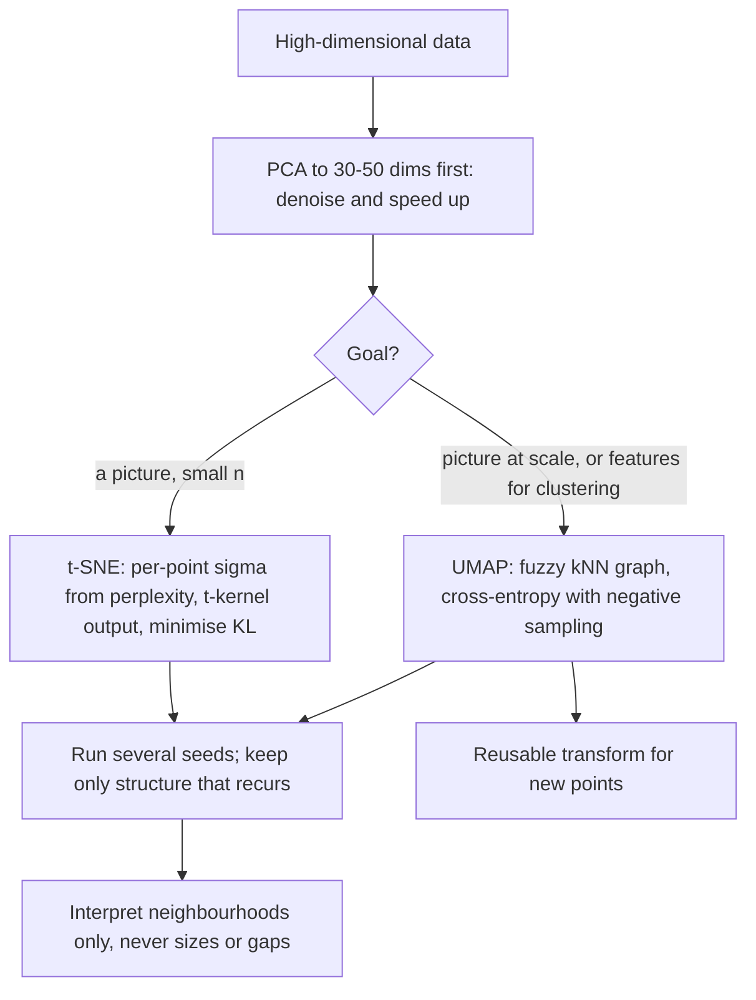

# t-SNE and UMAP

## TL;DR
Both turn high-dimensional data into a 2-D picture by preserving *local* neighbourhoods. t-SNE matches
conditional neighbour probabilities with a heavy-tailed Student-$t$ kernel in the output to fight
crowding; UMAP builds a fuzzy nearest-neighbour graph and optimises cross-entropy on it, which is faster,
preserves more global structure, and gives you a reusable `transform`. Read them as neighbourhood maps,
not as maps: cluster sizes and inter-cluster distances mean almost nothing.

## Intuition
You are drawing a map of who sits near whom at a wedding. You can get every table's seating right, but
once you flatten a many-dimensional social space onto paper, the distance *between* tables becomes
whatever the drawing needed it to be. t-SNE and UMAP both guarantee the tables; neither guarantees the
floor plan.

## The maths

### t-SNE
**High-dimensional similarities.** For points $x_i, x_j$, define a conditional probability that $i$ picks
$j$ as a neighbour under a Gaussian centred on $i$:

$$
p_{j\mid i} = \frac{\exp\!\big(-\lVert x_i - x_j\rVert^2 / 2\sigma_i^2\big)}
{\sum_{k \ne i}\exp\!\big(-\lVert x_i - x_k\rVert^2 / 2\sigma_i^2\big)}, \qquad p_{i\mid i} = 0
$$

The bandwidth $\sigma_i$ is set *per point* by binary search so that the perplexity

$$
\mathrm{Perp}(P_i) = 2^{H(P_i)}, \qquad H(P_i) = -\sum_j p_{j\mid i}\log_2 p_{j\mid i}
$$

matches a user-chosen value. Perplexity is therefore a smooth *effective number of neighbours* — that is
the correct one-line explanation. Adapting $\sigma_i$ per point is what lets t-SNE handle regions of
different density. Symmetrise: $p_{ij} = (p_{j\mid i} + p_{i\mid j}) / 2n$.

**Low-dimensional similarities.** In the 2-D map use a Student-$t$ with one degree of freedom (a Cauchy):

$$
q_{ij} = \frac{\big(1 + \lVert y_i - y_j\rVert^2\big)^{-1}}{\sum_{k\ne l}\big(1 + \lVert y_k - y_l\rVert^2\big)^{-1}}
$$

**Why the $t$-distribution — the crowding problem.** In $d$ dimensions the volume within radius $r$ grows
as $r^d$, so a point can have far more moderately-distant neighbours than 2-D has room for. With a
Gaussian in the output, all those moderate distances would be squeezed into a small region and the map
would collapse into a blob. The $t$-kernel's heavy tail assigns a *larger* $q_{ij}$ to a given large
output distance, so moderately-dissimilar points can be placed far apart without incurring much penalty —
gaps open up between clusters. This is the single idea that made t-SNE work where SNE did not.

**Objective.** Minimise the KL divergence by gradient descent on the $y_i$:

$$
C = \mathrm{KL}(P \parallel Q) = \sum_{i \ne j} p_{ij}\log\frac{p_{ij}}{q_{ij}}
$$

$$
\frac{\partial C}{\partial y_i} = 4\sum_{j \ne i}(p_{ij} - q_{ij})\big(1 + \lVert y_i - y_j\rVert^2\big)^{-1}(y_i - y_j)
$$

KL is **asymmetric**, and the asymmetry is the source of t-SNE's behaviour: a large $p_{ij}$ modelled by
a small $q_{ij}$ costs a lot (near points must stay near), while a small $p_{ij}$ modelled by a large
$q_{ij}$ costs little (far points may be placed anywhere). Hence local structure is faithful, global
structure is not ([[information-theory-entropy-kl]]).

Barnes–Hut approximation brings the cost from $O(n^2)$ to $O(n\log n)$ by treating distant groups of
points as single summarised nodes.

### UMAP
Grounded in fuzzy simplicial sets, but operationally:

1. Build a $k$-nearest-neighbour graph. For each point set $\rho_i$ = distance to its nearest neighbour
   and $\sigma_i$ by binary search so that $\sum_j \exp(-(d(x_i,x_j)-\rho_i)/\sigma_i) = \log_2 k$.
2. Directed edge weight:

$$
w_{i\to j} = \exp\!\left(-\frac{\max\big(0,\ d(x_i,x_j) - \rho_i\big)}{\sigma_i}\right)
$$

   The $\rho_i$ subtraction guarantees every point has at least one edge of weight 1 — local connectivity,
   which prevents isolated points in sparse regions.
3. Symmetrise with a fuzzy union: $w_{ij} = w_{i\to j} + w_{j\to i} - w_{i\to j}w_{j\to i}$.
4. In the output, model edge probability as
   $\big(1 + a\lVert y_i - y_j\rVert^{2b}\big)^{-1}$, where $a, b$ are fitted from `min_dist`.
5. Minimise the **binary cross-entropy** between the input and output fuzzy graphs, using negative
   sampling and stochastic gradient descent:

$$
C = \sum_{(i,j)} \Big[ w_{ij}\log\frac{w_{ij}}{v_{ij}} + (1 - w_{ij})\log\frac{1-w_{ij}}{1-v_{ij}} \Big]
$$

The second term is the difference that matters. t-SNE's KL has no penalty for placing dissimilar points
close together; UMAP's cross-entropy has an explicit repulsive term for non-edges, which is why UMAP
preserves more global structure and produces tighter, better-separated clusters.

Complexity is roughly $O(n^{1.14})$ in practice thanks to approximate kNN (NN-descent) plus negative
sampling — routinely 10–50× faster than Barnes–Hut t-SNE on large data.

### Parameters that actually change the picture

| Parameter | Meaning | Effect |
|---|---|---|
| t-SNE `perplexity` (5–50) | Effective neighbour count | Low = many small fragments; high = merged blobs. Should be well below $n$ |
| t-SNE `early_exaggeration` | Multiplies $p_{ij}$ early in optimisation | Helps clusters separate before fine-tuning |
| t-SNE `learning_rate` | Step size | Too low gives a compressed ball; `'auto'` ($\approx n/12$) is a good default |
| UMAP `n_neighbors` (5–100) | Local vs global balance | Small = local detail; large = global shape |
| UMAP `min_dist` (0.0–0.99) | Minimum packing distance in the output | Small = tight clumps (good before clustering); large = even spread (good for looking at) |
| UMAP `metric` | Input distance | `cosine` for embeddings, `euclidean` for scaled tabular |

### What you must not read off the plot
- **Cluster sizes.** t-SNE equalises density by construction ($\sigma_i$ adapts per point), so a dense
  cluster of 10,000 and a sparse one of 100 can occupy similar area.
- **Distances between clusters.** Under KL, far-apart points are cheap to place anywhere. UMAP is better
  but still not metric.
- **Empty space.** Gaps are artefacts of the repulsion, not evidence of separation.
- **Anything at all from one run.** Both are stochastic and non-convex. Run 3–5 seeds; structure that
  survives is real, structure that does not is decoration.

## Diagram



## Code

```python
import numpy as np
from sklearn.datasets import load_digits
from sklearn.decomposition import PCA
from sklearn.manifold import TSNE
from sklearn.preprocessing import StandardScaler

X, y = load_digits(return_X_y=True)
Xs = StandardScaler().fit_transform(X)

# Standard practice: PCA first. Denoises, and makes the kNN step much cheaper.
Xp = PCA(n_components=40, random_state=0).fit_transform(Xs)

ts = TSNE(n_components=2, perplexity=30, learning_rate="auto",
          init="pca",            # PCA init is far more stable and reproducible than random
          random_state=0).fit_transform(Xp)
print(ts.shape)
```

Perplexity sensitivity — run this once and you will never quote a single t-SNE plot again:

```python
import matplotlib.pyplot as plt

fig, axes = plt.subplots(1, 4, figsize=(16, 4))
for ax, perp in zip(axes, [5, 15, 30, 50]):
    emb = TSNE(2, perplexity=perp, learning_rate="auto", init="pca",
               random_state=0).fit_transform(Xp)
    ax.scatter(emb[:, 0], emb[:, 1], c=y, s=4, cmap="tab10")
    ax.set_title(f"perplexity={perp}")
    ax.set_xticks([]); ax.set_yticks([])
```

UMAP, including the thing t-SNE cannot do — transform new points:

```python
import umap

reducer = umap.UMAP(n_neighbors=15, min_dist=0.1, metric="euclidean", random_state=0)
emb_train = reducer.fit_transform(Xp[:1400])
emb_new   = reducer.transform(Xp[1400:])      # t-SNE has no equivalent
print(emb_train.shape, emb_new.shape)

# Supervised UMAP: uses labels to shape the embedding. Useful for visualising
# class structure, but NEVER evaluate a classifier on these coordinates - the
# labels are baked in, which is textbook leakage.
sup = umap.UMAP(n_neighbors=15, min_dist=0.1, random_state=0).fit_transform(Xp, y=y)
```

The production pattern for clustering embeddings:

```python
import hdbscan

# min_dist=0.0 packs points tightly, which is what a density clusterer wants.
red = umap.UMAP(n_components=10, n_neighbors=30, min_dist=0.0,
                metric="cosine", random_state=42).fit_transform(Xp)
labels = hdbscan.HDBSCAN(min_cluster_size=25, min_samples=5).fit_predict(red)
print("clusters:", len(set(labels)) - (1 if -1 in labels else 0),
      "noise fraction:", round((labels == -1).mean(), 3))
```

Checking stability before you show anyone the picture:

```python
from sklearn.neighbors import NearestNeighbors

def neighbourhood_overlap(emb, X_ref, k=15):
    """What fraction of each point's k nearest neighbours are preserved?"""
    a = NearestNeighbors(n_neighbors=k + 1).fit(X_ref).kneighbors(X_ref)[1][:, 1:]
    b = NearestNeighbors(n_neighbors=k + 1).fit(emb).kneighbors(emb)[1][:, 1:]
    return np.mean([len(set(ai) & set(bi)) / k for ai, bi in zip(a, b)])

for seed in (0, 1, 2):
    e = umap.UMAP(random_state=seed).fit_transform(Xp)
    print(f"seed {seed}: local neighbourhood preservation = {neighbourhood_overlap(e, Xp):.3f}")
```

## In practice
- **Use it when:** exploring whether structure exists at all; sanity-checking that an embedding model
  separates the classes you expect; presenting a qualitative picture of a corpus or a customer base;
  or — UMAP only — as a reduction step before density clustering.
- **Defaults that work:** PCA to 30–50 dims first; t-SNE with `init='pca'`, `learning_rate='auto'`,
  perplexity 30, and always several seeds; UMAP with `n_neighbors=15`, `min_dist=0.1` for viewing and
  `min_dist=0.0` with more components for clustering; `metric='cosine'` for text or image embeddings.
  Colour the plot by a variable you did *not* feed in, so the picture can be falsified.
- **Breaks when:** you want distances to mean something; you want reproducibility without pinning a seed;
  you need to embed a stream of new points (t-SNE cannot, UMAP can but its `transform` drifts as the data
  distribution moves); or $n$ is very large for t-SNE — past a few hundred thousand points, use UMAP or a
  GPU implementation.
- **Cost / latency:** Barnes–Hut t-SNE is $O(n\log n)$ but with a large constant — tens of minutes for
  100k points on CPU. UMAP is typically 10–50× faster and parallel. Both are offline, batch-only tools;
  neither belongs in a serving path.

> [!warning]
> Do not feed t-SNE or UMAP coordinates into a supervised model as features. They are stochastic,
> non-invertible, fitted on the whole dataset (so they leak across your split), and unstable across
> retrains. Use PCA if you need a reduction you can defend ([[data-leakage]]).

## Interview angle

**Q. Why does t-SNE use a Student-$t$ distribution in the low-dimensional space?**
To solve the crowding problem. Volume grows as $r^d$, so a point has vastly more moderately-distant
neighbours in high dimensions than 2-D can accommodate; with a Gaussian output kernel those points all
get compressed into a blob. The $t$-distribution's heavy tail assigns a relatively high similarity to a
large output distance, so moderately dissimilar points can be placed far apart cheaply — which lets gaps
open between clusters.

**Follow-up.** Why KL and not a symmetric divergence? → The asymmetry is deliberate. $\mathrm{KL}(P\|Q)$
heavily penalises placing true neighbours far apart, and barely penalises placing non-neighbours close
together. That is exactly the "preserve local, sacrifice global" tradeoff, and it is also precisely why
you cannot trust inter-cluster distances.

**Q. What is perplexity?**
$2^{H(P_i)}$, where $H$ is the entropy of point $i$'s neighbour distribution — a smooth effective number
of neighbours. Each point's Gaussian bandwidth $\sigma_i$ is binary-searched so its perplexity hits the
target, which is how t-SNE adapts to varying density. Typical range 5–50; it must be well below $n$.

**Q. UMAP vs t-SNE — when each?**
UMAP by default: it is much faster, its cross-entropy objective includes an explicit repulsive term for
non-neighbours so global structure survives better, and it has a `transform` for new points. t-SNE when
$n$ is modest and I want the most established, most scrutinised method, or when I specifically want
UMAP's tendency to tighten clusters *not* to exaggerate separation.

**Q. Your UMAP plot shows two clusters far apart. What can you conclude?**
That the two groups have few shared nearest neighbours. Not that they are "twice as different" as two
nearby clusters, not that the gap is meaningful, and not that this is stable — I would re-run with
different seeds and `n_neighbors` values and see whether the split survives. Then I would verify it in
the original space: are the groups actually separable by a classifier, or do they differ on a variable I
did not embed?

**Q. Can you use these as features?**
No, for four reasons: stochastic, so retrains give different coordinates; non-parametric in t-SNE's case
so there is no transform for new data; fitted on the full dataset so they leak across your split; and
they optimise visual neighbourhood preservation, not predictiveness. PCA is the defensible reduction for
modelling. The one exception is UMAP as a preprocessing step *inside* an unsupervised pipeline, where
there is no label to leak.

**Q. How would you validate that an embedding picture is telling the truth?**
Quantitatively, with trustworthiness or $k$-NN neighbourhood preservation between the original and
embedded spaces. Structurally, by running several seeds and parameter settings and keeping only what
recurs. Externally, by colouring with a variable that was not part of the input — if the clusters align
with a held-out attribute, they are probably real.

## Traps
- **Reading cluster sizes.** t-SNE equalises density by adapting $\sigma_i$ per point; area is not count.
- **Reading distances between clusters.** The KL objective does not constrain them.
- **Showing one run.** Both are non-convex and stochastic. Multiple seeds, always.
- **Using them as model features.** Leaky, unstable, and not designed for it.
- **Skipping PCA first.** Slower, noisier, and the kNN step in raw high dimension is less reliable.
- **Setting perplexity near $n$.** The Gaussian then covers everything and all local structure is lost.
- **Interpreting supervised UMAP as evidence of separability.** The labels shaped the layout; of course
  the classes separate.
- **Using t-SNE's default random init in older versions.** `init='pca'` is markedly more stable and
  reproducible.
- **Treating the plot as a dimensionality reduction.** It is a visualisation. There is no meaningful
  inverse and no guarantee of linearity.

## Flashcards
Why does t-SNE use a Student-t kernel in the output space?::To fix crowding — its heavy tail lets moderately dissimilar points sit far apart cheaply, so clusters separate instead of collapsing into a blob.
What is perplexity in t-SNE?::$2^{H(P_i)}$ — a smooth effective number of neighbours, used to binary-search each point's Gaussian bandwidth $\sigma_i$.
Why is t-SNE's KL divergence asymmetric, and what follows?::$\mathrm{KL}(P\|Q)$ punishes separating true neighbours but barely punishes merging non-neighbours — so local structure is faithful and global structure is not.
What does UMAP optimise that t-SNE does not?::Binary cross-entropy including a term for non-edges, giving explicit repulsion — which is why it preserves more global structure.
What does UMAP's rho (distance to nearest neighbour) subtraction guarantee?::Local connectivity — every point has at least one edge of weight 1, so no point is isolated in a sparse region.
Name three things you must not read off a t-SNE plot.::Cluster sizes, distances between clusters, and the meaning of empty space.
Which of t-SNE and UMAP can embed new points?::UMAP, via `transform`. t-SNE is non-parametric and has no equivalent.
What settings make UMAP suitable as input to HDBSCAN?::`min_dist=0.0` (tight packing) and a handful of components (5–10) rather than 2.

## Related
- [[dimensionality-reduction-pca]] — the linear, deterministic, defensible reduction
- [[curse-of-dimensionality]] — why the raw space needs reducing first
- [[hierarchical-and-density-clustering]] — HDBSCAN on UMAP output
- [[embeddings]] — the high-dimensional vectors usually being visualised
- [[information-theory-entropy-kl]] — the KL divergence t-SNE minimises
- [[k-nearest-neighbours]] — the neighbour graph both methods build
- [[data-leakage]] — why these coordinates must not become features
