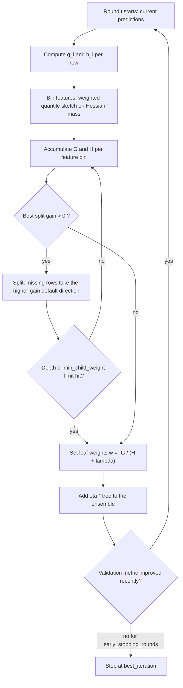

# XGBoost — Deep Dive

## TL;DR
XGBoost is gradient boosting with a **second-order Taylor expansion** of the loss and an **explicit
regularisation term** in the objective. That one change makes the optimal leaf weight a closed form,
$w_j^* = -G_j/(H_j+\lambda)$, and turns split selection into a formula with regularisation baked in. Every
hyperparameter people memorise — `lambda`, `gamma`, `min_child_weight`, `eta` — is a term in that formula,
and being able to say which is what separates a strong answer from a recited list.

## Intuition
Plain gradient boosting knows the slope of the loss at your current prediction and steps downhill. XGBoost
also knows the **curvature**. Where the loss is steeply curved — a confidently-predicted point where a
small change swings the loss a lot — it takes a small step. Where the loss is flat, it takes a bigger one.
That is Newton's method instead of vanilla gradient descent, done per leaf.

The second idea: instead of growing a tree and *then* regularising it, put the penalty for complexity
(number of leaves, size of leaf weights) directly inside the objective the split search optimises. A split
is only made if it pays for itself against that penalty.

## The maths

### Setup
The model is an additive ensemble of $K$ trees:
$$
\hat{y}_i = \sum_{k=1}^{K} f_k(x_i), \qquad f_k \in \mathcal{F}
$$
where each tree $f$ is defined by a structure $q$ mapping a row to one of $T$ leaves, and a weight vector
$w \in \mathbb{R}^T$: $f(x) = w_{q(x)}$.

The regularised objective at boosting round $t$, where $\hat{y}_i^{(t-1)}$ is the current ensemble output:
$$
\mathcal{L}^{(t)} = \sum_{i=1}^{n} l\big(y_i,\ \hat{y}_i^{(t-1)} + f_t(x_i)\big) + \Omega(f_t),
\qquad
\Omega(f) = \gamma T + \tfrac{1}{2}\lambda \sum_{j=1}^{T} w_j^2
$$

Symbols: $l$ is any twice-differentiable loss; $T$ the number of leaves in the new tree; $w_j$ the value
predicted by leaf $j$; $\gamma$ the per-leaf penalty; $\lambda$ the $L_2$ penalty on leaf weights. (An
optional $\alpha \sum_j |w_j|$ gives $L_1$; XGBoost exposes it as `alpha`.)

### Step 1 — second-order Taylor expansion
Expand $l$ around the current prediction $\hat{y}_i^{(t-1)}$, treating $f_t(x_i)$ as the small increment:
$$
l\big(y_i, \hat{y}_i^{(t-1)} + f_t(x_i)\big)
\;\approx\;
l\big(y_i, \hat{y}_i^{(t-1)}\big) + g_i f_t(x_i) + \tfrac{1}{2} h_i f_t(x_i)^2
$$
with
$$
g_i = \frac{\partial\, l(y_i, \hat{y})}{\partial \hat{y}}\bigg|_{\hat{y} = \hat{y}_i^{(t-1)}},
\qquad
h_i = \frac{\partial^2\, l(y_i, \hat{y})}{\partial \hat{y}^2}\bigg|_{\hat{y} = \hat{y}_i^{(t-1)}}
$$
The first term $l(y_i, \hat{y}_i^{(t-1)})$ does not involve $f_t$, so it is constant for this round and can
be dropped. The objective becomes
$$
\tilde{\mathcal{L}}^{(t)} = \sum_{i=1}^{n}\Big[g_i f_t(x_i) + \tfrac{1}{2} h_i f_t(x_i)^2\Big]
+ \gamma T + \tfrac{1}{2}\lambda\sum_{j=1}^{T} w_j^2
$$

Concretely, for the two losses that matter most:

| Objective | $\hat{y}$ means | $g_i$ | $h_i$ |
|---|---|---|---|
| `reg:squarederror`, $\tfrac12(y-\hat y)^2$ | the value | $\hat{y}_i - y_i$ | $1$ |
| `binary:logistic`, log-loss | log-odds, $p_i = \sigma(\hat{y}_i)$ | $p_i - y_i$ | $p_i(1-p_i)$ |
| `count:poisson` | log-rate | $e^{\hat{y}_i} - y_i$ | $e^{\hat{y}_i}$ |

Note $h_i = 1$ for squared error — which is why XGBoost's Hessian-based knobs behave like plain sample
counts on regression, and like *confidence-weighted* counts on classification.

### Step 2 — group by leaf
Every row lands in exactly one leaf. Define the instance set of leaf $j$ as
$I_j = \{ i : q(x_i) = j \}$, and since $f_t(x_i) = w_j$ for all $i \in I_j$:
$$
\tilde{\mathcal{L}}^{(t)}
= \sum_{j=1}^{T}\Big[ \Big(\underbrace{\textstyle\sum_{i \in I_j} g_i}_{G_j}\Big) w_j
+ \tfrac{1}{2}\Big(\underbrace{\textstyle\sum_{i \in I_j} h_i}_{H_j} + \lambda\Big) w_j^2 \Big] + \gamma T
$$

This is the pivotal step: a sum over $n$ rows became a sum over $T$ leaves, and each leaf's contribution is
an independent one-dimensional quadratic in $w_j$.

### Step 3 — optimal leaf weight
Differentiate the $j$-th term and set to zero:
$$
\frac{\partial}{\partial w_j}\Big[G_j w_j + \tfrac12 (H_j + \lambda) w_j^2\Big] = G_j + (H_j+\lambda) w_j = 0
$$
$$
\boxed{\;w_j^* = -\frac{G_j}{H_j + \lambda}\;}
$$
The second derivative is $H_j + \lambda > 0$ for a convex loss, so this is a minimum. Substituting back:
$$
\tilde{\mathcal{L}}^{(t)}(q) = -\frac{1}{2}\sum_{j=1}^{T} \frac{G_j^2}{H_j + \lambda} + \gamma T
$$
This is the **structure score** — a scalar measuring how good a tree *shape* $q$ is, once its leaf weights
are set optimally. Lower is better.

Sanity check: for squared error $h_i = 1$, so $H_j = |I_j|$ and $G_j = \sum (\hat{y}_i - y_i)$, giving
$w_j^* = \text{mean residual in the leaf}$ when $\lambda = 0$ — exactly Friedman's line-search answer.
XGBoost derives it instead of searching for it, and for free it handles log-loss, where Friedman had to
approximate.

### Step 4 — the gain formula
Enumerating all tree structures is intractable, so split greedily. Splitting a leaf with statistics
$(G, H) = (G_L + G_R,\ H_L + H_R)$ into children $L$ and $R$ changes the structure score by
$$
\boxed{\;
\text{Gain} = \frac{1}{2}\left[\frac{G_L^2}{H_L + \lambda} + \frac{G_R^2}{H_R + \lambda}
- \frac{(G_L + G_R)^2}{H_L + H_R + \lambda}\right] - \gamma \;}
$$
The bracket is (score after) − (score before) with the sign flipped; the $-\gamma$ is the cost of the one
extra leaf the split creates. **A split is only taken if Gain > 0.** So $\gamma$ is a literal minimum
improvement threshold measured in loss units — pre-pruning written into the objective.

Note the bracket is always $\ge 0$ by convexity, so without $\gamma$ *every* split looks non-harmful; the
regularisers are what stop the tree.

### Step 5 — shrinkage
Finally the new tree is added with a learning rate: $\hat{y}^{(t)} = \hat{y}^{(t-1)} + \eta\, f_t(x)$.
Note $\eta$ does **not** appear in the gain formula — it scales the tree *after* it is built. This is why
changing `eta` changes how many rounds you need but not, to first order, the shape of any individual tree.

### Every important hyperparameter, in terms of those two formulas

**`lambda` (`reg_lambda`, $L_2$ on leaf weights).** Appears as $H_j + \lambda$ in the denominator of both
$w_j^*$ and the gain. Two effects: it shrinks leaf outputs toward zero, and it shrinks them *most* where
$H_j$ is small — i.e. leaves with few or low-confidence rows. It is a data-adaptive regulariser. It also
shrinks gains, so large $\lambda$ builds smaller trees. Default 1; raise to 5–100 on noisy data.

**`gamma` (`min_split_loss`, $\gamma$).** Subtracted directly from the gain. A split must buy at least
$\gamma$ units of objective improvement or it is rejected, and XGBoost additionally prunes back branches
whose subtree fails to justify itself. It is an absolute threshold in loss units, so its useful scale
depends on the objective and on $n$ — there is no universal value. Default 0; tune on a log grid.

**`min_child_weight`.** The minimum $H_j$ (sum of Hessians) required in a child; splits producing a child
below it are rejected. The name is misleading — it is not a row count in general. For squared error
$h_i = 1$ so it *is* a row count. For logistic loss $h_i = p_i(1-p_i) \le 0.25$, so it is a count weighted
by *uncertainty*: 50 rows the model already predicts confidently ($p \approx 0.02$) contribute
$50 \times 0.0196 \approx 1$, while 50 rows at $p = 0.5$ contribute $12.5$. The parameter therefore says
"don't carve out a leaf unless there is enough remaining uncertainty there to be worth modelling", which is
a much better regulariser than a raw count. This is a favourite interview question.

**`max_depth`.** Caps the depth of the greedy search, bounding leaves at $2^{\text{depth}}$ and the order
of feature interactions the tree can express (depth $d$ ⇒ at most $d$-way interactions). It is the blunt
complexity knob and the one most often set too high. 3–8 is the working range; 6 is the default and a fine
starting point.

**`subsample`.** Fraction of rows sampled (without replacement) per boosting round. Fewer rows means noisier
$G_j, H_j$ per leaf, which decorrelates successive trees — a bagging effect layered on boosting — and makes
each round cheaper. 0.6–0.9 typically improves test error, not just speed.

**`colsample_bytree` / `_bylevel` / `_bynode`.** Fraction of features considered, per tree / per depth level
/ per split. Same decorrelation logic as `max_features` in [[random-forest]], and the main defence when a
handful of features dominate every split. 0.6–0.9.

**`eta` (`learning_rate`).** Multiplies each tree before it is added. Small $\eta$ means each round commits
less to a direction estimated from noisy gradients, so the ensemble path is smoother and the validation
curve has a flatter, lower minimum. Cost is proportional rounds: $\eta \cdot M \approx$ constant. Use
0.01–0.1 and let early stopping pick $M$.

**`scale_pos_weight`.** Multiplies $g_i$ and $h_i$ for positive-class rows by a constant $s$, so positives
count $s$ times in every $G_j$ and $H_j$. Standard setting is $s = N_{\text{neg}} / N_{\text{pos}}$, which
makes the effective class balance 1:1. It changes the *ranking* very little but rescales predicted
probabilities away from the true base rate — so if you need calibrated probabilities, either leave it at 1
and fix the decision threshold instead, or calibrate afterwards. See [[imbalanced-classification]] and
[[threshold-selection]].

**`max_delta_step`.** Caps $|w_j^*|$. Rarely needed, but genuinely useful for extremely imbalanced logistic
problems where $H_j \to 0$ makes $w_j^*$ explode.

### Missing values: the learned default direction
XGBoost never imputes. At each node the split finder computes gain using only the rows with a *present*
value for that feature, then evaluates two candidate placements for the missing rows — all to the left, or
all to the right — and stores whichever gives higher gain as the node's **default direction**. At
prediction time a missing value simply follows that stored direction.

Two consequences worth saying out loud: (1) missingness itself becomes a learned signal, which is exactly
right when it is informative (a field only populated for verified customers); (2) the sparsity-aware split
finder only iterates over non-missing entries, so training cost scales with the number of *present* values —
this is the reason XGBoost is fast on sparse one-hot matrices. Note that a zero in a dense array is a real
value, not missing; pass `missing=np.nan` (the default) and use actual NaN, or a sparse matrix where
implicit zeros are treated as missing. See [[missing-data-handling]].

### Native categorical handling
With `enable_categorical=True` and pandas `category` dtype (tree method `hist`), XGBoost can split a
categorical feature into a *partition* of its levels rather than one-hot indicators. It uses the classical
result that for a leaf-wise score of this form, sorting categories by their gradient statistic
(effectively $G_c / (H_c + \lambda)$ per category $c$) and scanning that order finds the optimal binary
partition in linear time — no need to enumerate $2^{k-1}-1$ subsets. Below `max_cat_to_onehot` levels it
falls back to one-vs-rest splits. `max_cat_threshold` caps how many categories are considered per split.

This beats one-hot on high-cardinality features (one-hot forces depth-$k$ staircases to isolate a group)
and avoids the target-leakage risk of mean encoding. It does bring its own overfitting risk on rare levels,
which `min_child_weight` and `lambda` control. Compare with [[categorical-encoding]] and the ordered
target statistics in [[lightgbm-and-catboost]].

### Early stopping
Pass an evaluation set and `early_stopping_rounds`; training halts when the chosen metric has not improved
for that many rounds and `best_iteration` is recorded. Points that matter: the eval set must be a genuine
holdout constructed the same way production data will be (time-ordered for a forecast — see
[[time-series-features-and-validation]]); the *last* eval set in the list is the one that drives stopping;
and if you also tune hyperparameters against that set you have leaked, so keep a third split.

### How it trains distributed on Spark
The PySpark integration (`xgboost.spark.SparkXGBClassifier` / `SparkXGBRegressor`, the successor to the
older `xgboost4j-spark` bindings) turns a Spark DataFrame into a synchronised distributed boosting job:

1. **Repartition to `num_workers`.** Each XGBoost worker is one Spark task holding one shard of the rows,
   pinned by Spark's **barrier execution mode** so all tasks are alive simultaneously — XGBoost needs
   collective communication, not independent map tasks. This is why a job hangs rather than degrades if the
   cluster cannot give you `num_workers` slots at once; size `num_workers` to available executor cores and
   set `spark.task.cpus` to match `nthread`.
2. **Data stays put.** Each worker quantises its shard once into histogram bins — the `hist` tree method
   with a weighted quantile sketch, where candidate split points are chosen so that bins carry roughly
   equal *Hessian* mass, not equal row counts. Weighting by $h_i$ is the right thing precisely because the
   objective is the Hessian-weighted quadratic derived above.
3. **Per round:** every worker computes $g_i, h_i$ on its own rows, accumulates a local histogram of
   $(\sum g, \sum h)$ per feature-bin, and the workers **AllReduce** those histograms. Now every worker
   holds identical global $(G, H)$ per candidate split and applies the gain formula independently, so all
   workers build a bit-identical tree without shipping any raw data. Communication per round is
   $O(\text{features} \times \text{bins} \times \text{nodes})$ — independent of $n$, which is why this scales.
4. **Repeat** for each round; the sequential dependency across rounds is unavoidable, so the wall clock is
   rounds × (local histogram + AllReduce latency).

Practical notes for a Databricks setup: assemble features into a single vector column or pass
`features_col` as a list of columns; enable `use_gpu` / `device="cuda"` only when the cluster actually has
GPUs and the data fits; be explicit about `missing` since Spark's sparse vectors make zeros implicit;
prefer training on a *cached* Delta table read so the shards are not recomputed each round; and log the run
with MLflow so `best_iteration` and the eval curve are recorded — see [[experiment-tracking-mlflow]],
[[spark-performance-tuning]] and [[databricks-platform]].

> [!tip]
> The honest advice on a Databricks job: if your training table fits in the driver's memory after
> sampling or aggregation, single-node XGBoost with `n_jobs=-1` is usually faster than a distributed job,
> because you pay no AllReduce per round. Reach for `SparkXGBRegressor` when the data genuinely does not
> fit, not by default.

## Diagram



## Code

Verifying the derivation numerically — this is the most convincing thing you can do in a take-home:

```python
import numpy as np, xgboost as xgb

rng = np.random.default_rng(0)
n, d = 4000, 8
X = rng.normal(size=(n, d))
y = (X[:, 0] + 0.6 * X[:, 1] ** 2 - 0.4 * X[:, 2] > rng.normal(scale=0.5, size=n)).astype(int)

LAMBDA = 2.0
booster = xgb.train(
    {"objective": "binary:logistic", "max_depth": 2, "eta": 1.0,
     "reg_lambda": LAMBDA, "gamma": 0.0, "min_child_weight": 0.0,
     "base_score": 0.5, "tree_method": "exact"},
    xgb.DMatrix(X, label=y), num_boost_round=1,
)

# Reproduce the leaf weights by hand from the first round's gradients.
p0 = 0.5                                  # base_score, in probability space
g = p0 - y                                # dL/dF for log-loss
h = np.full(n, p0 * (1 - p0))             # d2L/dF2

leaf_of_row = booster.predict(xgb.DMatrix(X), pred_leaf=True).ravel()
df = booster.trees_to_dataframe()
for leaf in np.unique(leaf_of_row):
    m = leaf_of_row == leaf
    G, H = g[m].sum(), h[m].sum()
    w_star = -G / (H + LAMBDA)
    reported = df.loc[(df.Feature == "Leaf") & (df.Node == leaf), "Gain"].item()
    print(f"leaf {leaf}: derived w* = {w_star: .6f}   xgboost leaf value = {reported: .6f}")
```

The two columns match to floating point. (`trees_to_dataframe` stores the leaf value in the `Gain` column
for leaf rows — an API quirk, not a conceptual one.)

A realistic training setup:

```python
import xgboost as xgb
from sklearn.model_selection import train_test_split
from sklearn.metrics import roc_auc_score

Xtr, Xtmp, ytr, ytmp = train_test_split(X, y, test_size=0.3, random_state=0, stratify=y)
Xva, Xte, yva, yte = train_test_split(Xtmp, ytmp, test_size=0.5, random_state=0, stratify=ytmp)

clf = xgb.XGBClassifier(
    objective="binary:logistic",
    eval_metric="aucpr",            # PR-AUC, not accuracy, on imbalanced data
    n_estimators=5000,              # a ceiling, not a target
    learning_rate=0.03,
    max_depth=5,
    min_child_weight=5.0,           # sum of Hessians, not a row count
    subsample=0.8,
    colsample_bytree=0.8,
    reg_lambda=5.0,
    gamma=0.0,
    scale_pos_weight=(ytr == 0).sum() / (ytr == 1).sum(),
    tree_method="hist",
    early_stopping_rounds=100,
    n_jobs=-1,
    random_state=0,
)
clf.fit(Xtr, ytr, eval_set=[(Xva, yva)], verbose=False)
print("best_iteration:", clf.best_iteration, "| test AUC:", roc_auc_score(yte, clf.predict_proba(Xte)[:, 1]))
```

Distributed on Databricks, with MLflow:

```python
import mlflow
from xgboost.spark import SparkXGBClassifier

train_sdf = spark.read.table("gold.churn_features_train")   # Delta table
valid_sdf = spark.read.table("gold.churn_features_valid")

estimator = SparkXGBClassifier(
    features_col=[c for c in train_sdf.columns if c.startswith("f_")],
    label_col="label",
    num_workers=16,                 # must match available executor task slots
    device="cpu",
    max_depth=6,
    learning_rate=0.05,
    n_estimators=2000,
    subsample=0.8,
    colsample_bytree=0.8,
    reg_lambda=5.0,
    missing=float("nan"),
    early_stopping_rounds=50,
    validation_indicator_col="is_valid",
)

with mlflow.start_run(run_name="churn-xgb-distributed"):
    model = estimator.fit(train_sdf.unionByName(valid_sdf))
    mlflow.log_params({"num_workers": 16, "eta": 0.05, "max_depth": 6})
    mlflow.spark.log_model(model, "model")
```

## In practice
- **Use it when:** tabular supervised learning of essentially any shape — it is still the default winner on
  structured data, and it is the model most Indian product-company and GCC interviews will assume you know
  to the derivation level if your CV says "XGBoost".
- **Defaults that work:** `tree_method='hist'`, `eta=0.03–0.1`, `max_depth=4–6`, `subsample=0.8`,
  `colsample_bytree=0.8`, `min_child_weight=1–10`, `reg_lambda=1–10`, `n_estimators=5000` with
  `early_stopping_rounds=50–100`. Tune in that rough order of impact: depth → min_child_weight → lambda →
  subsampling → gamma. Leave `eta` small and fixed.
- **Breaks when:** rows are not i.i.d. and your CV does not know it (time series, repeated customers) — the
  model will look excellent and fail in production; the target has heavy label noise; you need
  extrapolation beyond the training target range; the feature space is genuinely high-dimensional and
  sparse-textual, where a linear model or a transformer is a better fit.
- **Cost / latency:** training is $O(\text{rounds} \times \text{features} \times \text{bins})$ with `hist`.
  Serving a 1500-round depth-6 model is ~1500 traversals of ≤6 comparisons — tens of microseconds
  single-threaded, but it is not free at high QPS; consider fewer rounds with a larger `eta`, or
  `best_iteration` truncation, when latency budgets bite.

## Interview angle

**Q. Derive XGBoost's objective and the optimal leaf weight.**
At round $t$ the objective is $\sum_i l(y_i, \hat{y}_i^{(t-1)} + f_t(x_i)) + \gamma T + \frac{\lambda}{2}\sum_j w_j^2$.
Second-order Taylor around $\hat{y}^{(t-1)}$ gives $\sum_i [g_i f_t(x_i) + \frac12 h_i f_t(x_i)^2] + \Omega$
after dropping the constant term. Since $f_t(x_i) = w_{q(x_i)}$, regroup the sum over rows into a sum over
leaves with $G_j = \sum_{i \in I_j} g_i$ and $H_j = \sum_{i \in I_j} h_i$, giving
$\sum_j [G_j w_j + \frac12 (H_j + \lambda) w_j^2] + \gamma T$. Each leaf is an independent quadratic;
setting the derivative to zero gives $w_j^* = -G_j/(H_j + \lambda)$, and substituting back gives the
structure score $-\frac12 \sum_j G_j^2/(H_j + \lambda) + \gamma T$. Gain for a split is the drop in that
score, $\frac12[\frac{G_L^2}{H_L+\lambda} + \frac{G_R^2}{H_R+\lambda} - \frac{(G_L+G_R)^2}{H_L+H_R+\lambda}] - \gamma$.

**Follow-up.** What does $\lambda$ do to that formula, intuitively? → It sits in the denominator, so it
shrinks leaf weights toward zero and shrinks them most where $H_j$ is small — few rows, or rows the model
is already confident about. It is adaptive shrinkage that automatically hits the leaves you should trust
least, and because it also shrinks the gain, it makes the tree smaller.

**Q. What exactly is `min_child_weight`?**
The minimum sum of Hessians allowed in a child node. For squared error $h_i = 1$ so it reduces to a row
count, which is why everyone thinks it is one. For logistic loss $h_i = p_i(1-p_i)$, so it is a count
weighted by the model's remaining uncertainty: a hundred rows already predicted at $p = 0.99$ contribute
about 1, while a hundred rows at $p=0.5$ contribute 25. It is the parameter that says "don't isolate a
region unless there is real uncertainty left to explain there".

**Q. `gamma` vs `lambda` — when do you reach for each?**
$\gamma$ is subtracted from the gain: a hard minimum improvement threshold, so it prunes *structure* (fewer
splits, fewer leaves) and is scale-dependent on the loss and dataset size. $\lambda$ is in the denominator:
it shrinks *values* smoothly and adaptively, and only indirectly reduces structure. I reach for $\lambda$
first because it is smoother and better-behaved across datasets; I add $\gamma$ when the model is building
lots of splits that each buy almost nothing, which shows up as a huge tree with a flat validation curve.

**Q. How does XGBoost handle missing values?**
It learns a default direction per node. The split finder scores candidate thresholds using only rows where
that feature is present, then tries routing all missing rows left and all right, and keeps the higher-gain
choice in the node. At inference, missing rows follow it. Two implications: missingness becomes a modelled
signal, which is a feature when it is informative and a hazard when the missingness pattern differs between
training and production; and the finder only walks present values, which is why sparse data is fast.

**Follow-up.** Should you impute anyway? → Usually not — imputation destroys the missingness signal and
introduces an assumption. Do add an explicit `was_missing` flag only if you also transform the value, and
do check that the training and serving missingness rates match, because a pipeline change upstream that
starts filling a column with zeros instead of nulls will silently move every affected row to the wrong
branch.

**Q. `scale_pos_weight` — what does it actually change?**
It multiplies $g_i$ and $h_i$ for positive rows by $s$, so positives are worth $s$ rows in every $G_j$ and
$H_j$, and the optimal leaf weights shift toward predicting the positive class. Set to
$N_{\text{neg}}/N_{\text{pos}}$ it makes the effective prior balanced. It mostly improves recall at a fixed
threshold; it does not create information. Crucially it destroys probability calibration — predicted
probabilities no longer reflect the true base rate — so if downstream logic uses probabilities (expected
loss, expected revenue), prefer leaving it at 1 and moving the decision threshold, or recalibrate.

**Q. How does XGBoost train on Spark, and when would you not?**
Rows are sharded across `num_workers` tasks under barrier execution. Each worker quantises its shard once
into histogram bins via a Hessian-weighted quantile sketch, then per round computes local gradient
histograms and AllReduces them, so every worker sees identical global $(G,H)$ per candidate split and
builds an identical tree — no raw data moves, and communication is independent of row count. I would not
use it when the data fits on one machine after sampling or aggregation: the per-round AllReduce latency
usually makes distributed training slower than single-node with all cores below a few tens of millions of
rows. I also check that `num_workers` matches available task slots, because barrier mode blocks rather than
degrades.

**Q. Your XGBoost model has 0.94 validation AUC and 0.71 in production. Debug it.**
First suspect is leakage, not overfitting — a 0.23 AUC drop is too big for variance. I'd check: is any
feature computed with information unavailable at scoring time (an aggregate over the full table, a status
field updated after the event)? Was the validation split random on data that is temporal or has repeated
entities? Was early stopping or hyperparameter selection done on the same split I'm reporting? Then
training/serving skew: does the missingness pattern match, do categorical levels match, is the feature
pipeline the same code path. Only after those do I look at drift. See [[data-leakage]] and
[[training-serving-skew]].

## Traps
- **"`min_child_weight` is the minimum number of samples in a leaf."** True only for squared error. Say
  "sum of Hessians" and explain the logistic case — this is a deliberate filter question.
- **Reciting the gain formula without the $-\gamma$.** The $\gamma$ term is the whole point of that
  formula being a *decision rule*: without it every split has non-negative gain and nothing stops growth.
- **Treating `eta` as appearing in the gain.** It does not; it scales the finished tree. That is why it
  changes the number of rounds you need far more than the shape of any tree.
- **Using accuracy as `eval_metric` on imbalanced data.** Early stopping then optimises the wrong thing and
  can stop while PR-AUC is still improving. Use `aucpr` or `logloss` — see [[classification-metrics]].
- **Early stopping on the set you also report.** The reported number is then optimistic. Three-way split.
- **Passing 0 for missing in a dense array.** Zero is a legitimate value; XGBoost only treats NaN (or the
  value you set in `missing=`) as absent. Silently wrong results follow.
- **`max_depth=15` "because it's a strong model".** Depth bounds interaction order and leaf count
  ($2^{15}$ possible leaves); boosted trees are corrections and should be shallow.
- **One-hot encoding a 5000-level categorical.** Either use native categorical support, or group rare
  levels, or use a target encoding computed strictly out-of-fold. Naive mean encoding leaks —
  [[categorical-encoding]].
- **Reading `feature_importances_` as `gain` when it defaults to `weight`.** The sklearn wrapper's default
  `importance_type` is `gain` for `XGBClassifier`, but the Booster's `get_score()` defaults to `weight`
  (split counts), which over-rewards high-cardinality features. State which you used, or use SHAP.
- **Assuming distributed always means faster.** AllReduce per round has fixed cost; below a few tens of
  millions of rows, single-node usually wins.

## Flashcards
Write XGBoost's objective at round t.::$\sum_i l(y_i, \hat y_i^{(t-1)} + f_t(x_i)) + \gamma T + \tfrac{\lambda}{2}\sum_j w_j^2$.
What is the optimal leaf weight?::$w_j^* = -G_j/(H_j + \lambda)$, where $G_j$ and $H_j$ are the sums of gradients and Hessians of the rows in leaf $j$.
Write the split gain.::$\tfrac12\left[\frac{G_L^2}{H_L+\lambda} + \frac{G_R^2}{H_R+\lambda} - \frac{(G_L+G_R)^2}{H_L+H_R+\lambda}\right] - \gamma$.
What is $h_i$ for logistic loss?::$p_i(1-p_i)$ where $p_i = \sigma(\hat y_i)$; and $g_i = p_i - y_i$.
What does `gamma` do mechanically?::It is subtracted from the gain, so a split must improve the objective by at least $\gamma$ to be kept — an explicit minimum-improvement threshold.
What does `lambda` do mechanically?::It sits in $H_j + \lambda$, shrinking leaf weights (most strongly where Hessian mass is low) and shrinking gains, so trees get smaller and smoother.
What is `min_child_weight`?::The minimum sum of Hessians in a child; equals a row count only for squared loss, and is an uncertainty-weighted count for logistic loss.
How does XGBoost route missing values?::It learns a per-node default direction by scoring "all missing left" vs "all missing right" and keeping the higher gain.
What does `scale_pos_weight` change?::It multiplies positive rows' $g_i$ and $h_i$ by $s$ (usually neg/pos), rebalancing the effective prior — and breaking probability calibration.
How does distributed XGBoost on Spark avoid moving data?::Workers build local gradient histograms over pre-binned local shards and AllReduce them, so each worker computes identical global $(G,H)$ and builds an identical tree.

## Related
- [[gradient-boosting]] — the first-order algorithm this generalises
- [[lightgbm-and-catboost]] — the two main alternatives and what each changes
- [[bagging-vs-boosting]] — where this sits in the ensembling landscape
- [[xgboost]] — the library, its APIs and ecosystem
- [[imbalanced-classification]] — the right home for `scale_pos_weight` decisions
- [[hyperparameter-tuning]] — how to search this parameter space efficiently
- [[vs-xgboost-vs-neural-networks]] — when to stop reaching for this
- [[spark-performance-tuning]] — the cluster side of distributed training
